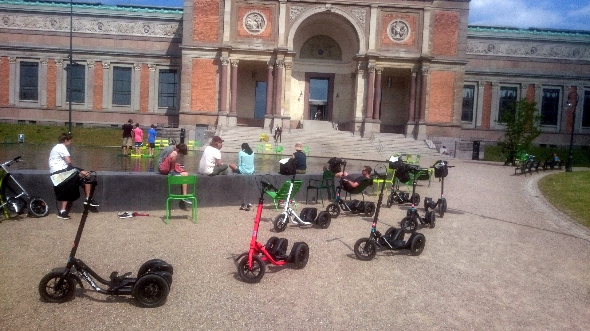

Title: 8-7-2015 - Copenhagen, Denmark
Date: 2015-08-07 10:08
Author: sumner
Category: Baltic Cruise and Northern Europe
Tags: Copenhagen, Denmark
Slug: 8-7-2015-copenhagen-denmark
Status: published

Today we were in Copenhagen, Denmark. This is our last port on the
cruise. We fly out of Copenhagen to London tomorrow.

We began our day by doing a MeMover tour. MeMovers are kinda like a
mobile elliptical, but not. I can’t really describe it, so I’ll post a
picture that our guide took when we were parked in front of a water
feature. Our guide had virtually perfect English and his son, Otto, who
made the caboose of our caravan, had terrific English also.

I’m not going to try and describe everything we saw in order, but I will
tell you about the things I remember.

1.  We went to the Queen’s palace and took some pictures. I’m sure it is
    interesting to someone, but I didn’t. It was pretty, but I’ve seen
    so many pretty buildings lately.

2.  We went to the sculpture of the Little Mermaid. It is very little.
    I’m not sure what the fuss is about it, but it’s apparently the \#1
    thing to see in Copenhagen so now it’s checked off my todo list.

3.  We went through some really pretty streets and got to know the town
    better.

4.  At one point, we stopped in front of an art museum (that’s where the
    picture of the MeMovers was taken). The fountain was neat because
    anyone could go in it. I went and sat on one of the chairs in the
    middle of the fountain.

I liked the tour as it really gave me a feel for the city. Copenhagen
seems to be fairly livable and, like all of the places we’ve been so
far, was clean and just overall nice.

------------------------------------------------------------------------

After our tour, another guide came to take us to the Viking Museum. We
walked down to the train station and rode \~25 minutes to another island
close to Copenhagen. We then walked \~20 minutes to the Viking Museum.
On our way, we passed a church where most of the Danish kings are
buried. We also walked through a nice park.

The Viking Museum was built to display five Viking ships that were sunk
in the bay as a blockade. There were three navigable routes and the
Vikings in the settlement barricaded two of them. One of them with these
boats and the other with wooden spikes. The third one is difficult to
navigate and was left open. The ships that were sunk were preserved in
the cold depths of the bay and were pulled up in 1962. The boats had
been underwater for nearly a millennia.

The Viking Museum itself is very cool. Outside, they had a lot of hands
on stuff geared towards younger kids but they also had a lot of neat
things for adults. The museum also actively reconstructs the Viking
boats using technology available to the Vikings in that period. We got
to see one of these reconstructions sailing out in the bay. The
reconstructed ships have even made a journey to Ireland and back. They
made this trip because the wood from one of the ships was from Ireland.

There was a guided tour by one of the museum staff and we listened in.
The guide spent a while talking about the Viking age in general which
was very informative. Here are a few things that I took away from this
part of the tour:

-   The Vikings didn’t wear hats with horns. In fact nobody has ever
    found a hat with horns on it.

-   The Vikings who built ships were expert sea men (oh wait I have to
    be PC: sea people). They were the richest and most skilled people in
    their communities and as such were the only people with enough time
    to build a boat.

-   The Viking age came to an end gradually (as most ages do) as the
    Vikings found it to be more profitable to trade than to loot. The
    introduction of Christianity to the Vikings also made them less
    likely to want to go around killing each other.

The boats themselves are one of the prime archeological sources for the
construction of Viking ships. Until these boats were discovered, nobody
really knew what a Viking ship looked like or how it was constructed.

After the tour, we stopped to get some ice cream and then walk back to
the train station. Unfortunately, the train was cancelled and we had to
wait 20 minutes for another. It did come, but it was very crowded. By
the time we got back to the train station and got a cab to the boat, it
was 17:15. We decided to get ready and go to dinner so that we could say
goodbye to our waiters and table mates.

The evening was much the same as the past few evenings so I’ll not
describe it here.
