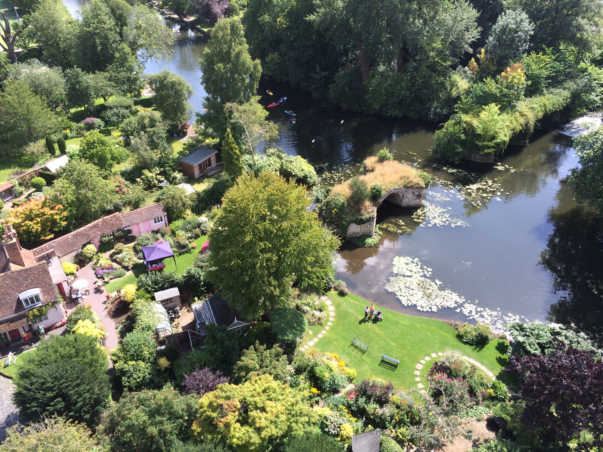
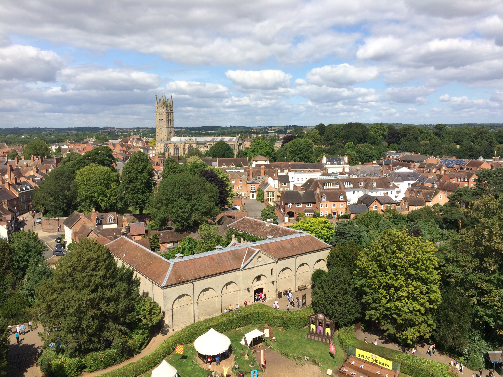

Title: 8-16-2015 - London, England (Warwick)
Date: 2015-08-16 01:12
Author: sumner
Category: Baltic Cruise and Northern Europe
Tags: England, London, Warwick
Slug: 8-16-2015-london-england-warwick
Status: published

Today we went to Warwick (pronounced war-ick). Warwick is the site of a
very old medieval castle. Today, the castle grounds are what I’d call a
Renaissance Festival mixed with a real castle. There were all sorts of
activities that you could do on the grounds, most of the activities were
a bit young or costed additional money. The castle became a palace at
some point and changed hands many times. We were able to walk through
the palace and learn about the various owners. I found it interesting
how many of the royalty in Europe were intermarried at the outbreak of
WWI, yet it didn’t prevent the war. Talk about a family feud…

The palace was not as lavishly furnished as some other palaces we’ve
been to, but the rooms are still very nice. It was a very Victorian
style of decoration.

After walking around the inside of the castle, dad and I went to go walk
on the top of the castle wall. Hannah’s hip was bothering her and mom's
knee wasn't doing well so they stayed in the grass in the courtyard.
From the wall we got some great views of the town and surrounding areas.

------------------------------------------------------------------------

After that we walked back into town for lunch at a tea parlour. I had a
steak pie with some salad.

------------------------------------------------------------------------

We then went back to the castle and walked along the river. There was an
waterwheel which was used to generate electricity for the castle. In
times of drought, gas generators were used. All of the electricity was
stored in batteries which gave the castle an un-faltering supply of
electricity. I thought it was interesting that they did this, it seems
so much like what Tesla is doing with their home batteries today. The
river was very peaceful and picturesque. I watched some ducks from a
bridge while the rest of my family went to see some horses.

------------------------------------------------------------------------

After the castle, we went back into town to see the cathedral. It was
nice to see a cathedral that wasn't full of tourists and which
represented a more traditional worship environment for the laymen.

At this point, we decided to head back to London. The train ride took
about an hour and a half and then we rode the metro to the big mall,
Westfield. We walked through the mall to the outside terrace where the
restaurants are. We ate at a Greek restaurant. We had some very good
hummus and flatbread for starters and then I had a chicken skewer and a
lamb wrap. Both were delicious. We then walked down out of the mall. We
realized that it was right around the corner from Shepherd’s Bush
station, the underground station that we normally go to in the morning.
We felt kinda silly that we hadn’t gone further around the corner into
the mall area as there were an abundance of restaurants in the mall.
Overall, though, we’ve enjoyed our dining experiences this trip, so it
wasn't a real tragedy that we hadn't discovered how close the mall was.

After dinner, we went back to the apartment and I tried to catch up on
my blog.
