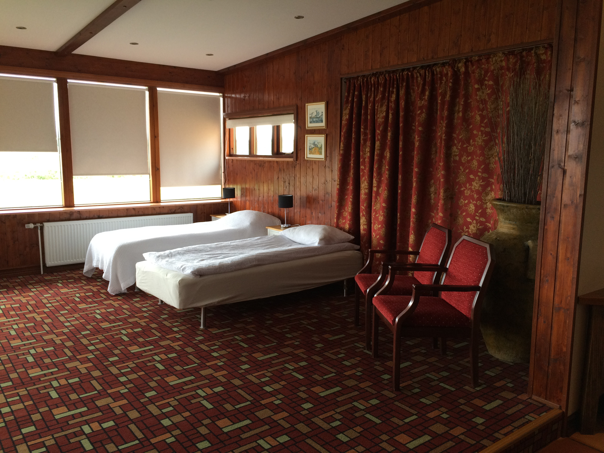
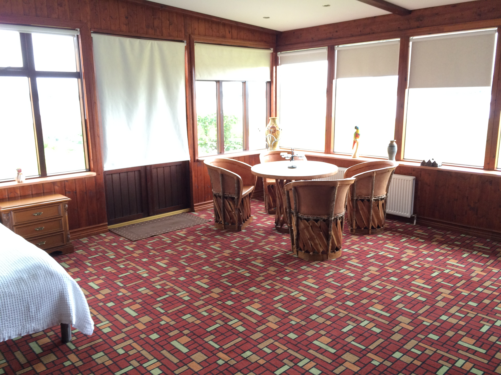
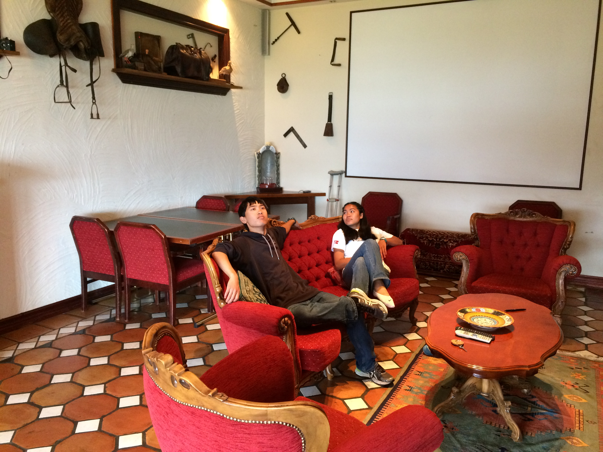

Title: 8-20-2015 - London, England to Reykjavik, Iceland
Date: 2015-08-20 10:32
Author: sumner
Category: Baltic Cruise and Northern Europe
Tags: England, Flight, Iceland, London, Reykjavik
Slug: 8-20-2015-london-england-to-reykjavik-iceland
Status: published

I’m going to make this short because I'm behind on writing. Today was a
travel day. We went by car from our apartment to Gatwick International
Airport. Then we flew to Reykjavik. It was only a 3 hour flight and 1
hour time difference so it wasn't bad at all.

We had planned to rent a car and drive to our hotel, but mom’s driver's
license expired on the 17th. The man at the car rental office was very
nice and gave us tickets on their bus into town (I guess they are both
part of the same company). He said that we would take that bus and then
a shuttle would take us to our hotel. The bus ride went fine, but when
we arrived at the place where we were supposed to get the shuttle, the
lady said that they don't take people to our hotel. We told her that the
man at the car rental place had said we could, so she phoned the car
rental office. She came back and said that the man was mistaken, but
said that since it was their fault they would pay for a taxi. We were
very surprised, especially since we hadn't even asked for anything, the
man at the car rental place had given us the tickets just to be nice. A
few minutes later, she came back and said “a taxi would take forever to
come so this lady will take you herself”. We got our own private 15
passenger van and she took us to our hotel. Her English was very good
and we asked her some questions about Iceland, what things she
recommends we do tomorrow and the like. We gave her a hefty tip on
arrival at our hotel.

------------------------------------------------------------------------

The hotel is called Hotel Kruines. It’s a small hotel by a lake (by
Colorado standards, it’s huge, but that’s not saying much). The hotel is
a family operation, the lady who greeted us is very pregnant (the baby’s
due in just a few days). Her father and mother, along with her
grandmother all work at the hotel. We've seen other people who look
related as well.

Our room is huge. We booked the family suite and it is very large. There
are two rooms, a family room and then a bedroom with panoramic views of
the lake. I think that our suite is the best in the hotel. I'll post
some pictures of the room here.

------------------------------------------------------------------------

We then went to eat dinner which was cooked by the lady who checked us
in and who we think is her mom. We had some delicious broccoli soup and
then a ham and cheese sandwich with salad. It was very nice of them
since they normally require reservations for dinner. (I didn't feel too
bad because another couple was eating as well.)

Tomorrow we are going to go on a tour of the Golden Circle, the main
sites to see in this part of Iceland.
