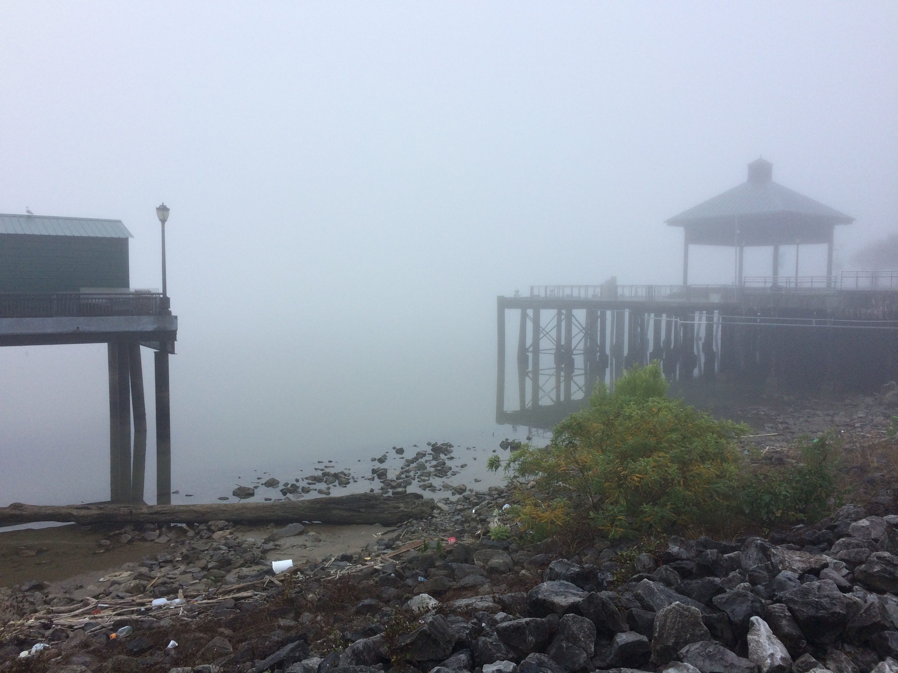
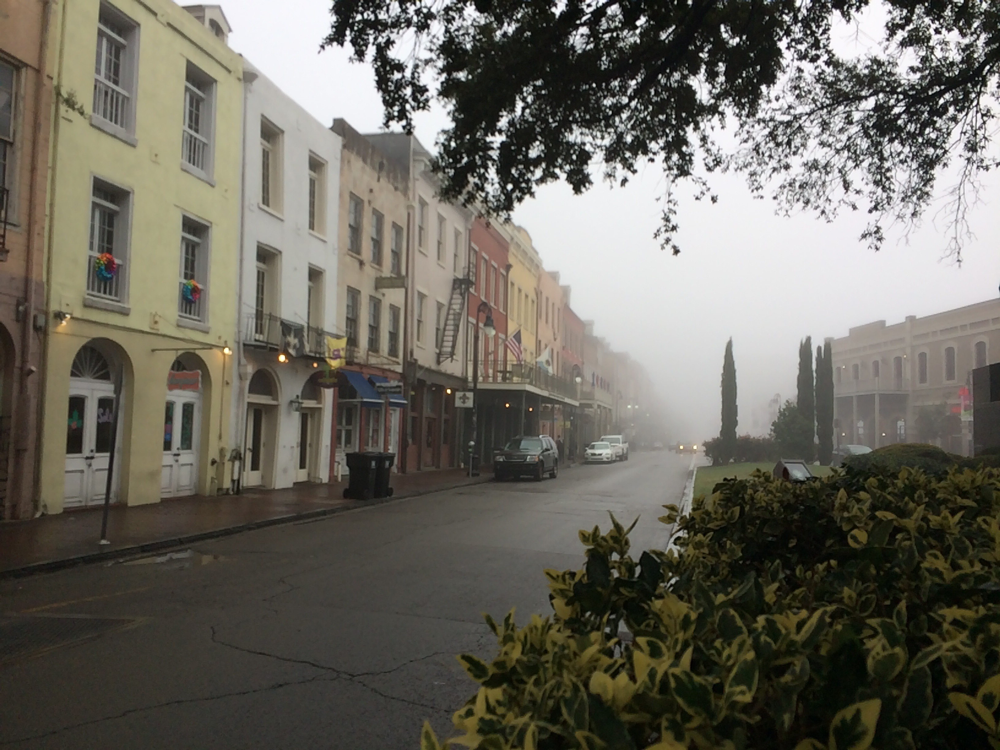
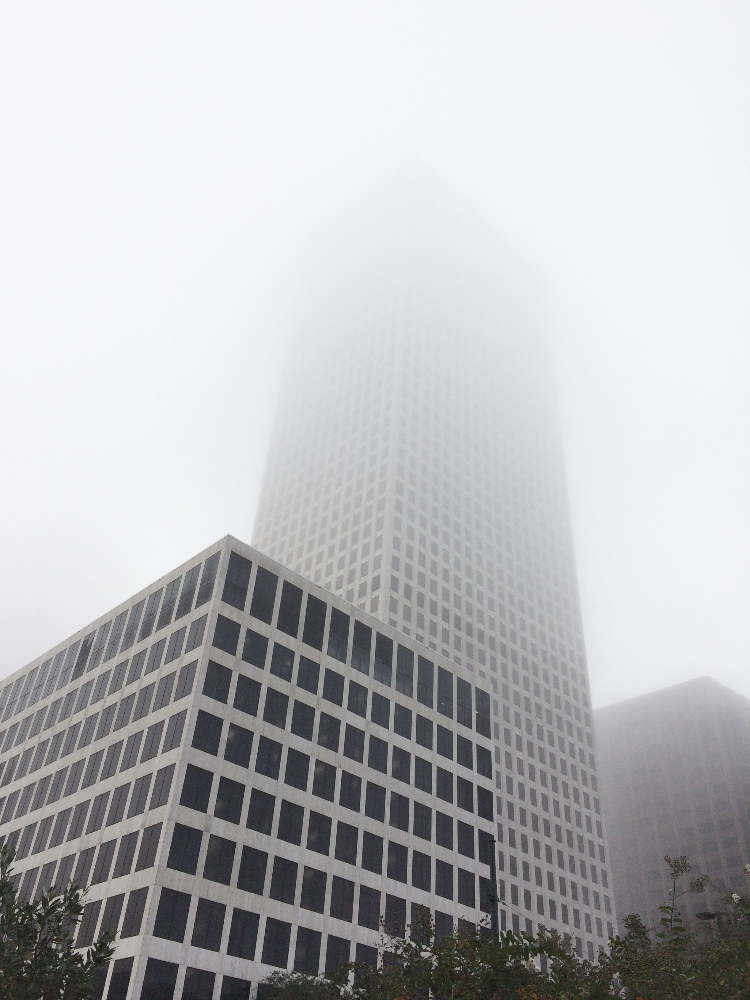

Title: 2016-12-27 - New Orleans, LA
Date: 2016-12-27 20:30
Author: sumner
Category: Caribbean Cruise
Tags: Laura Plantation, Louisiana, New Orleans, Oak Alley Plantation, Plantation, Red Fish Grill
Slug: 2016-12-27-new-orleans-la
Status: published

This morning we woke up to very dense fog. (See below.) I don't think
I've ever been in such dense fog for such a long time.

We ate breakfast downstairs and then headed out down Decatur St.
(duh-kay-ter) to Toulouse St. (toe-loose) where we met a guide (BilliJo)
for a plantation tour. We boarded one bus, but then we had to move to
another bus since the first one had some sort of problem. Not a very
auspicious beginning to today’s excursion. Eventually we got on a bus
and there weren’t any more vehicle troubles.

On the way, our guide told us about some of the history of New Orleans
and pointed out some of the sights. Unfortunately because of the dense
fog, we weren’t able to see much. It was pretty once we got out of the
city though.

The tour dropped people off at three plantations (you could choose two
out of three to tour). We chose the Laura plantation and the Oak Alley
Plantation.

# Laura Plantation

The Laura Plantation was first owned by the DuPark family and was named
the DuPark plantation at the time. Eventually, after four generations of
drama, the plantation was inherited by Laura (her father had renamed the
plantation after her). Those four generations of drama consisted of
everything from death by arsenic poisoning (it was supposed to cure
someone’s daughter’s acne. It did, but it also killed her) to multiple
slave-mistresses. One sad story was that one man had children with a
slave and those children grew up to be slaves for the man’s mother. Her
biological grandchildren were her slaves, but they were thought of as
sub-human.

When Laura inherited the plantation, she wanted nothing to do with
plantation life and the slave labour upon which it was built. She sold
the plantation to the Waguespack family for virtually nothing. After
Laura moved north, she began writing her memoir which has been used to
reconstruct much of the plantation’s history.

We toured the plantation house, the slave quarters, and a few other
structures on the plantation. I would write about what we saw, but it
was kinda information overload. It was a good tour though, and I learned
quite a bit.

Below are some pictures from the Laura Plantation.

[{.alignnone
.size-full .wp-image-994 width="3264"
height="2448"}](http://www.the-evans.family/sumner/blog/wp-content/uploads/2016/12/img_4173-1.jpg)
[{.alignnone
.size-full .wp-image-995 width="2448"
height="3264"}](http://www.the-evans.family/sumner/blog/wp-content/uploads/2016/12/img_4170-2.jpg)[{.alignnone
.size-full .wp-image-993 width="3264"
height="2448"}](http://www.the-evans.family/sumner/blog/wp-content/uploads/2016/12/img_4166-1.jpg)[{.alignnone
.size-full .wp-image-997 width="3264"
height="2448"}](http://www.the-evans.family/sumner/blog/wp-content/uploads/2016/12/img_4161-1.jpg)[{.alignnone
.size-full .wp-image-998 width="3264"
height="2448"}](http://www.the-evans.family/sumner/blog/wp-content/uploads/2016/12/img_4158-1.jpg)[{.alignnone
.size-full .wp-image-996 width="2448"
height="3264"}](http://www.the-evans.family/sumner/blog/wp-content/uploads/2016/12/img_4157-2.jpg)

# Oak Alley Plantation

After touring Laura Plantation, we went on to Oak Alley Plantation.
Named after the avenue of Oak trees which create a beautiful canopy from
the road to the plantation home.

[{.alignnone
.size-full .wp-image-1000 width="3264"
height="2448"}](http://www.the-evans.family/sumner/blog/wp-content/uploads/2016/12/img_4255-2.jpg)We
ate the lunch that we had gotten last night at Jimmy Johns and then
walked around the the reconstructed slave buildings. Then it was time
for us to go on a tour of the house. We went through about 10 rooms of
the house which had been restored back to the state it was in during the
residency of the Roman family in the 1800s. The Roman family did not
have the same amount of drama as the DuParks (or at least it wasn’t
emphasised), but they, too owned many slaves who worked the plantation.
I’ll take this moment to say that the primary crop was sugar cane.

Here are some pictures of the Oak Alley Plantation.

[{.alignnone
.size-full .wp-image-1005 width="3264"
height="2448"}](http://www.the-evans.family/sumner/blog/wp-content/uploads/2016/12/img_4222-1.jpg)[{.alignnone
.size-full .wp-image-1004 width="2450"
height="4516"}](http://www.the-evans.family/sumner/blog/wp-content/uploads/2016/12/img_4235-1.jpg)[{.alignnone
.size-full .wp-image-1001 width="2448"
height="3264"}](http://www.the-evans.family/sumner/blog/wp-content/uploads/2016/12/img_4237-1.jpg)[{.alignnone
.size-full .wp-image-1003 width="3264"
height="2448"}](http://www.the-evans.family/sumner/blog/wp-content/uploads/2016/12/img_4243-2.jpg)[{.alignnone
.size-full .wp-image-1002 width="3264"
height="2448"}](http://www.the-evans.family/sumner/blog/wp-content/uploads/2016/12/img_4246-3.jpg)[{.alignnone
.wp-image-1006 .size-large width="629"
height="472"}](http://www.the-evans.family/sumner/blog/wp-content/uploads/2016/12/img_4258-2.jpg)

# Back in New Orleans

Our tour bus picked us back up from Oak Alley and we headed back to New
Orleans. (The plantations we visited were about half way between New
Orleans and Batton Rouge (bat-on r-oo-j). In New Orleans we wandered our
way through the French Quarter to the Red Fish Grill. We had BBQ Oysters
for an appetizer, they were basically like BBQ chicken wings. For my
main course I had a really good Gumbo.

After that we came back to the hotel and I worked on writing this.
Tomorrow we are doing a Segway tour of the French Quarter, so that
should be fun.
