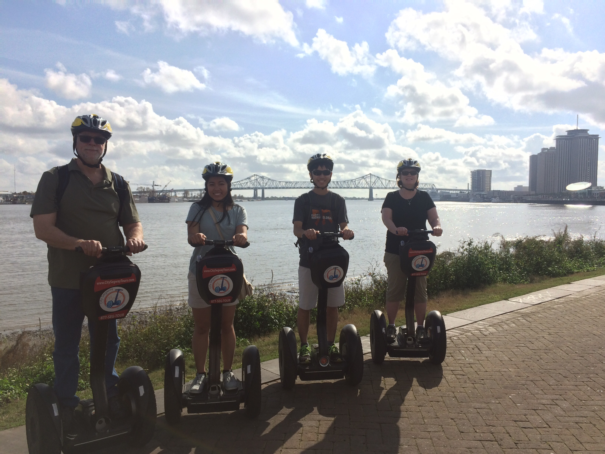

Title: 2016-12-28 - New Orleans, LA
Date: 2016-12-28 18:50
Author: sumner
Category: Caribbean Cruise
Tags: Battle of New Orleans, Louisiana, New Orleans
Slug: 2016-12-28-new-orleans-la
Status: published

Today we went on a Segway tour of the city and then went straight to a
river boat tour which went down the Mississippi River to the site of
Andrew Jacksons stand in the Battle of New Orleans.

Segway Tour
===========

After breakfast, we walked to Decatur street where the Segway tour
company is located. We practised riding the Segways in the company’s
“office” and then headed out onto the streets.

We toured all around the French Quarter and into two of the surrounding
neighbourhoods. The guide explained some of New Orleans’ history and
pointed out some of the interesting sights along the way. One of the
most interesting thing was that New Orleanians don’t call medians
“medians”, they call them “neutral grounds”. This is because each of the
neighbourhoods used to be separately governed. The streets, however, were
neutral and thus all commerce was done in the middle of the street out
of reach of either jurisdiction. So to this day, medians in New Orleans
are called “neutral grounds”.

Our guide also explained some of the History of New Orleans. I’ve
compiled what I’ve learned from our various guides below. (If there are
any inaccuracies, please let me know.)

History of New Orleans
======================

The Mississippi River and all of its watershed were claimed for France
by in 1699. New Orleans was founded by the French in 1718. The French
controlled New Orleans for about 50 years. The French built New Orleans
in the area that is now known as the French Quarter, but only three
buildings in that neighbourhood are actually French. The others were
burned in the fires during the Spanish rule.

New Orleans came under Spanish rule after the *Seven Years War*. Known
in the American Theatre as *The French and Indian War*, the *Seven Years
War* was the first worldwide war. The end result that we care about is
that France ceded all of Louisiana to Spain in the treaty ending the
war. New Orleans was not notified of the change in rule for two years.
During Spanish rule, the city burned to the ground twice. The first time
because someone didn’t extinguish his altar candles while he went to
lunch. After that fire, the city was rebuilt in the Spanish style and as
they were rebuilding, a second fire broke out, this time due to two boys
playing with matches in a hay shed. After this second devastating fire,
the Spanish rebuilt again, this time implementing fire codes preventing
houses from being made of wood and requiring courtyards with wells to be
able to fight fires.

In 1800, Napoleon corrected the Spanish to give Louisiana back to the
French. Three years later, in 1803, Thomas Jefferson bought Louisiana in
the biggest land deal in the history of the world. Jefferson only wanted
to buy New Orleans for 10 million dollars. Napoleon was in need of money
to conquer Europe, so he offered to sell all of Louisiana for 15 million
dollars. Thomas Jefferson agreed and so the biggest land deal in history
was made. The land acquired ended up costing 4¢/acre. Where did the
extra 5 million dollars come from? Britain loaned it to us. What did
Napoleon do with the money? He attacked Britain.

New Orleans has always been a strategic strongpoint on the Mississippi
since whoever controls that city controls all commerce along the
Mississippi. The British knew this, and during the War of 1812, the
British attacked New Orleans. Until this point in the war, American
forces had invaded French Canada conquering Montreal but then being
defeated on the Plains of Abraham outside of Quebec (see my post from
this summer when my mom and I were there). Over in Europe, Napoleon was
defeated (remember, Napoleon was fighting the British with American
money borrowed from the British) and the entire might of the British
Empire came to bear on the small United States of America. Washington DC
was sacked, the Capital and White House was burned, and George
Washington’s portrait was saved by the First Lady. The British advances
in the north were halted at Ft. McHenry where the famous words of the
national anthem were penned by Francis Scott Key.

The British then moved south and invaded New Orleans. After gaining
control of Lake Borgne, the British landed and camped at a plantation
south of New Orleans in late December. Upon hearing this, Andrew
Jackson, the general in charge of protecting the city of New Orleans,
ordered a night attack of the British encampment. The British held their
position, but preparations were delayed giving the Americans time to
fortify a canal on the Chalmette Plantation. The spot was specifically
chosen because it was the narrowest point between the British and New
Orleans. On January 8th, the British attacked. The British had to
advance across wide open fields to attack the American position. They
marched in the traditional head-on attack formation but despite their
ranks being torn apart by cannon, musket and rifle fire from behind the
battle work, the British soldiers continued marching. Jackson later said
after the battle that he respected the soldiers for their relentless
marching in the face of enormous casualties. The British commander and
many officers were killed, and the Americans grapeshot ripped through
the British lines. Few British made it to the breastwork and those that
scaled it were immediately killed or captured. After suffering huge
losses, the British commander in reserve brought his troops to cover the
retreat of what remained of the British army on the field. Casualties
for the British totalled over 2000 (285 of which were killed). There were
62 casualties (13 killed) for the Americans. Jackson did all of this
with only 4500 men while the British had nearly 14,000.

Because of the significance of the Battle of New Orleans, January 8th
was celebrated as the second Independence Day in America. During the
Civil War, however, Louisiana became part of the Confederate States of
America and the importance of the Battle of New Orleans was greatly
marginalized during the Reconstruction period.

Boat Tour
=========

After the Segway tour we went on a riverboat tour where we went down the
river to the Chalmette Plantation, the site of the Battle of New
Orleans. As I have already described the battle, I won’t elaborate here.
On the way down, we saw the Lower and Upper Ninth Ward and St. Bernard
Parish where the majority of the flooding occurred during Hurricane
Katrina and our guide described some of the various sights along the
way.

I’ll go ahead and stop here, I am already behind on my writing.
