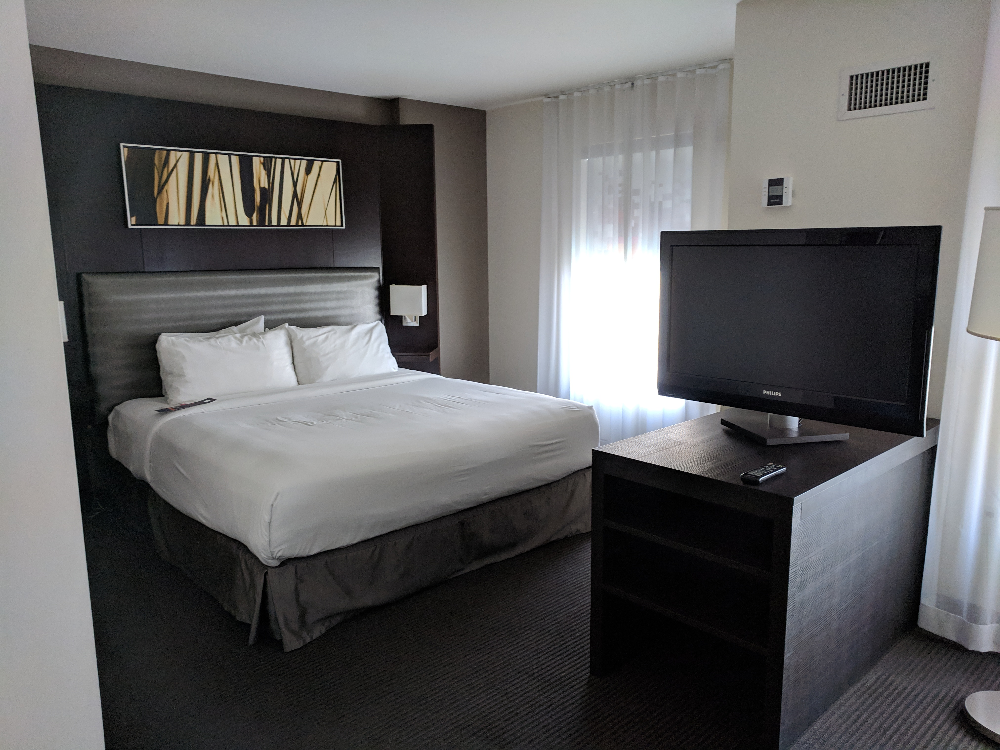

This morning I left for a hackathon at Facebook Headquarters. I had to wake up
at 3:30 since the flight was at 7:50 and I had to pick up Sam and Jack on my
way.

We qualified for the Facebook hackathon at MHacks with our `Datanium project`_.
Unfortunately, Robby was unable to make it to the finals since he had too many
assignments and projects due this week. So we ended up replacing him with Jack
Garner who I had on my HackCU team and on my `ICPC team`_.

.. _Datanium project: 
.. _ICPC team: 

Facebook is paying for the entirety our trip, plane tickets, hotel rooms,
transportation to and from the hotel, transportation from the hotel to and from
Facebook HQ, food, the whole shebang!

Security was literally empty. I got through without a problem, but Jack got
stopped because of a tablet in his bag that he forgot about, and Sam got stopped
because of all the snacks in his bag.

    "Today I learned that a big bag of nuts next to a box of electronics looks
    like a bomb."

    -- Sam Sartor

We had plenty of time for breakfast on the other side of security, and then we
headed over to our gate.

The flight was uneventful, and it was only about 10:00 by the time we got our
Uber to the hotel. We had a bit of trouble finding the Uber driver since we were
on the wrong level of the airport, but he was nice and waited for us and helped
us find him.

At the hotel, we got checked in. Each of us got a room all to ourselves!

After we settled in, we went to go eat some lunch at a nearby Pho restaurant. As
we were walking, we saw some mid-sized houses and decided to play a "guess the
price" game. All of us were under the actual price which was $800,000!

After lunch, we went back to the room and Sam and I worked on our High
Performance Computing project milestone report until dinner which was provided
at the hotel by Facebook. At the dinner, we met a team from Canada.

   Dinner buffet served on the first day of the hackathon.

After we finished dinner, Sam and I went back up to my room and finished up the
report. Now I'm getting ready for bed... We have to leave the hotel at 8:45
tomorrow.
