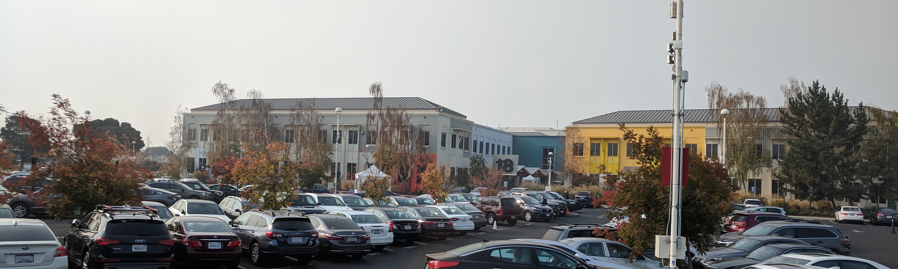
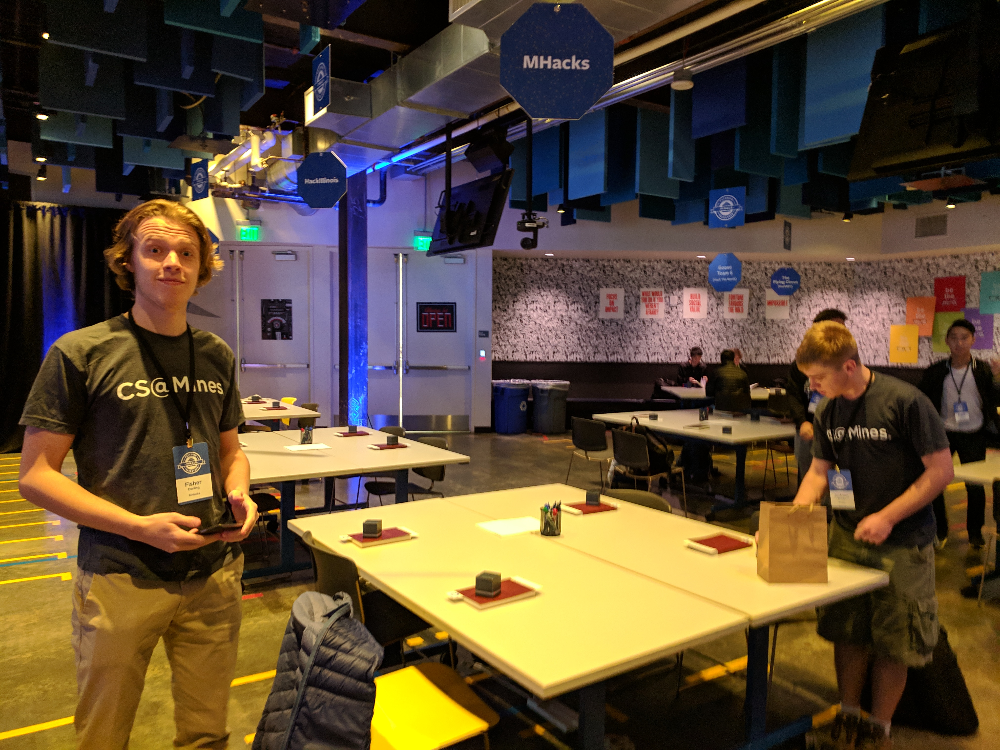
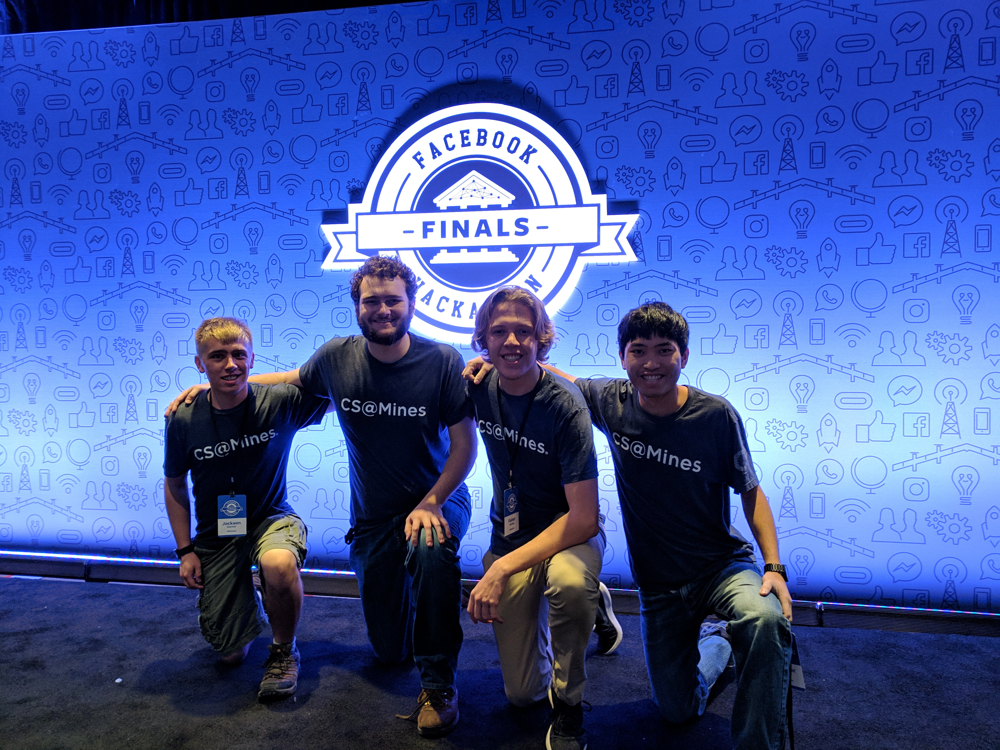
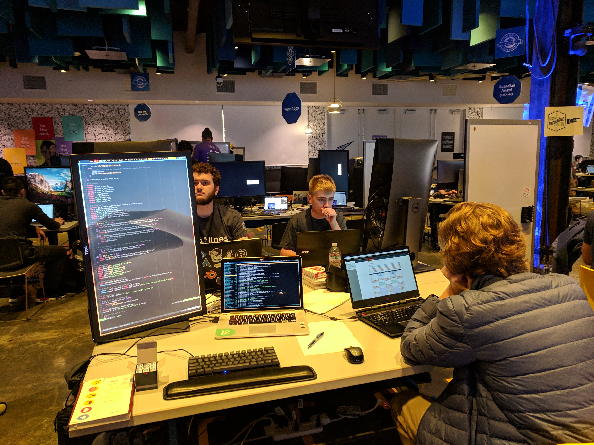
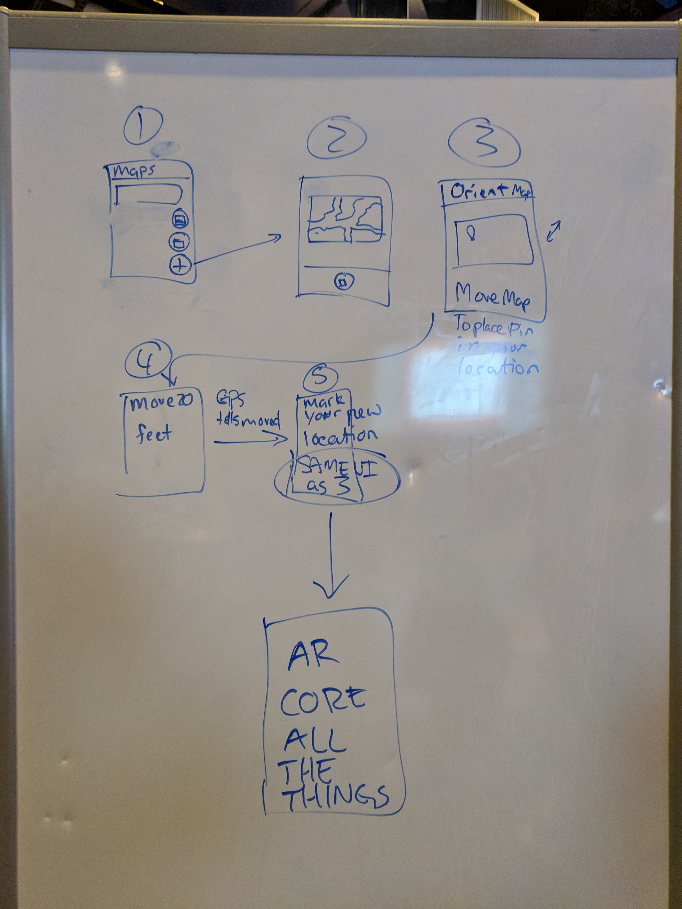
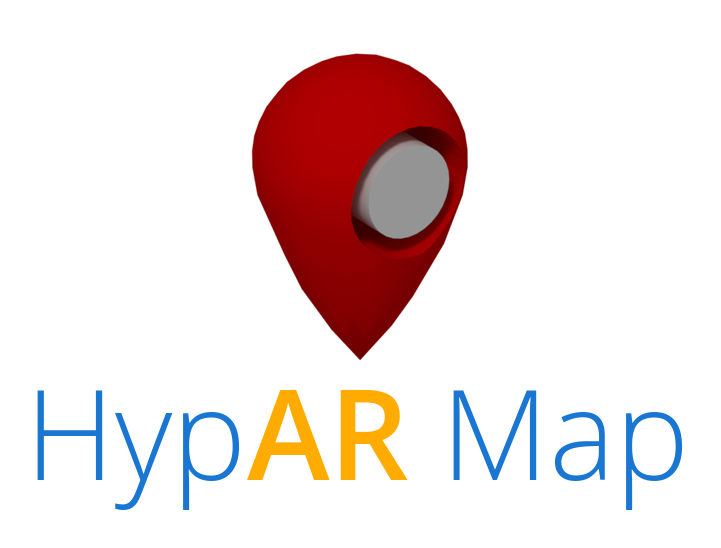
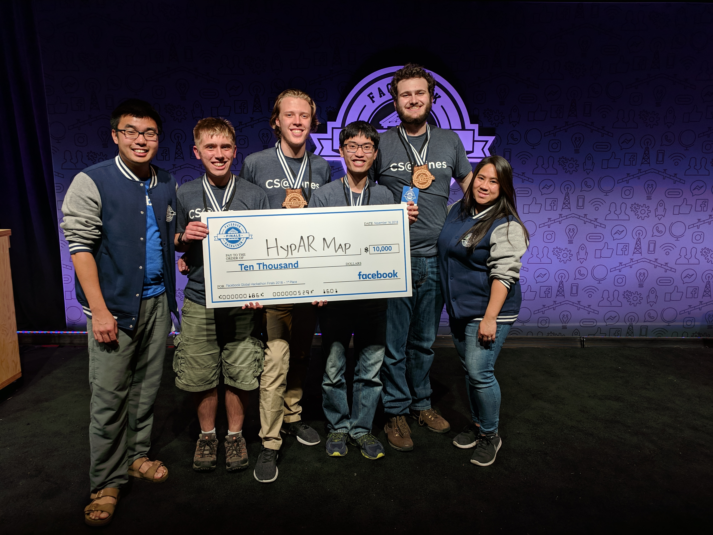

I woke up at 8:00 on Thursday morning. After a quick shower, I went down to eat
some breakfast (provided again by Facebook). Then, we got on a bus and went over
to Facebook HQ. This is a picture of building 18, one of the smaller buildings
on the campus.

Once inside, we got to go see the area that we would be working in. It was a
very nice space, and was set up for all 21 teams. They even had signs above our
tables telling us which table was ours!

Then, after the obligatory team picture...

         Hackathon Finals logo
   :width: 75%
   :align: center

we got our workspace set up using the awesome monitors provided by Facebook.

After we had everything set up, we got to take a tour of the Facebook
Headquarters. It is a pretty awesome campus!  On our tour, we saw these cool
maps on the ground which showed a correctly oriented map of the campus with a
red dot indicating your location.

.. image:: ./images/2018-11-15-fb-map.jpg
   :target: ./images/2018-11-15-fb-map.jpg
   :alt: a map of the Facebook campus on the ground
   :width: 75%
   :align: center

After the tour, we had a couple of minutes to continue getting set up and think
of ideas. Fisher suggested that we digitize the maps like we saw outside. I
thought that was a great idea. In fact, I've always wanted to create an app
where you can just take a picture of the fire escape plan and then get an
interactive map of the building using just that image. (Sidebar, I've always
wanted to make that for Google Glass so that you could run into a building, look
at the map quickly, and then it would show you where you have to walk to get to
the room you are looking for.)

We thought of all sorts of other ideas too like VR mesh building, but everything
seemed to be solidly in the AR/VR space.

By this time, it was about noon and we met our mentor from Facebook, Dan, who
took us and one other team (from Carnegie Mellon) to lunch at one of the
restaurants on the Facebook campus. The food is free for all employees (and to
us), which is really neat.

We went to a Asian restaurant which was really good. They had the food laid out
buffet style, and you could create your own Pho. Over lunch, we discussed our
ideas with Dan and he thought they were great ideas.

Once we got back, it was time to start coding! After a final debate about what
we wanted to do, we decided to go with the interactive map.

Writing All the Code
--------------------

At this point, we faced our first challenge: what platform should we use? The
most obvious choice for us was to use ARCore on Android since we all had Android
phones. Unfortunately, between us we had approximately zero experience in
Android development. Sam had literally zero experience in Android development,
and I only had a slight idea of how to do it from my `Wireless Debugging`_
project during field session a couple summers ago (Reece did all of the UI
stuff, so I only ever delt with a bit of systems-level stuff with ``adb``).
Fisher had done one super simple Android app in the past, and Jack was the most
experienced of us all having actually created an app 6 years ago when he was in
8th grade. We also decided to use Kotlin (which none of us had any experience
with), and since it's so new, none of us had any experience with ARCore either.

.. _Wireless Debugging: 

Let's just say, with those credentials, our chances of success seemed fairly
slim with that option. So, we looked into other platforms such as WebAR.
However, WebAR is not production-ready. We talked to a couple of mentors who
have experience in AR/Android, and they recommended that we just go ahead and
create an Android app.

We spent the next couple of hours installing Android Studio, getting our
development environments set up, learning Kotlin, and mocking up some designs
for our app.

Eventually, we got everything set up, and we all worked separately on small bits
of the puzzle. Jack made a major breakthrough when he found a sample ARCore app
which allowed the user to detect planar surfaces such as tables and walls in the
world. I started on the UI for adding a new map or selecting an existing one.
Sam started learning the AR APIs to determine what data it would give us. Fisher
worked on getting GPS data from the phone. I also found a fire escape plan and
took a picture of it.

Our strategy at this point was to try and use GPS data to locate the user on the
fire escape map. Sam spent a while hard-coding the coordinates of the building
we were in and also fixed up the picture that we took so that it would be more
suitable for use in the app.

By midnight on Thursday, Sam and Fisher had connected their pieces together to
create a proof-of-concept which used GPS and the hard-coded data to locate the
user in the building.  It was far from done, but we had something that (if
everything else failed) we could demo.

There were three main features that were missing at that point.

1. The map did not rotate itself correctly as you walked around the building,
2. GPS data was slow, we only got a new location every 5 seconds.
3. It only worked with a single, hard-coded image.

Sam had theorized that he could create and solve a linear system of equations to
solve for the position of the user just using the location of walls in the AR
space. If he could do that, then the first two problems would be solved
immediately. Two components would be necessary: an interface for lining up walls
in the AR space with walls in the map-space; and the actual math for calculating
the user's position on the map given the marked wall locations. We deemed this
to be a high-risk, high-reward problem, so we decided to have both Fisher and
Sam work on it (Fisher on the wall selection GUI, and Sam on the computational
linear algebra).

However, the risk of failure was high. To combat this, we decided to also
prioritize an alternate method for computing the orientation of the map. To do
this, Jack, worked on a method of using the compass APIs to get the orientation
of the phone and update the map's rotation in the AR overlay space accordingly.

I continued working on creating a UI for selecting maps and adding new maps.  I
was feeling fairly incompetent the entire evening, and I had lots of trouble
just getting a list to show up properly with Material design patterns. My major
contribution ended up being that I learned how to pass state between Android
Activities (screens) using Intents. Still, I didn't have anything working
correctly until 02:00 on Friday. (In my defense, I did bounce around helping
everyone else on the team throughout the hackathon.)

At 4:00, I decided it would be good to take an hour nap before getting back to
it in the morning.

When I got up, Jack and I tried banging away at getting the map to orient
correctly using compass data, but we were unsuccessful until we retrieved Sam
from the couch he was sleeping on. Sam came over and, as if he had some
revelation during his short sleep, paired up with Jack and wrote a ton of code
that solved the linear system! Sam was using hard-coded wall data, and as soon
as he got it working, the map oriented correctly and the red marker follow the
person without even needing to use the compass or GPS for orientation and
location! None of that was completed until there was less than an hour to go in
the competition.

Meanwhile, I finished the feature which allowed users to load arbitrary images
into the app (this ended up being critical for our preliminary demo). Fisher
also got the wall alignment functionality working, and figured out how to pass
data to Sam's AR activity so that all of the math could use real data.

By this time, it was about 08:30, and we had to submit a survey describing our
project to the judges by 09:30. Luckily, we had an extra hour until coding ended
at 10:30.  We realized that we didn't even have a name for our project yet, and
Sam suggested Hyper Map. Then, Fisher or Jack said, what about "**HypAR** Map"?
There was immediate consensus around that name (consensus that you can only get
when you are on 60 minutes of sleep for the last 24 hours), and thus HypAR Map
was born.

I worked with Jack to fill out the survey to submit our project to the judges
while Sam continued working on his linear equation solver.  Sam, with an eye for
potential failure, created an escape hatch in the application. If you pointed
the phone at the ceiling, it would reset to use the hard-coded wall data. This
gave us peace of mind in case everything started to fail.

With under an hour to go, Fisher and Sam finally managed to get all of the
rotation data from Fisher's code passed into Sam's AR code, and... it didn't
work. A few more minutes of fiddling, and Sam fixed the bug! He did it just in
time, too. The event organizer, Bambi, was literally in the middle yelling "10,
9, 8, ..." for the final countdown as he made the last code change.

In the meantime, I started working on a logo for our project:

Luckily, that didn't count as "coding" so we were able to finish that up after
the code freeze at 10:30. Then came a frantic hour of preparation for
preliminary demos. First, however, we had to cleanup the massive mess that we'd
created on our table. We needed it to look presentable for the demo!

Demo Time
---------

The way that judging worked is that every team had two minutes to pitch in front
of all of the hackathon mentors. Then, the mentors would choose the top six
teams to present to the actual judges, senior engineers from various parts of
Facebook. If you made it to the top six, you were given three minutes to
present.

Preparations included figuring out how to allocate the time to various parts of
the demo, who would talk about what, what keywords to include (gotta have all
the buzzwords if you want to win), how we were going to stand...  basically
everything. We only ran through the full demo a few times before we had to do
our demo.

The actual demos were amazing. It was a really neat environment because we got
to watch all of the other demos as well! Everyone's projects were great, and I
fully expected not to make it to the top six.

--------------------------------------------------------------------------------

We had lunch at this point, and just waited for the judges to announce the top
six. While we waited, I went around and talked to some of the other teams. It
was super cool to talk to people and see what they had built.

Then the announcement came. We were the first team that they announced as being
in the top six! We were so excited to be in the top six, but we'd seen the
quality of the other projects, and we decided that we had to go all out if we
had a chance of winning.

Thus, the next hour was another frantic hour of preparation. We had to figure
out how to screenshare from the phone to the projectors, and hook it all up with
the Facebook live stream that they were going to do for the final demos.  The AV
guys from Facebook were super helpful, and got us hooked up with a great setup.

We decided to tweak our demo to better highlight the features of our app. To do
this, we decided to have Sam stand in the back of the room with the phone and,
as we were talking about the project, he would mark a wall, and then walk around
the building to demonstrate how well the tracking worked. We also reshuffled
what each of us was going to talk about. We had gone through the general idea of
what we were going to do and say, but we never got to fully rehearse our demo.

We were first to demo, which was kinda scary, but it ended up working out. The
demo that we did on stage was the first time we had a done full-run of our demo;
so as I was doing it, it did not feel good.

You can watch our demo (and the other five finalists) here_ (our demo starts at
~3:30). I've included a video of just our demo below:

.. _here: https://www.facebook.com/hackathon/videos/2306855209387580/

.. raw:: html

    

      
<i class="fa fa-youtube-play"></i>&nbsp;CS@Mines Demo at Facebook Global Hackathon Finals

      
    

After the demos were over, we definitely didn't think that we would win. All of
the other finalists had amazing demos, and I would have been happy to loose to
any of them.

And the Winner Is...
--------------------

After an agonizing wait, the judges came out and announced the winners. They
started by announcing the runners up. We weren't in that group. Then they
announced third place. *Guardian Angels*, the team from Tel Aviv, won third. I
was very happy for them, all of them were so nice. Then, second place was
announced. As the judge was announcing it, he said "I think second place is
pretty important because it gives away first place." Good observation... He
continued to troll us by talking about the second place app in the most nebulous
way possible. He started out by saying "this product really brought a holistic
view of the world to us". I thought, well, that's us. Then he said, "it used
very impressive technology". I was thinking, great, that's really us! And then
he said "and a great use of ML". At that point, I realized that wasn't
describing our app anymore. The second place prize went to Hedwig, a team from
Melbourn, Australia. Their application was very impressive.

Then they called us up for the first-place prize! The prize was $10,000 for the
team and an Oculus Rift with Touch for each of us!

You can watch a video of the `award ceremony here`_ (we get first at ~8:20).

.. _award ceremony here: https://www.facebook.com/hackathon/videos/2195929524067524/

.. raw:: html

   

     <iframe
        src="https://www.facebook.com/plugins/video.php?href=https%3A%2F%2Fwww.facebook.com%2Fhackathon%2Fvideos%2F2195929524067524%2F&show_text=0"
        style="position:absolute;top:0;left:0;width:100%;height:100%;border:0"
        scrolling="no"
        frameborder="0"
        allowTransparency="true"
        allowFullScreen="true"></iframe>
   

Wow! What a great hackathon! I was so proud of how well our team worked
together, and I was super happy with the result as well. I continue to be amazed
by the quality of the competition, everyone at the hackathon made amazing
projects.

--------------------------------------------------------------------------------

At this point, we headed back to the hotel. Once back in my room I promptly took
a nap. In fact, I napped too much. There was a celebratory event at 8:00 that
evening, and I almost overslept it! Luckily, Sam called me to wake me up.

The event was really cool, there was great food, and we got to talk to the other
competitors. We sat at a table with a team from Mexico, they were hilarious!
There were games, and a bunch of different activities. Jack and I were super
tired, and so we headed back on the early bus to the hotel.

After getting back, I went straight to bed. Hackathons are a test of endurance
of both the brain and the body. If programming competitions are a sprint, then
hackathons are marathons.

**Edit (11-29-2018 13:40)** *Sam pointed out an error in the timeline of
events. I have copied his words below.*

    I do want to metion *[sic]* one correction to the timeline. I was working on
    the linear algebra solver all through the night on a separate branch and it
    was calculating position correctly in the hard-coded room before I went to
    bed.

    In the morning me and Jack were having tons of trouble with the compass
    data. We had a discussion and decided that we should focus on adding
    orientation to the wall-solving branch instead. We merged the branch into
    master and then spent an hour hacking out an orientation calculation.

    So although the master branch went from GPS to walls in an hour, it took a
    lot lot longer than that to actually write the code. Don't give us too much
    credit.

    Its a great piece of storytelling, you don't have to change it. I'm just
    setting the record straight that I can not, in fact, pull a fully
    interactive multivariate solver out of my [butt] in an hour. Much less when
    I'm operating on an hour of sleep.

