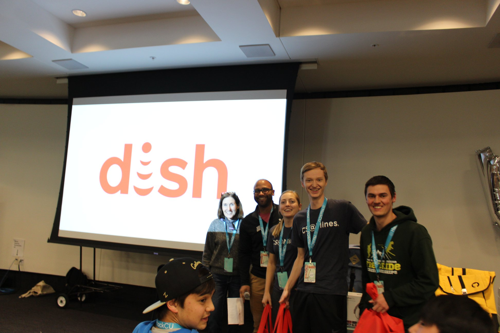
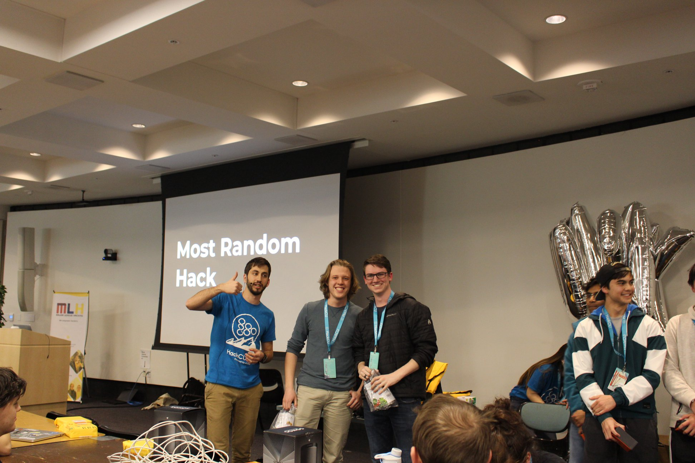
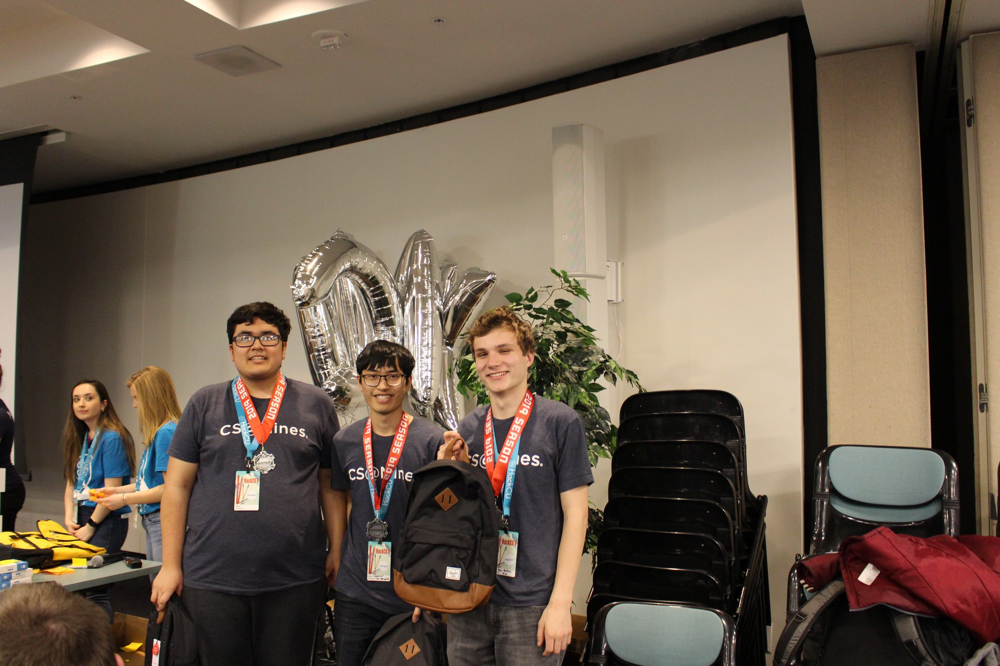

A couple of weekends ago (Feb. 23-24), nearly 30 Mines students (myself
included), attended the HackCU hackathon at CU Boulder.

Since the hackathon was so close and since I was driving up to the hackathon, I
decided to bring _all_ of my electronics. I brought my desktop, a monitor, my
mechanical keyboard, my ThinkPad, my MacBook Pro, my iPad, a Raspberry Pi, and a
variety of other assorted cables and electronics. It was a good thing I did,
too, since we ended up using all of them during the hackathon.

For this hackathon, I decided to make a team of me and 3 freshmen. My team
consisted of Ben Perkins, Nick Jarmusz, Jesus Nuñez, and myself. Ben had been to
a few hackathons during high school, and also attended MHacks this fall. This
was Nick's and Jesus's first time at a hackathon.

All of the Mines people headed out from Mines at 8:00, or at least that was the
plan. In actuality only one member of my team was at the meeting point at 8:00.
(The other cars heading up had similar luck getting everyone there on time.) At
around 8:15 Jesus and I decided to go to the Trads to check to make sure that
Ben was awake. He wasn't. Nick was also late, but he was at least awake. We left
at about 8:50.

The drive up was pretty uneventful and we got there at around 9:30, which was
perfectly fine since things didn't even start until 10:30.

We wandered around looking at the vendors' booths. Then there was an opening
ceremony. After that, we got some lunch (the catered food was really good).
Then, they were setting up tables, and not allowing people to claim tables. They
didn't do a good job patrolling, and a bunch of other people started camping
out. The Mines people wanted to be generally in the same area, so we were rather
annoyed. After complaining, we were able to get our tables.

Like last year's HackCU, they had way too few power strips, but we were able to
manage initially (I actually ended up going to Target to buy a power strip at
one point during the hackathon). We set up our computers and talked about what
we were going to make, and grabbed some lunch.

We had a couple of ideas initially, mainly related to machine learning or VR (I
had brought my desktop with its Nvidia GTX 2070 for that reason). We didn't
really have any ideas that were cool until we thought of using WiFi ping signals
to identify users' locations and then cluster devices using ML to make estimates
of how many people are in a space and their general movement patterns.

We started by doing some academic research into work done by Stanford and others
in using WiFi to track users' movements throughout a space. Things we researched
included:

- [ArrayTrack: Fine-Grained Indoor Location System](https://www.usenix.org/system/files/conference/nsdi13/nsdi13-final51.pdf)
- [Waitz](https://www.waitz.io/)
- [SpotFi: Decimeter Level Localization Using WiFi](https://web.stanford.edu/~skatti/pubs/sigcomm15-spotfi.pdf)
- [Accurate, Low-Energy Trajectory Mapping for Mobile Devices](https://www.usenix.org/legacy/events/nsdi11/tech/full_papers/Thiagarajan.pdf)

Having done this research, we were not only confident that our idea was viable,
but also that we would be able to point to the research in case our system was
terribly inaccurate. If it did, in fact, give terrible accuracy, we could say
that we didn't have time to integrate all of the research in this space and that
with more time and better equipment, we would be able to greatly increase
accuracy. (It's always good to have a scapegoat...)

We determined that we would have to build the following main components for a
minimal proof-of-concept.

- **WiFi Ping Capture:** We needed some way of capturing WiFi pings made by
  devices. This system also needed to give us a way to determine the signal
  strength of each of the pings.

- **Signal Analysis:** We needed a way to use the signal strength to create
  estimate the distance from the detection node to the device.

- **Trilateration:** We needed a way to determine the position of each device
  given distances from at least three capture nodes. (Trilateration is where you
  use distances, rather than angles to calculate positions. Triangulation, which
  is what is often used incorrectly to refer to trilateration, uses angles to
  calculate distances.)

- **Visualization:** We needed a user interface to show the locations of devices
  relative to the three detection nodes.

If we had time, we wanted to extend it further by adding a few more components:

- **Device Clustering:** Often, people have many devices. In these cases, we
  wanted to be able to cluster devices together using data analytics so that we
  could track numbers of _people_ rather than numbers of devices.

- **User Tracking:** We wanted to be able to track a given person's motions
  through the space with a high degree of accuracy.

At this point, we split off and started working on various components of the
system. Nick and I got set up for TensorFlow (in case we needed it later on, it
takes forever to get running). Ben started trying to figure out how to make a
Raspberry Pi into a hotspot that can capture pings, and Jesus did a ton of
research on how to use signal strength to measure distance from antenna to
device, and trilaterate based on three of those distance measurements.

By about 18:00, I started working on the trilateration logic. By 22:00, that was
basically completed. In the meantime, Ben and Jesus kept working like a champ
and determined that the Raspberry Pi was not going to cut it since the WiFi
adapters did not have the ability to be set it up in _monitor mode_ which is
what we needed for it to receive pings. They began working on using laptops to
act as our detection nodes instead. Nick worked on getting a server set up to
accept data from the ping collection nodes.

I took a nap for a couple of hours, and then at around midnight, I started
working on the frontend for displaying the location of all of the devices we
were tracking. I hate frontend dev. I just threw together some Bootstrap (the
base of which I stole from a previous project, as always). By about 04:00, most
of the frontend was complete, the backend of the web server needed to be hooked
up though, and that didn't come until later that morning. I went to bed for a
couple of hours, and then when I got up, I worked with Nick to hook up the
frontend. We completed that around 10:00, but we still were having trouble
figuring out how to calculate distance from signal strength. (Nick and Jesus had
worked on it for a while earlier in the morning but hadn't quite cracked it yet.
I don't remember exactly when as I was asleep/working on other stuff.) We only
had two hours left, so we all worked on it together to figure out what equations
were necessary to make the trilateration work correctly. We finished about half
an hour before noon, and took the next few minutes to clean up and prepare for
demos.

Nick had to go back to school because of a band concert (I think), so he headed
out before demos. Jesus, Ben, and I held down the fort.

---

We demoed to about 8 judges (many of whom were sponsor judges, since we entered
into a lot of sponsor prizes). It was a lot more than some of the teams around
us, not sure why that was (maybe they wanted a second look at some of the
projects?).

I was quite tired at that point, and it was difficult to stay enthusiastic about
the project while demoing, but we made it work.

Eventually, the representative from MLH came over to our table and told us that
we were in the top 5 and would be demoing our project in front of everyone! That
was extremely cool, I'd never made it to the finals of an MLH hackathon. At this
point, we were in a sort of pinch. My laptop was tied down being a fake WiFi
access point, and my desktop was running the web application. All of our other
laptops were likewise utilized. So, I pulled out my Mac. I was running Ubuntu on
my MacBook Pro because of needing it to do ROS development for Human Centered
Robotics, so we used my MacBook to hook up to the projector for the demo (good
thing I brought everything...).

We demoed second. It went pretty well. Demos can always go better, but it worked
out fine. After all of the demos, we waited around and listened to all of the
sponsor prizes. Easton, Kristin, and Zach won Second Place in the Dish Network
Challenge (the same challenge that Robby, Jack Garner, David, and I had won the
year before).

Fisher and Jake won best random hack for their _Cookie Injection with Real
Cookies_ game. (Their random prize was a cheese grater.) Jake wrote a
reflections post about the hackathon on his blog which you can find
[here](https://jake.vossen.dev/blogs/hack-cu-v-reflections.html).

Then they finally came out to announce the winners of the overall competition.
They announced third place. It went to a hack called _MLarketplace_ which was
basically a marketplace for plug-and-play Machine Learning algorithms. Then they
announced second place. My team won second place! We were extremely happy about
that, especially considering the quality of the competition.

An app called _Mentor_ which was a companion iPad application and Atom plugin
which converted abstract syntax trees from one language to another as an
educational tool won first place. They demoed with converting Python to Go.

After the demos were over, I had to pack up all of my stuff (that was a
non-trivial task, considering I had three computers, one of which I had to take
the GPU out of to pack up). We then headed back to Mines and went to Thai Gold
for dinner. Then I headed home and slept for a _very_ long time.

Anyway, overall, I was extremely happy with how my team did. All of them were
freshmen, it was the first time going to a hackathon for Nick and Jesus. Ben
came in clutch, and I think he was the real MVP of the team (he stayed up the
entire time, and did a lot of the dirty work as well as stepped up as a leader
of the team). I'm happy that I've gotten to represent Mines at so many
hackathons and that I was able to finish strong at my last hackathon. I also
have confidence that Colorado School of Mines will also continue to have great
success at hackathons long into the future.
