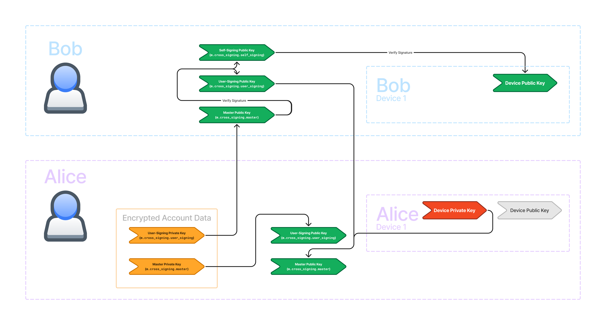

{}

This is a companion article to the
[talk I gave at the 2024 Matrix Conference]()
by the same name.

<a href="slides.pdf" target="_blank"><i class="fa fa-file-pdf-o"></i> Slides</a>
|
<a href="slides-with-notes.pdf" target="_blank"><i class="fa fa-file-pdf-o"></i>
Slides + Notes</a>

<i class="fa fa-youtube-play"></i>&nbsp;Matrix Cryptographic Key Infrastructure - Sumner Evans



{}

End-to-end encryption is one of the things which brought me to Matrix, and I'm
sure that it's one of the factors that brought many of you to Matrix as well.

However, Matrix's user experience with cryptography is often confusing. I mainly
blame the other chat networks for their incompetence. Most other chat networks
don't even provide any cryptographically-guaranteed security and privacy. Of the
ones that do, most do so in a way that does not truly leave the user in control
of their keys. Only a few networks, namely Signal, truly leave the user in
control, and their UX is arguably worse than Matrix.

In this article, my goal is to discuss the cryptographic key _infrastructure_ in
Matrix. What do I mean by "infrastructure"? I mean all of the features which
support key sharing and identity verification, but don't actually themselves
provide security. You can think of this article as discussing the "UX layer of
cryptography in Matrix". None of the things that I'm going to discuss are
strictly necessary for ensuring secure E2EE communication, but without them,
Matrix' UX would be horrible.

Let's first discuss what Matrix even uses cryptography for. There are two main
purposes:

- **Message Security** --- only the people who are part of the conversation
  should be allowed to view messages of the conversation.

  As an additional benefit of how Matrix achieves this, encrypted messages
  cannot be tampered with by a man-in-the-middle actor without the receiving
  party knowing.
- **Identity** --- verifying that a user or device is who they say they are.

  Note that one of the most important parts of identity this is verifying that
  our own devices are under our own control and we should allow our own clients
  to share keys to it.

We will look at how it accomplishes both of these goals and the infrastructure
required to move the necessary keys around.

## Big Picture

In this article, we will be exploring the following diagram. It shows how those
core features are implemented as well as the infrastructure that supports them.

I know, it's pretty overwhelming. But don't worry, we are going to go
step-by-step through this, at the end of the article you should have an
understanding of what each part of this diagram means.

Let's start by orienting ourselves to the big picture of this diagram, then we
will break down the diagram into manageable pieces.

You can see that there are two users represented in the diagram: Bob on the top
and Alice on the bottom. The diagram is focused on how the Megolm session
created by Alice's Device 1 is shared to Bob and to Alice's Device 2.

You'll also notice that the diagram is color-coded.

- Red nodes represent data that does not leave the device.
- Green nodes represent data is public and can be shared with the server and
  other users.
- Orange nodes represent data that can be shared with trusted parties, or with
  members of the same Matrix room.
- Blue and purple nodes represent cryptographic operations.

### Message Security

It's important that we don't loose sight of the reason for all of this
infrastructure. Highlighted in orange within each of the devices, we have the
core of Matrix security: the Megolm session.

We aren't going to discuss this in detail today. I wrote a full
[article about Megolm]() if you want to learn more.
For the purposes of this article, the only thing you need to know about the
Megolm session is that it's what is used to encrypt and decrypt messages. The
Megolm session needs to be shared with all the devices that Alice wants to be
able to read her messages. So it needs to be shared to the devices of other
users in the Matrix room (in this case Bob) as well as her other devices.

All of the rest of the infrastructure in this diagram is to facilitate
transferring that Megolm session, or verifying that a device should in fact have
access to that Megolm session.

### Identity

Next let's discuss identity. The highlighted parts of the diagram provide a
cryptographic way to verify that a device belongs to a particular user.

There are actually two pieces here: determining trust for our own user and
determining trust for other users. We will look at each of these in more depth
later.

### The Other Stuff

So what is all of the other stuff? That is the **infrastructure** for sharing
the Megolm session around to other devices and users. There are arrows
representing Olm-encrypted to-device messages going between devices. The
lower-right section of the diagram represents key backup which allows you to
backup your keys to the server and restore from your other devices. Then, on the
left we have the infrastructure necessary for storing secrets on the server
encrypted by a recovery code.

At this point, we are ready to embark on our journey of understanding each piece
of the diagram.

{}

This article requires some basic understanding of the following cryptography
concepts:

- Encryption (symmetric and asymmetric)
- Asymmetric signatures
- Hashes and HMAC
- Key-Derivation Functions (HKDF)
- Diffie-Hellman Key Exchanges

If you are unfamiliar with any of these topics, check out the
[Matrix Cryptography Prerequisites]()
companion article which describes the prerequisites in enough detail to
understand the rest of this article.

{}

## Sharing Keys

We're going to start by discussing how we get keys from one device to another.
This process is generally called "key sharing".

Remember, what the key that we want to share is the Megolm key. That's what
encrypts the messages. There are two ways to share these: encrypted olm events
and key backup.

### Encrypted Olm Events

In the following diagram, I got rid of everything besides the Megolm session and
the encrypted Olm events which are highlighted in red. The events are sent as
to-device messages which allow you to send messages to specific devices (rather
than to rooms).

You can see that we can send keys to other users' devices via `m.room_key`
events. We actually we use `m.room_key` events to send keys to our own devices
as well. We can also request keys by sending `m.room_key_request` events to our
own **verified** devices and the other devices can respond using
`m.forwarded_room_key` events. We will discuss about how we know a device is
verified later.

I'm not going to discuss how Olm encryption works. It's already been covered
many times since it's basically just the
[Signal double-ratchet algorithm](https://en.wikipedia.org/wiki/Double_Ratchet_Algorithm).
For our purposes, it's sufficient to know that we can send keys securely to
other users' devices and our own devices via these events.

This seems great, why do we have anything else? Well, new logins are the issue.
Say Alice just logged in on Device 2 and finished verification.

If Device 1 is _online_, she can send key requests to Device 1 and Device 1 can
respond. This works, but there will likely be a lot of keys to request. Every
user in every encrypted room has different keys. This will make Device 1 do a
lot of work to send back all the keys. On mobile devices, keysharing can't
really be done in the background, especially on iOS. Even on desktop devices,
it's still a lot of work to process a flood of key requests.

But it's even worse if Device 1 is _offline_. In that case, Alice's key requests
will never be answered!

This is where **key backup** comes into play. Key backup allows us to store keys
on the server, and restore them from our other devices even if your other
devices are offline or inaccessible.

### Key Backup

In the following diagram, I got rid of everything not related to key backup.

In the middle we have the key backup in green. Key backup is stored on the
server. In this diagram, we're trying to get the Megolm key from Alice's Device
1 to her Device 2, so left to right.

There are two pieces to key backup: the **key backup version** which includes
the backup public key and the **encrypted session data** for each of the
backed-up Megolm sessions.

The first thing to note is that AES is used on both sides to encrypt and decrypt
the Megolm session. Only the encrypted version is stored on the server. But AES
needs a key and initial vector. Where do we get those from? Well, we get them
from HKDF. HKDF requires a key as well, so where do we get that from? That comes
from a call to ECDH.

Note that everything so far is the **same on both the encrypting and decrypting
sides!**

Recall that ECDH requires a private key, and the other keypair's public key. If
you have either private key, we just need the other public key to get the same
value from ECDH.

\[\textbf{ECDH}(A_{private}, B_{public}) = \textbf{ECDH}(B_{private},
A_{public}) = K_{shared} \]

So where do we get the \(A\) and \(B\) keypairs from?

- The first keypair is the Megolm backup keypair. The public key is stored in
  the key backup version. The private key is a secret stored on the user's
  device.
- The second keypair is the ephemeral keypair. A new keypair gets created for
  each backed up session. It's ephemeral because the private part is be
  discarded immediately after the encryption is done. The public key is stored
  in the encrypted session data.

This is where the sides diverge.

- The encrypting side gets its private key from the _ephemeral keypair_ and it
  uses the Megolm backup public key as its public key.
- The decrypting side gets its private key from the Megolm backup private key
  and it uses the ephemeral public key as its public key.

Critically you must have the Megolm backup _private_ key to decrypt the key
backup.

For each Megolm session that we back up in key backup, we store the ephemeral
public key and the ciphertext from AES together in the encrypted session data
object. But there's another item that we store in this object: the MAC.

MACs are meant to ensure that the ciphertext hasn't been tampered with by a
malicious or incompetent party. We use HMAC to generate the MAC to avoid
metadata attacks. Recall that HMAC requires a key. Conveniently, we are already
using HKDF to generate the AES key and initial vector, so we can just use the
same key derivation to get the HMAC key as well.

What should happen is that we pass the ciphertext into HMAC. However, the
original implementation in libolm failed to do this correctly and instead just
passed an empty buffer, and it has been de-facto spec ever since.[^1]

[^1]: I documented this behaviour in
    [matrix-org/matrix-spec#1712](https://github.com/matrix-org/matrix-spec/pull/1712).

So, the MAC is not really useful at all in its current state. I'm hoping that a
future version of the spec fixes this.

## Device Verification

Recall how I said in [Encrypted Olm Events](#encrypted-olm-events) that we only
want to forward keys to our own _verified_ devices? Now we are going to discuss
how verification status is determined.

The answer is signatures! Remember that asymmetric signatures can only be
created by the private key, and anyone who possesses the public key can verify
the signature. In the following diagram, I've highlighted all of the signatures
required for verifying your own devices.

In Matrix, each device has a _device keypair_. The public key is an identifier
for the device. To verify a device, we _sign_ the device public key. Often, we
call this process **trusting** a key. We trust the key by creating a signature
for it.

We can use our own device private key to directly trust the other device key.
But that is inconvenient. When we log in a new device, all our existing devices
will need to make a signature for the new device, and the new device will have
to make a signature for all the existing devices!

So, we introduce a new user-wide key called the **self-signing key** because it
signs our own devices. We use the self-signing key to sign the device keys but
how do we know if we should trust the self-signing key?

That's where the master key comes in. The master key signs the self-signing key.
We then trust the master key by signing it with our device private key.

This creates a **chain of trust**. The _device private key_ signs the _master
public key_ which corresponds to the _master private key_. The _master private
key_ signs the _self-signing public key_ which corresponds to the _self-signing
private key_. And the _self-signing private key_ signs all of the _device public
keys_.

This allows us to trust a single key (in this case, the master key) and then by
verifying the signatures along the chain of trust, we can trust all of our own
devices.

## User Verification

Sometimes, we want to trust a user so that we know that all of the devices on
their account are under their control. If a new device is logged in, we will
know if they control the device if they have signed it. If some malicious actor
logged in a new device, they would not be able to sign it, and we would know the
other user has been compromised.

The user we want to trust has already signed their devices with their
self-signing key, which is itself signed by their master key. So, if we are able
to trust their master key, we will have a chain of trust to all of their
devices. In the following diagram, I've highlighted all of the signatures
required for verifying another user's devices.

We introduce a new key called the **user-signing key** which signs other users'
master keys} and is itself signed by our own master key.

This creates yet another chain of trust. Our _device private key_ signs the
_master public key_ which corresponds to the _master private key_. The _master
private key_ signs the _user-signing public key_ which corresponds to the
_user-signing private key_. The _user-signing private key_ signs other users'
_master public keys_.

We can verify the signatures by the other user's _master private key_ using
their _master public key_. Since their _master private key_ signed their
_self-signing public key_, we can verify the signature and trust their
_self-signing key_. Since their _self-signing private key_ signed their _device
public keys_, we can verify the signatures and trust their device keys.

## Secure Secret Storage and Sharing (SSSS)

Wow, that's a lot of keys! Where are they stored? The _public_ keys can be
stored on the server. However, the _private_ keys need to remain in the user's
control. So far we have seen private keys for key backup, user signing, and
device signing as well as the master key. These keys are stored on each of your
devices and can be shared with your other verified devices using those
Olm-encrypted to-device events. But what if you sign out of all of your devices
or lose access to them?

That's where **Secure Secret Storage and Sharing** (also known as **SSSS** or
**quadruple S**) comes in. SSSS allows you to store your keys encrypted within
account data on the server. The following diagram shows SSSS.

The key that SSSS uses to encrypt the account data is effectively the recovery
key. There is a base58-decode and an HKDF transformation which produces the
actual AES key, but it's basically just your recovery key that unlocks the
encrypted account data.

You can probably see that if you lose your recovery key, and you have no
signed-in devices, there is no way to recover the private keys. This is why it's
important to store the recovery key in a safe place like a password manager.

Astute readers may realise that AES needs both a key and IV and I've only
described how the key is generated. The answer is that the IV is stored within
the account data object itself.

So what's going on in the bottom part of the diagram? It's not actually strictly
necessary for the encryption, but it allows you to verify that your recovery key
is correct before trying to decrypt account data. The core of this functionality
is an equality check between an HMAC call and the HMAC stored within an
unencrypted account data event `m.secret_storage.key.<Key ID>`. There can be
multiple key IDs, so the default `Key ID` is stored in
`m.secret_storage.default_key`. The base58-decoded recovery key is passed
through HKDF do generate an AES key as well as a MAC key. Then, using 32-bytes
of 0s as the plaintext, and using the key ID as the IV, we run AES. Then we take
the ciphertext and use that as the input to HMAC. This process acts as a
checksum for the recovery key: only if the recovery key is entered correctly
will the MACs match.

## Conclusion

Let's go back to the big picture once more and see what we have learned.

We've now discussed each piece of this diagram. We discussed the **Megolm
session** which gets shared via **Olm-encrypted to-device events** and to our
own devices using **key backup**. We looked at how we verify our own devices
using the **self-signing key** and how we verify other users using the
**user-signing key**. We saw how the **master key** signs both the self-signing
and user-signing keys, and we examined how secrets can be stored securely in
account data on the server encrypted by the **recovery key**.

I hope that this article has helped you understand how all of these keys fit
together. My goal is to convince people that Matrix cryptography is not scary.
It's _complex_, but not inaccessible. If you have access to all of the
underlying cryptography primitives, all of this is something that a
security-conscious programmer could implement. You almost certainly should not
implement the cryptography primitives yourself, but composing them together is
doable.
