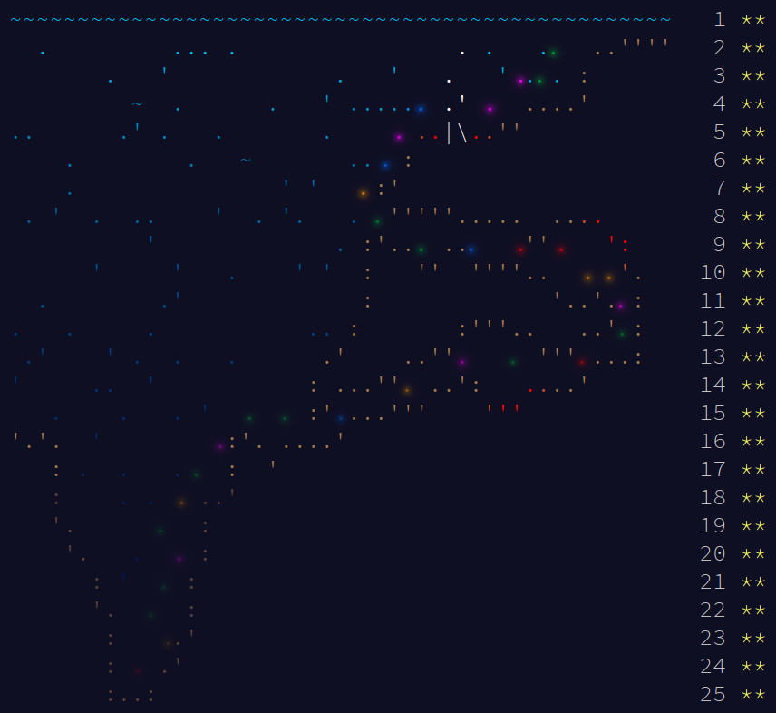
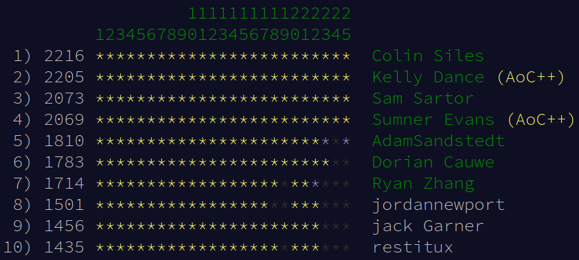
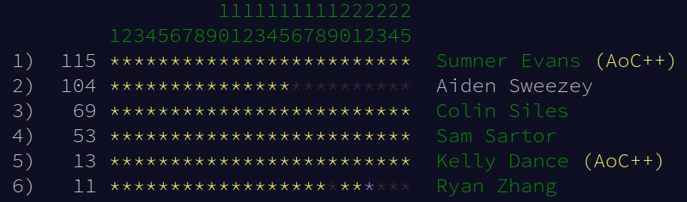

Every year since 2015, [Eric Wastl][1] creates a two-part programming problem
for each of the 25 days of Advent. He publishes a new problem every day at
[adventofcode.com](https://adventofcode.com) at exactly midnight EST which is
22:00 the day before for me in MST. Last year, I decided to do the problems as
soon as they came out and streamed my problem solving sessions on my [Twitch
channel][2] and uploaded them to [my Youtube channel][3].

This year, I'm doing to do the same thing! This year, however, I'm also going to
maintain this blog post. I will update this post every day with my thoughts on
each problem, and give a brief solution sketch.

As with last year, I am participating in a private leaderboad for the Colorado
School of Mines CS department with a bunch of Mines students and alum.

[1]: https://twitter.com/ericwastl
[2]: https://twitch.tv/sumnerevans
[3]: https://www.youtube.com/channel/UCyrdRO4oJRpszr0ovN1FwBA

# Summary of Results

I managed to solve all of the problems this year, for a total of 50 stars. This
is the second year in a row that I've completed all of the problems. Here's what
the map looks like:



The following is my results across all of the days.

```
      --------Part 1--------   --------Part 2--------
Day       Time   Rank  Score       Time   Rank  Score
 25   00:16:45    605      0   00:16:51    503      0
 24   14:47:42   4676      0   14:51:51   4547      0
 23   04:11:39   3515      0   05:11:51   1990      0
 22   00:09:58    503      0   03:45:25   2276      0
 21   00:07:55    352      0   00:22:56    144      0
 20   00:45:49   1489      0   01:07:34   2108      0
 19       >24h  11368      0       >24h  11815      0
 18   17:42:08  11447      0   17:50:55  11230      0
 17   00:10:48    240      0   00:16:56    271      0
 16   01:40:59   3439      0   01:55:56   3005      0
 15   00:05:10     84     17   01:51:23   3682      0
 14   00:07:33    391      0   01:08:40   3371      0
 13   00:35:07   3962      0   00:36:37   2836      0
 12   00:10:51    422      0   00:43:27   2240      0
 11   00:52:24   4855      0   00:54:24   4535      0
 10   00:11:12   1902      0   00:19:18   1640      0
  9   00:22:40   5314      0   00:39:34   2937      0
  8   00:07:24    890      0   00:44:03   1066      0
  7   00:02:29    252      0   00:10:14   1865      0
  6   00:03:14    122      0   00:06:50    175      0
  5   00:13:24   1238      0   00:36:27   2733      0
  4   00:16:54    845      0   00:37:47   2325      0
  3   00:06:56   1338      0   00:38:16   3718      0
  2   00:03:03   1045      0   00:04:57    856      0
  1   00:00:49     38     63   00:02:22     66     35
```

I got global leaderboard on two days 1 (part 1 and 2) and 15 (part 1) for a
total of 115 points on the global leaderboard. This year was the first time I'd
ever made global leaderboard, so that was really cool. My 115 points puts me at 
396th globally according to [this scraped leaderboard on
GitHub](https://github.com/SourishS17/AoC-2021-Full-Leaderboard/blob/main/leaderboard.csv).

I got top 200 on six occasions, and top 500 twelve times (I had two more at rank
503). I made top 1000 eighteen times, and top 5000 on all but five parts. I also
solved within 24 hours on every day except for day 19.

Language statistics (note that some of this is boilerplate that I copy to every
Python file):

```
$ tokei -e inputs
===============================================================================
 Language            Files        Lines         Code     Comments       Blanks
===============================================================================
 OCaml                   4          228          191           16           21
 Python                 25         6597         4819          557         1221
===============================================================================
 Total                  29         6825         5010          573         1242
===============================================================================
```

## Mines Leaderboard

At the end of the competition (2021-12-24 23:32 MST), this is the state of the
Mines leaderboard:



Six people leaderboarded globally:



# Day 1: Sonar Sweep

| <!-- -->       | <!-- -->                                                                                                                                                      |
| -------------- | ------------------------------------------------------------------------------------------------------------------------------------------------------------- |
| **Link:**      | https://adventofcode.com/2021/day/1                                                                                                                           |
| **Solutions:** | [Python](https://github.com/sumnerevans/advent-of-code/blob/master/2021/01.py), [OCaml](https://github.com/sumnerevans/advent-of-code/blob/master/2021/01.ml) |
| **Part 1:**    | 00:00:49, 38th                                                                                                                                                |
| **Part 2:**    | 00:02:22, 66th                                                                                                                                                |

<details class="youtube-expander">
  <summary><i class="fa fa-youtube-play"></i>&nbsp;Advent of Code 2021 - Day 1 | Python (38*, 66**)</summary>
  
</details>

I did surprisingly well on this problem and I made the global leaderboard on
both parts. The core algorithm for both parts was a simple scan of a list where
you have to determine how many times the current element is greater than the
previous element.

<details class="advent-of-code-part-expander" open>
<summary><h3>Part 1</h3></summary>

For part 1, you operate directly on the list. To do this, I used the
[`zip`](https://docs.python.org/3/library/functions.html#zip) function on the
sequence, and the sequence without the first element:

```python
for i, j in zip(seq, seq[1:]):
```

This iterates through all sequential pairs in the list. I then check to see if
`j > i` and if so, increment a counter.

</details>

<details class="advent-of-code-part-expander" open>
<summary><h3>Part 2</h3></summary>

Part 2 is very similar to part 1, but instead of operating directly on the list,
you operate on a new list consisting of the three-element sliding window sums of
the list. That is, you create a new list where the first element is the sum of
the three elements starting at index 0, the second element is the sum of the
three elements starting at index 1.

For example, if you have a list `[1, 2, 3, 4, 5]`, the resulting
sliding-window-sum list would be `[6, 9, 12]`. You don't have to start creating
sums until you have enough numbers.

To implement this, I used another `zip`, but this time with three elements, and
just summed each of the windows:

```python
windows = []
for i, j, k in zip(seq, seq[1:], seq[2:]):
    windows.append(i + j + k)
```

After calculating this list, the same algorithm as Part 1 works.

</details>

# Day 2: Dive!

| <!-- -->       | <!-- -->                                                                                                                                                      |
| -------------- | ------------------------------------------------------------------------------------------------------------------------------------------------------------- |
| **Link:**      | https://adventofcode.com/2021/day/2                                                                                                                           |
| **Solutions:** | [Python](https://github.com/sumnerevans/advent-of-code/blob/master/2021/02.py), [OCaml](https://github.com/sumnerevans/advent-of-code/blob/master/2021/02.ml) |
| **Part 1:**    | 00:03:03, 1045th                                                                                                                                              |
| **Part 2:**    | 00:04:57, 856th                                                                                                                                               |

<details class="youtube-expander">
  <summary><i class="fa fa-youtube-play"></i>&nbsp;Advent of Code 2021 - Day 2 | Python (1045*, 856**)</summary>
  
</details>

This problem went well, almost got top 1000 on part 1, and did get top 1000 on
part 2. The problem is a basic state machine where you have to keep track of
position and (for part 2) "aim".

<details class="advent-of-code-part-expander" open>
<summary><h3>Part 1</h3></summary>

The only interesting thing that I did for part 1 is use a regular expression to
parse each line. Other than that, it was just a few `if` statements to determine
how to modify the `f` (forward) and `dep` (depth) variables. (You can read the
problem description on the AoC website for details on how you are supposed to
modify them.)

</details>

<details class="advent-of-code-part-expander" open>
<summary><h3>Part 2</h3></summary>

Part 2 is basically the same as part 1, except there is an additional variable
that you have to keep track of "aim" (`a`). This determines how "down" or "up"
your submarine is headed. The "up" and "down" commands no longer change your
actual position, but rather the aim, and forward changes your depth as well as
your lateral direction.

</details>

# Day 3: Binary Diagnostic

| <!-- -->       | <!-- -->                                                                       |
| -------------- | ------------------------------------------------------------------------------ |
| **Link:**      | https://adventofcode.com/2021/day/3                                            |
| **Solutions:** | [Python](https://github.com/sumnerevans/advent-of-code/blob/master/2021/03.py) |
| **Part 1:**    | 00:06:56, 1338th                                                               |
| **Part 2:**    | 00:38:16, 3718th                                                               |

<details class="youtube-expander">
  <summary><i class="fa fa-youtube-play"></i>&nbsp;Advent of Code 2021 - Day 3 | Python (1338*, 3718**)</summary>
  
</details>

Part 1 of this problem went fairly well, but part 2 was a disaster. One thing
that I think helped with both parts was keeping the input as a string and
operating on the individual characters, because thinking through the actual
bitwise operations sounded difficult.

Overall, this problem was more interesting than Day 2, and I enjoyed refactoring
at the end. I think that I should have taken a couple more minutes at the start
of part 2 to think about how to best implement it. I think that would have
allowed me to avoid a couple foot-guns.

<details class="advent-of-code-part-expander" open>
<summary><h3>Part 1</h3></summary>

To calculate "gamma", you have to determine, for each column of the input what
the most common bit is (`1` or `0`) and that most common bit becomes that
column's value in the bit representation of "gamma". Epsilon is just the
complement of gamma (that is, reverse all the `1`s and `0`s).

To do this, I created two lists, one to keep track of how many `1`s were present
in each column of the input, and another to track how many `0`s were present in
each column of the input. Then, I `zip`ped the lists together so that I could
compare whether there were more `1`s or `0`s at each column.

During the stream, I just used a `for` loop to accomplish this, but afterwards I
converted it to a fairly nice list comprehension:

```python
# Store the bitmap as a list of integers. If there are more zeros than ones, then
# that index is 0, otherwise, that index should be 1.
gamma = [0 if zeros > ones else 1 for zeros, ones in zip(freq0, freq1)]
```

Obviously it can be simplified further to avoid the ternary, but I tend to go
for readability over succinctness.

Python has a nice feature where you can just use the `int` constructor with a
second parameter which is the base to use. So `int("11", 2) == 3`, for example.
I used this to my advantage by just joining the results together as a string and
then passing it to `int`.

</details>

<details class="advent-of-code-part-expander" open>
<summary><h3>Part 2</h3></summary>

Part 2 was more difficult. At each step, the task was to filter the list of
elements in the input by some rules. The rules depend on calculating whether `0`
or `1` is the most common bit at the \\(n^{\text{th}}\\) column for _all_ of the
elements remaining in the list, where \\(n\\) is the iteration number.

There are two values that you have to calculate: the "oxygen generator rating"
and the "CO2 scrubber rating". To calculate the "oxygen generator rating", at
each step you only filter the elements that do not have the most common element,
whereas with the "CO2 scubber rating" you do the opposite.

There are a few gotchas with this part. First (and I screwed this up when I was
solving), you have to be sure that you recompute the frequencies _every
iteration_. This was a key insight that I totally missed. Secondly, you have to
keep track of the remaining candidates for oxygen and CO2 independently.

I screwed up this pretty badly, and took _forever_ to solve. There are a few
things that I am going to keep in mind in the future:

- Read the examples sooner. If I had, I think I would have understood what to do
  a lot quicker.

- I reused `i` multiple times which bit me. I need to get out of that habit.

- I need to actually pull down the test input as well as the problem input a lot
  sooner, and verify against it for these harder problems.

</details>

# Day 4: Giant Squid

| <!-- -->       | <!-- -->                                                                       |
| -------------- | ------------------------------------------------------------------------------ |
| **Link:**      | https://adventofcode.com/2021/day/4                                            |
| **Solutions:** | [Python](https://github.com/sumnerevans/advent-of-code/blob/master/2021/04.py) |
| **Part 1:**    | 00:16:54, 845th                                                                |
| **Part 2:**    | 00:37:47, 2325th                                                               |

<details class="youtube-expander">
  <summary><i class="fa fa-youtube-play"></i>&nbsp;Advent of Code 2021 - Day 4 | Python (845*, 2325**)</summary>
  
</details>

Today's part 2 was another disaster (see below for details). Part 1 went pretty
decently, and I made it to the top 1000 again.

I liked the problem, but the edge case that I failed to handle cost me ~17
minutes, and probably 6 points on the Mines leaderboard (which is devastating,
since I am currently sitting at 4th with 301 points, but first second and third
are clustered at 316, 313, and 312).

The test infrastructure that I added somewhat helped, but I have some
improvements that I need to make before tomorrow.

<details class="advent-of-code-part-expander" open>
<summary><h3>Part 1</h3></summary>

The core of the problem was calculating if a board has won bingo. Luckily we
only had to handle rows and columns, since diagonals are really quite annoying
to implement.

To determine if a given row or column had won, I converted to a set, subtracted
the set of numbers that had been called, and then checked if I got the empty
set. If I did, then it was bingo, and the board had won.

```python
def checkset(row_or_col: List[int], called: List[int]) -> bool:
    return set(row_or_col) - set(called) == set()
```

For part 1, you just have to keep adding numbers from the sequence of called
numbers until a board wins. The score calculation was a bit annoying, since you
have to sum up all of the numbers that had _not_ been called. I missed that, and
submitted the wrong thing (thinking it was the sum of the ones that _had_ been
called).

</details>

<details class="advent-of-code-part-expander" open>
<summary><h3>Part 2</h3></summary>

For part 2, the task was to determine which board won last. I understood the
task right away, but then I made a fatal mistake. Every time a board won, I
would remove it from the list of boards. Then, when there was one board
remaining, I did the score calculation. However, this is incorrect. You must
play out the game until that last board wins bingo.

I spent about 17 minutes fixing that bug.

</details>

# Day 5: Hydrothermal Venture

| <!-- -->       | <!-- -->                                                                       |
| -------------- | ------------------------------------------------------------------------------ |
| **Link:**      | https://adventofcode.com/2021/day/5                                            |
| **Solutions:** | [Python](https://github.com/sumnerevans/advent-of-code/blob/master/2021/05.py) |
| **Part 1:**    | 00:13:24, 1238th                                                               |
| **Part 2:**    | 00:36:27, 2733rd                                                               |

<details class="youtube-expander">
  <summary><i class="fa fa-youtube-play"></i>&nbsp;Advent of Code 2021 - Day 5 | Python (1238*, 2733**)</summary>
  
</details>

Today was not ideal. It was not as disastrous as yesterday, but it was still
fairly unfortunate.

I thought that the problem was nice. The core of the problem was determining
intersections of horizontal, vertical, and (for part 2) diagonal lines. On part
2, I forgot basic algebra concepts; namely that slope can be positive or
negative. That cost me many minutes of debugging.

The test infrastructure improvements I made after yesterday were useful, and
saved me a couple seconds.

<details class="advent-of-code-part-expander" open>
<summary><h3>Part 1</h3></summary>

Because the size of the grid is fairly small (no numbers are over 3 digits),
it's efficient enough to just store the number of lines that go over a given
point in a `position -> number of lines covering` dictionary.

For part 1, the key was to ignore all diagonal lines. Only lines where either
`x1 == x2` or `y1 == y2` need to be considered.

The input can be provided with the first point "higher" than the second point,
so I used something that I thought was pretty clever to handle that: I just
sorted the position tuples. (Note that after solving, I added new helper
functions that allows me to perform directional ranges meaning that the range
will work regardless of whether the end is greater than the start or not.)

Then, I used a double `for` loop which fills in `G` with the line in regardless
of whether the line is vertical or horizontal. It is guaranteed to work here
because one of the for loops will only have a single iteration.

```python
G = defaultdict(int)
for x in range(x1, x2 + 1):
    for y in range(y1, y2 + 1):
        G[(x, y)] += 1
```

I also made use of
[`defaultdict`](https://docs.python.org/3.8/library/collections.html#collections.defaultdict).
This allows me to index into a dictionary and if that key is not in the
dictionary, it will initialize it using the constructor given. In this case
`int` (which is `0` by default).

I then just counted how many items in the graph were greater than 0.

</details>

<details class="advent-of-code-part-expander" open>
<summary><h3>Part 2</h3></summary>

For part 2, I thought I could use basically the same logic as part 1 with
sorting the points, but I made a fatal mistake. While the `x` points are sorted
correctly, the `y` coordinate could go either up or down depending on which
diagonal the line is on. Literally elementary school math, but I managed to
screw it up. I managed to waste a ton of time figuring that out.

The way I ended up solving it on stream was using an if statement to determine
if `y` should go up or down. I then refactored it to calculate slope.

After the stream, I came up with an even more ingenious way to handle diagonals
that involves the new directional range function.

```python
for x, y in zip(dirange(x1, x2), dirange(y1, y2)):
    G[(x, y)] += 1
```

What this does is goes through all of the `(x, y)` pairs starting at `(x1, y1)`
and going to `(x2, y2)`. This works even if `x1 > x2` or `y1 > y2` because
`dirange` figures out the correct direction to iterate in in order to always go
from the start to the end of the range.

</details>

# Day 6: Lanternfish

| <!-- -->       | <!-- -->                                                                                                                                                      |
| -------------- | ------------------------------------------------------------------------------------------------------------------------------------------------------------- |
| **Link:**      | https://adventofcode.com/2021/day/6                                                                                                                           |
| **Solutions:** | [Python](https://github.com/sumnerevans/advent-of-code/blob/master/2021/06.py), [OCaml](https://github.com/sumnerevans/advent-of-code/blob/master/2021/06.ml) |
| **Part 1:**    | 00:03:14, 122th                                                                                                                                               |
| **Part 2:**    | 00:06:50, 175th                                                                                                                                               |

<details class="youtube-expander">
  <summary><i class="fa fa-youtube-play"></i>&nbsp;Advent of Code 2021 - Day 6 | Python (122*, 175**)</summary>
  
</details>

Today went very well for me (besides one hiccup with a missing import in my
starter code which probably cost me a leaderboad spot). I got top 200 on both
parts. I think there were two main reasons for the success:

1. I went with the easy, inefficient solution for part 1. Instead of trying to
   prematurely optimize, I just went ahead and simulated the exponential growth.

2. I realized it would be inefficient to do 256 almost immediately (my test
   infrastructure helped me with that). I then paused for a moment to think of
   the optimization necessary, and figured that out very quickly.

After solving part 2, I refactored so that both part 1 and part 2 use the same
code.

<details class="advent-of-code-part-expander" open>
<summary><h3>Part 1</h3></summary>

For part 1, I took the most straightforward simulation approach, which was to
simulate the reproduction of the lanternfish at every single day exactly as the
problem description specified. I recreated the list of lanternfish every single
day, which is very inefficient, but for 80 days, it is efficient enough.

For each lanternfish in the list at any given day, I added one or two elements
to the new array. If the lanternfish was at `0`, then I added an 8 and a 6 to
the new array, and if the lanternfish was anything else (say `x`), I just added
`x - 1` to the list.

Then, the answer is the number of lanternfish after 80 iterations.

</details>

<details class="advent-of-code-part-expander" open>
<summary><h3>Part 2</h3></summary>

As mentioned above, for part 2 you have to make an optimization. The
optimization is to use a dictionary to aggregate of all of the lanternfish at
the same stage in life. For example, for the sample input:

```
3,4,3,1,2
```

the corresponding dictionary would be:

```python
{
  1: 1,  # one lanternfish at 1 day until breeding
  2: 1,
  3: 2,  # two lanternfish at 3 days until breeding
  4: 1
}
```

Then, at each day I just recreated the dictionary following the rules of
regeneration, but instead of moving the fish to the new life-stage one at a
time, the dictionary allows me to do it in bulk.

The only other interesting thing that I did for this problem was use a
[`defaultdict`](https://docs.python.org/3.8/library/collections.html#collections.defaultdict).
This allowed me to index into, and then modify, the new dictionary without
worrying about whether the key existed or not in the dictionary.

</details>

# Day 7: The Treachery of Whales

| <!-- -->       | <!-- -->                                                                                                                                                      |
| -------------- | ------------------------------------------------------------------------------------------------------------------------------------------------------------- |
| **Link:**      | https://adventofcode.com/2021/day/7                                                                                                                           |
| **Solutions:** | [Python](https://github.com/sumnerevans/advent-of-code/blob/master/2021/07.py), [OCaml](https://github.com/sumnerevans/advent-of-code/blob/master/2021/07.ml) |
| **Part 1:**    | 00:02:29, 252nd                                                                                                                                               |
| **Part 2:**    | 00:10:14, 1865th                                                                                                                                              |

<details class="youtube-expander">
  <summary><i class="fa fa-youtube-play"></i>&nbsp;Advent of Code 2021 - Day 7 | Python (252*, 1865**)</summary>
  
</details>

Part 1 went fairly well for me today. Part 2 did not go quite as well (I missed
a key insight into the problem), but it was a decent enough performance so I
didn't loose too many points on the Mines leaderboard.

I also solved this problem in OCaml after cleaning up my Python code.

<details class="advent-of-code-part-expander" open>
<summary><h3>Part 1</h3></summary>

For both parts, brute force is fast enough. The core brute-force algorithm is
checking every single possible alignment point, and determining which of them
gives you the best total "fuel cost" as defined by the problem. The fuel cost
for every submarine is just the distance from the submarine's position to the
alignment point. Then, you can just iterate over the possible alignment
locations which are all integer values between the minimum element in the
sequence and the maximum element in the sequence.

During my initial solve, I just used a for loop to do the minimization because
that was easy, and I didn't have to think very hard about it. After the stream,
I converted it to use much more functional code (more details below).

</details>

<details class="advent-of-code-part-expander" open>
<summary><h3>Part 2</h3></summary>

For part 2, the only thing that changes is the cost function. Instead of being
the distance between the alignment location and the submarine position, the cost
of moving \\(n\\) places is
\\[\sum_{k=1}^n k.\\]
It is efficient enough to do a `for` loop to calculate this manually (which is
what I did), but you can also use the formula
\\[\sum_{k=1}^n k = \frac{n(n+1)}{2}\\]
which makes the program run _much_ faster.

The reason my part 2 code did not work first time was because I missed a key
insight which was that the alignment point did not necessarily have to be at one
of the existing submarine locations. This cost me many minutes of debugging.

</details>

After my initial solution, I refactored my Python code to be more functional.
The core of the algorithm is now very concise, and uses the `min` function with
generators to minimize the sum of the costs for each of the crab submarines.

```python
def calc_best_alignment(seq: List[int], cost_fn: Callable[[int, int], int]) -> int:
    return min(sum(cost_fn(v, k) for k in seq) for v in irange(*seqminmax(seq)))

seq = [int(x) for x in lines[0].split(",")]
print("Part 1:", calc_best_alignment(seq, lambda x, y: abs(x - y)))
print("Part 2:", calc_best_alignment(seq, lambda a, b: sum(irange(1, abs(a - b)))))
```

# Day 8: Seven Segment Search

| <!-- -->       | <!-- -->                                                                       |
| -------------- | ------------------------------------------------------------------------------ |
| **Link:**      | https://adventofcode.com/2021/day/8                                            |
| **Solutions:** | [Python](https://github.com/sumnerevans/advent-of-code/blob/master/2021/08.py) |
| **Part 1:**    | 00:07:24, 890th                                                                |
| **Part 2:**    | 00:44:03, 1066th                                                               |

<details class="youtube-expander">
  <summary><i class="fa fa-youtube-play"></i>&nbsp;Advent of Code 2021 - Day 8 | Python (890*, 1066**)</summary>
  
</details>

This problem was fun. It involved dealing with a seven-segment display, which
automatically makes it interesting IMO. I have some experience with writing
problems related to seven-segment displays (see [*Broken Clock* from HSPC
2020]()).

One of the hardest parts of the problem was figuring out what it was asking and
understanding the format that the problem was being provided in. After that,
part 1 was fairly simple. Part 2 required some logic, and I floundered around
for a while trying to figure it out, and was finally successful.

<details class="advent-of-code-part-expander" open>
<summary><h3>Part 1</h3></summary>

Part 1 required that you count how many elements on the _output_ part of each
line were of length 2 (corresponding to the digit 1), 4 (corresponding to the
digit 4), 3 (corresponding to the digit 7), and 7 (corresponding to the digit
8). These are the only digits with that corresponding number of segments
illuminated.

It took forever to read through the problem, and then I messed up and didn't
realize that I just had to compare lengths (I thought I had to compare actual
values, which was not the case).

</details>

<details class="advent-of-code-part-expander" open>
<summary><h3>Part 2</h3></summary>

For part 2, you actually have to infer a mapping of the scrambled segment IDs to
the actual segment IDs, and then use that to determine the numbers being output.

There are two sets of constraints you can create for each line:

1. Each of the characters in strings with unique segment counts (2, 4, 3, 7)
   must map to one of the characters in the actual seven segment display for
   that number. For example, if you have `eg`, then you know that `e` can either
   map to `c` or `f`, and `g` can map to `c` or `f` as well. You can make these
   constraints for each of the unique segment counts and their corresponding
   digit.

2. You can look at the number of times that each character occurs in the signal
   patterns on the left of the `|`. If a letter occurs eight times on the left
   hand side, then it could either map to `a` or `c` because those are the only
   two segments that appear in eight of the possible digits. You can make these
   constraints for each of the segments.

After generating these constraints, I used my handy
`infer_one_to_one_from_possibles` function which performs simple inference to
get a 1:1 mapping of key to value.

Then, you can use that mapping to determine the values of each of the digits on
the right hand side of the `|`, convert that to an integer, and add it to the
answer. I messed that part up as I was solving because I accidentally used the
digits on the left hand side instead of the right hand side, and that cost me a
bit of time (and possibly a point on the leaderboard, although I don't think it
would have been enough).

</details>

Although I liked the problem, it was not great for me on the leaderboard. I lost
another 5 points on Colin (679), and Ryan jumped me with another 1*, 1\*\*
placement for +6 over my 4*, 5\*\* today. Ryan is now at 654, Kelly at 653, and
I'm at 652. It's going to really be interesting to see how things shake out down
the stretch!

# Day 9: Smoke Basin

| <!-- -->       | <!-- -->                                                                       |
| -------------- | ------------------------------------------------------------------------------ |
| **Link:**      | https://adventofcode.com/2021/day/9                                            |
| **Solutions:** | [Python](https://github.com/sumnerevans/advent-of-code/blob/master/2021/09.py) |
| **Part 1:**    | 00:22:40, 5314th                                                               |
| **Part 2:**    | 00:39:34, 2937th                                                               |

<details class="youtube-expander">
  <summary><i class="fa fa-youtube-play"></i>&nbsp;Advent of Code 2021 - Day 9 | Python (5314*, 2937**)</summary>
  
</details>

Today was my worst day yet. Absolutely bombed both parts. Lots of things went
wrong. Probably the biggest was that my grid adjacency helper function didn't
actually do what I needed it to, and it had been so long since I'd programmed it
that I couldn't actually remember how it worked to modify it.

Also, I had a couple of other errors, including that I missed that the low
points had to be strictly less than all adjacent points, but that was a small
error compared to the time I wasted on a function that was broken.

Part 2 went a little bit better, but I failed to implement a basic flood fill
for a number of minutes.

<details class="advent-of-code-part-expander" open>
<summary><h3>Part 1</h3></summary>

As I mentioned above, part 1 went very poorly because of my assumption that past
me had implemented the `grid_adjs` function in the way I wanted it to work
today. However, that was a fatal assumption: past me is stupid; and present me
is equally stupid because present me assumed that past me was good at
programming.

Fundamentally, the problem required that you check every square of a grid and
see if its compass-neighbors are strictly greater than it. If so, then that
square is a "low point" and \\(1 + h\\) where \\(h\\) is the value of the
square.

It's actually fairly simple if your past self doesn't come up and stab you in
the back.

I refactored everything on stream, and improved my `grid_adjs` function and
actually documented it this time. Hopefully future me will understand how to use
the function in the future. The final version of the code is actually fairly
concise:

```python
def part1(lines: List[str]) -> int:
    ans = 0
    L = [[int(y) for y in x] for x in lines]

    for r in range(len(L)):
        for c in range(len(L[0])):
            if all(
                L[ar][ac] > L[r][c]
                for ar, ac in grid_adjs((r, c), ((0, len(L)), (0, len(L[0]))))
            ):
                ans += 1 + L[r][c]

    return ans
```

</details>

<details class="advent-of-code-part-expander" open>
<summary><h3>Part 2</h3></summary>

The second part of the problem involved flood filling all of the areas bounded
by the edge of the grid and `9`s. I floundered around for a while trying to
remember how to do flood fill, but eventually I remembered and implemented a
fast enough solution.

While I was cleaning up the code on stream, I made a change that drastically
improved the performance of part 2. Basically, I had been performing a
flood-fill starting from every single square on the grid. This is unnecessary
and creates many duplicates. So, I refactored it to skip flood-fills from any
square that had already been added to a basin.

</details>

Unfortunately, today was so bad on the Mines leaderboard (got 10\*, 8\*\*) that
I now am a full ten points back from 3rd place, and 17 points behind 2nd place
meaning that I'm on track for another 4th place finish on the Mines leaderboard.

But, at least when you sort by Global Score, I'm still first.

# Day 10: Syntax Scoring

| <!-- -->       | <!-- -->                                                                       |
| -------------- | ------------------------------------------------------------------------------ |
| **Link:**      | https://adventofcode.com/2021/day/10                                           |
| **Solutions:** | [Python](https://github.com/sumnerevans/advent-of-code/blob/master/2021/10.py) |
| **Part 1:**    | 00:11:12, 1902th                                                               |
| **Part 2:**    | 00:19:18, 1640th                                                               |

<details class="youtube-expander">
  <summary><i class="fa fa-youtube-play"></i>&nbsp;Advent of Code 2021 - Day 10 | Python (1902*, 1640**)</summary>
  
</details>

Another bad day today, I just couldn't get my head around what I was supposed to
be doing, and I clearly haven't done enough stack problems, and I also need to
start reading the problems better.

<details class="advent-of-code-part-expander" open>
<summary><h3>Part 1</h3></summary>

Part 1 is a simple parentheses matching problem. If you get mismatched
parentheses, then there is a specific score for the mismatched character. The
main thing that went wrong was that I forgot to pop from the stack in the right
cases.

Reading comprehension was also a problem. I read that I was supposed to only
consider invalid lines, and I understood what caused a line to be invalid, I
just floundered around for a while trying to figure out where to put it in the
code.

Maybe I'm just rushing it too much, but I didn't feel like I was rushing through
it as I was solving.

</details>

<details class="advent-of-code-part-expander" open>
<summary><h3>Part 2</h3></summary>

For the second part of the problem you have to consider lines that aren't
immediately invalid (and are instead just incomplete). After processing the
line, you have to use the stack to determine what characters need to be added
to the back of the string.

The biggest mistake I made was that I didn't reverse the list I was using as my
stack, so I spent a while debugging before I realized that I just needed to
reverse the list before computing the score for the line.

</details>

I lost another 6 points to 3rd place on the Mines leaderboard, so I'm now 16
points behind the podium. And we are getting to the point where the days are a
lot harder to get points because there aren't as many people solving each night.

# Day 11: Dumbo Octopus

| <!-- -->       | <!-- -->                                                                       |
| -------------- | ------------------------------------------------------------------------------ |
| **Link:**      | https://adventofcode.com/2021/day/11                                           |
| **Solutions:** | [Python](https://github.com/sumnerevans/advent-of-code/blob/master/2021/11.py) |
| **Part 1:**    | 00:52:24, 4855th                                                               |
| **Part 2:**    | 00:54:24, 4535th                                                               |

<details class="youtube-expander">
  <summary><i class="fa fa-youtube-play"></i>&nbsp;Advent of Code 2021 - Day 11 | Python (4855*, 4535**)</summary>
  
</details>

Well, today was the worst day yet. I did so bad at part 1 that I had to give up
and start rewriting the entire function. After solving, I managed to get my
original approach over the hump with help from chat, and got the solution via
that method.

<details class="advent-of-code-part-expander" open>
<summary><h3>Part 1</h3></summary>

For part 1, my original approach was to run the flashing simulation like a
flood-fill. Every time an octopus flashed, I reset it to `0`, and then
propagated that outwards. I had multiple bugs with my logic, though. The most
tragic of which were having to do with the modulo operator. I was using `% 9`
instead of `% 10`, and I also failed to do the operator precedence correctly
(`%` binds tighter than `+`).

As I was solving, I just gave up and rewrote with a different approach that was
a bit less intelligent, but was easier to reason about. It was still a sort of
flood fill, but I didn't use modulo and didn't set the octopus to `0` until
after the entire simulation for each iteration was complete. I just keep
iterating over the entire grid, and if there's an element that is 9 or larger,
then I increment all of the points around it (unless that square has been
already handled).

I think the lesson is that I should not use modulo unless absolutely necessary,
and if I do have to use it, I should think about it for a long time to make sure
it works how I want it to.

</details>

<details class="advent-of-code-part-expander" open>
<summary><h3>Part 2</h3></summary>

Part 2 was very similar to part 1. All that changed was that instead of 100
iterations, you keep iterating until every octopus flashes in a single
iteration. The core simulation was the same, and the check at the end was fairly
simple to write as well (just make sure that the number of flashed octopuses)
was the same as the size of the grid.

I had an off-by-one error, but the test case saved me on that and I just added 1
to the answer and it was fine.

</details>

# Day 12: Passage Pathing

| <!-- -->       | <!-- -->                                                                       |
| -------------- | ------------------------------------------------------------------------------ |
| **Link:**      | https://adventofcode.com/2021/day/12                                           |
| **Solutions:** | [Python](https://github.com/sumnerevans/advent-of-code/blob/master/2021/12.py) |
| **Part 1:**    | 00:10:51, 422th                                                                |
| **Part 2:**    | 00:43:27, 2240th                                                               |

<details class="youtube-expander">
  <summary><i class="fa fa-youtube-play"></i>&nbsp;Advent of Code 2021 - Day 12 | Python (422*, 2240**)</summary>
  
</details>

I liked this problem, probably my favourite one so far. I did fairly well on
part 1, getting back into the top 1000 globally, and 3rd place on the Mines
leaderboard. Part 2 on the other hand, went quite poorly; even though I liked
the problem.

I think this problem is my favourite because it is a graph problem. Graphs are
my favourite subject in all of computer science, so it was right up my alley.

<details class="advent-of-code-part-expander" open>
<summary><h3>Part 1</h3></summary>

Part 1 was a path-counting problem where you have to count the number of paths
from the `start` node to the `end` node. However, there's a twist: you can visit
some nodes (large ones that are annotated by uppercase letters) multiple times.
In general, I find it easiest to write path-counting algorithms using recursion
because you can think of it like you are summing up the counts at each level of
the recursion tree.

The base case is when you get to the `end` node. In that case, just return `1`
since a path was found.

Otherwise, look at all of the neighbors in the graph, and sum the recursive
calls to the function for each of the neighbors. However, I had to have some
extra conditionals to ensure that I didn't loop back to `start` and so that I
could avoid revisiting small (lowercase) caves.

In the end, my recursive function ended up being fairly concise:

```python
def paths(key, visited: Set[str]) -> int:
    if key == "end":
        return 1

    count = 0
    for a in G[key]:
        if a == "start":
            continue
        if a.islower() and a in visited:
            # This is a small cave, and we've only been here once.
            continue

        count += paths(a, {*visited, a})

    return count

paths("start", set())  # this generates the answer
```

(Yes, I know that I could simplify the `for` loop down to a `sum` with a
generator expression, but I think this is more readable splatted out like this.)

</details>

<details class="advent-of-code-part-expander" open>
<summary><h3>Part 2</h3></summary>

For part 2, there was an added twist, you can visit _one_ small cave twice (and
you can still visit big caves multiple times). Once you visit one small cave
twice on a path, you cannot visit another small cave more than once.

I made a few major mistakes:

1. I thought that you could visit any number of small caves twice on a path.
   This didn't cost me a ton of time in the scheme of things.
2. I messed up my conditions, and didn't allow visiting any small caves after
   visiting one small cave twice. I'm pretty sure I had a solution which had
   this bug for about 15-20 minutes.

Unfortunately, it was quite difficult to debug (that is the downside of
implementing it recursively).

In the end, the function is actually very similar to part 1, except the
condition is slightly different. [See source
here](https://github.com/sumnerevans/advent-of-code/blob/master/2021/12.py#L161).

After I solved, I did a bit of optimizing by adding memoization.

</details>

At this point, I'm about to give up on trying to content for top 3 on the Mines
leaderboard. I just need to hold off a late surge from Sam, Dorian, or Adam who
have all been outperforming me the past few days.

# Day 13: Transparent Origami

| <!-- -->       | <!-- -->                                                                       |
| -------------- | ------------------------------------------------------------------------------ |
| **Link:**      | https://adventofcode.com/2021/day/13                                           |
| **Solutions:** | [Python](https://github.com/sumnerevans/advent-of-code/blob/master/2021/13.py) |
| **Part 1:**    | 00:35:07, 3962nd                                                               |
| **Part 2:**    | 00:36:37, 2836th                                                               |

<details class="youtube-expander">
  <summary><i class="fa fa-youtube-play"></i>&nbsp;Advent of Code 2021 - Day 13 | Python (3962*, 2836**)</summary>
  
</details>

Well, unlucky 13, I guess: today didn't go well. I enjoyed the problem, though!

In this problem, you are given the location of a set of dots on a piece of paper
and you have to perform a sequence of folds on that piece of paper to get a
point-cloud.

<details class="advent-of-code-part-expander" open>
<summary><h3>Part 1</h3></summary>

For part 1, you just have to perform a single fold, and then print out the
number of dots on the overlapped page.

Input parsing went fairly well. Using a simple state machine to determine where
in the input I was went flawlessly. Everything after that went poorly on part 1,
though.

First, I screwed up my math for doing the reflection for a good number of
minutes. Doing arithmetic has been the bane of my existence for forever, and
arithmetic involving subtraction and negatives are even worse. I never have been
good at it (just ask [Sam Sartor](https://samsartor.com) about the VR bug).

Second, I only solved for the \\(y\\) direction since that was what the sample
input had, and I figured that I could do a bit of cheese and only solve that
case. However, I failed to look at the actual input, which had \\(x\\) as the
first fold direction. I spent over 11 minutes trying to figure out why it was
working on the sample but not my input 🤦.

The one nice thing about screwing up so badly on part 1 was that I implemented
some nice debugging functions to print out the paper. That was supremely helpful
on Part 2.

</details>

<details class="advent-of-code-part-expander" open>
<summary><h3>Part 2</h3></summary>

For part 2, you had to process all of the folds (instead of just the first one)
and then when you print out the final folded paper, it prints a sequence of
letters which is the answer.

My delta time on this part was amazing because I had already implemented a
function to print out the folded paper. All I had to do was add a for loop on
top of the fold logic, print out the paper, and viola: answer.

</details>

At this point, I'm officially calling off the hunt for top 3 on the Mines
leaderboard. Next goal is to try and hold off a late surge from Sam, Dorian, or
Adam who all outperformed me again tonight.

# Day 14: Extended Polymerization

| <!-- -->       | <!-- -->                                                                       |
| -------------- | ------------------------------------------------------------------------------ |
| **Link:**      | https://adventofcode.com/2021/day/14                                           |
| **Solutions:** | [Python](https://github.com/sumnerevans/advent-of-code/blob/master/2021/14.py) |
| **Part 1:**    | 00:07:33, 391st                                                                |
| **Part 2:**    | 01:08:40, 3371th                                                               |

<details class="youtube-expander">
  <summary><i class="fa fa-youtube-play"></i>&nbsp;Advent of Code 2021 - Day 14 | Python (391*, 3371**)</summary>
  
</details>

The streak of bad part 2s continued today. I got back to the top 1000 for part
1, but I floundered hard on part 2. There were many reasons (mainly due to a
really stupid bug with my cache that I fought for a long time even after getting
a correct solution).

The core of the problem was taking a template sequence and expanding each of the
pairs for \\(n\\) iterations. For example, if you have an insertion rule:
`AB -> C`, you would on a given iteration replace all `AB` in the template with
`ACB`.

<details class="advent-of-code-part-expander" open>
<summary><h3>Part 1</h3></summary>

For part 1, \\(n = 10\\) which is manageable with brute force. I was a bit slow
on this (4th on Mines leaderboard), but I was happy that I got back into top
1000 again.

I just did a simple `for` loop across all of the pairs in the template, and
reconstructed the template every subsequent day. At the end, I used a `Counter`
to get the minimum and maximum number of occurrences of each character in the
string and performed the necessary subtraction.

The biggest thing I had to remember is that (due to the way I constructed the
string) I had to add the last character of the template to the string on every
iteration. Luckily I remembered, so this wasn't that big of an issue, and the
algorithm ended up being pretty elegant. Here's my cleaned up version:

```python
def part1(lines: List[str]) -> int:
    template = lines[0]
    insertion_rules = {a: b for a, b in map(lambda line: line.split(" -> "), lines[2:])}

    for _ in range(10):
        new_template = (
            "".join(a + insertion_rules[a + b] for a, b in window(template, 2))
            + template[-1]
        )
        template = new_template

    min_, max_ = seqminmax(Counter(template).values())
    return max_ - min_
```

</details>

<details class="advent-of-code-part-expander" open>
<summary><h3>Part 2</h3></summary>

The challenge with part 2 was that \\(n = 40\\) which is too large to brute
force. I chose to use a memoized recursive solution.

The basic idea was to have a recursive function that gives you a count of the
number of each character between two bounding characters for some depth,
\\(d\\). Here's a math-ish formulation of the function (\\(I\\) is a mapping of
start and end character to character to insert between the start and end):
\\[
c(a, b, d) = \begin{cases}
[I[a, b] \rightarrow 1] & d = 1 \cr
c(a, I[a, b], d - 1) + [I[a, b] \rightarrow 1] + c(I[a, b], b, d-1) & otherwise
\end{cases}
\\]
where the \\(+\\) operator on mappings merges the maps with a sum if there are equal
keys.

The base case is relatively simple: if you have the `AB -> C` insertion rule,
calling the recursive function with `A`, `B` and depth of `1` would give you
`{'C': 1}` because a single `C` would be inserted between the `A` and `B`
(result is `ACB`).

The recursive case is when \\(d \neq 1\\) in which case, you have to make
recursive calls on both of the resulting pairs, as well as add another \\(I[A,
B]\\) to the count.

I don't think this was the best approach for multiple reasons:

1. After talking to friends and watching [Jonathan
   Paulson](https://www.youtube.com/watch?v=7zvA-o47Uo0), the simpler solution
   was to keep track of the number of each of the pairs in the sequence. For
   example, if you have the `AB -> C` insertion rule, at any given iteration,
   for every `AB`, you add 1 to the count of `AC`s and `CB`s for that iteration.
   Another way of thinking about it:

   ```python
   {"AB": 3}           # initial sequence
   {"AC": 3, "CB": 3}  # one iteration
   ```

   This is a lot easier to reason about than the recursive method, I think,
   however counting everything up at the end is slightly more annoying I think.

2. The recursive formulation was nontrivial to figure out the base and recursive
   steps for. I think this is mainly due to me not really thinking recursively
   very often. I enjoyed this aspect of the problem, though.

3. This is the main issue: when using
   [`functools.cache`](https://docs.python.org/3/library/functools.html#functools.cache),
   if you return something mutable like dictionaries, if you modify the return
   value of the cached function, you are modifying the actual mutable reference.
   This really bit me hard as I was solving because I was mutating my cache,
   making the computations totally wrong.

   During the solve, I converted everything over to just use tuples, but during
   the cleanup, I realized that all I really had to do was to treat the return
   value as immutable. I guess this is where a language with immutability by
   default would come in handy.

Despite this, I still like my solution: it's fairly elegant. As I cleaned up
part 2, I converted to use `Counter`s across the board, and used the `+`
operator on them (which merges `Counter`s together) to fix all of my mutability
woes.

</details>

Overall, I thought it was a neat problem, but I didn't immediately see the easy
optimization for part 2, so I lost a ton of time.

I lost another 7 points to Sam today, so he's now at 1123 points, and I'm at
1140 points on the Mines leaderboard. It's going to be a lot tighter than I
would have hoped down the stretch to hold on to fourth place. Third is totally
out of reach (Ryan has 1195 points, which is virtually insurmountable).

# Day 15: Chiton

| <!-- -->       | <!-- -->                                                                       |
| -------------- | ------------------------------------------------------------------------------ |
| **Link:**      | https://adventofcode.com/2021/day/15                                           |
| **Solutions:** | [Python](https://github.com/sumnerevans/advent-of-code/blob/master/2021/15.py) |
| **Part 1:**    | 00:05:10, 84th                                                                 |
| **Part 2:**    | 01:51:23, 3682nd                                                               |

<details class="youtube-expander">
  <summary><i class="fa fa-youtube-play"></i>&nbsp;Advent of Code 2021 - Day 15 | Python (84*, 3682**)</summary>
  
</details>

Yet another bad part 2 (the trend continued). I leaderboarded on the first part,
but had an awful delta time. This one was especially painful, because I could
have had an amazing delta time, but I had two bugs that cancelled each other out
on part 1, but did not on part 2. More on that later.

<details class="advent-of-code-part-expander" open>
<summary><h3>Part 1</h3></summary>

The core of the problem is a Dijkstra's shortest-cost path algorithm. Basically,
you are given a grid of numbers, and you need to find the shortest-cost path
from the top left to the bottom right where the cost is the sum of the numbers
that you pass over. You can only go in compass directions (no diagonals).

To model this as a graph, problem, then, I chose to conceptually put the nodes
on the top-left corner of each of the squares, and then edges each have a cost
which is the cost of going "through" a square. Thus, if you have the following
grid:

```
123
321
342
```

the `(0, 1)` entry in the graph would have the following items:

```python
{
    (2, (0, 0)),  # it costs 2 to go to (0, 0)
    (2, (0, 2)),  # it costs 1 to go to (0, 2)
    (2, (1, 1)),  # it costs 1 to go to (1, 1)
},
```

Then, you can run Dijkstra's algorithm on the resulting graph. I had it in my
starter code already (which is why I was able to solve quickly and leaderboard).

There are few gotchas with this approach:

1. You have to make sure to count the bottom-right square manually in the cost.
2. You have to set the cost of the top-left square to 0.

I didn't actually realize that these two were both the case on part 1, and my
solution was correct because the top left and bottom right were actually the
exact same value meaning that my two bugs cancelled out. I was not so fortunate
on part 2.

</details>

<details class="advent-of-code-part-expander" open>
<summary><h3>Part 2</h3></summary>

For part 2, you are given some rules to expand the grid. I did the grid
expansion more or less correctly (I did have a bug where I forgot to
wrap-around, but I fixed that fairly early).

The biggest bug that I had was (as I mentioned in my notes on part 1), was that
I was counting the first square, and not counting the last square in the cost.
I spent probably an hour and a half on that issue alone, causing my delta time
(and thus my delta ranking) to be absolute garbage today.

My Twitch chat bailed me out and mentioned that I should read the part of the
description that talked about what to count again.

</details>

Despite another terrible performance on part 2, I did like the problem. It's a
cool little graph problem (which are my favourite category of problems).

Luckily, this was a hard enough problem, and I did well enough on part 1 that I
only lost one point to Sam today. He's at 1208, and I'm at 1224. I did gain 11
points on Ryan today, but I fully expect to loose those back promptly. Colin and
Kelly are leagues ahead of all of us at 1327 and 1311, respectively.

So far, we have had five people get on the global leaderboard from Mines: myself
(115 points), Aiden (104), Colin (69), Kelly (13), and Ryan (11). Last year,
only one person (Colin) leaderboarded at all, so it's awesome to have so many
people who've gotten to the top 100 from Mines!

# Day 16: Packet Decoder

| <!-- -->       | <!-- -->                                                                       |
| -------------- | ------------------------------------------------------------------------------ |
| **Link:**      | https://adventofcode.com/2021/day/16                                           |
| **Solutions:** | [Python](https://github.com/sumnerevans/advent-of-code/blob/master/2021/16.py) |
| **Part 1:**    | 01:40:59, 3439th                                                               |
| **Part 2:**    | 01:55:56, 3005th                                                               |

<details class="youtube-expander">
  <summary><i class="fa fa-youtube-play"></i>&nbsp;Advent of Code 2021 - Day 16 | Python (3439*, 3005**)</summary>
  
</details>

The best way to describe how today went is "tragic". I made a few crucial
errors, that are entirely my own stupidity at fault.

<details class="advent-of-code-part-expander" open>
<summary><h3>Part 1</h3></summary>

The problem consisted of recursively parsing a hex string into "packets". The
packets can be nested within one another.

The core of the solution is a recursive function that iteratively parses
packets. The function itself is a state machine that keeps parsing until it has
processed either all of the remaining bits, or the requisite number of packets.

I made three crucial mistakes on this part (ordered roughly in the way I
encountered them):

1. I didn't parse literals correctly, and thought that it was a hard-coded at 15
   elements. However, that's totally not how it works. You have to parse chunks
   of 5 bits until you get a chunk with a `0` in the leftmost position, then you
   should stop iterating. Then combine all of the 4-bit chunks together to get
   the actual number.

2. I didn't read how to actually use the _length type ID_. The length type ID
   specifies both the number of bits to consider when calculating the length and
   how to interpret that length. I immediately understood and correctly
   implemented the first part: how many bits to consider.

   But I failed multiple times to read the other part correctly. I initially
   interpreted the length as the number of bits total in the subpackets in both
   cases. Then, I saw **number of sub-packets immediately contained** in the
   problem description, and converted both cases to do that. Then I realized
   that the length type ID also specifies what that length represents (it
   represents either the number of bits that the subpackets take up, or the
   number of subpackets).

3. I failed to increment my bit location pointer by `11` when the length type ID
   was 1 (the case where the length specified the number of subpackets). This
   caused everything to be shifted incorrectly on the next loop.

4. I named the variable I was using as a condition for my loop the same thing as
   the output of a function call within the loop. So I basically had:

   ```python
   while x < L:
      # lots of bad code
      L = call_to_function()
      x += 1
   ```

   (obviously with lots more code in between).

   This failed miserably and overrode my `L` variable that I needed for the loop
   condition.

The thing about today was that there were multiple very painful mistakes.
Normally, I only end up with one fatal mistake per day. Today, though, it seemed
made so many fatal mistakes it was a total disaster. To add insult to injury, if
I was read the section about length type ID more carefully the first time, I
could have avoided a _lot_ of the issues. I think I was definitely rushing too
much at that point.

</details>

<details class="advent-of-code-part-expander" open>
<summary><h3>Part 2</h3></summary>

For part 2, the same parser was required, but the operator types were given
meanings, and you had to calculate the value that was encoded.

I made a bad copy-paste mistake and forgot to change `5` to `6` and `7` for the
less than and equal to cases, respectively. This cost me another 5 minutes.

</details>

Sam (1298) pulled within 1 point of me (1299) today on the Mines leaderboard.
The top 3 are pretty much untouchable at this point: Colin (1415), Kelly (1403),
Ryan (1343). It will be interesting to see who gets the edge down the stretch
between me and Sam.

I am also considering stopping streaming my solutions. I will continue updating
this every day, but dealing with chat during stream is getting too stressful. I
will probably also continue uploading to YouTube, as well. In the past, I mainly
streamed under the assumption that nobody was watching. I used my VODs as way to
do a self-retrospective. But now, people are actually watching (I've been raided
the past few days, and I'm very grateful to all of the viewers), but it's
getting way too stressful, and I don't want to have to explain to people what
I'm doing as I'm doing it.

# Day 17: Trick Shot

| <!-- -->       | <!-- -->                                                                       |
| -------------- | ------------------------------------------------------------------------------ |
| **Link:**      | https://adventofcode.com/2021/day/17                                           |
| **Solutions:** | [Python](https://github.com/sumnerevans/advent-of-code/blob/master/2021/17.py) |
| **Part 1:**    | 00:10:48, 240th                                                                |
| **Part 2:**    | 00:16:56, 271th                                                                |

<details class="youtube-expander">
  <summary><i class="fa fa-youtube-play"></i>&nbsp;Advent of Code 2021 - Day 17 | Python (240*, 271**)</summary>
  
</details>

I was pretty happy about today, and the problem was a fairly short and
straightforward one, too.

I decided not to stream today live, and instead just record the VOD for YouTube.
I didn't want to deal with chat (they really distracted me yesterday, and got me
on to a lot of tangents yesterday which really extended the stream time). Having
the video to look back on is nice (hence why I still will record my solves), but
I have a lot of other things that I need to catch up on and so engaging with my
Twitch chat is the one thing that has to be dropped (at least for now).

<details class="advent-of-code-part-expander" open>
<summary><h3>Part 1</h3></summary>

To solve part 1, I just brute forced all possibilities for initial \\(x\\) and
\\(y\\) velocities and simulated the trajectory's path using a time-step
simulation. Apparently there's a closed-form solution for this one as well, but
I couldn't be bothered to figure it out.

I spent proportionally more time actually reading the problem today, so I think
that helped me significantly since I was able to implement without any
problem-comprehension-induced problems. (There were other bugs, more on that in
a moment.)

To do the time step itself, I just used a while loop and went until the \\((x,
y)\\) position was either below the target, to the right of the target, or in
the target. If it goes beyond the target without hitting it at some point, you
can stop and give up.

For part 1, the task was to find the maximum height you can reach while still
hitting the target. I initially chose \\(x \in [0, 100)\\) and \\(y \in [0,
100)\\) as my bounds, and that gives the correct answer for the example case.
However, it does not give the correct answer for the actual input. This makes
sense, because the target area is beyond `200` in the \\(x\\) direction. While I
solved, I decided to just increase the bounds to \\(x \in [0, 1000)\\) and \\(y
\in [0, 1000)\\) which is quite slow, but gets the correct answer.

In actuality, the bounds can be much tighter. In my cleaned up solution, I have
\\(x \in [0, x_2]\\) and \\(y \in [0, \lvert y_1 \lvert)\\) where \\(x_2\\) is
the largest \\(x\\) value in the target bounding box and \\(y_1\\) is the
smallest \\(y\\) value in the target bounding box.

</details>

<details class="advent-of-code-part-expander" open>
<summary><h3>Part 2</h3></summary>

To solve part 2, you just have to count the number of initial velocities that
would result in a hit on the target. The simulation is the same, but the range
of initial \\(y\\) values changes because you can start out with a negative
value (since height is not an objective).

As I solved, I thought that \\(x\\) may be able to be negative as well, and I
failed to take a step back and think about the impracticality of it being
negative, given the target was in the positive \\(x\\) direction. I finally just
set the ranges to of \\(x \in [0, 500)\\) and \\(y \in [-300, 300)\\), which
worked.

Just like with part 1, the bounds can be much tighter: \\(x \in [0, x_2]\\) and
\\(y \in [y_1, \lvert y_1 \lvert)\\) where \\(x_2\\) is the largest \\(x\\)
value in the target bounding box and \\(y_1\\) is the smallest \\(y\\) value in
the target bounding box (note that at least for all of the inputs that I've
heard about, \\(y_1 < 0\\). If there is an input where that is not the case,
then the bounds may be different).

</details>

I got first on part 1 on the Mines leaderboard, but my floundering to find the
proper brute-force bounds let Kelly and Ryan slip in before me on part 2. Still,
a 1\*, 3\*\* day is pretty good for me. I gained 7 points over Sam who
calculated a closed-form solution for part 1 for third place, but there is not a
closed form solution for part 2 (that we were able to think of), so he basically
had to rewrite everything.

At the top of the table, Colin (5\*, 4\*\*) just hit 1500, and Kelly gained 6
points on Colin and is now at 1494. It's going to be exciting down the stretch!
Ryan is at 1431, putting my 1389 and Sam's 1381 in a distant fourth and fifth
place.

# Day 18: Snailfish

| <!-- -->       | <!-- -->                                                                       |
| -------------- | ------------------------------------------------------------------------------ |
| **Link:**      | https://adventofcode.com/2021/day/18                                           |
| **Solutions:** | [Python](https://github.com/sumnerevans/advent-of-code/blob/master/2021/18.py) |
| **Part 1:**    | 17:42:08, 11447th                                                              |
| **Part 2:**    | 17:50:55, 11230th                                                              |

Today was the worst day yet, and a total unmitigated disaster. I started solving
on release, but I didn't get it until the afternoon of the day after (I tested
for my fourth degree black belt in ATA taekwondo in the morning [I passed, so at
least one good thing happened to me today], and didn't get back to it until
afternoon).

I recorded some of my solve, but I am not going to upload it. There is no
value in it, as I not only didn't solve, but I just went around in circles.

<details class="advent-of-code-part-expander" open>
<summary><h3>Part 1</h3></summary>

The core algorithm that I used for Part 1 involved a recursive function that
performed a single explosion, a function that handled number splits, a `for`
loop, and a function to handle calculating magnitude.

For the reduction function, it processes a pair at some depth and returns
instructions for the layer above about what to do. I start by recursing into the
left side of the pair. If running the reduction there gives me an instruction,
then I handle that. If it didn't give an instruction (no reduction was done), I
recursed into the right side of the pair.

The logic for handling the instructions was very annoying, and I screwed it up
multiple times. Basically, my instructions were `"done"`, `"explodeBoth"`,
`"explodeRight"`, `"nothing"`, and `"explodeLeft"`, and each one had to be
handled separately.

If after doing the reduction there were no explosions, then splits have to be
performed. This is a fairly simple traversal to see if there are any elements
greater than or equal to 10, and splitting them.

I missed that I was supposed to do _all_ explosions before processing _even one_
split. No idea how much time that cost me across all of my different attempts,
but that was stupid. I read that part of the description, but it still didn't
register with me for a long time what it actually meant as far as the code.

Early on, I missed that explosions propagate left and right regardless of how
deep in the tree they happen.

I had to rewrite everything multiple times. I got to the point at least two
times that I just was unable to debug my code because it was structured so
poorly. I think that I was probably close on multiple occasions, but it became
impossible to debug. I do think that the fact that I did that a few times was
good, as that helped me find bugs. Still, I should reread the problem more
often, since I carried over some misconceptions between attempts.

The only bright side was that my use of test cases was effective. They allowed
me to have checkpoints along the way to make sure that everything was working
properly and I didn't regress as I went through and implemented each part of
each function.

Still, overall it was an absolute unmitigated catastrophe.

</details>

<details class="advent-of-code-part-expander" open>
<summary><h3>Part 2</h3></summary>

Part 2 is just a trivial double-nested `for` loop over all of the combinations
of numbers, shove the values into the adder from part 1, and check the
magnitude.

Whichever magnitude is greater is the answer.

</details>

Luckily, being this late into the year, I only got 8*, 8\*\* on the Mines
leaderboard. Sam got 4*, 4\*\* and we are now tied at 1467. Nobody gained places
on part 2 so far on the leaderboard. Colin, Kelly, and Dorian got podium, Sam,
Adam, Ryan, and Jack all slipped in before me.

# Day 19: Beacon Scanner

| <!-- -->       | <!-- -->                                                                       |
| -------------- | ------------------------------------------------------------------------------ |
| **Link:**      | https://adventofcode.com/2021/day/19                                           |
| **Solutions:** | [Python](https://github.com/sumnerevans/advent-of-code/blob/master/2021/19.py) |
| **Part 1:**    | >24h, 11368th                                                                  |
| **Part 2:**    | >24h, 11815th                                                                  |

I haven't solved this one yet. I spent about three hours night of trying to
figure it out, but I haven't been able to figure out the necessary rotation
logic. I have had to finish grading final exams for the class I taught this
semester at Mines, and I finished that just after midnight on Monday (I took a
break to solve day 20). I then worked on this for another couple hours, but made
no progress.

I think I'm going to have to give up on this one. I am just too stupid to figure
out the rotations.

---

**Update (2021-12-21):** I solved part 1. It's some of the ugliest code I've
ever written, and takes forever to run. Now I just have to figure out how to do
part 2. I'm close, but I'm off by a rotation or something. Not really sure how
to debug.

**Update (2021-12-22):** I finally solved part 2! The runtime for part 2 is way
better than for part 1.

I'm not going to write any description for this one, I'm really not the person
you should be asking for help on this one. I literally retarded when it comes to
applying linear algebra of any level to an actual problem, and that bit me very
badly on this problem. I want to thank Colin for sending me the correct rotation
results for all 24 rotations: that was a lifesaver.

# Day 20: Trench Map

| <!-- -->       | <!-- -->                                                                       |
| -------------- | ------------------------------------------------------------------------------ |
| **Link:**      | https://adventofcode.com/2021/day/20                                           |
| **Solutions:** | [Python](https://github.com/sumnerevans/advent-of-code/blob/master/2021/20.py) |
| **Part 1:**    | 00:45:49, 1489th                                                               |
| **Part 2:**    | 01:07:34, 2108th                                                               |

<details class="youtube-expander">
  <summary><i class="fa fa-youtube-play"></i>&nbsp;Advent of Code 2021 - Day 20 | Python (1489*, 2108**)</summary>
  
</details>

Today was a sort of Conway's Game of Life (CGL). I liked the concept, but there
was a catch that I didn't detect until somebody mentioned it in the Mines Advent
of Code chat.

<details class="advent-of-code-part-expander" open>
<summary><h3>Part 1</h3></summary>

In a CGL, the core of the algorithm is to iterate through some grid of squares,
and for each element of the grid, determine if that element should be alive (in
this case `#`) or dead (`.`) for the next generation. You have to perform the
calculation of aliveness for every single square based on the old generation's
grid.

In a normal CGL, the rules are based on the number of alive neighbors. With this
modified CGL, the rules are based off of the state of the 9 cells around the
given cell, including the cell itself, and a bitmap that is provided in the
input. The 9 cells are used to create a bitmap and then you have to take that to
determine which element of the 512-character long bitmap of the "algorithm" to
use as the new value for that square. Luckily, my `grid_adjs` function iterated
in the correct order for creating the bitmap, which was nice.

The way that I implemented the CGL image was using a set to store the presence
of a given square being alive in the image. For example, if the image was:

```
###
.#.
#..
```

I would store it as:

```
{(0, 0), (0, 1), (0, 2), (1, 1), (2, 0)}
```

which is a sparse representation of the image. In talking to others, it seems
like storing the grid as a double array is actually faster (because of cache
lines, avoiding hashing, etc.), but I think this is fairly easy to reason about,
which is good because then my brain can comprehend it.

The only catch (and it's a big one) is that the input flashes. When computing
out the infinite picture, all empty space switches to filled space and back
again, oscillating between the two every generation.

I didn't realize this until people started commenting about it in the Mines
Advent of Code chat. Luckily, I'd written a bunch of code to print the grid
already, so I decided to just cheese the solution for part 1. I just ran the
algorithm with a lot of padding, and then stuck the result into `vim` and cut
out all the sides and then wrote a quick script to count `#`s.

</details>

<details class="advent-of-code-part-expander" open>
<summary><h3>Part 2</h3></summary>

Part 2 required 50 iterations, so I actually had to fix the underlying issue. I
ended up using a flag that basically oscillates back and forth that tells me
what the value of a border element (one that is beyond the image) is. (I
actually didn't implement it as a flag, I just used mod to determine which value
it should be).

For the first iteration, it's `False` because all of the space outside the
image is `.`s. For the next iteration, it's `True` because all of the space
outside of the image is `#`, etc.

When computing the next generation, if I ever get a coordinate outside of the
stored image, I just use whatever the flag has as the value.

</details>

After the last two days, it was refreshing to actually finish the problem. I'll
take it.

# Day 21: Dirac Dice

| <!-- -->       | <!-- -->                                                                       |
| -------------- | ------------------------------------------------------------------------------ |
| **Link:**      | https://adventofcode.com/2021/day/21                                           |
| **Solutions:** | [Python](https://github.com/sumnerevans/advent-of-code/blob/master/2021/21.py) |
| **Part 1:**    | 00:07:55, 352th                                                                |
| **Part 2:**    | 00:22:56, 144th                                                                |

<details class="youtube-expander">
  <summary><i class="fa fa-youtube-play"></i>&nbsp;Advent of Code 2021 - Day 21 | Python (352*, 144**)</summary>
  
</details>

I'm very happy about how today went. It was a nice simulation for part 1, and
then a neat recursion problem for part 2.

The problem involved a circular board where players' pawns were moved around the
board with the basic mechanic of making three dice rolls, and advancing the pawn
by the sum of the values of the dice rolls, then adding the value of the square
that the pawn landed on to that player's score.

<details class="advent-of-code-part-expander" open>
<summary><h3>Part 1</h3></summary>

For part 1, the objective was fairly straightforward: simulate the game until
someone hits 1000. At that point, just multiply the number of dice rolls by the
score of the player who lost the game.

The most important thing to do is to switch between the players, and make sure
to increment the correct player's score and move the correct player's pawn.
Also, dealing with circular board is slightly nontrivial. Because I didn't want
to figure out how to do the proper modulo logic while I was solving, I just did
a ghetto method:

```python
spot = p1 + dice_vals
while spot > 10:
    spot -= 10
p1 = spot
```

It's ugly, and a bit slow, but effective!

</details>

<details class="advent-of-code-part-expander" open>
<summary><h3>Part 2</h3></summary>

Part 2 was where the fun began. Instead of the dice being deterministic as in
part 1, they are now nondeterministic, and create branching universes. You have
to calculate the total number of universes in which each player wins and return
the max. I formulated this recursively. There are a few key insights that I made
fairly quickly:

1. The three nondeterministic rolls will result in a distribution of outcomes
   (and therefore a distribution of end positions for the current player).

   On a player's turn, the nondeterministic rolls will result in one roll-sum of
   3, three roll-sums of 4, six roll-sums of 5, etc. That means that if, for
   example, the player is currently at 1, in one universe, the player will land
   on 4. In three universes, the player will land on 5, etc.

2. Given the players locations and scores, and the current player, all of the
   game outcomes can be determined.

3. It is likely that you may arrive at the same game state via multiple
   different methods (at the very least, you will get this because there are
   multiple rolls at any given game state that will get you to the exact same
   game state).

Thus, I precomputed a roll frequency map, and then applied the following
recursive formulation (\\(F\\) is the frequency map of roll values \\(r\\) to
roll frequencies \\(f\\), the \\(+\\) operator is the \\(+\\) operator under the
circular set (it wraps around), and \\(p_i\\) is the position of player \\(i\\),
and \\(s_i\\) is the score for player \\(i\\):

\\[
W(p_1, p_2, s_1, s_2, c) = \begin{cases}
[1, 0] & s_1 > 0 \cr
[0, 1] & s_2 > 0 \cr
\sum_{r, f \in F} f \cdot W(p_1 + r, p_2, s_1 + (p_1 + r), s_2, 2) & c = 1 \cr
\sum_{r, f \in F} f \cdot W(p_1, p_2 + r, s_1, s_2 + (p_1 + r), 1) & c = 2
\end{cases}
\\]

There are a finite set of possible values for the function because of the
constraints of the problem. Precisely, it is \\(10 \times 10 \times 21 \times 21
\times 2 = 88\,200\\) possible inputs to the recursive function. That is not a
very large number, so storing it in an LRU cache works wonders for performance.

The solution, then is just the maximum value of the vector returned by \\(W(P_1,
P_2, 0, 0, 1)\\) where \\(P_i\\) is the start position for that player from the
input.

</details>

I was pretty happy with how part 2 went because I spent the necessary time to
think about the optimization required before actually coding it up. I'm sure I
could have shaved some time off somewhere, but I think it would have been
difficult, and overall, I'm really not disappointed.

I got 3\*_, 1_ on the Mines leaderboard, which means that if I solve day 19, I
may have a chance to retake 3th place. (Ryan hasn't solved day 19 or day 20, so
if he does, I'll be back down to 4th.)

I'm currently in 5th with Colin (1860), Kelly (1848), Sam (1716), and Adam
(1644) ahead of me at 1642. Ryan is at 1600, and I'm assuming that he will
eventually solve 19 and 20.

# Day 22: Reactor Reboot

| <!-- -->       | <!-- -->                                                                       |
| -------------- | ------------------------------------------------------------------------------ |
| **Link:**      | https://adventofcode.com/2021/day/21                                           |
| **Solutions:** | [Python](https://github.com/sumnerevans/advent-of-code/blob/master/2021/21.py) |
| **Part 1:**    | 00:09:58, 503th                                                                |
| **Part 2:**    | 03:45:25, 2276th                                                               |

Another horrific part 2 today, but at least I solved night-of unlike with days
19 and 20. Also, part 1 went well: I got to top 1000 again.

At its core, the problem is a cuboid-intersection problem. Given a sequence of
additions and removals of cuboids, determine the resulting volume.

<details class="advent-of-code-part-expander" open>
<summary><h3>Part 1</h3></summary>

For the first part, the space that you have to simulate is only \\(100 \times
100 \times 100 = 1\,000\,000\\), which is small enough to just brute force. I
was pretty happy that I was able to do that fairly quickly. I just used a set to
store all of the lit squares. I then just iterated through all of the
\\((x,y,z)\\) coordinates the box that was being turned on or off, and just did
the necessary additions and removals. The important optimization to make the
brute-force approach work properly is restricting the coordinates to within the
bounding box that the problem asked for.

</details>

<details class="advent-of-code-part-expander" open>
<summary><h3>Part 2</h3></summary>

Part 2 required that you operate on the entire search space, which is
significantly more difficult.

My first attempt was to use set math to determine how much each addition and
removal changed the total lit volume. I spent multiple hours trying to figure
that out, but the set math exploded way too quickly, and I finally gave up for
a much easier to-reason-about (albeit highly inefficient) method.

One of the core parts of the problem is that intersections are easy, but unions
are hard, so, my algorithm only uses intersections.

Given a bounding cuboid, I created six cuboids which represent the "infinite"
complement of the bounding cuboid. Then, I intersect all of those six infinite
cuboids and keep all of the non-zero intersections as the new set of lit
cuboids. If the bounding cuboid was "on", then I also add it to the set of lit
cuboids.

This is very inefficient, and causes the number of cuboids that must be
considered to balloon very quickly, but it runs the input in around 25 seconds,
which is fast enough that it wasn't worth optimizing for the purpose of solving!

I'm sure there's a better algorithm for this, but this was the thing that my
tiny brain could think about and not screw up, and when doing Advent of Code,
that's the most important part.

</details>

I somehow managed to retake third place tonight. At 1808 I'm miles behind Colin
(1950) and Kelly (1932), and only a point ahead of Sam Sartor (1807) now. Adam
is at 1725, and Ryan is in 6th place with 1714, hewever he hasn't solved day 19
or day 22 part 2 yet, so if he does that, he'll jump back above me to third
place. Dorian (1619), Jordan (1501), Jack (1418), and restitux (1396) round out
the top ten going in to day 23.

# Day 23: Amphipod

| <!-- -->       | <!-- -->                                                                       |
| -------------- | ------------------------------------------------------------------------------ |
| **Link:**      | https://adventofcode.com/2021/day/23                                           |
| **Solutions:** | [Python](https://github.com/sumnerevans/advent-of-code/blob/master/2021/23.py) |
| **Part 1:**    | 04:11:39, 3515th                                                               |
| **Part 2:**    | 05:11:51, 1990th                                                               |

Another _really_ hard day, and back outside of the top 1000 again. I did solve
night-of at much cost to my sleep schedule.

At its core, the problem is a Dijkstra's shortest path finding problem, but
computing the neighbors set for a given node is very nontrivial.

<details class="advent-of-code-part-expander" open>
<summary><h3>Part 1</h3></summary>

The most complicated problem of the first part was figuring out adjacent elements to a given
map state. For example, given the following map state:

```
#############
#...........#
###B#C#B#D###
  #A#D#C#A#
  #########
```

<details>
<summary>Expand to see the valid next states when moving just the leftmost `B`...</summary>

```
#############
#B..........#
###.#C#B#D###
  #A#D#C#A#
  #########
```

```
#############
#.B.........#
###.#C#B#D###
  #A#D#C#A#
  #########
```

```
#############
#...B.......#
###.#C#B#D###
  #A#D#C#A#
  #########
```

```
#############
#.....B.....#
###.#C#B#D###
  #A#D#C#A#
  #########
```

```
#############
#.......B...#
###.#C#B#D###
  #A#D#C#A#
  #########
```

```
#############
#.........B.#
###.#C#B#D###
  #A#D#C#A#
  #########
```

```
#############
#..........B#
###.#C#B#D###
  #A#D#C#A#
  #########
```

</details>

However, if there's ever anything in the way of a piece moving, then it cannot
continue moving it. I read that part of the description, but I failed to
implement it correctly (I ended up having amphipods teleporting through one
another in the hallway).

I chose to represent the board state as a 14-element tuple. The first seven
values represented the valid places for an amphipod to be in the hallway, the
next four represented the valid places for an amphipod to be in the top row of a
room, and the last four represented the valid places for an amphipod to be in
the bottom row of the room. Unfortunately, this made computing distances, and
thus cost, very difficult and error-prone.

Also, generating the neighbors for a given tuple is very nontrivial, although
the function I made was fairly nice: it just `yield`s all of the potential
neighbors. The logic was verbose, but effective and quick. After much pain, I
was able to figure it out.

A also decided to use some actual software engineering on this problem to avoid
having to deal with too many random indices that I could mess up (and also to
help with comparisons in the priority queue elements). I created a square class
which represented either an empty square, or an amphipod. If it represented an
amphipod, it tracked the type as well as the number of times the amphipod had
been moved already. This was fairly effective in keeping the logic straight.

</details>

<details class="advent-of-code-part-expander" open>
<summary><h3>Part 2</h3></summary>

Part 2 required an additional two layers to be added to each of the columns. The
logic for computing neighbours became significantly more complicated (and much
more ugly), but it was relatively straightforward. The biggest thing that I
screwed up was that my modifications to my distance map were incorrect, so my
cost was off by a factor of 1000 or so. I ended up creating the expanded
distance matrix programmatically, which fixed the bug.

</details>

On part 1, I got 4th on the Mines leaderboard behind Kelly, Colin, and Sam, but
for part 2, I solved 3rd behind Colin and Kelly. Dorian slipped in with 4th on
part 2, so I'm guaranteed to gait at least one point on Sam today. He hasn't
solved yet, but I fully expect him to.

# Day 24: Amphipod

| <!-- -->       | <!-- -->                                                                       |
| -------------- | ------------------------------------------------------------------------------ |
| **Link:**      | https://adventofcode.com/2021/day/24                                           |
| **Solutions:** | [Python](https://github.com/sumnerevans/advent-of-code/blob/master/2021/24.py) |
| **Part 1:**    | 14:47:42, 4676th                                                               |
| **Part 2:**    | 14:51:51, 4547th                                                               |

(Edit: 2022-05-24) I forgot to write about this one I guess. This one required
reverse-engineering a simple program in a simple assembly language. I did
horribly, but I eventually figured out how to use Z3 to give me the answer.

# Day 25: Sea Cucumber

| <!-- -->       | <!-- -->                                                                       |
| -------------- | ------------------------------------------------------------------------------ |
| **Link:**      | https://adventofcode.com/2021/day/25                                           |
| **Solutions:** | [Python](https://github.com/sumnerevans/advent-of-code/blob/master/2021/25.py) |
| **Part 1:**    | 00:16:45, 605th                                                                |
| **Part 2:**    | 00:16:51, 503rd                                                                |

<details class="youtube-expander">
  <summary><i class="fa fa-youtube-play"></i>&nbsp;Advent of Code 2021 - Day 25 | Python (605*, 503**)</summary>
  
</details>

Well, today didn't go terribly, but I lost to Sam and Kelly, so I ended up in
fourth place on the Mines leaderboard. This is the second year in a row that
I've been off the podium, which is sad.

The problem was an interesting CGL-like problem with two steps per generation
instead of one. I had a few major bugs with how I was recreating the set of
points in the CGL which cost me significantly.

<details class="advent-of-code-part-expander" open>
<summary><h3>Part 1</h3></summary>

The core algorithm for this problem was a two-step process for creating a new
configuration of sea cucumbers. The rules were fairly simple: move all of the
right-facing ones first, then the downwards facing ones. One annoying thing was
the wrap-around of the grid, but that wasn't too bad in the end.

I stored the cucumbers in a dictionary of `(row, column) -> "v" or ">"`, and
then every iteration, I just created a new dictionary with all of the `>`s
shifted (if they were able to) and then all of the `v`s shifted if they were
able to.

The two big bugs that I had were that I forgot to add the unchanged elements
back to the dictionary at each step it two different places. This cost me many
minutes, and may have cost me third place.

</details>

<details class="advent-of-code-part-expander" open>
<summary><h3>Part 2</h3></summary>

Just click the correct link. The hardest part was figuring out which link to
push. I knew that all I had to do was press a link, but I couldn't figure out
which one to actually click, which was annoying.

</details>
