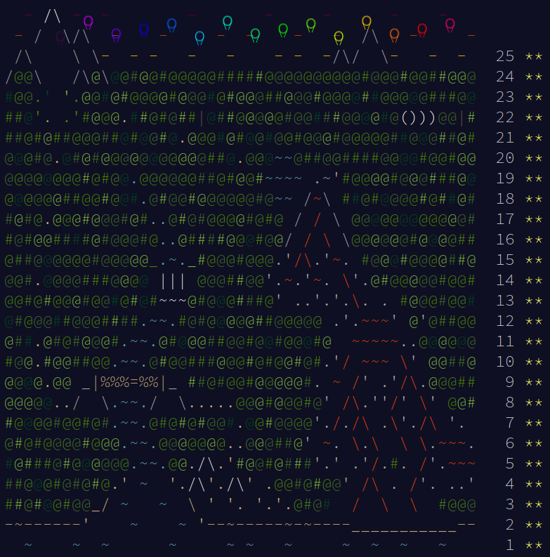
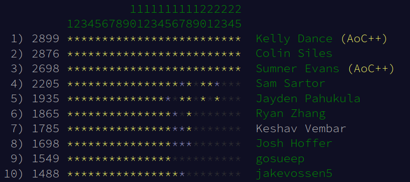
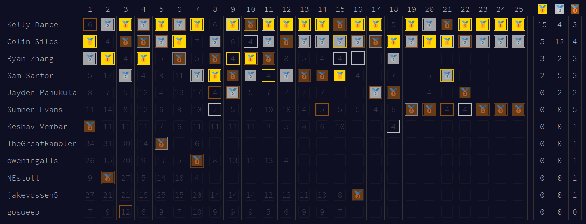
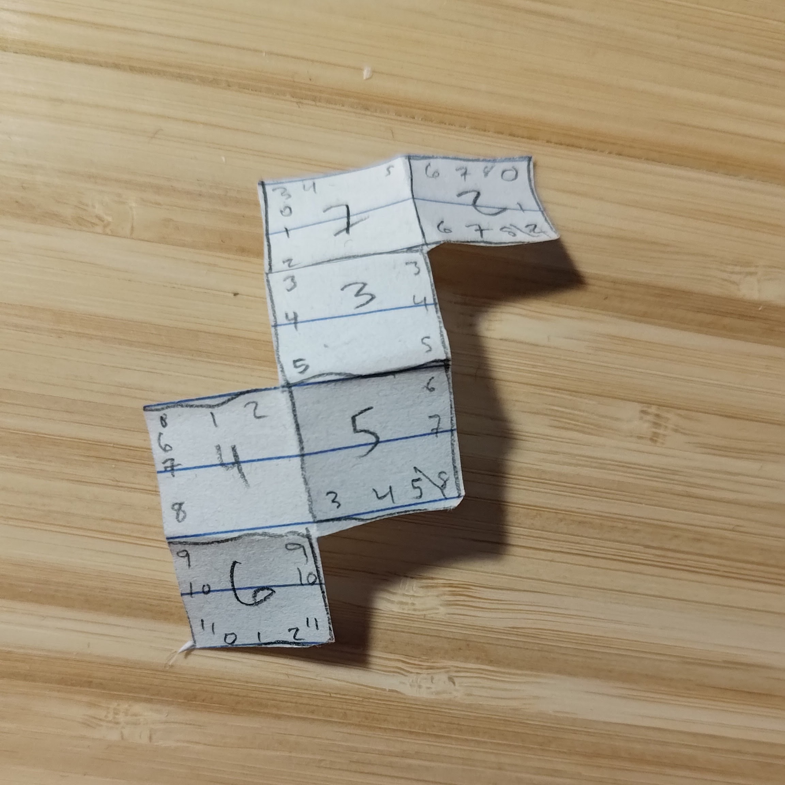

Every year since 2015, [Eric Wastl][1] creates a two-part programming problem
for each of the 25 days of Advent. He publishes a new problem every day at
[adventofcode.com](https://adventofcode.com) at exactly midnight EST which is
22:00 the day before for me in MST. The last two years, I decided to do the
problems as soon as they came out and streamed my problem solving sessions on my
[Twitch channel][2] and uploaded them to [my Youtube channel][3]. Last year, I
also updated a
[blog post after each day]()
which I intend to do again this year.

This year, I'm going to be streaming my solves eventually, but for the first few
days, I'm going to skip that because of illness. I will try and keep this blog
post up-to-date every day with my thoughts on each problem, and give a brief
solution sketch. (Until I get to the point where I don't really understand
what's going on.)

As with the last last two years, I am participating in a private leaderboad for
the Colorado School of Mines CS department with a bunch of Mines students and
alum. I don't expect to get anywhere close to the top since I'm switching to Go
this year, which will slow me down significantly.

The reason for the switch is twofold:

1. I've been using Go extensively at work, so I'm comfortable writing it now.
2. I want a statically typed language so that I can avoid the annoying type
   errors that have plagued my solves in the past.

We'll see how that goes.

[1]: https://twitter.com/ericwastl
[2]: https://twitch.tv/sumnerevans
[3]: https://www.youtube.com/@sumnerevans

# Summary of Results

I accomplished my main goal of solving all of the problems and getting all 50
stars for the third year in a row.



The following are my results across all of the days.

```
      --------Part 1--------   --------Part 2--------
Day       Time   Rank  Score       Time   Rank  Score
 25   02:27:45   4003      0   02:27:45   3074      0
 24   02:19:41   2418      0   02:40:15   2372      0
 23   00:47:41   1081      0   00:48:42    891      0
 22   00:33:57    486      0   03:49:52   1570      0
 21   00:10:44    865      0   01:49:16   3155      0
 20   00:56:49   1513      0   01:59:13   2451      0
 19   01:50:10   1086      0       >24h  11277      0
 18   00:13:20   1777      0   01:55:16   3193      0
 17   01:20:55   2050      0       >24h   9670      0
 16   18:26:29  12682      0       >24h  17871      0
 15   00:25:44   1097      0   01:24:58   2171      0
 14   00:17:06    420      0   00:30:12   1123      0
 13   00:19:23    880      0   00:30:52   1238      0
 12   01:24:19   5663      0   01:28:11   5221      0
 11   00:23:51    910      0   01:25:59   4261      0
 10   00:21:27   4404      0   00:45:18   4534      0
  9   00:27:34   3536      0   00:36:51   2009      0
  8   00:08:11    556      0   00:33:16   2632      0
  7   00:39:14   3323      0   00:45:19   2879      0
  6   00:04:50   1891      0   00:06:23   2071      0
  5   00:18:24   2321      0   00:26:01   3205      0
  4   00:03:46    669      0   00:13:17   3984      0
  3   00:11:02   3285      0   00:18:05   3187      0
  2   00:14:26   5517      0   00:19:30   4347      0
  1   00:03:27   1461      0   00:08:04   2857      0
```

It was a pretty bad year for me in general. I failed to make top 10,000 on three
occasions, and I only cracked top 1000 on eight occasions. I also had three >24h
solves. I also failed to have a single day with sub-1000 solves on both parts,
which is pretty abysmal.

But, honestly, I really should just be happy that I solved everything in time
for being able to solve day 25 part 2 right after part 1. I barely made it on
solving day 16 part 2. I submitted that about a half hour before day 25 opened.

## Mines Leaderboard

At the end of the competition (2022-12-25 00:51 MST), this is the state of the
Mines leaderboard:





Three of us (Kelly, Colin, and myself) solved everything by Christmas. I managed
to get 3rd place on the Mines leaderboard by default this year because nobody
else was solving up until the last day. As you can see, I failed to get better
than 2nd place on any part during the entire competition, and failed to get
better than 3rd on part 2 on any day which is absolutely abysmal. Ryan, Sam, and
Jayden all managed better metal counts, and both Sam and Ryan would likely pass
me if they ever decide to solve the rest of the problems.

After coming short of Colin in both 2020 and 2021 by 3 and 11 points,
respectively, Kelly ran away with this one by a 23-point margin. He's been
practicing competitive programming a lot more this year, and it shows. He even
switched programming languages from Python to Kotlin about half way through the
competition and still was consistently beating everyone. He failed to podium on
the Mines leaderobard on only two days. Colin was extremely consistent as well,
only failing to podium three days, but especially down the stretch, Kelly was
too strong and was able to string together chains of 1\*, 1\*\* days which put
first place out of reach.

There were strong performances from many others as well. Jayden, Keshav, Josh,
and Eugin in particular gave me lots of problems (though I was eventually able
to outlast them by powering through the horrible day 16, day 17, and day 19
sequence).

Particularly impressive were Jayden and Tyler, both freshmen. Tyler got up to 24
stars while Jayden got 37 stars, and even beat me on a couple problems down the
stretch. I think they are going to be really difficult to contend with in future
years once they have a bit more algorithms and data structures knowledge.

## Using Go

In general, some of my woes can be blamed on using Go instead of Python, and not
having as much of a standard library and it being a less expressive language in
general. There were a couple days that I just had to write utility functions
before actually solving (day 12 for example) which significantly slowed me down.

There were also a couple things that were really annoying to do in Go:

- **Not having tuples.** They aren't a thing in Go. This is convenient in a way
  (I don't ever have to worry about forgetting what each index represents
  because I have to create a struct or some other specific data structure to
  store all data).
- **Not having frozensets or frozendicts for using as keys in dictionaries.** I
  ended up having to use bitmaps or fixed-sized arrays instead on a lot of
  problems.

On the other hand, I think that using a strongly typed language helped me to
make significantly less coding mistakes. Towards the end of the year, the
problems were so hard that the thing slowing me down was my stupidity and not
knowing how to actually solve the problems rather than the language getting in
the way of my ability to solve at speed. One language feature that I really
enjoyed using was type aliasing. For example, I would often alias a primitive
type with a wrapper so that I could implement methods on the type and also more
easily keep track of what type of data I was dealing with.

I'll probably use Go again next year, though. I do think that it prevented more
problems than it caused. I may try a hybrid model where I have the option to
solve in Python or Go next year.

Language statistics (my boilerplate is fairly extensive, though):

```
$ tokei -e '*.txt' -e '*.json'
===============================================================================
 Language            Files        Lines         Code     Comments       Blanks
===============================================================================
 Go                     50         7646         6331          293         1022
 OCaml                   1           46           37            4            5
===============================================================================
 Total                  51         7692         6368          297         1027
===============================================================================
```

# Day 1: Calorie Counting

| <!-- -->       | <!-- -->                                                                                                                                                            |
| -------------- | ------------------------------------------------------------------------------------------------------------------------------------------------------------------- |
| **Link:**      | https://adventofcode.com/2022/day/1                                                                                                                                 |
| **Solutions:** | [Go](https://github.com/sumnerevans/advent-of-code/blob/master/y2022/d01/01.go), [OCaml](https://github.com/sumnerevans/advent-of-code/blob/master/y2022/d01/01.ml) |
| **Part 1:**    | 00:03:27, 1461th                                                                                                                                                    |
| **Part 2:**    | 00:08:04, 2857th                                                                                                                                                    |

Considering this was my first time using Go under time pressure to solve an
Advent of Code problem, I think I did pretty well. I had lots of issues with
input parsing, and then I couldn't figure out how to sort for a while on part 2.

<details class="advent-of-code-part-expander" open>
<summary><h3>Part 1</h3></summary>

For part 1, the main challenge was to parse the input into a list of groups.
Each group is separated by an empty line. My existing utilities for doing that
were very poor, so I had to manually do the grouping and parsing which was quite
slow.

After the groups are parsed, then it's fairly trivial to just find the maximum
sum group.

</details>

<details class="advent-of-code-part-expander" open>
<summary><h3>Part 2</h3></summary>

For part 2, you have to instead sum the three highest-sum groups in the input.
You can be smart about this and keep track of only the largest 3 items in the
list as you scan, but I opted to just sort the list and get the top 3 instead.

That's where things went off the rails. I'd read in the input as `int64`s
because that's what most of my utilities had (I'd built up some Go libraries
since last year by salving previous years' problems in Go), but the Go `sort`
package does not have a convenient function for sorting `int64`s. It only has a
convenient one for `int`s. I ended up just using `sort.Slice` with a custom
comparator.

Go just got generics in 1.18, and they haven't them it into the standard library
at all, so there's no genericism in any of the standard functions. I hope that
they change that in a future version of Go so that the `sort.Ints` function can
be generic over all integer types.

</details>

I put myself into a pretty big hole on the Mines leaderboard from today with an
8\*, 10\*\* performance for 101 points. I think that's just going to be expected
given I'm using Go now.

# Day 2: Rock Paper Scissors

| <!-- -->       | <!-- -->                                                                        |
| -------------- | ------------------------------------------------------------------------------- |
| **Link:**      | https://adventofcode.com/2022/day/2                                             |
| **Solutions:** | [Go](https://github.com/sumnerevans/advent-of-code/blob/master/y2022/d02/02.go) |
| **Part 1:**    | 00:14:26, 5517th                                                                |
| **Part 2:**    | 00:19:30, 4347th                                                                |

Today was horrible. I failed at reading comprehension, and then incompetence set
in and I forgot how to play rock-paper-scissors.

<details class="advent-of-code-part-expander" open>
<summary><h3>Part 1</h3></summary>

The input consisted of a list of rock-paper-scissors (RPS) rounds formatted as
`OPPONENT MY_RESPONSE`. The selection was given by `ABC` for the opponent and
`XYZ` for my response.

The goal was to calculate how many points I'd win given the sequence.

Overall, the input parsing was a lot smoother today. I went with stringly-typed
for the two fields.

The first issue that I had was that I thought it was in the format `MY_RESPONSE OPPONENT` so that cost me a large number of minutes.

The second issue that I ran into was just implementing the scoring logic. It was
hard keeping track of what ABC and XYZ actually stood for, and I had to talk to
myself so that I could work through all of the combinations.

There's an elegant mathematical way of doing this using mod, which I did not use
while solving. I figured there was one, but I didn't want to have to figure it
out during my solve (though it may have been helpful).

</details>

<details class="advent-of-code-part-expander" open>
<summary><h3>Part 2</h3></summary>

For the second part, you interpreted your response differently. You interpreted
it as your desired outcome (win, lose, draw) and then had to calculate which
option to choose.

I ended up solving this with a ton of `case` statements. I later refactored to
have a few less case statements, but all of the mathematical solutions that I've
seen are way uglier, so I didn't refactor to use them.

I submitted the wrong value which cost me a minute, but honestly, that wasn't
the main reason I failed today.

</details>

Overall, the problem was just annoying to implement, and I'm hoping for
something more algorithmic tomorrow.

I continue to dig myself into a pretty big hole on the Mines leaderboard with an
15\*, 13\*\* performance bringing me up to 191 points. I think that I'm already
about to write this year off as a rebuilding year (doing this in Go, and all).
I'm hoping that the static typing of Go will give me a boost later on in the
competition. Unfortunately, by then I assume that many fewer people will be
competing so I'll have no chance to catch up.

# Day 3: Rucksack Reorganization

| <!-- -->       | <!-- -->                                                                        |
| -------------- | ------------------------------------------------------------------------------- |
| **Link:**      | https://adventofcode.com/2022/day/3                                             |
| **Solutions:** | [Go](https://github.com/sumnerevans/advent-of-code/blob/master/y2022/d03/03.go) |
| **Part 1:**    | 00:11:02, 3285th                                                                |
| **Part 2:**    | 00:18:05, 3187th                                                                |

Today was more fun than yesterday, but I still did horribly as far as time. At
least I was able to comprehend the problem fairly well, except I screwed up the
scoring which cost me, and I also didn't know how to deal with char arrays very
well in Go. This is what happens when you switch languages haha.

<details class="advent-of-code-part-expander" open>
<summary><h3>Part 1</h3></summary>

For part 1, you have to split each string in the input in half and then figure
out what character is present in both halves. Then you have to calculate the
score for that character.

To calculate the character that is in both halves, I decided to just load both
halves into a set and do an intersection. Obviously, this is not the most
efficient method, but it (should) have been fairly quick to code. Unfortunately,
I got caught by the fact that `string`s in Go are not just `[]rune`, so I wasted
a lot of time trying to convert it to `[]rune` so that I could use my `Set`
helper data structure. Unfortunately, I chose a very bad way of doing this
(complicated `for` loop) because I forgot that you can just construct them like
this: `[]rune(s)` where `s` is the string to convert to a `rune` array.

After that, the next challenge is figuring out the score for the chosen
character. I forgot that in ASCII A-Z come before a-z and that they are
separated by a bunch of special characters. Thus, when I tried to combine the
cases together, things went poorly. Once I handled each case separately, things
went much more smoothly.

</details>

<details class="advent-of-code-part-expander" open>
<summary><h3>Part 2</h3></summary>

For the second part, instead of finding the common character between the halves
of each string, you had to find the common character between three lines.

The main issue for me was implementing the windowing correctly. I just totally
botched it. I didn't handle the last window correctly, and I also had a bug
where I would skip the element right after the window.

After I unravelled myself from my own incompetence, calculating the score was
trivial.

</details>

I definitely enjoyed this problem more than last nights problem as there were
not as many annoying implementation details that were difficult to deal with.

I continue to perform very poorly on the Mines leaderboard (295, 8\*, 8\*\*).
I'm just hoping that I can medal at some point this year. There's a lot more
people competing this year who are good (some of whom were in the Algorithms
class I taught last spring), so my chances are not great.

# Day 4: Rucksack Reorganization

| <!-- -->       | <!-- -->                                                                        |
| -------------- | ------------------------------------------------------------------------------- |
| **Link:**      | https://adventofcode.com/2022/day/4                                             |
| **Solutions:** | [Go](https://github.com/sumnerevans/advent-of-code/blob/master/y2022/d04/04.go) |
| **Part 1:**    | 00:03:46, 669th                                                                 |
| **Part 2:**    | 00:13:17, 3984th                                                                |

<details class="youtube-expander">
  <summary><i class="fa fa-youtube-play"></i>&nbsp;Advent of Code 2022 - Day 4 | Go (669*, 3984**)</summary>
  
</details>

Today was the first time that I cracked the top 1000 with my solution. I was
able to get 669th on the first part, before utterly collapsing on the second
part.

<details class="advent-of-code-part-expander" open>
<summary><h3>Part 1</h3></summary>

For part 1, the hardest part reading the input into a reasonable format. The
fact that I'm using Go meant that I used `struct`s for storing the data rather
than tuples as I would have in Python.

```go
type Section struct {
	Start, End int
}

type Pair struct {
	Section1, Section2 Section
}

type Day04 struct {
	Pairs []Pair
}
```

This data format allowed me to keep track of what I was dealing with fairly
effectively and not make mistakes related to interpreting data incorrectly.

Reading input in Go is much more difficult than reading input in Python.

On the other hand, Go allows me to define functions on structs, and I was able
to define a `contains` function on the `Section` struct which just determined if
the given `Section` was contained within the first one.

```go
func (s Section) Contains(other Section) bool {
	return s.Start <= other.Start && other.End <= s.End
}
```

After that it was just a matter of incrementing the answer when one section
contained the other.

</details>

<details class="advent-of-code-part-expander" open>
<summary><h3>Part 2</h3></summary>

In the second part, I fell victim to incompetence (I forgot to save the test
file that I had). I have a great test infrastructure, but it was useless because
there was to test to run. Then I implemented the intersection functionality
incorrectly in almost every way possible.

I defined a function on the `Pair` to determine if the pair intersected or not.
My first mistake was that I used `Min` for calculating the minimum start and
ends of the segments which is not what you want. You want the _maximum_ start
time, and the _minimum_ end time. Then if the start time is less than or equal
to the end time, the there is an overlap.

I then incorrectly dealt with segments that only overlapped on a single element.
I was returning an integer (being the cardinality of the overlap, but I was off
by one because the cardinality of a overlap that starts and ends at the same
point is 1, not 0.)

This last error could be easily avoided by just returning a boolean and not
dealing with cardinality at all.

My final function is as follows:

```go
func (s Section) Intersects(other Section) bool {
	return lib.Max(s.Start, other.Start) <= lib.Min(s.End, other.End)
}
```

</details>

On the Mines leaderboard, I got 4th place on part 1 and I'm on 398 points, the
best I've done so far. But similar to what happened with the global leaderboard,
I fell on part 2 all the way down to 13th place. At the top, Ryan (446) has
pulled ahead of Kelly (443) for first place. Colin is tied with Kelly and Sam is
in fourth with 407 points.

# Day 5: Supply Stacks

| <!-- -->       | <!-- -->                                                                        |
| -------------- | ------------------------------------------------------------------------------- |
| **Link:**      | https://adventofcode.com/2022/day/5                                             |
| **Solutions:** | [Go](https://github.com/sumnerevans/advent-of-code/blob/master/y2022/d05/05.go) |
| **Part 1:**    | 00:18:24, 2321th                                                                |
| **Part 2:**    | 00:26:01, 3205th                                                                |

<details class="youtube-expander">
  <summary><i class="fa fa-youtube-play"></i>&nbsp;Advent of Code 2022 - Day 5 | Go (2321*, 3205**)</summary>
  
</details>

Today was an interesting problem with annoying parsing step which made me slow
on Part 1. Then I fell into a trap with slices in Go on Part 2 that cost.

<details class="advent-of-code-part-expander" open>
<summary><h3>Part 1</h3></summary>

The hardest part of the entire problem was parsing the input. The stacks at the
top of the problem were really annoying to parse correctly. I know other people
who just hard-coded them, and that probably would have been smarter than what I
did, but then I'd have to figure out a way to differentiate between when I'm
running the test and the actual input.

I ended up using a regular expression to find what character (if any) was in the
stacks at the given height.

Then, reading in the moves was pretty easy because I was able to use my
`lib.AllInts` function to extract the moves.

After everything was parsed, I was able to implement the swapping logic fairly
quickly. I made the nice decision to represent the stacks as lists with the
first element being the top of the stack. It made the swapping code fairly
convenient:

```go
move := []string{d.Stacks[m.From][0]}
d.Stacks[m.From] = d.Stacks[m.From][1:]
d.Stacks[m.To] = append(move, d.Stacks[m.To]...)
```

</details>

<details class="advent-of-code-part-expander" open>
<summary><h3>Part 2</h3></summary>

For part 2, I got caught by the fact that taking a slice of a list in Go doesn't
make a copy of the elements. I think it's just a pointer with a length under the
hood. This caused a big bug because I was mutating memory that I really did not
intend to mutate.

I finally realized this and just copied the data using `append` with the `...`
operator on the slice. That actually copied the data and it worked first time
after that.

Overall, not too disappointed with that bug because it wasn't entirely obvious
what Go does under the hood. Now I know (and have a utility function) so I hope
I don't make that mistake again.

</details>

My 6\*, 6\*\* performance on the Mines leaderboard has me in 8th place currently
with 506 points. I'm hoping that there are some harder algorithmic questions
later on so that I can pass up Jayden and Eugin and catch up with Sam and
Keshav, but with how slowly I've been solving, that's still a pretty tall order.

# Day 6: Tuning Trouble

| <!-- -->       | <!-- -->                                                                        |
| -------------- | ------------------------------------------------------------------------------- |
| **Link:**      | https://adventofcode.com/2022/day/6                                             |
| **Solutions:** | [Go](https://github.com/sumnerevans/advent-of-code/blob/master/y2022/d06/06.go) |
| **Part 1:**    | 00:04:50, 1891th                                                                |
| **Part 2:**    | 00:06:23, 2071th                                                                |

<details class="youtube-expander">
  <summary><i class="fa fa-youtube-play"></i>&nbsp;Advent of Code 2022 - Day 6 | Go (1891*, 2071**)</summary>
  
</details>

Today was a sliding window problem. The challenge was to find the first sliding
window of size \\(n\\) such that all of the characters in the window are unique.

<details class="advent-of-code-part-expander" open>
<summary><h3>Part 1</h3></summary>

The hardest part was reading it into a reasonable data structure. I ended up
going with `[]rune` instead of `string` because the ergonomics of treating a
`string` like a list of characters is not great in Go.

I ended up just throwing all of the characters in the window into a set and
checking the size of the set. If it was 4 (the window size I was looking for), I
would just return the current index.

Managing the window was somewhat annoying, but my method of appending and
removing from the end was reasonable, and worked well enough. It also had the
nice properly of the index being on the last character of the window rather than
the first.

After solving, I realized that I could just use slices, and I refactored my code
to do so. (I also added a sliding window slices function to my solving library.)

</details>

<details class="advent-of-code-part-expander" open>
<summary><h3>Part 2</h3></summary>

Part 2 was the same as part 1, except windows of size 14 instead of 4.

I had a bug in the part 1 implementation where I was only iterating until
`len(input) - n` where `n` was the size of the window I was looking for. This is
incorrect because I was never doing anything that could go out of bounds. Thus,
I had to just iterate to `len(input)` instead. If I had my sliding window
function already, then I wouldn't have had this problem. That cost me quite a
few places on the global rankings, but oh well.

</details>

My 8\*, 8\*\* performance on the Mines leaderboard has me (610) up to 7th place
currently.

# Day 7: No Space Left On Device

| <!-- -->       | <!-- -->                                                                        |
| -------------- | ------------------------------------------------------------------------------- |
| **Link:**      | https://adventofcode.com/2022/day/7                                             |
| **Solutions:** | [Go](https://github.com/sumnerevans/advent-of-code/blob/master/y2022/d07/07.go) |
| **Part 1:**    | 00:39:14, 3323rd                                                                |
| **Part 2:**    | 00:45:19, 2879th                                                                |

<details class="youtube-expander">
  <summary><i class="fa fa-youtube-play"></i>&nbsp;Advent of Code 2022 - Day 7 | Go (3323*, 2879**)</summary>
  
</details>

Today was much more challenging than I expected, but it seems like it was fairly
challenging to most people considering I solved part 1 in just under 40 minutes,
and still was sub 5000.

<details class="advent-of-code-part-expander" open>
<summary><h3>Part 1</h3></summary>

At its core, the problem required keeping track of the size of directories and
then doing some processing with that. The input was given as a sequence of `cd`
and `ls` commands which showed the directory structure and the sizes of the
files in each directory.

The hardest part was choosing a data structure to keep track of the directory
structure. It took me along while, but I eventually landed on a recursive data
structure with an internal mapping of `name -> item` where `item` was either a
file or another directory.

My struct ended up needing a flag for whether it was a directory or not, which
is slightly ugly, but I think it helped avoid some errors. I did wish for
OCaml/Rust enum variants though...

The next challenge was keeping track of the current path so that I could store
the file size in the correct location in the data structure. I ended up storing
the path as a list of strings, and then reconstructing the path when appending.
When I refactored, I just passed the list to the add function rather than a
string.

I implemented the actual "add file" functionality using recursion which I think
was a good decision.

The next challenge was to find all of the sizes of all of the directories in the
filesystem tree. I used a BFS to traverse the tree and for all of the
directories, I checked if their size was less than the threshold.

The main problem that I had during this part of the implementation was the fact
that I implemented the `IsDir` flag incorrectly. I should have just used the
presence of `Size > 0` as a proxy for the flag, but instead I spent precious
minutes debugging why the flag was set incorrectly.

</details>

<details class="advent-of-code-part-expander" open>
<summary><h3>Part 2</h3></summary>

Part 2 required finding the smallest directory which (if deleted) would cause
the total used size to fall below a given threshold.

I was able to solve this part pretty easily by modifying my iteration logic to
result in a list of integers representing the sizes of the directories.

The biggest challenge was that I overcomplicated the data structures (common
pattern) and had to do a couple transformations that were quite annoying.

</details>

My 10\*, 10\*\* performance on the Mines leaderboard kept me stable at 7th place
on 710 points. I lost tons of points to Sam tonight. He had a 2\*, 2\*\*
performance, which has put him at 727 points against my 696. Josh (697) and
Keshav (719) also outrank me. At the top of the leaderboard, Kelly (796) is
starting to pull away from Colin (787) and Ryan (783) who both had bad nights
(4*, 7\*\*) and (6*, 5\*\*), respectively.

# Day 8: Treetop Tree House

| <!-- -->       | <!-- -->                                                                        |
| -------------- | ------------------------------------------------------------------------------- |
| **Link:**      | https://adventofcode.com/2022/day/8                                             |
| **Solutions:** | [Go](https://github.com/sumnerevans/advent-of-code/blob/master/y2022/d08/08.go) |
| **Part 1:**    | 00:08:11, 556th                                                                 |
| **Part 2:**    | 00:33:16, 2632nd                                                                |

<details class="youtube-expander">
  <summary><i class="fa fa-youtube-play"></i>&nbsp;Advent of Code 2022 - Day 8 | Go (556*, 2632**)</summary>
  
</details>

Today was an interesting nice grid problem. I did pretty well on part 1, and
then choked really badly on part 2. I'm happy to have returned to top 1000 on
part 1. I wish I could have kept the momentum up into part 2.

<details class="advent-of-code-part-expander" open>
<summary><h3>Part 1</h3></summary>

For part 1, you are given a grid of trees of a certain height. The problem was
to find the set of trees that are visible from the edges of the grid. Visibility
is defined by the height of the tree being greater than any of the trees between
itself and the edge in the four cardinal directions.

I decided to implement my solution by iterating from all four sides of the grid
and incrementing a counter whenever I encounter a taller tree. This method
worked quite well, and I was able to implement it for rows very easily (iterate
from the left and from the right keeping track of the current highest tree, and
incrementing the answer and updating the highest tree if I encountered a higher
tree).

To account for the vertical directions in the grid, I was able to utilize my
`lib.Columns` utility function which transposes a grid. Then I was able to
copy-paste my code for rows but use the transposed grid instead.

</details>

<details class="advent-of-code-part-expander" open>
<summary><h3>Part 2</h3></summary>

On part 2, I totally collapsed. The challenge was to find the tree which had the
longest product of sight-lines in the four cardinal directions.

My first implementation of calculating sight lines in the four directions for a
given tree was just flat out incorrect. Instead of incrementing the sight line
length before checking if the tree is tall enough to block the sight line, I was
incrementing after checking if the tree was too tall.

I ended up declaring bankruptcy on that first implementation, and then I finally
implemented it correctly.

I think it was a good decision to declare bankruptcy and rewrite. I could have
wasted a lot of time if I had continued trying to debug my first implementation.

</details>

I podiumed on the Mines leaderboard for the first time today on part 1 before
collapsing on part 2. Sam beat me by literally a second on part 1 (ahhhhh!) so I
ended up with a 2\*, 7\*\* finish.

I (805) have now jumped over Eugin (803) for 6th place, and I'm 10 points behind
Keshav (815). Sam's 1\*, 1\*\* performance puts him at 843, which is probably
going to be enough to secure him 4th place, and puts him in possible contention
for 3rd.

# Day 9: Rope Bridge

| <!-- -->       | <!-- -->                                                                        |
| -------------- | ------------------------------------------------------------------------------- |
| **Link:**      | https://adventofcode.com/2022/day/9                                             |
| **Solutions:** | [Go](https://github.com/sumnerevans/advent-of-code/blob/master/y2022/d09/09.go) |
| **Part 1:**    | 00:27:34, 3536th                                                                |
| **Part 2:**    | 00:36:51, 2009th                                                                |

<details class="youtube-expander">
  <summary><i class="fa fa-youtube-play"></i>&nbsp;Advent of Code 2022 - Day 9 | Go (3536*, 2009**)</summary>
  
</details>

Today I fell victim to another tooling problem. I'm not sure how much it cost
me, but it was pretty bad, and I'm never going to use `gotestfmt` for Advent of
Code again.

I think I did a decent job recovering on part 2, which I'm happy about.

<details class="advent-of-code-part-expander" open>
<summary><h3>Part 1</h3></summary>

Part 1, the challenge was to simulate a rope where the head of the rope and the
tail of the rope follow some certain properties. Namely, they always stay
connected to one another by at most a distance of one in all 8 grid directions.

The rules are simple when moving horizontally and vertically. But moving
diagonally is where things get interesting. If the head is more than 1 away from
the tail in a diagonal direction, you move the tail towards the head along the
appropriate diagonal (it depends on which quadrant the head is in relative to
the tail).

I had so many bugs, and I couldn't figure out diagonals to save my life. I had
to write in a notebook to figure out how to deal with the diagonals.

But, the worst part was that during my debugging, I added a ton of print
statements. This bit me because `gotestfmt` doesn't output anything until all of
the tests have run. That meant that I couldn't see the any output until all of
those prints were buffered to the console. I think I had the correct answer for
a little while, but I didn't know it because `gotestfmt` was so slow because of
all of the program output.

My automatic submission code worked well, though, so that's at least good.

</details>

<details class="advent-of-code-part-expander" open>
<summary><h3>Part 2</h3></summary>

On part 2, I was able to adapt my code pretty quickly. Basically, the rope
becomes 10 segments long (instead of the 2 in part 1). You move the head the
same as in part 1, but then perform the "follow the leader" logic with every
element in the rope.

After solving, I made my code generic so that it can handle arbitrary-length
ropes. A small consolation for the disaster which was part 1 and `gotestfmt`.

</details>

Overall, I liked the problem, despite doing horribly. It was an interesting
state machine.

On the Mines leaderboard, I got 8\*, 5\*\* which is honestly better than I
thought I would do considering how horribly slow I was. I'm now at 6th place
with 910 points, but I gained 4 points on Keshav (916). Sam (953) is pretty much
out of striking distance in 4th place. The top three people have now passed the
1000 point mark (Kelly 1017, Colin 1007, Ryan 1006).

I added an additional 5 points between myself and 7th place (Eugin, 903) but I'm
definitely not out of the woods, yet because Josh (897) and Jayden (884) are
both within striking distance. (Jayden would be beating me if it weren't for a
couple days that he didn't solve as soon as the problem came out.)

# Day 10: Cathode-Ray Tube

| <!-- -->       | <!-- -->                                                                        |
| -------------- | ------------------------------------------------------------------------------- |
| **Link:**      | https://adventofcode.com/2022/day/10                                            |
| **Solutions:** | [Go](https://github.com/sumnerevans/advent-of-code/blob/master/y2022/d10/10.go) |
| **Part 1:**    | 00:21:27, 4404th                                                                |
| **Part 2:**    | 00:45:18, 4534th                                                                |

<details class="youtube-expander">
  <summary><i class="fa fa-youtube-play"></i>&nbsp;Advent of Code 2022 - Day 10 | Go (4404*, 4534**)</summary>
  
</details>

Today was a fun problem which I did somewhat horribly on due to failure to read
the instructions, and assuming that things were much more complicated than they
really were.

<details class="advent-of-code-part-expander" open>
<summary><h3>Part 1</h3></summary>

For the problem, you are asked to simulate a very simple CPU given some set of
instructions. The instructions are either `noop` (which means do nothing) or
`addx` which means add something to the `x` register (the only register in the
CPU).

That would be fine to simulate, except `noop` takes one clock cycle, while
`addx` takes two. Implementing the timing correctly took the vast majority of my
time.

My first misunderstanding was that I didn't realize that I had to stall the CPU
for the add operation to happen. I know that it's described in the test case
prose, but I didn't read that, obviously. I thought that I was supposed to
simulate some sort of variable-length pipeline CPU that allows for concurrent
instructions.

After realizing that I was stupid and that wasn't what I was supposed to do, I
separated the program counter from the CPU clock. Then the next challenge was to
make sure to check the value of the `X` register in all of the correct places.
(Part 1 requires that you check the value of `X` on the 20th, 60th, 100th,
140th, 180th, and 220th cycles.)

I had multiple issues while doing this. The first was that I didn't copy down
the checking code to everywhere that I was incrementing the clock. Then, I was
checking every time that the index was equal to a multiple of 20, so I had to
skip every other multiple of 20 starting with 40 using modulo tricks.

</details>

<details class="advent-of-code-part-expander" open>
<summary><h3>Part 2</h3></summary>

On part 2, the `X` value now becomes a 3-wide "cursor". If the clock cycle
equals the cursor position modulo 40, then it writes a `#` to the screen.

The modulo 40 thing is very important, and I totally missed it for a long time.

Another thing that I missed was that the clock starts at 0, not 1 for part 2.

But the stupidest thing that I did the entire night was that I didn't copy my
cursor-checking code correctly to every place that I incremented the clock. Even
though that was literally one of my biggest mistakes on part 1, I managed to
follow up and make the exact same mistake on part 2.

My test infrastructure also was really not designed for strings, so I had a bear
of a time dealing with that. But, I don't think it was the fundamental reason
why I was so slow. I'm probably not going to make any modifications to it before
tomorrow and just hope that it's a problem that outputs a number next time.

</details>

I think this was my favorite problem so far. My test infrastructure is totally
not geared towards these types of questions, but they don't come up that often,
so I think that I should be able to get away with not fixing it that much.

On the Mines leaderboard, I got 10\*, 7\*\*. I'm solidly in 6th place with 1031
points. I'm only 4 points back from Keshav (1035), while Sam (1085) extended his
lead over us with a 4\*, 2\*\* performance. Meanwhile, Eugin (1023), Jayden
(1011), and Josh (1010) are all within striking distance if I continue to do
this poorly. Jayden gained 6 points on me on the night with a 6\*, 5\*\*
performance, so he is definitely going to keep me on my toes down the stretch!

At the top of the leaderboard, Colin (1139) and Ryan (1140) swapped places,
while Kelly is 11 points clear at 1151.

# Day 11: Cathode-Ray Tube

| <!-- -->       | <!-- -->                                                                        |
| -------------- | ------------------------------------------------------------------------------- |
| **Link:**      | https://adventofcode.com/2022/day/11                                            |
| **Solutions:** | [Go](https://github.com/sumnerevans/advent-of-code/blob/master/y2022/d11/11.go) |
| **Part 1:**    | 00:23:51, 910th                                                                 |
| **Part 2:**    | 01:25:59, 4261th                                                                |

<details class="youtube-expander">
  <summary><i class="fa fa-youtube-play"></i>&nbsp;Advent of Code 2022 - Day 11 | Go (910*, 4261**)</summary>
  
</details>

I managed to not suck at part 1, but then Advent of Number Theory began on part
2 and I had another classic part 2 collapse.

<details class="advent-of-code-part-expander" open>
<summary><h3>Part 1</h3></summary>

The core of the problem was keeping track of how many times a given set of
object was passed around between "monkeys". For part 1, it was enough to just
simulate the passing of the objects because the "worry level" (think size) of
the objects was restricted by a convenient divisor operation.

Overall, I felt pretty smooth with my implementation. I was a bit slow on the
parsing part, but honestly, I'm not disappointed at all. It set me up really
well for actually implementing the simulation.

</details>

<details class="advent-of-code-part-expander" open>
<summary><h3>Part 2</h3></summary>

Part 2 is where things went horribly wrong. Instead of doing 20 iterations, you
have to do 10000. At first, I thought that I could probably just solve it with
arbitrarily sized integers, so I started converting my code to use `big.Int`. My
Twitch chat steered me away from that, but I wasted a lot of time wandering
around the wilderness trying to think of a more intelligent solution.

Eventually, I started writing down the loops that the "worry level" for each
object went through. I realized that there had to be some periodicity to their
movement between the monkeys.

Then, after another eternity, I realized that really all that mattered was the
factors of each worry level, and specifically, whether they had any of the
factors that could be tested at any point.

The final revelation that I had (after another hard think) was that I could,
store each of the worry levels as just the number modulo all of the possible
test numbers.

So, for example, the worry level `54` could be represented as just:

```
Mod 3: 54 % 3 = 0
Mod 5: 54 % 5 = 4
Mod 7: 54 % 7 = 5
...
```

Then, whenever an operation is performed, I just could do the
operation on each of the numbers under their appropriate modulus.

So, if the operation was `+ 3`, I could just perform the operations the
representation for the worry level would become:

```
Mod 3: (0 + 3) % 3 = 0
Mod 5: (4 + 3) % 5 = 2
Mod 7: (6 + 3) % 7 = 2
...
```

Then, whenever I needed to do a check on a number, I could just check if the
corresponding mod number was 0.

I thought I was petty clever, but then after solving, I was informed in the
Twitch chat by Eric Wastl that all I had to do was mod by the product of all of
the test numbers after every operation (because all of the test numbers are
prime), and then I wouldn't have to keep track of the number modulo each of the
different possible test numbers.

During my cleanup, I went ahead and implemented that solution, and man, it was
so trivial to make the modification. I guess I should have paid attention during
Discrete Math class...

</details>

I really enjoyed part 1. I think mainly because I was able to software engineer
my way to victory on it. But then on part 2, I went on a pointless side-quest
into trying to `big.Int` my way to victory and then I totally couldn't remember
that any of the convenient properties of modulus existed.

On the Mines leaderboard, my performance mirrored my performance globally. I got
4\*, 10\*\*, loosing on part 2 to literally everyone who was solving night-of.
That puts me at 1137 points total.

I did manage to hop into 5th place because Keshav (1136) went 10\*, 9\*\* and I
my part 1 performance fended off advances from Eugin (1131, 7\*, 5\*\*), Josh
(1116, 6*, 8\*\*), and Jayden (1116, 8*, 7\*\*).

Kelly (1268, 2*, 1\*\*) continues to defend his top position with Ryan (1254,
3*, 3**) and Colin (1252, 5\*, 2**) clustered in a tight race for second place.
Sam (1200, 1\*, 4\*\*) continues to distance himself from 5th place, but is all
but out of contention for the top 3 places.

# Day 12: Hill Climbing Algorithm

| <!-- -->       | <!-- -->                                                                        |
| -------------- | ------------------------------------------------------------------------------- |
| **Link:**      | https://adventofcode.com/2022/day/12                                            |
| **Solutions:** | [Go](https://github.com/sumnerevans/advent-of-code/blob/master/y2022/d12/12.go) |
| **Part 1:**    | 01:24:19, 5663rd                                                                |
| **Part 2:**    | 01:28:11, 5221st                                                                |

<details class="youtube-expander">
  <summary><i class="fa fa-youtube-play"></i>&nbsp;Advent of Code 2022 - Day 12 | Go (5663*, 5221**)</summary>
  
</details>

Well, tonight went very badly due to poor tooling, and bad reading
comprehension (are you seeing a trend here?). The time spent fixing my library
is not wasted. I assume there will be at least one more graph problem at some
point this year, so I should be ready for that now.

<details class="advent-of-code-part-expander" open>
<summary><h3>Part 1</h3></summary>

Part 1 requires a simple BFS to find a path through a grid of letters with some
certain rules. Importantly, from a given node, you can only go to the four
compass-adjacent cell, and only if the value of the adjacent cell is either
**less than your current cell**, or one later in the alphabet. That "less than
your current cell" part was important, and I didn't read it at all, causing me
to loose quite a bit of time.

However, even if I had read it correctly, it wouldn't have been able to rescue
me from the horrifyingly bad time I had using a priority queue. You might be
wondering, why was he using a priority queue for BFS? Well, I was trying to use
the more general Dijkstra's to solve the problem (and I figure I'll need a true
Dijkstra implementation at some point, so I decided to bite the bullet and
implement it). I was also in the middle of implementing Dijkstra's algorithm
before the problem was released because I knew that I would need it eventually,
but I hadn't finished yet.

I was about half way through implementing the basics of the algorithm before the
competition started, but it was definitely not ready yet, and I had to finish
implementing during my solve. While the core of my Dijkstra's implementation was
probably half way written by the time the problem released, my priority queue
implementation was very much not complete. I'd looked up the documentation on
the `heap` standard library, but I didn't really understand how to hold it, so I
ended up shooting myself in the foot multiple times by not understanding how it
worked.

Eventually I figured out how to use it (it was some of the ugliest hacks that
I'd ever done to get it to work), and then I proceeded to shoot myself in the
foot again with utter incompetence with dealing with grid coordinates (I was
using my `lib.Point` utility struct, but that uses \((X, Y)\) not \(R, C\)
coordinates, so I got very confused). Then after that I continued to shoot
myself in the foot with the aforementioned "less than your current cell" reading
comprehension error. I spent about 10 minutes before I realized my reading
mistake.

</details>

<details class="advent-of-code-part-expander" open>
<summary><h3>Part 2</h3></summary>

For part 2, I was able to reuse most of my code, except I just modelled it as
having a single starting node that had zero-cost edges to all of the `a` nodes
in the grid. That allowed me to really easily find the optimal path from any `a`
to the `E` node.

</details>

I'm definitely writing this one off as mainly tooling problems. I should be much
faster on graph searching problems in the future.

On the Mines leaderboard, I lost to literally everyone who was solving night-of,
resulting in a 10\*, 10\*\* score. I now have 1237 points, and I am all the way
down to 7th place. Keshav (1247) gained 11 points on me with a 4\*, 5\*\* night
and Eugin (1239) passed me with a 6\*, 6\*\* result as well. Jayden (1222, 7\*,
7\*\*) also gained points on me tonight, and is really getting too close for
comfort.

At the top of the table, Kelly (1386, 1\*, 1\*\*) solved parts 1 and 2 at 8:54
and 10:05, respectively He is now a full 20 points clear of Colin (1366, 3\*,
3\*\*) due to Sam (1316, 2\*, 2\*\*) sliding in to steal a couple more points
from Colin. However, Colin did manage to regain second place from Ryan (1358)
who had a 8\*, 8\*\* showing tonight.

# Day 13: Distress Signal

| <!-- -->       | <!-- -->                                                                        |
| -------------- | ------------------------------------------------------------------------------- |
| **Link:**      | https://adventofcode.com/2022/day/13                                            |
| **Solutions:** | [Go](https://github.com/sumnerevans/advent-of-code/blob/master/y2022/d13/13.go) |
| **Part 1:**    | 00:19:23, 880th                                                                 |
| **Part 2:**    | 00:30:52, 1238th                                                                |

<details class="youtube-expander">
  <summary><i class="fa fa-youtube-play"></i>&nbsp;Advent of Code 2022 - Day 13 | Go (880*, 1238**)</summary>
  
</details>

Tonight was Advent of Sorting and Advent of Recursion. I did pretty well,
returning once again to top 1000 on part 1, and unlike the previous times I got
top 1000 on part 1, I managed to not totally collapse on part 2.

<details class="advent-of-code-part-expander" open>
<summary><h3>Part 1</h3></summary>

This problem required parsing a bunch of lists where the elements were either
integers, or a recursive list of the same type. I chose to use Go's built-in
`json` library to parse the input. This worked out reasonably well, but I had to
parse into `[]any` instead of anything more strongly typed because Go doesn't
have type variants. This caused some pain when working with the objects because
I had to do type checks (effectively having to use duck typing) everywhere.

Other than that, parsing went well. My `lib.ParseGroups` function worked great
(I'd added it after Day 1's disaster).

I was proud of myself for choosing to create a recursive `Cmp` function to
compare arbitrary objects. Although it was quite annoying to implement with all
of the type unwrapping, I think I implemented it fairly cleanly. I did have a
bit of trouble deciding what to output from the function. I tried just using a
boolean at first, but I ended up returning an integer representing whether the
LHS is less than, equal to, or greater than the RHS.

I did have a couple of bugs (mainly logic bugs), and then one bad typo (I wrote
`1` instead of `-1` somewhere). Those possibly cost me a spot on the Mines
leaderboard.

Once the comparison function was written, it was fairly trivial to just run it
for each pair of lists.

</details>

<details class="advent-of-code-part-expander" open>
<summary><h3>Part 2</h3></summary>

For part 2, I was very lucky to have the `Cmp` function because you had to take
all of the lists from the input (rather than just each of the pairs) and sort
them. The `sort.Slice` function came in handy for this (it seems to have been
easier for me to use than my friends who were using Python, because they had to
use `cmp_to_key` or similar).

After sorting, you have to go through the list and find the index of some
particular special lists. Unfortunately, the code that I had to write to check
for those lists was quite ugly due to all of the duck typing that I had to do. I
also made the mistake of not properly checking the length of the lists in
question, so I ended up with two incorrect answers. My test infrastructure
helped mitigate the damage to only a couple minutes.

</details>

On the Mines leaderboard, I clawed back to 6th place with a 4\*, 4\*\* night
putting me at 1349 points. I hopped over Eugin (1341, 9\*, 9\*\*) and pulled to
within three of Keshav (1352, 7\*, 8\*\*).

The top 3 places on both parts were taken by Kelly (1504), Colin (1482), and Sam
(1430), in that order on each part. I managed to beat out Ryan (1468, 5\*,
5\*\*) and then Josh slid in a solve on part 1 before Keshav and then both Josh
(1322, 6*, 6\*\*) and Jayden (1327, 8*, 7\*\*) solved part 2 before Keshav as
well. The fact that they are solving night-of this late into the competition
really is helping me down the stretch to have a chance to make up point
differentials in the tight grouping of everyone from 5th place to 9th place who
are all in the 30 point span from 1322 to 1352 after tonight.

# Day 14: Regolith Reservoir

| <!-- -->       | <!-- -->                                                                        |
| -------------- | ------------------------------------------------------------------------------- |
| **Link:**      | https://adventofcode.com/2022/day/14                                            |
| **Solutions:** | [Go](https://github.com/sumnerevans/advent-of-code/blob/master/y2022/d14/14.go) |
| **Part 1:**    | 00:17:06, 420th                                                                 |
| **Part 2:**    | 00:30:12, 1123rd                                                                |

<details class="youtube-expander">
  <summary><i class="fa fa-youtube-play"></i>&nbsp;Advent of Code 2022 - Day 14 | Go (420*, 1123**)</summary>
  
</details>

Today was a nice little simulation problem. I did fairly well on part 1, though
parsing was quite annoying in Go. I was pretty smooth with the implementation on
that part which saved me.

<details class="advent-of-code-part-expander" open>
<summary><h3>Part 1</h3></summary>

For this problem, you are given the location of some rocks, and you have to
simulate sand falling down through the rocks, one grain at a time.

Parsing the location of the rocks was fairly nontrivial and quite annoying. Once
parsed, the problem is just a simple simulation. You can simulate the grains
falling down one by one stacking on each other using the rules provided in the
instructions.

For part 1, you need to know when the sand would start falling off the edge of
the given set of rocks. This can be accomplished by checking if the \(y\) value
has exceeded the
furthest down rock.

The thing that tripped me up the most was not `break`ing in the correct place
and so I got into an infinite loop. Luckily I was able to fix that fairly
quickly.

</details>

<details class="advent-of-code-part-expander" open>
<summary><h3>Part 2</h3></summary>

For part 2, the problem changes: you get an infinite floor at two below the
lowest rock provided in the input. Then, you have to determine when the sand
would stack up to the starting point.

I screwed this up a bit
with an incorrect condition check negation. I was checking to see if the start
point was _not_ covered in sand, rather than checking that it _was_ covered.

That cost me quite a bit of time, but I also had an issue with indices (I was
using the `lib.Point` struct which is `(x, y)` rather than `(r, c)` and I
switched them around on accident during my debugging.)

I dropped a lot of positions due to these errors, but I wouldn't classify this
as a collapse like some of the previous days.

I have yet to find that elusive part 2 sub-1000 day. I have come close the last
couple nights off of good part 1 performances, but I didn't quite adapt quick
enough.

</details>

On the Mines leaderboard, I managed a podium spot at 3rd place on part 1 before
falling to 5th on part 2. I think that should bump me up to 5th places because
(as of writing this), Keshav has not solved, and there have been a few people
who have solved between us.

Kelly (1622, 1\*, 1\*\*), Colin (1598, 2\*, 2\*\*), Ryan (1579, 5\*, 4\*\*), and
Sam (1543, 4\*, 3\*\*) continue to occupy the top four positions.

# Day 15: Beacon Exclusion Zone

| <!-- -->       | <!-- -->                                                                        |
| -------------- | ------------------------------------------------------------------------------- |
| **Link:**      | https://adventofcode.com/2022/day/15                                            |
| **Solutions:** | [Go](https://github.com/sumnerevans/advent-of-code/blob/master/y2022/d15/15.go) |
| **Part 1:**    | 00:25:44, 1097th                                                                |
| **Part 2:**    | 01:27:58, 2171st                                                                |

<details class="youtube-expander">
  <summary><i class="fa fa-youtube-play"></i>&nbsp;Advent of Code 2022 - Day 15 | Go (1097*, 2171**)</summary>
  
</details>

Today was hard. My delta time was horrible on Part 2 primarily because I
couldn't figure out the necessary optimizations to make it work. (Then a couple
bugs further exacerbated my problems.)

<details class="advent-of-code-part-expander" open>
<summary><h3>Part 1</h3></summary>

For this problem, you are given a set of pairs of sensors and their nearest
beacon. You are guaranteed to know the nearest beacon to each sensor and that
there are never two beacons that are equidistant from a sensor.

Given that information, you know that there can be no other sensor within that
"radius" of the sensor. The shape is really a diamond because the distances are
measured in Manhattan distances. This area is called the sensor's **exclusion
zone**.

For part 1, the challenge is to figure out where on a particular line (10 for
the sample, and 2000000 for the actual input) there definitely could not be a
beacon.

To do this, I iterated through all of the sensors, and calculated how much of
the line would be covered up by the sensors exclusion zone. I did this using the
fact that the amount of squares covered by the exclusion zone reduces by two for
every step away from the sensor (reducing by one on either side).

</details>

<details class="advent-of-code-part-expander" open>
<summary><h3>Part 2</h3></summary>

For part 2, you have to find the single square in a 4 million by 4 million
square that is not covered by one of the beacon's exclusion zone.

I started by implementing the brute force \(\mathcal{O}(n^2)\) solution, but for
obvious reasons, that didn't cut it.

Eventually, I realized that I would need to do something more intelligent. I
first realized that all I cared about were the actual segments that are covered
by each diamond.

Next I realized that if I sorted said segments by their leftmost point, I could
iterate through them, keeping track of the rightmost point that was covered by a
previous interval. If there was ever a situation where the current interval in
question did not touch a previous interval, then there would be no interval that
covered that point, making it the point that I was looking for.

I was pretty happy with figuring it out, because it was a fun algorithmic
problem. I was a bit disappointed at how long it took me to figure out the
proper algorithmic optimization, but on the other hand, I'm glad that we are to
the point in the year where using Go really isn't going to slow me down. The
main thing slowing me down today was not knowing how to optimize, not that I was
slow at implementing.

</details>

On the Mines leaderboard, I had a decent 4\*, 5\*\* day maintaining my 5th place
position.

Colin (1715) moved a few points closer to Kelly today with a 1\*, 2\*\*
performance as Kelly (1736, 3\*, 3\*\*) dropped points to Ryan (1693, 2\*,
4\*\*) on part 1, and Sam (1657, 5\*, 1\*\*) on part 2.

Sam's comeback on part 2 was quite impressive. His 15:04 delta time was nearly
half of the next lowest (Colin at 29:32). He's very good at these geometric
problems.

# Day 16: Proboscidea Volcanium

| <!-- -->       | <!-- -->                                                                        |
| -------------- | ------------------------------------------------------------------------------- |
| **Link:**      | https://adventofcode.com/2022/day/16                                            |
| **Solutions:** | [Go](https://github.com/sumnerevans/advent-of-code/blob/master/y2022/d16/16.go) |
| **Part 1:**    | 18:26:29, 12682nd                                                               |
| **Part 2:**    |                                                                                 |

<details class="advent-of-code-part-expander" open>
<summary><h3>Part 1</h3></summary>

I am doing a DFS with additional pruning through the state space of
`(currently open valves, position, time, flow)`. It works, but is fairly slow,
and I haven't been able to properly optimize hence why I haven't solved part 2
yet.

</details>

<details class="advent-of-code-part-expander" open>
<summary><h3>Part 2</h3></summary>

No clue :(

**Update 2022-12-24:** I solved this just in time for day 25 using some very bad
code with a 3.5 hour runtime on Isengard (one of the school servers that I have
access to). Not sure how much memory it used, but it was a lot.

I'll just leave you with this glorious output from executing my solution (the
fail is just because it couldn't auto-submit the answer for me for reasons):

```
--- FAIL: Test_Day16 (12879.97s)
    --- PASS: Test_Day16/Part_1 (0.00s)
    --- FAIL: Test_Day16/Part_2 (12879.97s)
        --- PASS: Test_Day16/Part_2/1_Test_cases (0.74s)
            --- PASS: Test_Day16/Part_2/1_Test_cases/Test_1 (0.74s)
        --- FAIL: Test_Day16/Part_2/2_Actual_input (12879.23s)
FAIL
FAIL    github.com/sumnerevans/advent-of-code/y2022/d16 12880.797s
FAIL
```

</details>

Luckily it was a bad day for everyone else as well. As of writing this (night of
12/17) only Colin and Kelly have solved part 2. I did do the worst of all of the
people who did solve part 1 (7th).

# Day 17: Pyroclastic Flow

| <!-- -->       | <!-- -->                                                                        |
| -------------- | ------------------------------------------------------------------------------- |
| **Link:**      | https://adventofcode.com/2022/day/17                                            |
| **Solutions:** | [Go](https://github.com/sumnerevans/advent-of-code/blob/master/y2022/d17/17.go) |
| **Part 1:**    | 01:20:55, 2050th                                                                |
| **Part 2:**    | >24h, 9670th                                                                    |

<details class="advent-of-code-part-expander" open>
<summary><h3>Part 1</h3></summary>

Part 1 required simulating a tetris game. I felt pretty smooth for a good
portion of the implementation, but I had so many off by one errors and other
random issues.

</details>

<details class="advent-of-code-part-expander" open>
<summary><h3>Part 2</h3></summary>

Part 2 is a cycle-finding problem. To detect a cycle, I am storing a mapping of

```
(current configuration of the last 200 lines, current direction index, current shape)
```

to

```
(iteration that the configuration was last seen, height of the stack at that point)
```

Then, whenever the cycle is detected, I can jump forward to near the end and
finish simulating the rest of the way.

</details>

I went 5\*, 4\*\* on the day, despite not solving part 2 until after day 18 was
released. I lost to Kelly (1\*, 1\*\*), Colin (2\*, 3\*\*), and Jayden (3\*,
2\*\*). I also dropped points on part 1to Keshav (4\*), but he hasn't solved
part 2 yet.

# Day 18: Boiling Boulders

| <!-- -->       | <!-- -->                                                                        |
| -------------- | ------------------------------------------------------------------------------- |
| **Link:**      | https://adventofcode.com/2022/day/18                                            |
| **Solutions:** | [Go](https://github.com/sumnerevans/advent-of-code/blob/master/y2022/d18/18.go) |
| **Part 1:**    | 00:13:20, 1777th                                                                |
| **Part 2:**    | 01:55:16, 3193rd                                                                |

<details class="advent-of-code-part-expander" open>
<summary><h3>Part 1</h3></summary>

This was a very conceptually simple problem that I royally screwed up the
implementation of multiple times before landing on the correct one. I chose the
\(\mathcal{O}(n^2)\) algorithm while initially implementing because it was just
easier to manage.

Basically, for every cell, determine whether there's a cell above, below, left,
right, behind, or in-front of the cell, and if not, then that face is exposed,
and should increment the count.

</details>

<details class="advent-of-code-part-expander" open>
<summary><h3>Part 2</h3></summary>

For part 2, I created a "mould" for the rock by:

1. Inverting the cells in the grid to finding the cells that are _not_ part of
   the original rock that was scanned. I only cared about cells that were within
   1 of the bounds of the original rock that was scanned.

2. Doing a BFS to find all of the cubes reachable from \((0, 0, 0)\). This gave
   me a list of cubes that the lava would fill in once the object came into
   contact with the lava. This can be thought of as a mould for the object since
   it doesn't care about internal holes.

3. Invert the result of step 2. This basically uses the mould and creates a
   "copy" of the original, but without the internal holes.

4. Run the same algorithm as in part 1.

</details>

I had a 5\*, 7\*\* day on the leaderboard and I'm sitting on 1845 points now.
Kelly (2080, 7\*, 5\*\*) started late, yet managed to still beat me on part 2.
Colin (2063) did very well with a (1\*, 1\*\*) night and Jayden (1711, 3\*,
3\*\*), Keshav (1785, 2\*, 4\*\*), and Ryan (1865, 4\*\*, 2\*\*) all tied each
other.

# Day 19: Not Enough Minerals

| <!-- -->       | <!-- -->                                                                        |
| -------------- | ------------------------------------------------------------------------------- |
| **Link:**      | https://adventofcode.com/2022/day/19                                            |
| **Solutions:** | [Go](https://github.com/sumnerevans/advent-of-code/blob/master/y2022/d19/19.go) |
| **Part 1:**    | 01:50:10, 1086th                                                                |
| **Part 2:**    |                                                                                 |

My part 1 code was horrifying, and totally does not work in the general case.
Still haven't gotten part 2.

I did get 2nd place on star 1 on the Mines leaderboard. At this point, a lot of
people have dropped off due to the extreme difficulty of the previous few days
and it's really only Kelly, Colin, and myself solving.

# Day 20: Grove Positioning System

| <!-- -->       | <!-- -->                                                                        |
| -------------- | ------------------------------------------------------------------------------- |
| **Link:**      | https://adventofcode.com/2022/day/20                                            |
| **Solutions:** | [Go](https://github.com/sumnerevans/advent-of-code/blob/master/y2022/d20/20.go) |
| **Part 1:**    | 00:56:49, 1513rd                                                                |
| **Part 2:**    | 01:59:13, 2451st                                                                |

This problem was pretty difficult, but then I screwed myself over on part 2 with
pure incompetence (as usual).

<details class="advent-of-code-part-expander" open>
<summary><h3>Part 1</h3></summary>

For part 1, you have to shift every element of a list by their value. I started
out by using a list and trying to figure out the shuffle that way, but tracking
which item needed to be moved next was very annoying.

I finally realized that, since Go has actual pointers, I could just use a
circular doubly-linked list for the operations. The only challenge was to keep
track of the move order of the elements. I did this by just storing a list of
pointers in the list. Since it is a circular linked list, keeping track of a
single element is sufficient (no need to keep track of a specific "head" node).

</details>

<details class="advent-of-code-part-expander" open>
<summary><h3>Part 2</h3></summary>

For part 2, I realized that I could just mod may way to victory, but I failed to
implement the mod correctly for a while. You have to do the modulo on the length
of the sequence minus one.

Then, I also failed to perform the modulo before doing my offset checks. That
wasted me so much time debugging it and wondering why it wasn't working. As soon
as I calculated the modulo'd offset in the correct place, it worked very well.

I'm pretty annoyed with myself for part 2. I could have had a really good delta
time if I didn't totally screw up.

</details>

I got 3\*, 3\*\* on the Mines leaderboard (though, only Kelly, Colin, and myself
are solving at this point). I'm currently at 3rd place with 2017 points, but if
Ryan and/or Sam catch up, they will easily pass me.

Kelly (2314) went 2\*, 2\*\* on the day while Colin (2296) went 1\*, 1\*\*.

# Day 21: Monkey Math

| <!-- -->       | <!-- -->                                                                        |
| -------------- | ------------------------------------------------------------------------------- |
| **Link:**      | https://adventofcode.com/2022/day/21                                            |
| **Solutions:** | [Go](https://github.com/sumnerevans/advent-of-code/blob/master/y2022/d21/21.go) |
| **Part 1:**    | 00:10:44, 865th                                                                 |
| **Part 2:**    | 01:49:16, 3155th                                                                |

Part 1 went well for me tonight, and I cracked top 1000 again. Part 2 was much
more difficult, and I made it even harder on myself by not using any nice
techniques.

<details class="advent-of-code-part-expander" open>
<summary><h3>Part 1</h3></summary>

For part 1, the entire problem is just to evaluate some tree of expressions.

Everything went smoothly and I was able to solve fairly quickly, getting third
on the Mines leaderboard behind Colin and Sam.

</details>

<details class="advent-of-code-part-expander" open>
<summary><h3>Part 2</h3></summary>

Part 2 was a total disaster, though. I ended up doing the full symbolic
computation necessary to get a closed form for the human monkey. I actually
enjoyed doing that, but I was annoyed by the fact that binary search on the
human monkey value would have done the trick.

I actually got tipped off to the binary search technique by the Mines Discord
chat, but I couldn't figure out how to actually implement it (my high and low
values kept going off to infinity).

The symbolic computation method was kinda cool, though, so I guess it was fine.

</details>

Luckily, only four people on the Mines leaderboard solved, so I still got 4th
place on part 2.

# Day 22: Monkey Map

| <!-- -->       | <!-- -->                                                                        |
| -------------- | ------------------------------------------------------------------------------- |
| **Link:**      | https://adventofcode.com/2022/day/22                                            |
| **Solutions:** | [Go](https://github.com/sumnerevans/advent-of-code/blob/master/y2022/d22/22.go) |
| **Part 1:**    | 00:33:57, 486th                                                                 |
| **Part 2:**    | 03:49:52, 1570th                                                                |

Part 1 went quite well, and I followed it up with another classic part 2
collapse.

<details class="advent-of-code-part-expander" open>
<summary><h3>Part 1</h3></summary>

For part 1, the problem just requires tracking your current position and
orientation on an oddly shaped grid. My `GridPoint` utility struct came in
handy, as I stored both position as well as direction as a `GridPoint`.

The only challenge is that you have to wrap around to the other side if you fall
of an edge. I accomplished this by just going to the furthest extreme on the
opposite side and then iterating until I found a square that wasn't off the map.
It is a kinda dumb solution, but quite easy to implement.

</details>

<details class="advent-of-code-part-expander" open>
<summary><h3>Part 2</h3></summary>

For part 2, the horrible realization is that the map given is actually a cube
and you have to wrap as if it was a cube.

I ended up just hard-coding the cube shape because I couldn't figure out how to
do anything more intelligent.

I messed it up in about every way possible. I screwed up my translation
functions for multiple edges. But the worst thing that happened was that I
forgot to actually check if the place that I was moving on the next face was a
wall or not (literally the entire point of the problem).

I did make a good decision to actually cut out a physical cube to figure out the
necessary transformations.



</details>

On the Mines leaderboard I got 2nd on part 1 behind Kelly (1\*, 1\*\*). On part
2, Colin (3\*, 2\*\*) and Jayden (5\*, 3\*\*) solved before me giving me 4th
place. Sam solved part 1 (4\*) as well.

# Day 23: Unstable Diffusion

| <!-- -->       | <!-- -->                                                                        |
| -------------- | ------------------------------------------------------------------------------- |
| **Link:**      | https://adventofcode.com/2022/day/23                                            |
| **Solutions:** | [Go](https://github.com/sumnerevans/advent-of-code/blob/master/y2022/d23/23.go) |
| **Part 1:**    | 00:47:41, 1081st                                                                |
| **Part 2:**    | 00:48:42, 891st                                                                 |

Today went pretty well overall, despite failing to crack top 1000 on part 1, I
managed to make up places on part 2 to crack the top 1000 on part 2 for the
first time this year.

It was a nice CGL problem, which we haven't had any of this year until now.

<details class="advent-of-code-part-expander" open>
<summary><h3>Part 1</h3></summary>

Today's problem was mainly a matter of implementing the given algorithm for
moving the elves. I did a pretty good job of that overall, but the problem
description failed to describe what to do when an elf couldn't propose a new
location (i.e. all four directions were blocked). In that case, I didn't copy
the elf to the next state, which was incorrect (you're supposed to just have the
elf stay if it can't propose any new location).

I wasted way too much time on this before realizing why my elves were
disappearing. That omission from the problem description almost certainly cost
me a top 1000 spot.

Part 1 was just to simulate the process for ten iterations, which was pretty
easy.

</details>

<details class="advent-of-code-part-expander" open>
<summary><h3>Part 2</h3></summary>

For part 2, all you have to do is step the CGL state until none of the elves are
moving. This was a fairly trivial change in my code (I already had a break
statement for when there were no moves able to be made, so I just updated it to
actually return that as the answer).

</details>

Only Kelly (1\*, 1\*\*), Colin (2\*, 2\*\*) and myself (3\*, 3\*\*) solved
tonight.

# Day 24: Blizzard Basin

| <!-- -->       | <!-- -->                                                                        |
| -------------- | ------------------------------------------------------------------------------- |
| **Link:**      | https://adventofcode.com/2022/day/24                                            |
| **Solutions:** | [Go](https://github.com/sumnerevans/advent-of-code/blob/master/y2022/d24/24.go) |
| **Part 1:**    | 02:19:41, 2418th                                                                |
| **Part 2:**    | 02:40:15, 2372nd                                                                |

Today was debugging hell on part 1, and then I totally failed to add on part 2.

<details class="advent-of-code-part-expander" open>
<summary><h3>Part 1</h3></summary>

Part 1 required navigating through a blizzard. I realized fairly early on that I
would have to pre-compute the positions of the blizzards at all possible times,
and then my state would only be a combination of the current time, and the
current position. I tried to create some fancy memoized function for calculating
the blizzard state, but I ended up just falling back to precomputing 1000 of
iterations of the blizzards.

Indexing was a bit of a horror show and wraparound was difficult due to the
outside of the grid being walls, so the 0th index and the last index were
effectively useless (besides the entrance and exit locations).

I did have a fairly unfortunate problem which boiled down to me not using slices
correctly. I stored the state of the blizzards in a fixed-size array (2687 items
to be exact), but the test cases don't have that many elements. So, in order to
make things work correctly, I needed to do all of my operations on just the
slice corresponding to the active blizzards. I failed to do this, which caused
me to have to spend like an hour debugging why I couldn't find a path through
the maze.

</details>

<details class="advent-of-code-part-expander" open>
<summary><h3>Part 2</h3></summary>

For part 2, you have to travel from the start to the end, then to the start, and
then back to the end again (because an elf forgot his snack).

I solved this by copy-pasting my code three times and just reverse the start and
end positions, and updating the start time for each passage through the storm
accordingly.

Unfortunately, I totally failed at this for a long time because for the final
return trip to the goal, I started at the time of the end of the first traversal
rather than the second. The basic problem was that I was doing something like
this:

```
timeToGoal = traverse(time=0, start=start, end=end)
timeBackToStart = traverse(time=timeToGoal, start=end, end=start)
timeBackToGoal = traverse(time=timeBackToStart, start=start, end=end)
```

but critically the value returned by `traverse` only included the time of the
actual traversal, not the time already passed, so the last call really needed to
be:

```
timeBackToGoal = traverse(time=timetoGoal+timeBackToStart, start=start, end=end)
```

That cost me probably 10-15 minutes.

</details>

Only Kelly (1\*, 1\*\*), Colin (2\*, 2\*\*) and myself (3\*, 3\*\*) solved
tonight.

# Day 25: Full of Hot Air

| <!-- -->       | <!-- -->                                                                        |
| -------------- | ------------------------------------------------------------------------------- |
| **Link:**      | https://adventofcode.com/2022/day/25                                            |
| **Solutions:** | [Go](https://github.com/sumnerevans/advent-of-code/blob/master/y2022/d25/25.go) |
| **Part 1:**    | 02:27:45, 4003nd                                                                |
| **Part 2:**    | 02:27:45, 3074th                                                                |

Today was another horrible performance on my part. I couldn't figure out how to
solve the problem to save my life.

<details class="advent-of-code-part-expander" open>
<summary><h3>Part 1</h3></summary>

Part 1 required that you compute the sum of some SNAFU numbers, and then print
the SNAFU number corresponding to their sum.

Computing the sum was relatively trivial to me. I was fairly fast all things
considered I think.

However, doing the reverse computation took me probably over two hours.

I tried to find some closed-form way of doing it by converting to base5 and then
doing something intelligent, but I failed at doing multiple different
implementations. I saw later that I was definitely on the correct track, but I
wasn't doing the rounding correctly. I was using floor, rather than round, and
that was my problem.

I eventually gave up and just implemented a binary-search-like solution which
just iterated through each place and found which two multipliers bounded the
target number (multipliers being -2, -1, 0, 1, or 2). Then, I figured out which
multiplier came closest to the goal and then went to the next lower place with
the number removed from the target sum.

Unfortunately, I had some leading zeros on my solution, which caused me to have
to wait for a minute before submitting again. Luckily, I was able to check my
work by running the number I got back into my SNAFU Number -> integer conversion
function, so I was confident that my answer would be correct once the timeout
passed.

</details>

<details class="advent-of-code-part-expander" open>
<summary><h3>Part 2</h3></summary>

My autosubmission code worked great and gave me a zero-second delta time, so I
guess that's nice.

</details>

Only Kelly (1\*, 1\*\*), Colin (2\*, 2\*\*) and myself (3\*, 3\*\*) solved
tonight. (See top of article for more commentary on the final placements.)
