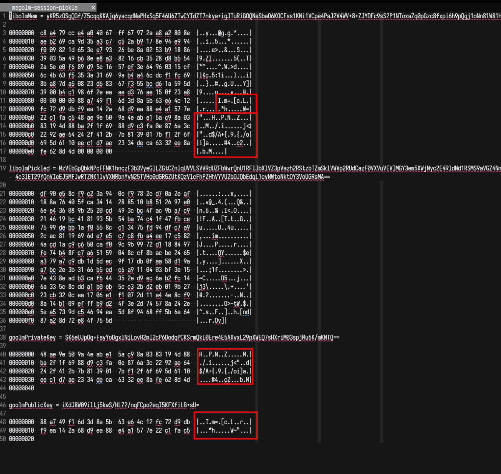

## Background

When we at Beeper started working on the
[new Android app](https://blog.beeper.com/2024/04/09/how-beeper-android-works/),
based on [mautrix-go](https://github.com/mautrix/go), we initially tried using
[goolm](https://github.com/mautrix/go/tree/master/crypto/goolm) as the crypto
implementation instead of [libolm](https://gitlab.matrix.org/matrix-org/olm). We
almost immediately ran into issues for unknown reasons, and rather than fighting
with cryptography, we decided to just put in the work to get libolm working in
the Android app.

However, libolm is annoying for multiple reasons.

1. It's a C++ library, so in order to use it from Go, you have to use cgo to
   import the functions. This makes cross-compiling difficult/impossible, and
   also requires that libolm is installed on the runtime system. A pure Go
   implementation like goolm compiles everything necessary into the single
   executable binary.
2. libolm is effectively being deprecated with all new development happening in
   [vodozemac](https://github.com/matrix-org/vodozemac) which is a Rust library
   and probably even more difficult to use from Go than libolm.

I wanted to figure out why we were having these issues by finding the
discrepancies between the two implementations, but I wasn't quite quite sure how
to actually accomplish this goal until [Tulir](https://mau.fi/) and I were at a
[talk at FOSDEM
about _differential fuzzing_]().
Tulir leaned over to me and said, this would be a great way to test libolm and
goolm!

> 📕 **Differential fuzzing:** a technique which attempts to detect bugs by
> providing the same input to different implementations of the same application
> and observing the differences in their execution.
> ([Wikipedia](https://en.wikipedia.org/wiki/Differential_testing))

Every third Friday, Beeper has a BRAD[^1] day which is a day where all employees
are encouraged to work on a project that is unrelated to anything on the current
roadmap. Many projects are to scratch an itch (creating better tooling,
upgrading a library, etc.), to experiment with a new technology, or to try and
prove out a new idea. Sometimes, BRAD projects have turned into actual company
priorities such as what happened with
[hungryserv]().

Thus, for basically every BRAD day that I have participated in since FOSDEM, I
have been working on getting goolm and libolm to a point where they could be
differential fuzzed within mautrix-go.

[^1]: BRAD: **B**eeper **R**adical **A**wesomeness **D**ay

## Interface-ifying

The biggest challenge that I faced was that the way we switched between the
libolm and goolm implementations was using build flags. Specifying `-tags=goolm`
would compile in the goolm implementation of Olm, while not specifying the tag
would compile in the libolm implementation of Olm. Both implementations defined
the same methods within the `olm` package, which provided a unified interface to
users of the `olm` package so the underlying implementations could be switched
between without any code changes outside of that package. However, because the
build flags determine which code is compiled, the two implementations could not
exist at the same time because they defined the same functions.

The solution to this came again from Tulir: **interfaces**! Both goolm and
libolm provide a set of primitives which offer the same basic interface. So I
started by interface-ifying the two olm implementations so that we can have
libolm and goolm existing in the same codebase and test them against each other.
For example, this is the interface for decrypting messages:

```go
// PKDecryption is an interface for decrypting messages.
type PKDecryption interface {
	// PublicKey returns the public key.
	PublicKey() id.Curve25519

	// Decrypt verifies and decrypts the given message.
	Decrypt(ephemeralKey, mac, ciphertext []byte) ([]byte, error)
}
```

Both the `crypto/libolm.PkSigning` and `crypto/goolm/pk.Decryption` structs
implement this same interface. The other interfaces are significantly more
involved.

What this allows me to do is have both libolm and goolm side-by-side in the
codebase not gated by build flags. The user can choose which of the
implementations to import, or (most importantly for my use-case) the user can
import both at the same time. Once both implementations can be imported,
differential fuzzing can be applied.

## Differential Fuzzing the Sign Function

The first thing I tried to test was the `olm.Account.Sign` function which
returns the signature of a message using the
[Ed25519](https://en.wikipedia.org/wiki/EdDSA#Ed25519) identity key of the
Account.

My test involved creating an account using libolm, exporting it via pickle (the
binary representation of the account that we use to persist the account data),
importing the pickle into goolm, calling `Sign` on the same data using the two
different implementations, and comparing the outputs. Signatures from Ed25519
are deterministic (there is no random element that is embedded), so I should
have received the same signatures, but **the signatures from goolm and libolm
were different!**

## Is Pickling Broken?

This is obviously wrong, so the first thing that I looked into was whether our
pickling logic was incorrect. I did many experiments involving round-tripping
the pickled values through both implementations (generating with libolm,
importing into goolm, exporting with goolm, expecting the values to be the same)
and all of those tests passed. I tried reversing the generation (generating with
goolm instead) and many other round-trip combinations, but none of them failed.
Thus, my hypothesis that the pickling was the problem turned out false.

## Internally Inconsistent!?

However, during this round-tripping exploration, I decided to add in a test for
internal consistency within the goolm side after importing from libolm: I added
a test to ensure that the public key derived from the private key was the same
as the public key that libolm reported. It turns out, they were different!

```go
assert.Equal(t,
	goolmAccount.IdKeys.Ed25519.PrivateKey.PubKey(),
	goolmAccount.IdKeys.Ed25519.PublicKey) // this assertion failed!
```

Which means that whatever private key we were getting from libolm didn't match
each other!*

*or so I thought

## C Struct Snooping

Both the public and private keys of the Ed25519 keys are both included in the
pickle value, so as far as I could tell, the public and private keys that libolm
and goolm were using were identical! However, I wanted to double-check by
actually inspecting the bytes of the private and public keys.

I was able to verify that both libolm and goolm had the same public key
trivially because there are functions in both implementations for retrieving the
public key bytes.

However, verifying that the private key bytes were the same was a different
story entirely. It is easy to introspect goolm's internals and get the private
keys, but libolm does not expose functions for getting the private key (it only
exposes a way to get the pickled value of the entire account). However, libolm
does not allocate any memory itself (you have to pass it a byte buffer to put
all of its data into), so I could inspect the byte buffer and cross-reference it
with the byte layout to see if it mached.

At this point, I figured out that megolm sessions also have Ed25519 keys, and
are a lot less heavy than accounts, so I made a reproduction of the issue with
megolm sessions and did a memory dump of the libolm megolm session struct. The
result? The bytes are equal!



So, at this point I know that the private key bytes being used by libolm and
goolm are identical, but the signatures are still turning out different!

## Different Ed25519 Binary Format?

Tulir then said something in our chat which led me down a (long) path to solving
the mystery. He said:

> elliptic curves have those weird encodings where if you encode only one
> coordinate, then there are two possible keys it can represent. I wonder if
> it's somehow related to that

(It turned out to not be exactly that, but it was an encoding issue.)

So, I started looking at different formats that Ed25519 private keys are stored.
The Go standard library `crypto/ed25519` implementation is very clear about what
format it uses. [The documentation](https://pkg.go.dev/crypto/ed25519) states
(emphasis my own):

> Package ed25519 implements the Ed25519 signature algorithm. See
> https://ed25519.cr.yp.to/.
>
> These functions are also compatible with the "Ed25519" function defined in
> RFC 8032. However, unlike RFC 8032's formulation, **this package's private key
> representation includes a public key suffix** to make multiple signing
> operations with the same key more efficient. This package refers to the RFC
> 8032 private key as the "seed".

What this means is that the public key is just the last 32 bytes of the private
key.

So, the next step was to figure out if other formats exist, and whether libolm
used one of the other formats. I found many different resources, but
[Brian Warner's blog post](https://blog.mozilla.org/warner/2011/11/29/ed25519-keys/)
caught my eye because of this diagram:


According to the table at the bottom, there are two main ways to store the
private key: storing the seed and the public key, or storing the private scalar
and the righthalf. Both of these result in 64-bytes, which means that if libolm
was using a different representation, it would not be obvious from key size
alone, nor would pickling round-tripping tests catch the discrepancy.

According to the
[libolm readme](https://gitlab.matrix.org/matrix-org/olm/-/tree/master/lib/ed25519),
the implementation that it uses is based on SUPERCOP, so I expected that it
would use the same private key representation, but if it did, it would match
what Go expects and I wouldn't be writing this article.

## Epiphany

I asked what format libolm uses in the
[End-to-end encryption in Matrix](https://matrix.to/#/#e2e:matrix.org) room on
this past Saturday morning, but (understandably due to it being a weekend)
nobody responded to me. So, I decided to do some more digging on Saturday
evening and after much DuckDuckGoing and Googling, I found
[this StackOverflow question and answer](https://stackoverflow.com/questions/44810708/ed25519-public-result-is-different)
which described the exact symptoms I was observing, and provided code for
getting from the SHA512 value to a public key. So, I applied that code (I had to
make some slight modifications) to one of the libolm private keys that I was
testing with, and compared it against the expected public key from libolm, **and
they matched!**

So, what it appears is that libolm actually stores Ed25519 private keys in
neither the NaCl format, nor the SUPERCOP format but instead stores the SHA512
result (left and right half).

<div class="admonition note">
<p class="first admonition-title">Correction</p>
<p class="last">

The format used by libolm is in fact the same as the NaCl format. When I was
doing my analysis, I tried to use functions which did not do the bit set/unset
logic (also called clamping I believe), and they didn't seem to work, but this
is probably user error rather than the private key not being clamped.

</p>
</div>

It turns out that the private and public key exported by libolm do in fact match
each other, the private key is just in a different format than the Go
`crypto/ed25519` package expects.

## Our Very Own ed25519 Implementation

It is impossible to reverse a cryptographic hash (of which SHA512 is one). Thus,
there is no way to get from the libolm format back to the format required by the
Go standard library. Unfortunately, this means that we are going to have to
maintain our own implementation of Ed25519 that uses the
[`filippo.io/edwards25519`](https://github.com/FiloSottile/edwards25519) library
directly and stores the private key in the libolm format, rather than taking
advantage of the `crypto/ed25519` package in the stdlib.

As soon as I switched out the `crypto/ed25519` package for a custom package that
uses the libolm representation, the account tests started passing, and most of
the session tests started passing as well! There's still one session test that
is not working, but I don't think that it's related to the private key
representation, so that is a mystery for another day!
