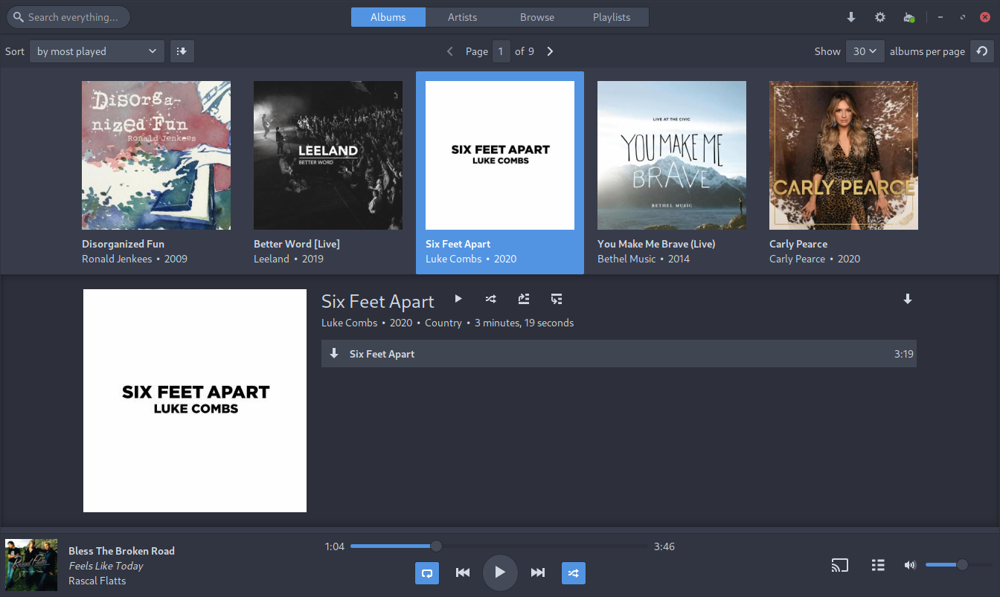

Today I'm happy to announce Sublime Music to the world! Sublime Music is a
feature-packed native GTK client for Subsonic-compatible servers such as
Airsonic_, Gonic_, and Navidrome_. Sublime Music is in beta and version 0.11.0
is available on the AUR_ and PyPi_.

`Hooked already? Check out the website! <website_>`_
----------------------------------------------------

   **The Albums tab of Sublime Music.** Clicking on an album cover shows the
   details for that album.

   See the `Sublime Music website <website_>`_ for more screenshots.

Background
----------

I started using Airsonic_ for hosting my personal media library a few years ago,
but there was one thing missing: a well-designed client for Linux, so about two
years ago, I decided to write my own Subsonic client. I have worked on Sublime
Music on and off since then.

I took design inspiration from my favourite music players including iTunes,
Spotify, and DSub and I also followed the Gnome HIG to design the app to look
right at home on the Linux desktop.

Features
--------

Sublime Music has many features that differentiate it from the competition:

* **Offline Support:** Download your songs for offline listening. Sublime Music
  also provides an Offline Mode to prevent it from making any network requests.
* **Desktop Integration:** Control Sublime Music using playerctl, KDE Connect,
  and many commonly used desktop environments.
* **Chromecast Support:** Cast music to Google Chromecast and Google Home
  devices on the same network.
* **Linux Native:** Sublime Music is built using the GTK toolkit, so it looks
  right at home on your Linux desktop.
* **Multiple Servers:** You can configure connections to multiple servers and
  switch between them seamlessly.
* And much more!

For more information on the features on the `Sublime Music website
<features_>`_!

Future
------

Sublime Music is currently in beta, and there are still bugs that need to be
squashed and code cleanup that needs to be done before the Version 1.0
release. The Version 1.0 release will have everything required for Sublime
Music to be used as a Subsonic client.

Version 2.0 will bring support for using Sublime Music without a \*sonic server.
Users will be able to point Sublime Music at a local directory and Sublime Music
will scan that directory for songs and show them in the UI.

Other future initiatives include:

* **Support for additional backends.** Sublime Music was designed with
  extensibility in mind. Developers can use the `Adapter API`_ to implement
  adapters for other music services such as YouTube Music. If you are interested
  in implementing an adapter, join our `Matrix chat <matrix_>`_ to discuss!

* **Flatpak support.** Currently, Flatpak builds are broken due to dependency
  issues. Once these are fixed, I will try and get Sublime Music on FlatHub.

* **More package formats and platforms.** For example: Snap, AppImage, DMG for
  macOS, MSI installer for Windows.

Ways to Contribute
------------------

There are many ways that you can contribute to Sublime Music.

* **Join the discussion** on our `Matrix chat <matrix_>`_. Discuss ideas with,
  suggest features to, or get help from other users and developers.

* **Report issues or suggest features** on the `GitLab repository <issues_>`_.

* **Package Sublime Music** for your distribution or operating system. Sublime
  Music is currently packaged for Arch Linux and Debian and is available on
  PyPi. A Flatpak is also in the works. I'm very unfamiliar with other package
  formats, and I'd appreciate help making packages for other distributions and
  operating systems.

* **Write an adapter** for your music service of choice. Note that the interface
  does have many rough edges, so you will likely have to fix bugs in the core
  application as well.

* **Contribute bug fixes or new features** to the core application. There are
  many bugs and features that need to be worked on. Check the `Issues
  <issues_>`_ page for a list of things that need to be worked on.

Credits
-------

Sublime Music would not be where it is without the support of many people.
Thanks especially to:

* Robozman: for making me a self-hosting junkie, starting this project, giving
  great feedback along the way, and being the first user besides myself.
* sentriz: for many bug fixes and being a great advocate for Sublime Music.
* anarcat and baldurmen: for packaging Sublime Music for Debian.
* deluan: for helping me get Sublime Music working with Navidrome and being a
  great advocate for Sublime Music.

Thanks also to everyone who has reported issues and requested features on
GitLab, interacted in the Matrix chat, or told their friends about Sublime
Music!

.. _website: https://sublimemusic.app
.. _features: https://sublimemusic.app/#features
.. _AUR: https://aur.archlinux.org/packages/sublime-music/
.. _Debian Unstable: https://packages.debian.org/sid/sublime-music
.. _PyPi: https://pypi.org/project/sublime-music/
.. _Airsonic: https://airsonic.github.io/
.. _Gonic: https://github.com/sentriz/gonic
.. _Navidrome: https://www.navidrome.org/
.. _Adapter API: https://sublime-music.gitlab.io/sublime-music/adapter-api.html
.. _matrix: https://matrix.to/#/!veTDkgvBExJGKIBYlU:matrix.org
.. _issues: https://gitlab.com/sublime-music/sublime-music/-/issues
