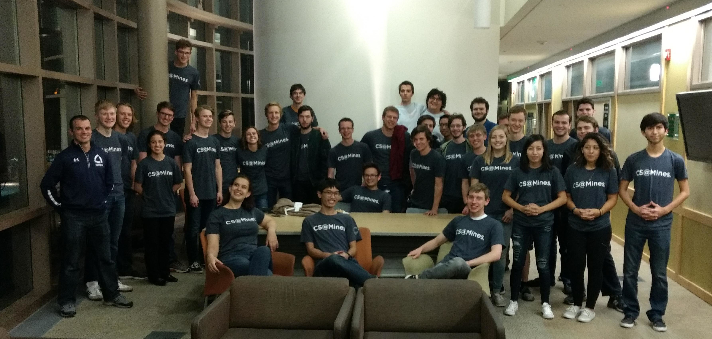

Today I competed in the ICPC Rocky Mountain Regionals at CSU.

   Photo Credit: CPW

ICPC is the International Collegiate Programming Contest. It's an algorithmic
competition for college students. I've competed in ICPC three times now, but
today was is the best my team has ever done. But I'm getting ahead of myself.
Some background on what we did.

It all started Friday afternoon. I'd just finished up my phone interview with
Google at about 15:15, so I went downstairs to ALAMODE to find Jack Garner. Then
we headed in to Denver to pick us Sam Sartor who was at his job. Sidenote,
driving in downtown Denver is terrible. We had to go around the block multiple
times, just to find him. Anyway, we finally caught up to him and drove up to
Fort Collins (specifically the Best Western near the CSU campus). On the way, we
stopped to get some Qdoba (we had some leftover catering trays from an event
that had happened at school a couple of months back, and when you bring them in
to Qdoba, they give you a free burrito).

We arrived to the hotel right behind Dr. Paone and CPW who had driven up in two
vans with most of the other people from Mines. We checked in to our rooms (I was
rooming with Jack and Easton) and then headed over to the campus for the
practice competition.

At the practice competition, we were able to get everything set up properly so
that we knew how the development environment worked. The practice competition
had three fairly trivial problems, and then an impossibly hard problem (9.5 on
Kattis, the highest of any problem on there).

After the practice, we walked back to the hotel. However, some of us made a
slight detour to a nearby Cold Stone. That was a great move. As we were walking
back from the Cold Stone to the hotel, we got blasted with some terrible wind. I
was carrying a whiteboard that I had brought to the practice competition, and I
almost lost it a couple of times.

At the hotel, some of us hung out in Kieran and Jake's room, and then we decided
it was a good idea to go to bed since we had an entire programming competition
the next day.

-------------------------------------------------------------------------------

That brings us to today. After waking up at 7:30 and taking a quick shower, I
went to grab some food at the hotel and then we drove the 3 minutes over to the
CSU campus.

My team (Sam Sartor and Jack Garner) and I had brought the house. We had two
whiteboards, 8 whiteboard markers, volumes 1-4A of Donald Knuth's *Art of
Computer Programming*, my mechanical keyboard, and (most importantly) a rubber
duck.

There was some sort of "opening ceremonies/info session" and then the
competition started.

The Competition
===============

The competition itself went very well. To start out, Sam and Jack found and
implemented the easiest problem (Problem A) in 3 minutes. We were just seconds
behind *Three Slythery Bois* (Jack Rosenthal, Adam Frick, Billy Brickner) who
were the first to solve a problem in the entire competition.

By this time, I'd identified the next easiest problem (Problem D) for them to
solve. They submitted it at 24 minutes.

As they were solving that problem, I went through all of the problems in the
competition (there were 12) and determined what types of problems they were. My
initial pass got me the following:

- **A**: `Quality-Adjusted Life-Year <a_>`_ - trivial
- **B**: `Gwen's Gift <b_>`_ - some sort of combinatorics math
- **C**: `Forest for the Trees <c_>`_ - a geometry/ray-tracing question
- **D**: `H-Index <d_>`_ - trivial (list processing)
- **E**: `Driving Lanes <e_>`_ - DP-esque (I learned at the end that it could be
  solved with a simple Dijkstra's shortest path graph traversal through a DAG)
- **F**: `Treasure Spotting <f_>`_ - another geometry/ray-tracing problem
- **G**: `Neighborhood Watch <g_>`_ - DP path counting (it ended up being some
  very simple math)
- **H**: `Small Schedule <h_>`_ - DP scheduling (it ended up being one just
  being a fairly simple math problem)
- **I**: `Mr. Plow King <i_>`_ - Maximal MST (I thought it might be DP, but it
  didn't end up being DP which was nice)
- **J**: `Rainbow Road Race <j_>`_ - Graph craziness

I was kinda off the mark on some of them (many turned out to be much easier than
I thought they would be).

.. _a: https://rmc18.kattis.com/problems/qaly
.. _b: https://rmc18.kattis.com/problems/gwensgift
.. _c: https://rmc18.kattis.com/problems/forestforthetrees
.. _d: https://rmc18.kattis.com/problems/hindex
.. _e: https://rmc18.kattis.com/problems/drivinglanes
.. _f: https://rmc18.kattis.com/problems/treasurespotting
.. _g: https://rmc18.kattis.com/problems/neighborhoodwatch
.. _h: https://rmc18.kattis.com/problems/smallschedule
.. _i: https://rmc18.kattis.com/problems/plowking
.. _j: https://rmc18.kattis.com/problems/rainbowroadrace

I'd started thinking about problem **C**, and then when Sam finished **D**, we
paired up and coded **C** while Jack worked on **G** (we saw a few teams
completing it on the standings, so we figured it must be a fairly easy one). Our
first solution to **C** failed on a *Time Limit Exceeded* error, but we were
able to fix that and submit a correct solution on 54 minutes which brought us to
2nd place of the teams competing at CSU with 3 problems completed.

In the middle of us coding up **C**, Jack had figured out a formula for **G**
and I told him to write up the code which we needed to use on a whiteboard (we
fully utilized both whiteboards during the entire competition) so that Sam and I
could finish ironing out the bugs in **C**.

By the time that we were done, Jack had code on the board, and I quickly typed
it into a Python file. Jack's code had just a couple bugs which were easy to fix
(it was basically flawless considering he coded it up on a whiteboard). We
submitted **G** 11 minutes later which bumped our ranking regionally, and helped
solidify our second-place spot at CSU with 4 problems solved in the first 65
minutes of the competition and a total time of 186 minutes (including penalty)
minutes.

Meanwhile, Sam had started working on **F** because it was a ray-tracing problem
which is his thing. He'd reduced the bulk of the problem to solving a matrix
equation, but was having a hard time. I don't remember exactly what order things
happened from here, but I think that he started up coding up some of it while
Jack worked out a solution to **H**. I bounced between helping both of them. It
took us a total of 27 minutes to finish **H** (unfortunately we had a slight
snafu with calculating the area of a rectangle... maybe some things are better
left unwritten...). At this point, it was the 92nd minute of the competition and
we had 5 problems solved. I think we were close to second in the region at this
point (definitely second on site at CSU).

At this point, Jack and I started working on **E**. We figured out the recursive
formulation for it (it is very similar to the DP project which I did for
Algorithms), figured out to calculate everything, and then wrote up some code on
the whiteboard so we could be just copy from there to the computer. Sam
continued working on **F** while we were doing this, but unfortunately he missed
some edge case and his solution failed with a wrong answer.

At this point, Jack and I went to actually implement **E**, and we left one-half
of the monitor for Sam to look at his code (we were using i3 which made this
super easy). We wrote it in Python 3 initially, but it gave us a *Time Limit
Exceeded*! We should have just converted it to Python 2 right then and there,
but we decided that it may be our algorithm that was actually too slow (wrong
assumption, :math:`\mathcal{O}(nm^2)` was perfectly fine). We spent over an hour
trying to optimize, and then in a last ditch effort, we converted it to Python 2
and our original algorithm worked. We probably could have solved another problem
and beaten the team ahead of us in the region on time if we hadn't wasted ~2
man-hours on that problem, which was kinda annoying.

By this time, Sam had given up for the time being on **F** and started on **I**.
He solved it, we coded it up, and it worked first time!

Sam tried to work through **F**, and got extremely close (one or two edge cases
away from getting it right), but unfortunately time expired before he was able
to finish it.

Both our submissions on **E** and **I** happened in the last hour of the
competition when the scoreboards were frozen. Going in to the last hour, we were
in 6th place regionally, 2nd on-site at CSU. The final standings were not
announced until 3:30 (30 minutes after the competition ended) so the suspense
was real! After time expired, we went around to talk to other teams so that we
could see if anyone had solved any problems in the last hour of the competition.

Competition Results
===================

**Full standings can be found here:** https://rmc18.kattis.com/standings

Then (finally) the announcement of the winners came. He first announced the
finalists for the region. Two CSU teams placed 5th and 4th, then *Three Slythery
Bois* placed **third**, *Dream Team 2.0* (Sam Sartor, Jack Garner, me) placed
**second**, and *((+)(((+)s)m)j)* (Sam Reinehr, Matt Baldin, Joseph McKinsey)
placed **first**! The Mines teams had managed to hold off the other schools to
take all three podium spots on-location at CSU!

Then he announced the winners regionally. He said "we had two top-five finishers
at this site"! That meant that we got at least fifth! In fact, we'd done better
than that, we finished **fourth-place regionally**! Sam Reinehr's team took
**first-place regionally**.

Sam Reinehr's team went into the last hour with one problem left and managed to
finish it. They were able to do that to beat out *Utah Arches* (University of
Utah). That secured them a first place finish regionally, and earned them a
repeat trip to ICPC World Finals which will be hosted in Porto, Portugal this
spring.

My team went into the last hour at 6th place, and managed to leapfrog Utah
Canyonlands and Alberta Gold to get 4th place regionally.

A couple of other cool things that happened:

- *NP = No Problem* (Easton Bornemeier, Kristin Farris, and Matt Iverson) did
  well with 5 problems solved.
- Mines teams were first on all problems except for **D** (Alberta White was
  first). But at location, Mines teams were first on all problems.
- All Mines teams solved at least one problem.
- *The Open Sourcerers*, a team of all freshmen (Jake Vossen, Kieran Lewis, and
  Nick Redhorse) completed 4 problems for a 28th-place finish regionally and a
  10th-place finish on-location.
- Six of the top 25 teams in the region were from Mines.
- Four of the top 20 teams in the region were from Mines.
- Seven of the top 10 teams on-location were from Mines.
- CU Boulder did not even send any teams (maybe they are still reeling after how
  badly we beat them at HackCU...)

For me, the second-place finish on location, fourth-place regionally was the
best that my team and I had ever gotten (the previous two years, Sam and I were
on a team with Robbie Merillat and we got 3rd on-site, 13th regionally in 2016;
and 6th on-site, 15th regionally in 2017).

All in all, the competition was a great success for my team, Sam Reinehr's team,
and all of Mines. Sam and Jack were amazing teammates, and I'm really proud of
how well we worked together.
