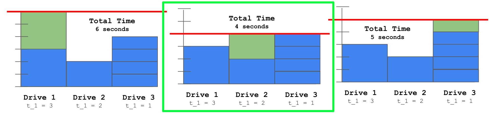
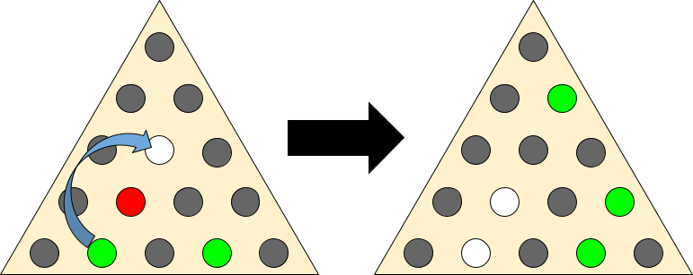

For the last six years, Mines ACM has hosted a High School Programming
Competition (HSPC) modelled after the
[International Collegiate Programming Contest (ICPC)](https://icpc.global/). I
wrote about the [2019](), [2020](),
[2021](), and [2022]() competitions
on this blog. The problems from every year are new and written by Mines students
and some Mines alum specifically for the competition. This year, I wrote four of
the problems and helped [Ethan Richards](https://ezrichards.github.io/) with
organizing the competition.

Like last year, we ran the competition as a hybrid competition. However, we
awarded prizes to the winners of both the in-person and remote competitions
separately. As with the past three competitions, we allowed contestants to
access the internet (in the past, we banned forums like StackOverflow, but we
explicitly banned resources such as ChatGPT this year).

We ran two concurrent divisions again this year: a beginner division and an
advanced division. The beginner division was designed for first-year computer
science students, while the advanced competition was designed for computer
science students who had more experience. We had 18 different problems written
by 10 authors (the highest number of authors ever).

The beginner competition featured 34 teams while the advanced competition
featured 31 teams. At 65 teams from across the nation, this competition tied
with last year as the largest competition to date.

In this post, I'm going to explain the problems in the competition (with
relatively detailed solution sketches).

**You can view full standings for each competition at the following websites:**

- Beginner: https://mines23beginner.kattis.com/standings
- Advanced: https://mines23advanced.kattis.com/standings

## The Problems

> [!WARNING]
>
> The rest of this post should be treated like a solutions manual. I hope that
> this is an extremely helpful resource when you get stuck, but you should _try_
> to solve each of the problems before reading the solutions. There's no magic
> amount of time that you should try to solve the problem before looking at the
> solution sketch, but I think a good rule of thumb is after you've tried at
> least three ideas on your own, then you can read at the solution sketch.
>
> **Remember: You will not learn anything if you just read the explanations!**

There were eighteen problems in the competition written by eight different
authors. The problems can be viewed at
https://mines23beginner.kattis.com/problems and
https://mines23advanced.kattis.com/problems. The following lists the problems
featured in each competition and a short description of the algorithm required
to solve the problem, listed in the order in which they appeared in each
respective competition:

**Beginner Competition:**

- **A: Above Sea Level** -- Basic arithmetic.
- **B: Driving Dilemma** -- Arithmetic with an `if` statement.
- **C: MIR Cipher** -- Modular arithmetic in a `for` loop.
- **D: Sarah's Sandwich Shop** -- Lots of `if` statements (or a dictionary).
- **E: Mines Football** -- Minimization/maximization on a list.
- **F: Cookie Monster Concussion** -- A `for` loop (or notice that modular
  arithmetic would solve the problem).
- **G: Compass Rose** -- Binary search.
- **H: Computer Imaging** -- Simple simulation or computing a summation.
- **I: Fixing Figures** -- Write out numbers as words.
- **J: Paper Pile Pandemonium** -- Keep track of piles of paper using a list.
- **K: Noise Reduction** -- Compare differences in averages of chunked data at
  different chunk sizes.
- **L: Telescope Targeting** -- Center an image inside of another image using
  offsets.

**Advanced Competition:**

- **A: Mines Football** -- Minimization/maximization on a list.
- **B: Basketball Modelling** -- Dynamic programming to compute a statistical
  result.
- **C: Cookie Monster Concussion** -- A `for` loop (or notice that modular
  arithmetic would solve the problem).
- **D: Paper Pile Pandemonium** -- Keep track of piles of paper using a list.
- **E: Pegs** -- BFS on an annoying graph.
- **F: Compass Rose** -- Binary search.
- **G: Galactic Reconstruction** -- Union find.
- **H: Wikipedia Black Hole** -- Loop detection using BFS.
- **I: Planetary Computer Imaging** -- A harder version of Computer Imaging
  requiring binary search or LCM.
- **J: Telescope Targeting** -- Center an image inside of another image using
  offsets.
- **K: Unit Rescue** -- BFS or DFS with either traceback or keeping track of
  extra metadata in the queue.
- **L: Noise Reduction** -- Compare differences in averages of chunked data at
  different chunk sizes.

As you can see, there were some repeats across the competition. The harder
problems in the beginner competition were low and mid-tier questions in the
advanced competition.

In the beginner competition, the problems were ordered in estimated difficulty.
The advanced competition had no such guarantee (except that the first problem
would be the most trivial). Problems **G: Galactic Reconstruction**, **E:
Pegs**, **B: Basketball Modelling**, and **I: Planetary Computer Imaging** were
intended to be the most difficult problems in the advanced competition.

The following subsections are going to describe the problems and provide fairly
detailed solution sketches for each one, sorted by their intended relative
difficulty with the easiest ones first.

I do not try and build up from first principles in each of these explanations.
Rather, I try and make the explanations accessible to anyone who feels like
solving the problem is within their grasp, but they can't figure out one or two
of the key ideas to crack the problem. For the easiest problems, I start much
closer to first principles, but as the problems get harder, I start assuming
more and more base understanding of programming.

Additionally, I'm only presenting a single solution for each problem here. There
are likely many alternative ways to solve each of these problems.

### Above Sea Level

|                 |                                                                                            |
| --------------- | ------------------------------------------------------------------------------------------ |
| **Description** | https://mines23beginner.kattis.com/contests/mines23beginner/problems/mines23.abovesealevel |
| **Author**      | Ryan Mapes                                                                                 |
| **Beginner**    | Problem A, 34/52 (65%) solved/tries, 100% solve rate                                       |
| **Concept**     | basic operations on variables                                                              |

> [!NOTE] Problem Summary
>
> Calculate the modified elevation of a particular point after the sea level
> rises by 30 centimeters.

The solution is to read the input (which is given in meters) as a floating point
number, subtract 0.3, and output it.

You need to subtract because as the sea level _rises_, the **elevation** of all
objects on land decreases.

### Driving Dilemma

|                 |                                                                                             |
| --------------- | ------------------------------------------------------------------------------------------- |
| **Description** | https://mines23beginner.kattis.com/contests/mines23beginner/problems/mines23.drivingdilemma |
| **Author**      | Sumner Evans                                                                                |
| **Beginner**    | Problem B, 32/66 (48%) solved/tries, 94% solve rate                                         |
| **Concept**     | basic operations on variables                                                               |

> [!NOTE] Problem Summary
>
> **Will Rishi make it to the end of the intersection before the light turns red
> given he is going at \(S\) miles per hour?** He is \(D\) feet from the end of
> the intersection and he has \(T\) seconds to get through the intersection.

For this problem, you need to determine if Rishi will travel at least \(D\) feet
in \(T\) seconds going at \(S\) miles per hour.

You need to do some unit conversions in order to make this comparison. It is
recommended to convert the speed to feet per second.

Then if \(T \times S \geq D\) Rishi "MADE IT" otherwise output "FAILED TEST".

### MIR Cipher

|                 |                                                                                        |
| --------------- | -------------------------------------------------------------------------------------- |
| **Description** | https://mines23beginner.kattis.com/contests/mines23beginner/problems/mines23.mircipher |
| **Author**      | Ryan Manley                                                                            |
| **Beginner**    | Problem C, 22/133 (17%) solved/tries, 64% solve rate                                   |
| **Concept**     | modular arithmetic in a `for` loop.                                                    |

> [!NOTE] Problem Summary
>
> Given a message, decode it by applying a Caesar cipher to each character with
> shift amount that doubles every character.

For each character, shift it by the shift amount, print it, then double the
shift amount. Main gotchas:

- The shift amount will quickly become greater than the length of the alphabet
  so you will need to wrap around by doing all operations under \(\pmod{26}\).
- You need to use 64-bit integer to store the shift amount!

It is recommended to subtract from the ASCII value of the letters before
performing the Caesar cipher so that A is 0, B is 1, etc. This allows the
modular arithmetic work naturally.

### Sarah's Sandwich Shop

|                 |                                                                                                 |
| --------------- | ----------------------------------------------------------------------------------------------- |
| **Description** | https://mines23beginner.kattis.com/contests/mines23beginner/problems/mines23.sarahssandwichshop |
| **Author**      | Ethan Richards                                                                                  |
| **Beginner**    | Problem D, 27/55 (49%) solved/tries, 79% solve rate                                             |
| **Concept**     | lots of `if` statements (or a dictionary)                                                       |

> [!NOTE] Problem Summary
>
> Given a word, determine what numbers on a standard keypad would be used to
> represent that word.

You need to convert everything to lower case (or upper case), then loop over all
of the characters in the string and determine the number corresponding to the
letter.

One of the cleanest ways to determine the number corresponding to the letter is
by creating a _dictionary_ to store a mapping of letters to numbers.

Alternatively, you can just write 26 `switch` cases or `if` statements.

### Mines Football

|                 |                                                                                            |
| --------------- | ------------------------------------------------------------------------------------------ |
| **Description** | https://mines23beginner.kattis.com/contests/mines23beginner/problems/mines23.minesfootball |
| **Author**      | Ethan Richards                                                                             |
| **Beginner**    | Problem E, 24/46 (52%) solved/tries, 71% solve rate                                        |
| **Advanced**    | Problem A, 29/52 (56%) solved/tries, 94% solve rate                                        |
| **Concept**     | minimization/maximization on a list                                                        |

> [!NOTE] Problem Summary
>
> Calculate the maximum and minimum number of points scored across all games,
> and the maximum and minimum total number of points scored in a month.

Store the current maximum score, current minimum score, current maximum total
month, and current minimum total month (minimum values should be initialized to
`INT_MAX`).

Loop through the scores for each month to sum up the scores for the month. Use
that to update the current minimum and maximum total month scores.

Either in the same loop or in a separate loop, iterate through each of the
individual scores in the month and update the current maximum and minimum
scores.

### Cookie Monster Concussion

|                 |                                                                                                      |
| --------------- | ---------------------------------------------------------------------------------------------------- |
| **Description** | https://mines23beginner.kattis.com/contests/mines23beginner/problems/mines23.cookiemonsterconcussion |
| **Author**      | Scott Enriquez                                                                                       |
| **Beginner**    | Problem F, 26/81 (32%) solved/tries, 76% solve rate                                                  |
| **Advanced**    | Problem C, 30/63 (48%) solved/tries, 97% solve rate                                                  |
| **Concept**     | a `for` loop (or notice that modular aritemetic would solve the problem)                             |

> [!NOTE] Problem Summary
>
> Compute the output of an algorithm that determines if an integer is divisible
> by nine.

The problem can be solved by implementing the algorithm provided in the problem
statement. It may have been useful to interpret the input as a string of digits
rather than an integer to avoid overflow on 32-bit integers.

Note that running the provided algorithm on a number \(C\) is equivalent to
computing \(C \mod 9\), except that the algorithm outputs 9 if \(C \mod 9 = 0\).

### Compass Rose

|                 |                                                                                          |
| --------------- | ---------------------------------------------------------------------------------------- |
| **Description** | https://mines23beginner.kattis.com/contests/mines23beginner/problems/mines23.compassrose |
| **Author**      | John Henke                                                                               |
| **Beginner**    | Problem G, 8/27 (30%) solved/tries, 24% solve rate                                       |
| **Advanced**    | Problem F, 16/45 (36%) solved/tries, 52% solve rate                                      |
| **Concept**     | binary search                                                                            |

> [!NOTE] Problem Summary
>
> Given a list of headings in a generalized extended version of the compass rose
> cardinal directions, determine the corresponding degree values.

First, handle the special cases of due north/east/south/west. Then, the easiest
way to solve this is by dividing the problem up per-quadrant. You can determine
which quadrant of the compass rose you are dealing with looking at the last two
characters of the heading.

Once you know the quadrant, the preceding characters (going right to left) add
specificity to the heading.

The most intuitive way to think about how each subsequent preceding character
adds specificity is in terms of a _binary search_. **Each character "pulls" the
bounds towards that cardinal direction.**

For example, if you have the heading NE (\(45^{\circ}\)) it can be thought of as
the mid-point between \(0^{\circ}\) (N) and \(90^{\circ}\) (E).

If we prepend N to NE to get NNE, we "pull" the bounds _towards_ the north, and
we get the mid-point between \(0^{\circ}\) (N) and \(45^{\circ}\) (NE) which is
\(22.5^{\circ}\).

There is no great way to do this entirely generically for all four quadrants,
and some amount of special-casing per quadrant will be necessary. One special
case is the northwest quadrant where you have to use \(360^{\circ}\) as your
"north" value rather than \(0^{\circ}\).

### Computer Imaging

|                 |                                                                                              |
| --------------- | -------------------------------------------------------------------------------------------- |
| **Description** | https://mines23beginner.kattis.com/contests/mines23beginner/problems/mines23.computerimaging |
| **Author**      | Colin Siles                                                                                  |
| **Beginner**    | Problem H, 7/36 (19%) solved/tries, 21% solve rate                                           |
| **Concept**     | simulation or computing a summation                                                          |

> [!NOTE] Problem Summary
>
> Given many different flashdrives that can image computers at different speeds,
> and the number of computers to image, determine the minimum time to image all
> computers

It's useful to think about this problem as a scheduling problem, where computers
are scheduled onto flash drives. The input size for this problem is small enough
that a **greedy simulation** is fast enough.

- Keep track of the total amount of time each flash drive images a computer
  (initially zero for each drive).

- For each computer we need to image, we determine which flash drive it should
  be scheduled on.

  We choose the flash drive based by determining which one will **minimize the
  total time**. To do this, we iterate over each flash drive and consider the
  total time if we scheduled the next computer on that flash drive.

  We select the flash drive that resulted in the lowest total time (choosing
  arbitrarily if multiple options yield the same minimum time), and increment
  the total amount of time that flash drive images a computer accordingly.

  

- After we complete this procedure for each computer, the maximum amount of time
  that any flash drive is imaging a computer is the minimum amount of time it
  would take to image all computers.

  Scheduling any computer on a different flash drive would necessarily increase
  the total time (or at least leave it unchanged), per the nature of the greedy
  simulation.

If \(N\) is the number of computers, and \(M\) is the number of flash drives,
this solution is \(\mathcal{O}(NM)\). This is fast enough since both \(N\) and
\(M\) are less than or equal to \(1,000\).

The problem can also be solved by doing a **linear search of the total time**,
starting from 0, to determine the smallest time when the required number of
computers are imaged. If there are \(M\) flash drives, and the \(i^{\text{th}}\)
flash drive takes \(t_i\) seconds to image a computer, then the total number of
computers that can be imaged in \(T\) seconds is

\[ \sum_{i=1}^M \left\lfloor \frac{T}{t_i} \right\rfloor. \]

Note that there are more efficient solutions, which are required for the
[more difficult form of this problem](#planetary-computer-imaging).

### Fixing Figures

|                 |                                                                                            |
| --------------- | ------------------------------------------------------------------------------------------ |
| **Description** | https://mines23beginner.kattis.com/contests/mines23beginner/problems/mines23.fixingfigures |
| **Author**      | Ethan Richards                                                                             |
| **Beginner**    | Problem H, 9/46 (20%) solved/tries, 26% solve rate                                         |
| **Concept**     | string and number representation                                                           |

> [!NOTE] Problem Summary
>
> Convert a number to its textual representation.

The cleanest approach is to notice that the textual representation of each set
of 3-digits is the same, with an added postfix for thousands/millions.

With this insight, you can solve printing for \([0, 999]\) and then use that
solution for the hundreds place, the thousands place, and the millions place.

There are some highly annoying edge cases such as numbers from \([0, 19]\) and
double-digit numbers with hyphens.

### Paper Pile Pandemonium

|                 |                                                                                                   |
| --------------- | ------------------------------------------------------------------------------------------------- |
| **Description** | https://mines23beginner.kattis.com/contests/mines23beginner/problems/mines23.paperpilepandemonium |
| **Author**      | Colin Siles                                                                                       |
| **Beginner**    | Problem J, 7/8 (88%) solved/tries, 21% solve rate                                                 |
| **Advanced**    | Problem D, 22/31 (71%) solved/tries, 71% solve rate                                               |
| **Concept**     | array manipulation                                                                                |

> [!NOTE] Problem Summary
>
> Given the initial state of a series of stacks of paper, and a record of how
> sheets of paper were moved between stacks, determine the final state of the
> stacks.

To solve this problem, simulate the provided sequence of operations on the
initial state of the stacks, and then output the final state.

The simulation must keep the sheets in order when they were moved between piles,
and not reverse their order.

The size of the inputs is small enough that no special data structures are
required: dynamic arrays to represent each stack is sufficient.

### Noise Reduction

|                 |                                                                                             |
| --------------- | ------------------------------------------------------------------------------------------- |
| **Description** | https://mines23beginner.kattis.com/contests/mines23beginner/problems/mines23.noisereduction |
| **Author**      | Sumner Evans                                                                                |
| **Beginner**    | Problem K, 7/29 (24%) solved/tries, 21% solve                                               |
| **Advanced**    | Problem L, 10/59 (17%) solved/tries, 32% solve rate                                         |
| **Concept**     | array processing with windowing                                                             |

> [!NOTE] Problem Summary
>
> Given a list of \(N\) temperature readings, find a group size such that the
> difference of averages between sequential groups is below a certain threshold,
> \(T\).

The bounds of this problem are such that you can just try every group size up to
\(N/2 + 1\) and see if the group size works.

In order to determine if a group size \(g\) works, split the dataset into groups
of size \(g\) (discarding any extraneous readings) and compute the average of
the readings within each group.

Keep track of the previous group's average, and if the difference is above
\(T\), then the group size is too small.

### Telescope Targeting

|                 |                                                                                                 |
| --------------- | ----------------------------------------------------------------------------------------------- |
| **Description** | https://mines23beginner.kattis.com/contests/mines23beginner/problems/mines23.telescopetargeting |
| **Author**      | Sam Sartor                                                                                      |
| **Beginner**    | Problem L, 3/10 (30%) solved/tries, 9% solve rate                                               |
| **Advanced**    | Problem J, 9/13 (69%) solved/tries, 29% solve rate                                              |
| **Concept**     | 2-D array processing                                                                            |

> [!NOTE] Problem Summary
>
> Given a \(W \times H\) reference image and an \(N \times M\) sky, determine
> the **rotation** at which the reference image would be centered in the sky.

To find where the reference image appears in the current view, create 4 nested
for loops:

- Over \(M - H + 1\) possible vertical offsets
- Over \(N - W + 1\) possible horizontal offsets
- Over \(H\) rows of pixels in the reference image
- Over \(W\) pixels in the row of the reference image

If all pixels in the reference image equal the pixels in the current view, at
the given offset, then the correct offset has been found.

### Wikipedia Black Hole

|                 |                                                                                                 |
| --------------- | ----------------------------------------------------------------------------------------------- |
| **Description** | https://mines23advanced.kattis.com/contests/mines23advanced/problems/mines23.wikipediablackhole |
| **Author**      | Sumner Evans                                                                                    |
| **Advanced**    | Problem H, 6/76 (8%) solved/tries, 19% solve rate                                               |
| **Concept**     | BFS                                                                                             |

> [!NOTE] Problem Summary
>
> Given a list of links between Wikipedia pages, determine the smallest number
> of clicks it would take to get back to the page you started on.

Model the problem as a **directed graph** with links being the _edges_ and pages
being the _nodes_.

Because you need to output the _smallest_ loop, you must use a **breadth-first
search** (BFS) to find the loop rather than a depth-first search (DFS).

If you explore the entire graph without finding a loop back to the original
page, then there is "NO BLACK HOLE".

### Unit Rescue

|                 |                                                                                         |
| --------------- | --------------------------------------------------------------------------------------- |
| **Description** | https://mines23advanced.kattis.com/contests/mines23advanced/problems/mines23.unitrescue |
| **Author**      | Alex Capehart                                                                           |
| **Advanced**    | Problem K, 5/49 (10%) solved/tries, 16% solve rate                                      |
| **Concept**     | BFS/DFS                                                                                 |

> [!NOTE] Problem Summary
>
> Given a set of conversion factors between units, convert from one unit to
> another unit. (There may not be a direct conversion given.)

Model the problem as a **directed graph** with the _nodes_ being units and the
_edges_ being a known conversion from the two units. Note that you will always
have the reverse edge since you can always invert the ratio.

Then, use BFS or DFS to find a path from the start unit to the end unit. In
addition to keeping track of which nodes to visit, you will have to track the
converted value (similar to a distance table used in Dijkstra's algorithm).

### Planetary Computer Imaging

|                 |                                                                                                       |
| --------------- | ----------------------------------------------------------------------------------------------------- |
| **Description** | https://mines23advanced.kattis.com/contests/mines23advanced/problems/mines23.planetarycomputerimaging |
| **Author**      | Colin Siles                                                                                           |
| **Advanced**    | Problem I, 6/43 (14%) solved/tries, 19% solve rate                                                    |
| **Concept**     | binary search for the answer                                                                          |

> [!NOTE] Problem Summary
>
> Given many different flash drives that image computers at different speeds,
> and a very large number of computers to image, determine the minimum time to
> image all computers.

This is a harder version of the [Computer Imaging](#computer-imaging) problem
given to the beginner competition. In this version of the problem, the number of
computers can be very large (up to \(8 \cdot 10^9\)), so neither the greedy
simulation nor the linear search is fast enough.

We can use the same formula from the linear search solution to determine how
many computers are imaged in a given amount of time, but use **binary search**
to drastically reduce the number of times we search, compared to linear search.

Since each step of binary search cuts the number of possible candidates in half,
we can determine the answer amongst the \(2 \cdot 10^{11}\) possible times in
only \(\log_2(2 \cdot 10^{11}) \approx 38\) steps!

If we test a time and image more computers than necessary, then we can eliminate
all times greater than that value, since all such times must necessarily image
at least as many computers.

If we test a time and image fewer computers than necessary, then we can
eliminate all times less than that value, since all such times could only
possibly image fewer computers.

### Basketball Modelling

|                 |                                                                                                  |
| --------------- | ------------------------------------------------------------------------------------------------ |
| **Description** | https://mines23advanced.kattis.com/contests/mines23advanced/problems/mines23.basketballmodelling |
| **Author**      | Colin Siles                                                                                      |
| **Advanced**    | Problem B, 2/25 (8%) solved/tries, 6% solve rate                                                 |
| **Concept**     | dynamic programming                                                                              |

> [!NOTE] Problem Summary
>
> Given a probabilistic model for how a basketball team scores points, determine
> the expected value for the number of points they will score.

This problem requires a solution technique called **Dynamic Programming**, which
allows us to efficiently solve problems involving recursion.

Let \(f(n, m_2, m_3)\) be the expected number of points the team scores over
\(n\) possessions given that they begin with an \(m_2\) percent chance of making
a 2-pointer, and an \(m_3\) percent chance of making a 3-pointer. We define the
function recursively.

The first step is to define a recursive definition for the expected value
function.

> [!NOTE] Recursive Definition
>
> For the base case, \(f(0, m_2, m_3) = 0\) for all \(m_2\) and \(m_3\), because
> there are no more possessions to score points.
>
> For the recursive case, let \(C_2\) and \(C_3\) be the confidence adjustments.
> There are five cases to consider.
>
> If the team attempts and makes a 2-pointer, the expected number of points
> scored is \(2 + f(n - 1, \min(m_2 + C_2, 100), m_3)\). The team has scored 2
> points, and we add the expected number of points they score over the remaining
> possessions.
>
> If the team attempts but misses a 2-pointer, the expected number of points
> scored is \(0 + f(n - 1, \max(m_2 - C_2, 0), m_3)\). The team did not score
> any points, but we add the expected value of the rest of the possessions.
>
> The 3-pointers and no shot attempt cases follow a similar pattern.
>
> To complete the recursive definition, we multiply the expected value of each
> case by the probability of that case occurring, and sum those values up. The
> probability of attempting a 2-pointer and making it is \(\frac {A_2}{100}
> \cdot \frac{m_2} {100}\), for example.

Computing this function with the recursive definition directly is not fast
enough. Because all of the inputs to \(f\) are integers, we would repeat a lot
of computations. If we "memoize" the results to the function call (that is,
cache the answer, and check the cache before computing), we can solve the
problem efficiently. This memoization step is what advances us from simple
recursion to "Dynamic Programming".

### Pegs

|                 |                                                                                   |
| --------------- | --------------------------------------------------------------------------------- |
| **Description** | https://mines23advanced.kattis.com/contests/mines23advanced/problems/mines23.pegs |
| **Author**      | Sumner Evans                                                                      |
| **Advanced**    | Problem E, 4/8 (50%) solved/tries, 13% solve rate                                 |
| **Concept**     | BFS on an implicit graph with annoying indexing                                   |

> [!NOTE] Problem Summary
>
> Given the state of a Peg Game, determine the number of pegs that you would end
> up with after optimal play.
>
> 

There are three main challenges to solve this problem:

1. **Modelling the problem as a graph.**

   This problem requires that you model the possible moves from a given position
   as _edges_ in a directed graph. The _nodes_ of your graph represent a game
   state.

   By modelling the problem in this way, you can use an exhaustive search
   (either BFS or DFS work) to find the game state with the smallest number of
   pegs remaining.

2. **Representing the state of the board in a comparable way.**

   There are many ways to represent the state of the board, but whichever way
   you choose, it must be hashable so that you can put it into a "visited" set
   so you don't get in an infinite loop.

   Options include:

   1. **Bitsets**: there are only 15 pegs, so you can fit the entire board state
      in a 32-bit integer (or even a 16-bit one).
   2. **Tuples**: if your language has tuples (say, Python), you can use tuples
      of booleans.
   3. **Custom class with hash function**: you may have to resort to this in
      languages such as Java.

3. **Finding adjacencies to a given hole.**

   Finding adjacencies to a given hole is nontrivial due to the triangular
   nature of the board.

   Given a hole in the \((r, c)\) cell, it is adjacent to the holes at the
   \((r,c-1), (r,c+1), (r-1,c-1), (r-1,c), (r+1,c)\), and \((r+1,c+1)\) cells.

   There are many other ways to represent hexagonal grids. This website has some
   good resources about options: https://www.redblobgames.com/grids/hexagons/

### Galactic Reconstruction

|                 |                                                                                                     |
| --------------- | --------------------------------------------------------------------------------------------------- |
| **Description** | https://mines23advanced.kattis.com/contests/mines23advanced/problems/mines23.galacticreconstruction |
| **Author**      | Kelly Dance                                                                                         |
| **Advanced**    | Problem G, 5/46 (11%) solved/tries, 16% solve rate                                                  |
| **Concept**     | union find or creative use of dictionaries                                                          |

> [!NOTE] Problem Summary
>
> Given a starting set of \(n\) colonies, and a set of proposed warp gates,
> determine which gates will be built, which are unnecessary, and which are
> impossible to build due to lack of funds.

This problem requires that we efficiently keep track of _disjoint subsets_ of
the colonies.

This problem can be solved using the _Union Find_ data structure, but we will go
over another solution that does not require as much prerequisite knowledge which
involves merging sets of colonies using dictionaries.

We will represent each cluster as a tuple of the set of colonies within it and
its wealth. We will also need a list that tracks with cluster each colony is
part of. So before we process any propositions, we have these two structures:

`cluster`: \( \left[(\{1\},w_1),(\{2\},w_2),(\{3\},3),\ldots\right] \)

`lookup`: \( [1,2,3,\ldots] \)

We now process the propositions in order. If the current proposition is joining
\(a\), \(b\) at at a cost of \(c\), we can check `lookup[a]` and `lookup[b]` to
see which clusters they are part of.

If they already belong to the same cluster then you can just output that the
warp gate is `UNNECESSARY`.

We can then check that each have enough wealth to build the warp gate using
`clusters[lookup[a]][1]` and `clusters[lookup[b]][1]`. If either has wealth less
than \(c\), then it is `IMPOSSIBLE`.

If both of these checks have passed, we output `BUILT` and must update our data
structures to reflect this change.

To update our data structures, we choose the _smaller_ cluster and move its
elements into the larger cluster. Moving a colony to the larger cluster requires
that we

1. add the colony to the larger cluster
2. update the lookup table for each of the moved colonies

We must also update the wealth of the larger cluster, which now represents their
union, to be the sum of the original wealths minus twice the warp gate cost.

This algorithm is \(\mathcal{O}(n \log n)\). The most expensive part of this
algorithm is moving colonies from one cluster to another.

We can derive our complexity by looking at how many times a colony can move from
one cluster to another then multiplying that count by the number of colonies
(\(n\)).

Since we are always moving a colony into a cluster with a size greater than or
equal to the size of the previous cluster, we know that the size of the cluster
a colony is part of _at least doubles_ after every move.

Since the size is doubling, we know that there can be at most around
\(\log_2(n)\) moves before there is only a single cluster.
