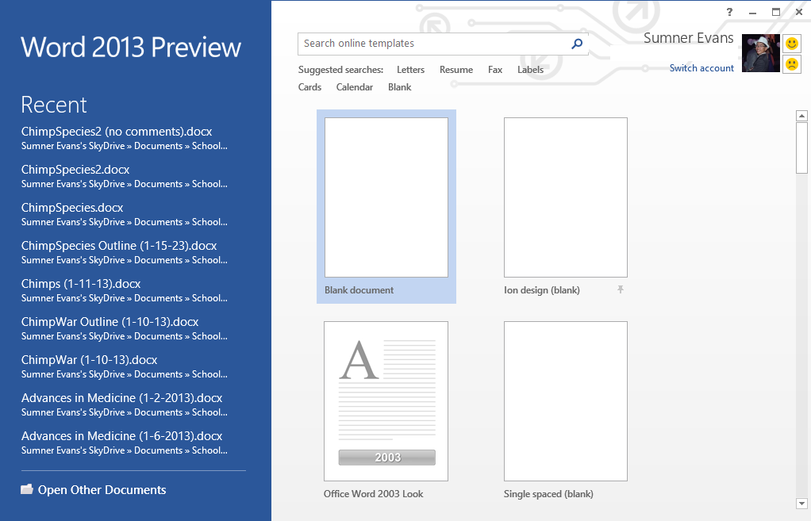

A little while ago I downloaded and installed Office 2013 Preview on my PC.
Now, with only a few days before the final version shows up in stores I decided
to post some of my thoughts on it.

1.  ### Files First

    

    The first thing that I noticed about Office 2013 is that it puts your files
    first. On run, Word, PowerPoint, Publisher, and Access all open to a page
    with recent files, and a view of all the templates that you can use to
    create a new document/file. (See picture)

2.  ### SkyDrive Integration

    One feature that is *really* cool is SkyDrive integration.  Basically,
    Microsoft has hard-coded SkyDrive into Office 2013.This is great because you
    don't actually have to have the file on your local device/computer. (I use
    the SkyDrive desktop app and so all of my files sync anyway but if I had,
    for example, a Surface tablet I wouldn't have to have all of my files stored
    on it.)

    For those of you who are wondering "What in the world is SkyDrive?" it is
    basically Microsoft's version of Dropbox.  You can store your files on your
    personal SkyDrive. You get 7GB to start and can buy more space if you want.
    If you buy Office 365 you get 20GB more space (for a total of 27GB).

3.  ### Smooth Cursor

    One of the coolest aesthetic improvements to Office is the smooth cursor.
    Rather than moving instantly to a new position as you type, the new cursor
    glides along the page as you enter text. You may think that it shouldn't
    matter that much but when you see it you get addicted to it immediately. I
    love it! It looks great in Excel as well. You can actually see the selection
    of a cell move!

4.  ### The Ribbon

    Love it or hate it, you have to have it and you may as well learn how to use
    it because pretty soon everything will be using it.  (File Explorer has
    already made the transition.) Personally, it is a nice interface. It is
    clean and shows you only the stuff that you need.  It's also easy to find
    the feature that you want because they are categorized in the little tabs.

You might be wondering if you should upgrade. If you are, my advice to you is if
you have the money, do it. If you don't, don't. (I know, profound but hey it is
true you can't buy anything without money.) Here is a little chart to determine
if you should upgrade.

| I Currently Have...  | You Should...                                                                                                        |
|----------------------|--------------------------------------------------------------------------------------------------------------------- |
| Nothing              | Go out and buy it when it comes out                                                                                  |
| Office Pre-2003      | Get out of the stone ages!!! :) Go ahead. It's worth the investment.                                                 |
| Office 2003          | Step into the twenty-teens. Buy it. It's time to upgrade.                                                            |
| Office 2007          | You're stuck with the ribbon already. You may as well upgrade because you will get more features and a "File" menu.  |
| Office 2010          | I would, but it isn't totally necessary                                                                              |
