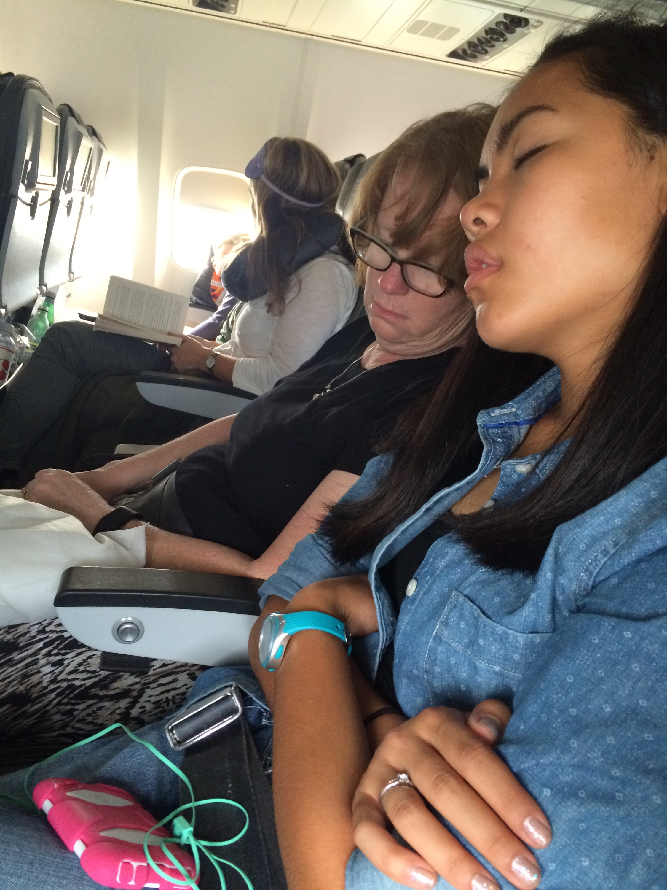

I am on an Icelandair flight right now writing this post. We are about an hour
and a half into the flight. We were able to check in online, so we ended up
being fairly early to the airport, but it gave us plenty of time to eat a lupper
(**Lu**nch/Su**pper**) at Panda Express. We are currently somewhere over the US
still but I don’t know exactly because the flight map is not working for me.
Right now I am waiting for the flight attendant to come and ask if we would like
drinks. Right now she is having trouble scanning a Discover card for the people
in front of us, so it is looking like it might be a while before we get our
drinks…

I now have some 7-up. Hannah is watching *The Hobbit: Battle of the Five Armies*
on the seat-back TV and mom is half sleeping, half watching a movie on her
tablet. I am writing this using my wireless keyboard which is really nice to
have. I’ve been using an app called Byword for writing. I am loving it so far. I
have a full review in the works which will be published someday :).

We have one or two little kids sitting behind us. One of them is kicking mom’s
seat. This is going to be fun… (not)

------------------------------------------------------------------------

*Note: unless otherwise stated, all times are in military/24 hr time with either
the 3 character timezone code or the city name.*

**23:19 MST, 5:19 in Reykjavík, Iceland (our layover destination), 7:19 in
Stockholm, Sweden (our final destination).**

I just got back from taking my contacts out. They were beginning to bother me. I
guess I should have waited to put them in until this afternoon right before we
left. On well, lesson learned. I’m really glad I had the stuff I needed to take
them out them. The other lesson I learned: when flying overseas, just expect to
loose a night of sleep.

On another note, I unplugged my iPhone at ~13:30 MST, it is now 23:42 MST and I
am still at 35% battery life. I even watched a 90 minute movie, enabled
in-flight Wi-Fi, and turned on Bluetooth to use my keyboard. I’ve also been
playing music for the entire flight. I’m impressed.

We are now 45 minutes from our destination according to the in-seat TV.  I’m
setting Music to play my favorites (I love the up-next feature in iOS 8.4) and
going to try and stop thinking about how much my bottom hurts.
