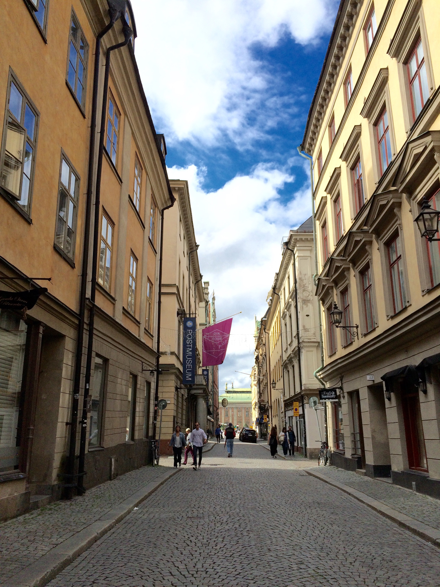
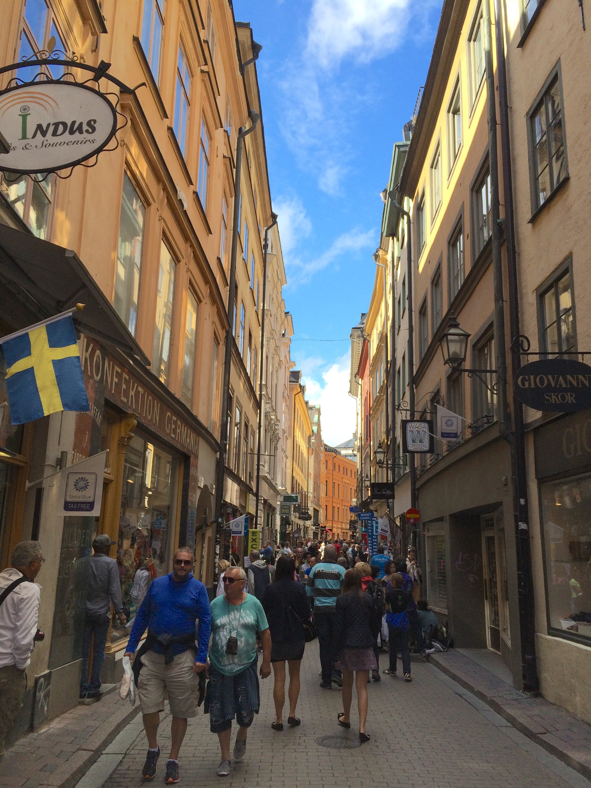
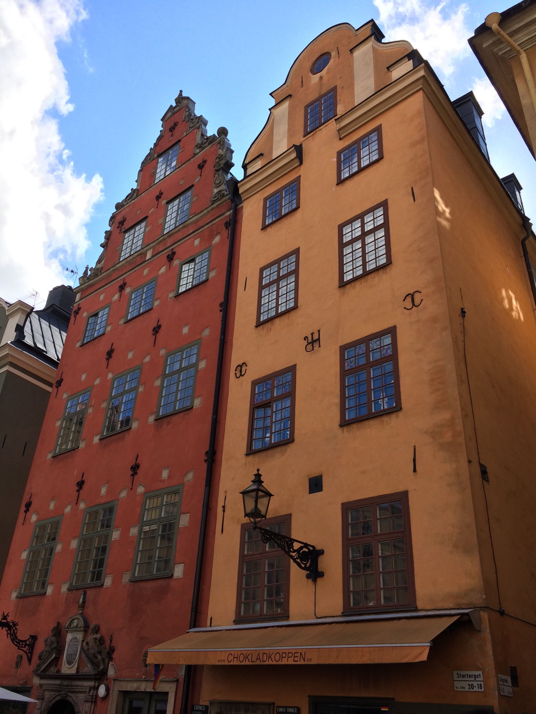
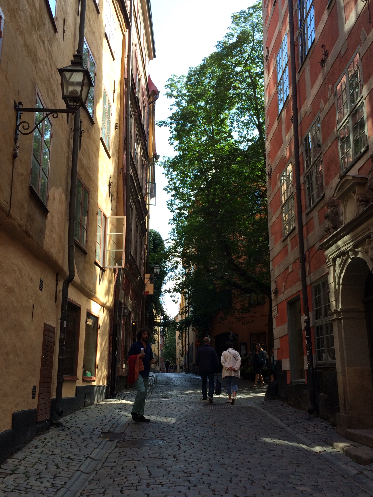
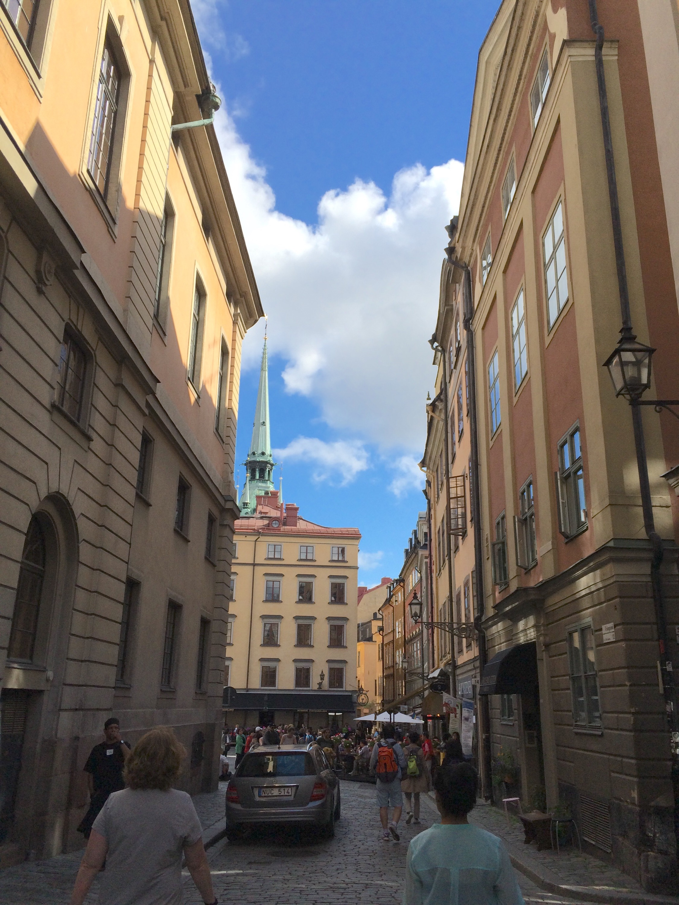

Today we embarked on our cruise. We woke up and had breakfast at the hotel and
then had the hotel staff order us a taxi to the cruise port.  The ride was fine
and went without an issue. To check in to the cruise ship, it's like airport
check in and security. We had to "check" our bags and at a little stand, it was
very easy because we’d already printed our luggage tags. Then we went into
another line to go through security. It isn't quite as rigorous as airport
security (we were able to take water bottles through) but it still took a while.
Then we got in a new line to get our key cards for the ship. After these three
lines (in total they took an hour or so) we boarded the boat. Then we waited
forever for the elevator. Eventually we made it in to an elevator and went to
the 11th floor where the Windjammer Cafe is. (The Windjammer is the lunch
buffet.) By the time we were done with lunch our stateroom was ready to be
occupied so we went to check it out and drop off our "cary ons". We then went
back into Stockholm for the afternoon.

------------------------------------------------------------------------

We rode bus \#1 into town and got off at the central station (I think we went
further than we wanted to, but whatever, we did pretty well considering
everything was in Swedish). Then we walked to the subway station. It was very
confusing getting in, because mom's Stockholm card was the only one that worked.
(The Stockholm card is a pass that allows you to use all of the public
transportation and gives you access to most of the major museums.) The lady at
the window said that we just needed to be let in manually. I think that maybe
kids are free or something, I don’t know. We had to go down a couple levels to
get to the correct platform, but we got on the subway without any issue and made
our way to Gamla Stan, the old town. It was a very short metro ride (only one
stop), but it was an interesting experience nonetheless.

------------------------------------------------------------------------

Gamla Stan is very pretty, almost Germanic-looking in places. I think pictures
speak louder than words on this, so here they are.

<table class="gallery" width="60%">
<tr>
<td colspan="2">

</td>
</tr>
<tr>
<td>

</td>
<td>

</td>
</tr>

<tr>
<td>

</td>
<td>

</td>
</tr>
</table>

We eventually made it to the Nobel museum, a museum about the Nobel prize and
some about Alfred Nobel himself. Although interesting, it was nothing to write
home about. I think that it would be a good museum to go to regularly as a
resident of Stockholm to learn about a few people each time. (The homeschooler
in me saw a "History of the Nobel Price" class.)

------------------------------------------------------------------------

We then headed to the Royal Palace, the residence of His Majesty the King.
Sweden is a monarchy, but the monarch has no political power. The Swedish
monarchy is one of the only monarchies to pass to the first born child
regardless of gender. As we arrived at the palace, the changing of the guards
was happening, so we watched that. Sweden is big on gender equality (we think
it's bad in America, go to Europe, it's even worse), in fact the LGBT "Stockholm
Pride" is going on in a few days. I'm so glad we're missing that. Anyway, all
that to say, two of the guards were female.

We then walked out to the stop for bus \#76 which would take us back to the
port. Unfortunately a bus was just leaving. Fortunately, there was another bus
that was to come in about 20 minutes. Thirty minutes later, no bus had arrived.
We decided to try and go to the \#1 bus which also goes to the port. As we were
walking away, the 76 bus finally arrived at the station we were just at.
Fortunately for us, it was coming to the stop that we had walked to as well. We
rode that bus for a while but then the driver told us all to get off and go to a
different bus because the one we were on wasn't working properly. After boarding
the other bus, things went smoothly.

------------------------------------------------------------------------

At this point it was like 17:50 and our dinner reservation for each night is at
18:00. After franticly getting ready for dinner, we walked down to the dining
hall and then wandered around trying to find our table (we have reserved seating
so we are at the same table each day). The tables seat multiple parties, and we
had another family at our table. The parents were very nice, but their children
were, how to say this without offending anyone... annoying. Ok, maybe that
offended someone but we aren't going to be giving that family our blog address
so hopefully they never see this. They are a military family (he is a dentist in
the army) stationed on a base outside of Munich, Germany. It would have been
fine if it was just the parents, but the kids made it... shall we say,
interesting. They were 2 and 4, and all over the place.  The little girl had an
alligator toy and was sticking it in her water glass, both of them were under
the table kicking us, it was... an interesting experience. It wasn't terrible,
but we won’t be sitting with them again.

After dinner, we headed to our room to organize the mess we created trying to
get ready for dinner. When we had finished, we went up to the teen room, *Fuel*,
to meet the group there. As with the cruise population itself (which I will
mention later on as well) the teen group is very diverse. There were two boys
who were cousins from Israel, a few Canadians and Americans. The leader is from
Columbia. A few minutes after we arrived, we started a game of spoons. I made it
to the round of 4. Then, at 22:00, we went to the sports deck to play dodgeball.
It was a bit wet as it had rained earlier in the day, but it was good exercise
and a lot of fun.

After that, Hannah and I headed down to the room to go to bed.

Tomorrow, we set sail for Helsinki, Finland at around 16:00. After that, we go
to a new port almost every day (excepting 3 nights in St. Petersburg).
