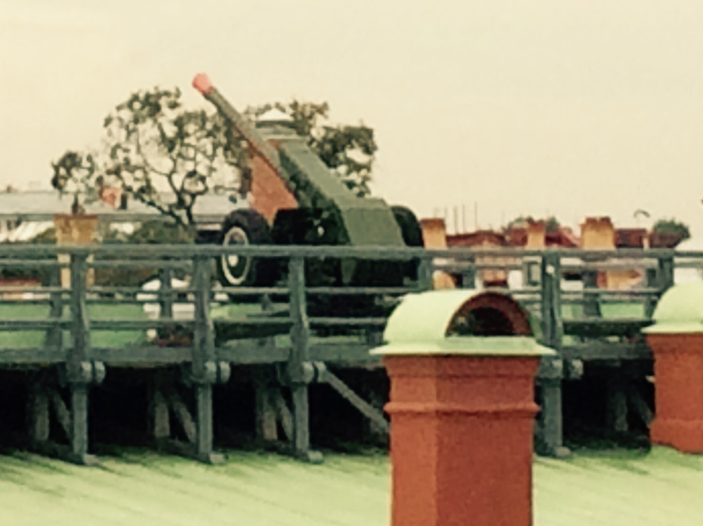

The stereotypes are true. Russia was pretty much as I expected.

If you like Russia, Putin, Socialism, Communism or Obama (specifically his
foreign policy or, really, lack thereof), you should probably not read my posts
about Russia.

When we looked out into the city from the 11th deck where the Windjammer Cafe is
the buildings (they were a kilometer or so away) just screamed communist block
housing. They were tall, white, ugly buildings made out of cement. It appeared
that they were still making apartments like that in the area because we saw one
under construction.

We had to go through customs to get out of the port and I was worried that the
passport control agent would be very strict. I think we got the nicest Russian
border agent. She spoke very good English and was very friendly, friendlier than
passport agents in the States. I’m thinking that she is the exception, not the
rule, because when we came back through, the lady was much more legalistic.

We met our guide outside the cruise terminal. Her name was Maria. Then we headed
to the van and met the driver, Mitri. We drove towards the city and she
explained some of the sites as we went.

.. note::

   I am going to try and write semi-chronologically about are time in St.
   Petersburg, but I am going try and group information together more than on my
   other posts.

   These facts may not be entirely accurate. They have come through a guide and
   then through my brain so that is two points of failure.

St. Petersburg is built on ~40 islands and was founded by Peter the Great, Czar
of Russia in the 1700s. It is the second largest city in Russia next to Moscow
and has a population of about 5 million.

Our guide described it as "the most western Russian city". I don't have anything
to compare it to, but it seemed fairly Russian to me. As we drove, we saw a
squadron of police in wool-lined raincoats passing by.  It's an entirely
different attitude to America where it seems that we try and hide our law
enforcement because it might be "offensive". We also passed a warship (I think
it was a battleship) and two submarines docked in the bay. I don't think any of
them are serviceable, but it was so Russia.

It began as a fortress which we went to later on in the tour and grew out from
there. Our guide pointed out the Czar's winter palace that now holds the
Hermitage Museum. It was very large, and we couldn't even see it all. At one
stop in a square with a statue of Nicolas I, we saw the palace for the Czar's
daughter, Maria. It is said that she only spent one night in it because she did
not like that the statue of her father was facing way from her palace.

We went inside the fortress and to the church inside. It was the church where
many of the Russian Czars were buried. Everyone from "Someone the Great" to
"Someone the Terrible" were there. We asked her how the Czars and the Soviets
were looked at by modern day Russians and she said that "it is history, we just
think of it like history". That was very telling, I don't know if she speaks for
the majority, but it was similar in Vietnam as well. In Vietnam, most people see
the Vietnam War as just history.

As we exited the church, it was about 12:00 and there is a cannon that is fired
at noon every day from the top of the wall. We got a good vantage point of the
firing. Unfortunately, I didn’t get a good picture of it being fired, but later
I got a picture from a better vantage point. I doctored that one up to make it
look as sketchy as possible without totally obscuring the image too much. Here
it is

We walked along the top of the fortress walls which overlook a bit of the bay.
(It doesn't seem like there is a bay because there are so many islands, but it
is part of the Baltic Sea. By this time it was lunchtime. We went to a small
cafe which specialized in "pies" (Cheburek in Russian). I didn't take any
pictures of my food because I'm not an Instagramophile, but I think my mom got
some pictures so I will try and post them someday.

After lunch, we went to the Artillery museum. The first room we went into had a
variety of missiles from the early 1800s to the Soviet era.  They had a display
with rockets like the ones used in the War of 1812 and where we get "rockets red
glare, bombs bursting air" in our national anthem. They had upwards of ten
missile launcher trucks which were kinda cool. They had a display about the
rocket that took down the famous US spy plane during the Cold War.

In another room featured cannon without explosive shells. Interestingly, the
United States Civil War was the last war in which these types of cannon were
used. There wasn't anything extremely special about the cannons, but one was
interesting to me. It was a small cannon, the barrel was about 30 cm (1 ft) long
and was 26 cm in diameter. It was a gift to some Czar prince and was used to
shoot vegetables, much like a potato cannon except with real gunpowder and much
more cannon-looking.

There was also a room with armour from various periods. It wasn't as interesting
as the rest of the museum so I won't describe it in depth.

At this point, the group split up. I went with Sebastian and Tom (Mr.  Coco)
back to the boat. Mom, Hannah, Mrs. Coco and the twins went to a metreuska doll
factory and decorated metreuska dolls. You can probably read Hannah's post for
more info on what they did, but I will post a picture of their creation here.

When we arrived back at the cruise terminal, we had to have our passports to go
through customs. Unfortunately for Sebastian, his mom (who was painting dolls)
had his passport so he had to stay outside of customs. I made it through fine
because mom had given me my passport.

The rest of the day proceeded much like previous days so I will not describe it
here.
