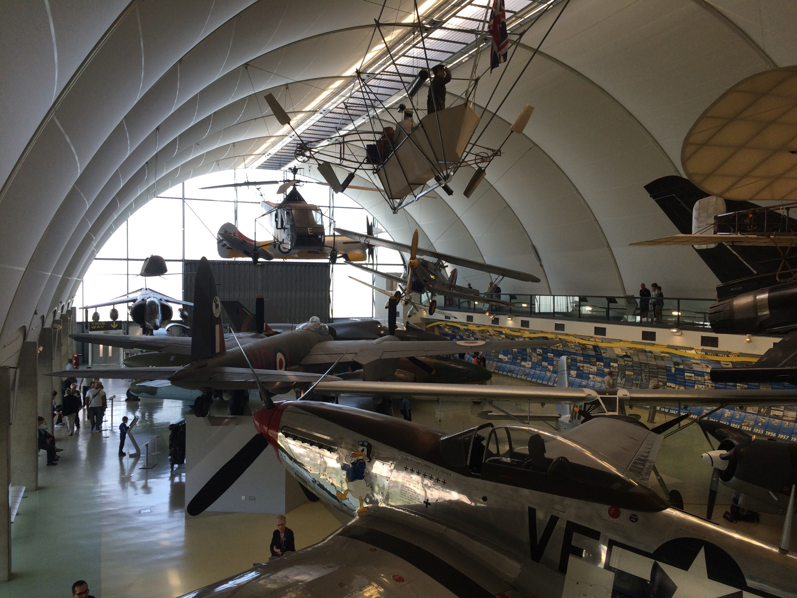

We started the day by going to the Royal Air Force Museum. It took a while to
get there because we had to get off the underground and walk a little ways and
then get on a different line and go for another while.  Then we had to walk for
about 15–20 minutes to get to the actual museum.  The museum consisted of four
large buildings with lots of planes.  **Lots** of planes.

The first building had displays on a variety of aircraft and their contribution
to the advancement of aviation. They had everything from Spitfires to Lockheed
Martin multi-purpose, supersonic war planes, dirigible cockpits to vertical and
horizontal takeoff airplanes.

On one of the walls, there was a large display outlining aeronautical
advancements each year from the start of the 1900s to 2001. It was very
interesting to see how fast the aeronautics industry advanced. The moon landings
were only about half of the way down the wall. During the two World Wars,
aeronautics went from slow, rather flimsy biplanes to jets capable of flying
300+ mph and enormous bombers like the B–17, dubbed the "Super Fortress".

We then walked to yet another huge hangar filled with airplanes.  (Actually, I
think it was two hangars put together, but that's beside the point.) I really
enjoyed seeing all of the WWII fighters and bombers from both the Axis and the
Allies. They also had some really cool (relatively) modern fighter-bombers on
display. I can't describe everything to you, there were at least a hundred
planes on display with descriptions of each one, and often additional displays
detailing various aspects of the plane from gun turrets to engines. There was an
entire section dedicated to helicopters, old and modern. There were a lot of
planes. I'll try and give you some of the highlights.

-   There was a video about the Dam Buster raids done by the RAF during WWII.
    The goal was to destroy some German dams and take out industrial facilities.
    The dams that they wanted to "bust" had defenses around them to prevent
    torpedo attacks, but the Dam Busters used "bouncing bombs" to skip over the
    nets and breech the dams.  Look it up, it's very interesting.

-   They had some of the first jet engines developed by the Germans during WWII
    on display.

-   Some (relatively) contemporary guided, air-to-ground cruise missiles were
    displayed. They were used during the Gulf War if I'm remembering correctly.

There were just so many planes it would be nearly impossible to describe them
all to you (and you probably wouldn't want to hear about each one).  I will tell
you that I had a great time seeing all of the planes, especially the WWII
fighters and bombers.

------------------------------------------------------------------------

We then made our way back to London. We went to the Charles Dickens Museum which
is located in his former home. It was a beautiful Victorian home with many nice,
antique pieces of furniture. Charles Dickens wrote many of his books in that
very house. We went to the RAF Museum mainly for me, but the Charles Dickens
Museum was mainly for Hannah since she is a big fan of his books. I appreciate
his literary contributions, but I am not as big of a book worm as her. It was
neat to see his home though.
