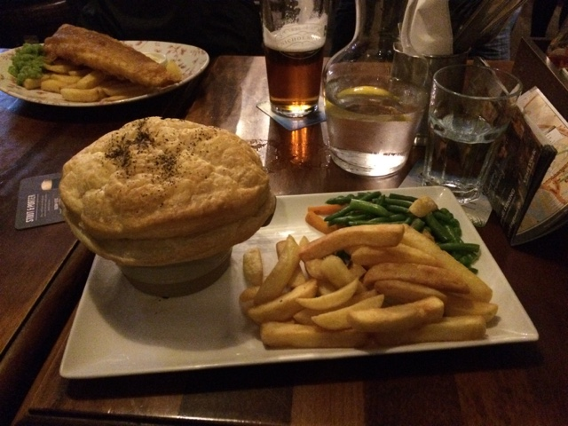
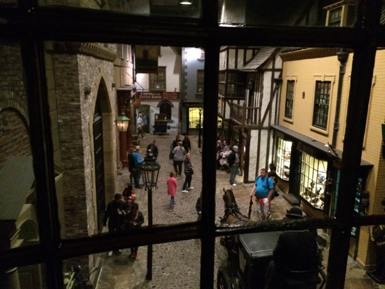

Today we went to York, our furthest day trip so far. It took two hours by
express train (120 mph I think). The other trips we've made have been on much
slower trains with more stops.

We began by going to a museum on the history of York. The area around York is
full of fossils from various small snail-like sea creatures.  There were a few
rooms dedicated to the dinosaur age with lots of evolution junk that didn't
really have to do with York

Then it moved to the Roman history of York. The Romans built fortresses in the
area and it soon became the "capital of Northern England". In fact, Emperor
Constantine was coronated in York. He was stationed there with the Roman Army
when his father died. I thought it was interesting that the Roman Empire had
such influence so far from Rome itself. I guess I'd always thought the Roman
influence in Britain was just a few military outposts with predominantly self
ruled surrounding areas.

York became a Christian religious centre under Constantine who made ended
persecution of Christians across the Empire and made Christianity the state
religion. During the Middle Ages, York continued to be an important city. It had
a castle, a Catholic Cathedral and an Minster during this time. The Cathedral,
along with many other buildings deemed as "too Catholic", were destroyed when
England separated from the Roman Catholic church. The Minster was saved for
reasons which have been lost in the cracks of my brain.

------------------------------------------------------------------------

After the museum, we walked to the minster. The best way to describe it is
"Westminster Abbey without all the tombs". It was an enormous Gothic structure.
I was able to really appreciate the beauty of the building because there weren't
any tombs in the way.

One interesting thing is that the Minster contains over half of the medieval
stained glass in the world. Unfortunately, they are currently restoring the main
window located behind the High Altar. That window is the largest surviving
expanse of medieval stained glass in the world.

------------------------------------------------------------------------

We then walked into the centre of town and had lunch at an English pub.  I had a
chicken and mushroom pie. It was served in a bowl and there was a huge puffy
top. I actually took a picture of it, so here it is.

------------------------------------------------------------------------

After lunch we walked down the Shambles, a famous street in York. It was named
that not because it was in shambles. Rather, it was derived from an Old English
word which had to do with the type of shops on the street

------------------------------------------------------------------------

We continued walking down to the old York castle. Inside there was a
reconstruction of the town during the 1800s with displays of various goods of
the time. It was very similar to what York is like today (except there aren't
any horse-drawn carriages anymore).

------------------------------------------------------------------------

We were all tired so we headed back to the train station to go back into London.
The train ride went fine until the driver came on the intercom and said that the
train had a problem so we had to stop at the next station and transfer to a
different train. While we waited, a different express train went by the platform
at ~110 mph. It was there and then it was gone. There was a blast of air as the
train passed. Anyway, we got on the next train and made it back to London
without any issues.
