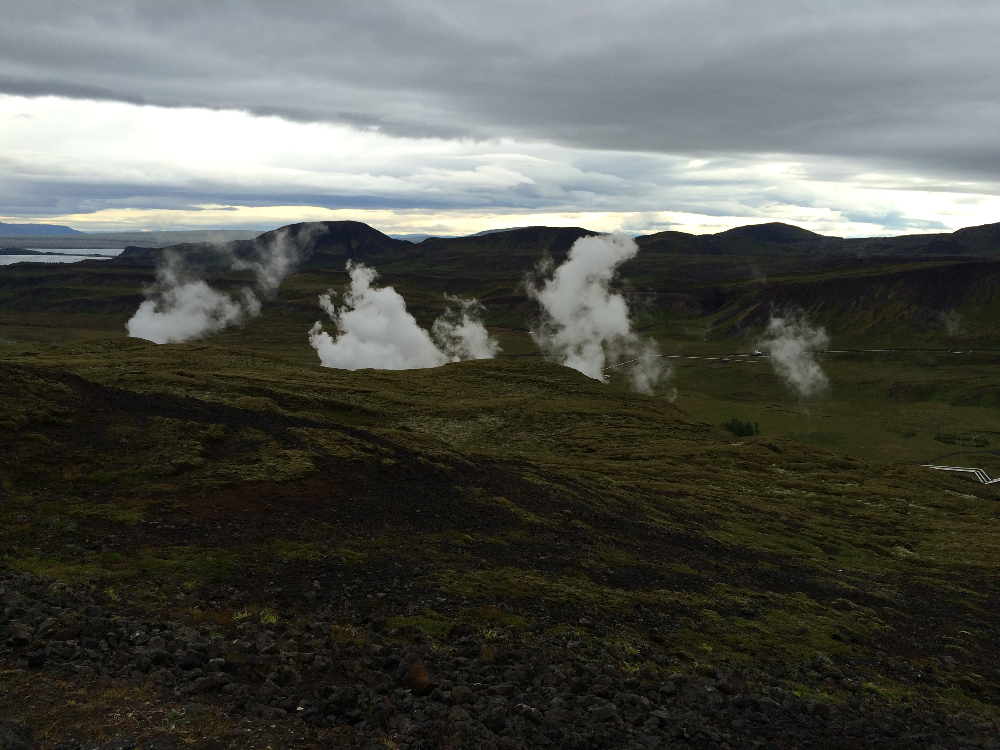
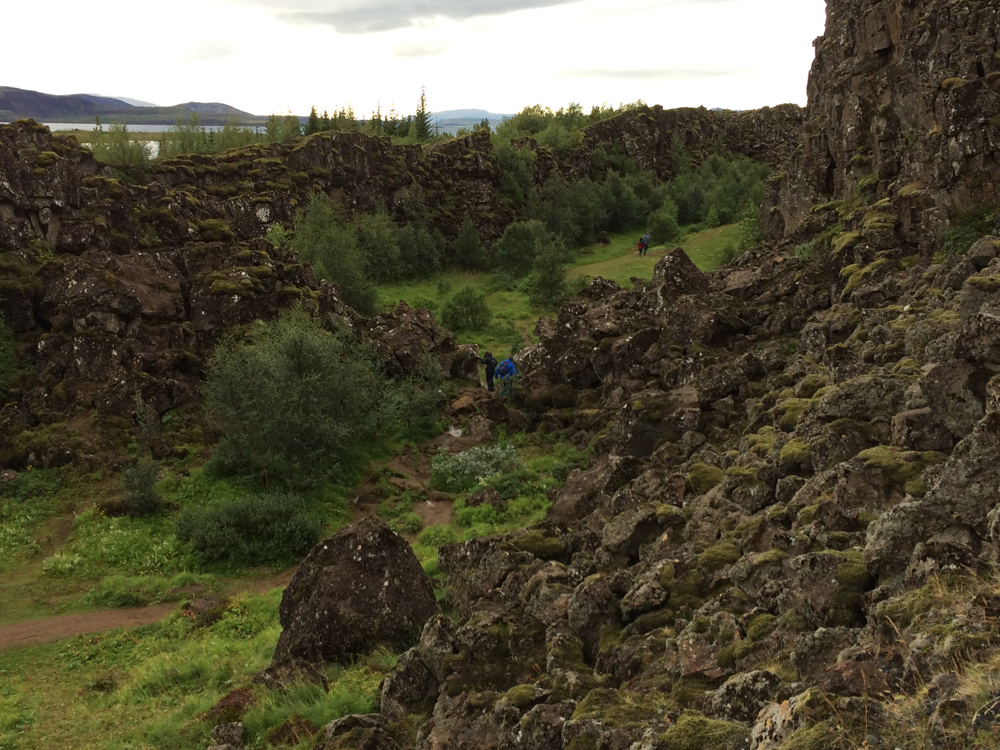
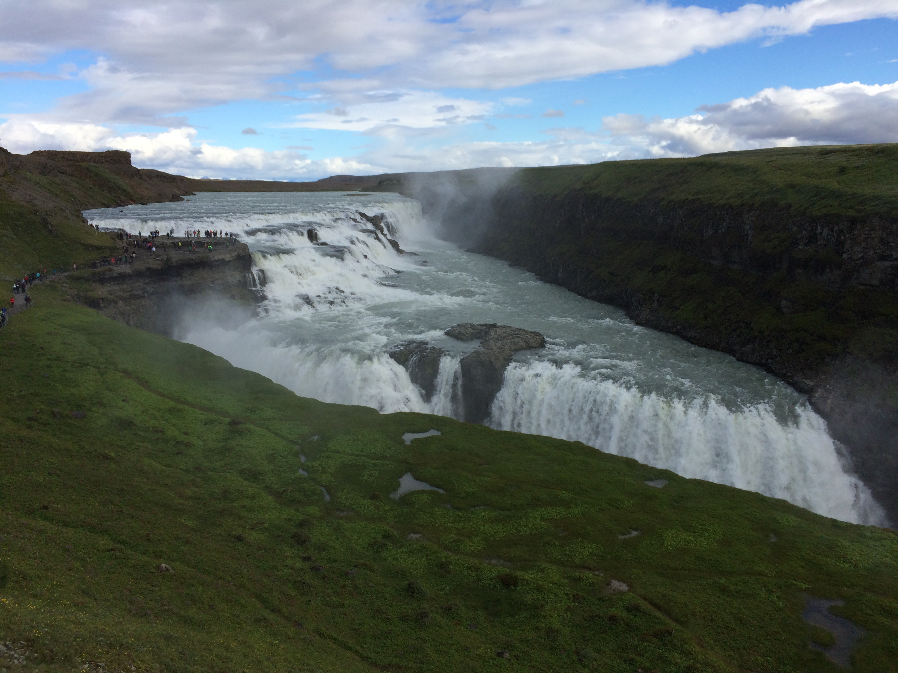
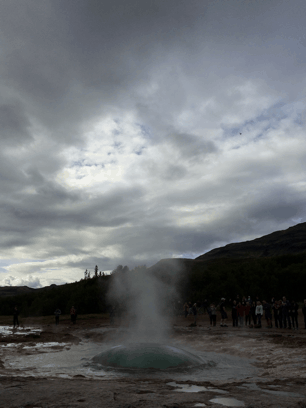

Today we did a tour of the Golden Circle, the main sites in the southwest of
Iceland. Getting to the bus terminal was a bit interesting.  We were driven by
the grandpa of the family from the hotel to some apartments. Then we were picked
up by a minibus from the tour company which took us to the main terminal where
we boarded a larger tour bus.

Our guide’s name was really complicated, but her nickname was something like
Appa, like Abba. I don't know, Icelandic is really difficult. I'm going to give
you a brief overview of our tour and then let the pictures do the explaining.

We drove through some beautiful countryside and then stopped at an overlook
where we could see steam from geothermal vents. These vents are abundant in
Iceland since it is a volcanic island. Of course, the evolutionists believe that
it was formed millions of years ago, I postulate that it was formed during the
Flood. I mean, the Bible does say that the “fountains of the great deep burst
forth” (Gen. 7:11 ESV).  Anyway, back to what we did.

We continued driving through beautiful scenery and after about an hours ride, we
stopped at a place near a large lake. This location was the seat of government
for many years. Iceland has had a tradition of democracy almost since the first
settlers arrived. They have one of the oldest parliaments, founded around the
year 1000 AD. They met at this location up until sometime in the 1700s. It was a
very beautiful place. Our guide said that some of the *Game of Thrones* TV show
was filmed close by. (I'm not saying this because I watch/endorse *Game of
Thrones*, I just had already thought that it was a great place for film and she
confirmed that when she mentioned *Game of Thrones*.)

We then rode to a beautiful waterfall, the biggest in Iceland (I think).  At
this stop we also ate lunch. Mom and I both tried the traditional Icelandic lamb
soup. I thought it was pretty good.

Then we rode to the Geyser area. The first recorded discovery of a geyser was
the main geyser in the area. It was named Geyser and all other geysers are named
after this one. The big geyser does not spout consistently. When some tectonic
activity occurred earlier this year, it did spout, but only for a few days.
Before that it hadn't spouted since the early 2000s. There was a smaller Geyser
~50 metres away that does spout fairly consistently. It is not like Old Faithful
in that it doesn't spout on a set schedule. We had a treat when we got there
though because it spouted three times in a row. Our guide said that's very rare.
We watched it spout a few other times as well. I was able to get a burst photo
of the water.

<a href="./images/iceland-geyser.gif">
   
</a>
Geyser

There was also a small pool that was so clear that you could see down into the
underground tunnels. One right beside it was a very pretty deep blue color.

We then drove to the religious centre of the country. There is a small church at
this location, and a church has been there since around the year AD 1000 when
Iceland became Catholic. During the Reformation, Iceland became Lutheran and
even today, most Icelanders consider themselves to be Lutheran. Unfortunately,
today not many Icelanders attend church regularly.

The last location on our tour was a geothermal power plant. It is a very new
plant. I believe it became operational sometime within the last decade. It
serves two purposes: 1) generating electricity for Reykjavík and 2) heating
water to send to Reykjavík. They drill down about 2000–3000 metres into the rock
where they extract superheated water.  This water is heated by magma and can be
up to 300 ºC (572 ºF). This is then pumped up to the surface and the steam is
separated from the water.  The steam is used to turn the turbines and generate
electricity. The hot water is used to heat up cold water (which is pumped from a
much higher level in the rock). This water is heated to about 88 ºC (190 ºC) and
sent to Reykjavík. The cold water is also used as the liquid in the condensing
chamber where the steam from the turbines is turned back into water. This also
preheats the cold water so that it takes less energy to heat it up to the 88 ºC.
The hot water that is used to heat the cold water and the condensed water from
the turbines is pumped back into the ground where it cycles back through.

As we rode back into Reykjavík, our guide sang us a traditional Icelandic love
song. She has a very good voice and in addition to being a tour guide, she is an
actress.

After the tour, we all agreed that it was a blessing that mom's drivers license
had expired. We'd have been so lost if we'd done it alone. And also, mom
wouldn't have been able to see the scenery and we wouldn't have had the
commentary from the guide. Overall, it didn't seem like a huge bus tour. The
guide told us about the places we were going to see as we drove in the bus. Then
she let us go and see the sites ourselves and met us back on the bus to take us
to the next site. Of course, she was available to answer questions, but we
didn't feel like we were in a huge group.

------------------------------------------------------------------------

Our transportation back to the hotel was rather interesting as well. We pulled
over on a wide shoulder and got out of the big bus and transferred to a minibus
which took us back to the apartments where we'd been picked up in the morning.
Then we called the man from the hotel and he came and picked us up.

------------------------------------------------------------------------

Dinner was very good as well. We had tomato soup (I didn't like it as much as
the broccoli, but it was ok), chicken, rice, corn, and salad. It was a simple,
homemade meal, but very filling. One funny thing was that the man who'd taken us
to and from the apartments took some of the food from the dishes as he passed
by. (The food was laid out buffet style, but we were the only people eating.) He
casually grabbed a piece of the salad as he walked by once and another time he
spooned some corn into his hand. We were very amused about that.

------------------------------------------------------------------------

We then tried to organize some of our things to make packing easier tomorrow.
Our flight is at 4:45, but we are going to have to figure out airport
transportation. It's hard to believe, but we are going home finally after a
month abroad.
