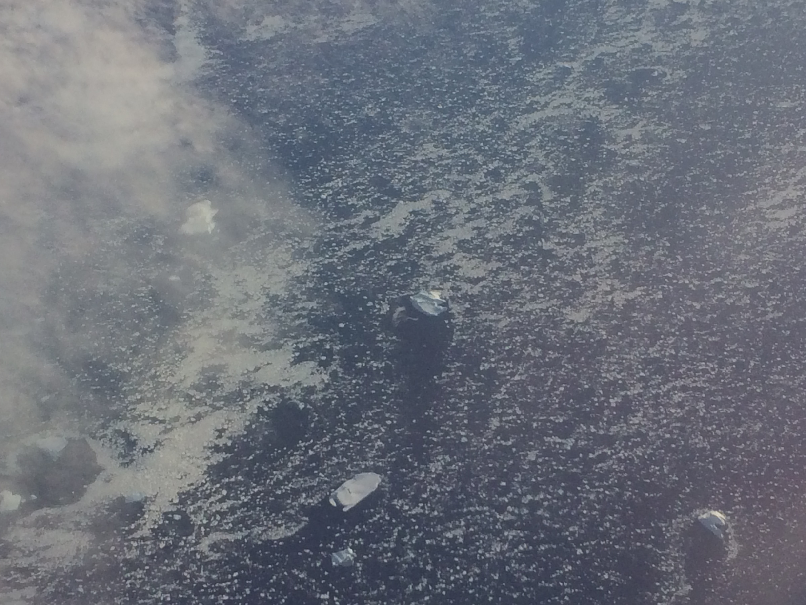
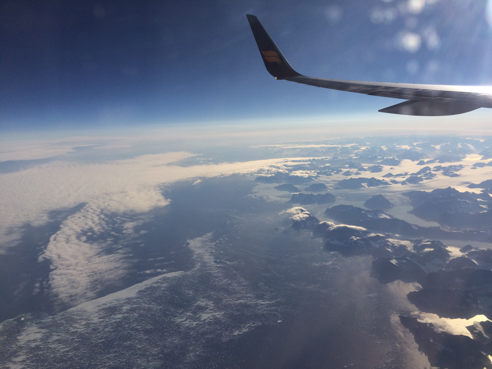
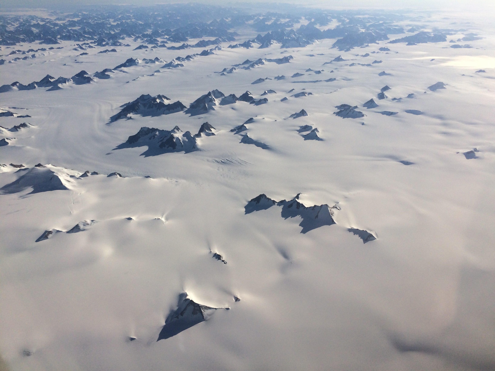
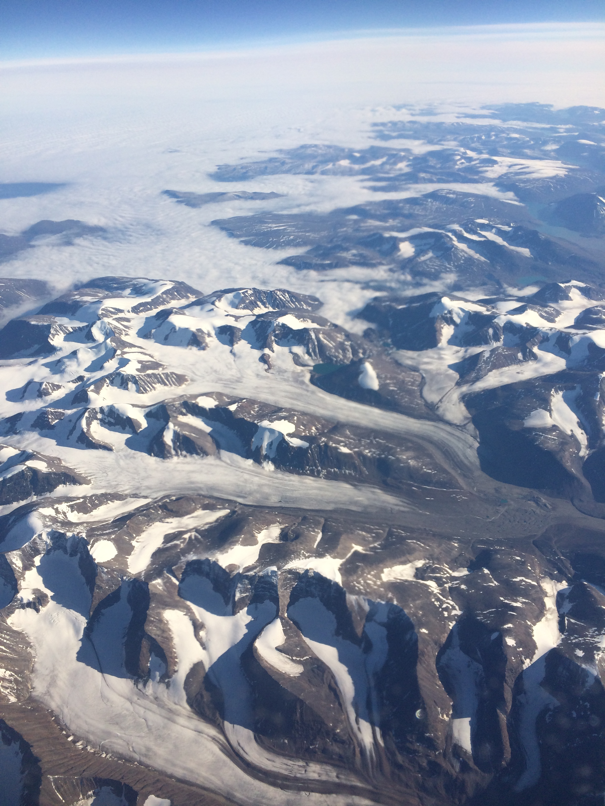

**Somewhere over Northern Canada:** I am in the plane right now and just got
caught up on all my blog posts. Transportation to the airport was fairly easy.
The man who took us to the apartments yesterday took us to the bus terminal
where we caught an airport shuttle to Keflavik International. Unfortunately, our
flight was delayed an hour because the plane was delayed arriving. We walked
around the shops and ate lunch just to kill time. We also bought food for the
plane. We have a driver set up to pick us up from Denver International Airport
so I'll assume that that will work out fine.

Right now we are flying over northern Canada. We flew over some of Greenland on
the way and now we are approaching the Hudson Bay. It was a great way to see the
terrain of Greenland. Even one of the flight attendants thought it was cool
(normally the ground is obscured by clouds). The middle of Greenland is
basically one huge glacier. It was very impressive, all I could see out of the
window was white up to the horizon in all directions (some of the white was
clouds, but not much of it). I'll post some pictures of the terrain here.

------------------------------------------------------------------------

We just passed over Bismarck, North Dakota, USA. It's been really turbulent all
the way across the Canadian plains. The seatbelt sign has been on basically
since we reached mainland Canada. Thanks a lot Canadians. They are coming
through with drinks now that the turbulence has stopped. I'm pretty sure that's
the most turbulence I've ever been in (or at least that I can remember).

------------------------------------------------------------------------

It's been a hectic trip, but it was totally worth it. I'll be posting some
reflections on the trip on my personal blog:
[sumnerevans.com](https://sumnerevans.com) so be sure to check that out.

**Note: Here are links if you are interested:**

* [Reflections on Trip 1]()
* [Reflections on Trip 2]()

So with that I will conclude my discourse on the events of this trip. I hope
that you've all enjoyed reading and please do check out my reflections on the
trip. They'll probably be profound.
