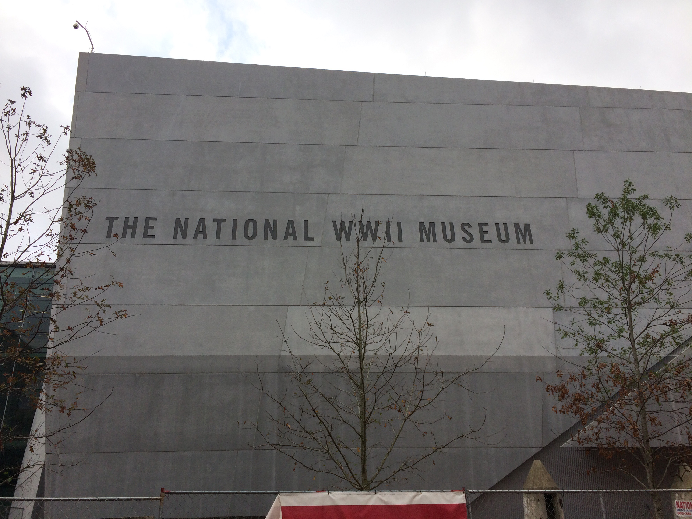

Today we spent the entire day at the National World War II Museum.

There were three main exhibits: an exhibit about the European Theatre of the war
and an exhibition about the Pacific Theatre of the war and an exhibit with some
WWII planes. Overall, it was a good comprehensive overview of the war. My
writing skills can do it no justice so I won’t try. I also didn’t take many
pictures, so there won’t be much to this post besides a recommendation to go to
this museum.

Tomorrow we are boarding the boat for our Caribbean Cruise. There is limited
Wi-Fi on the boat so I will have to wait to post until I’m in port (which will
be most days).
