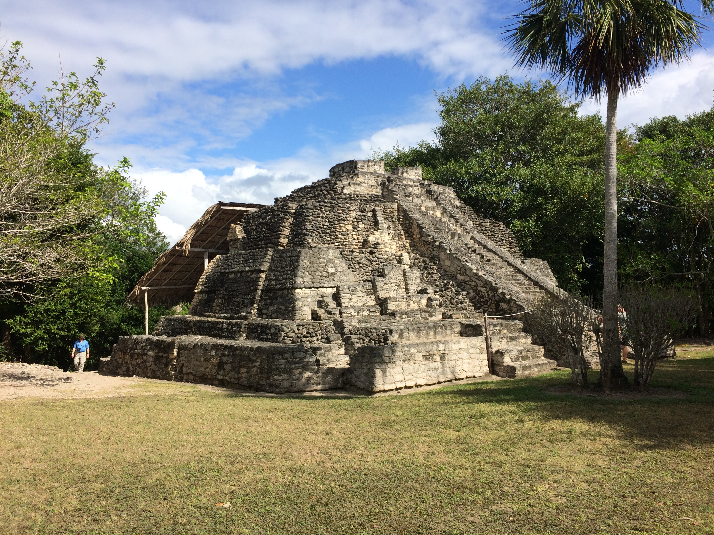
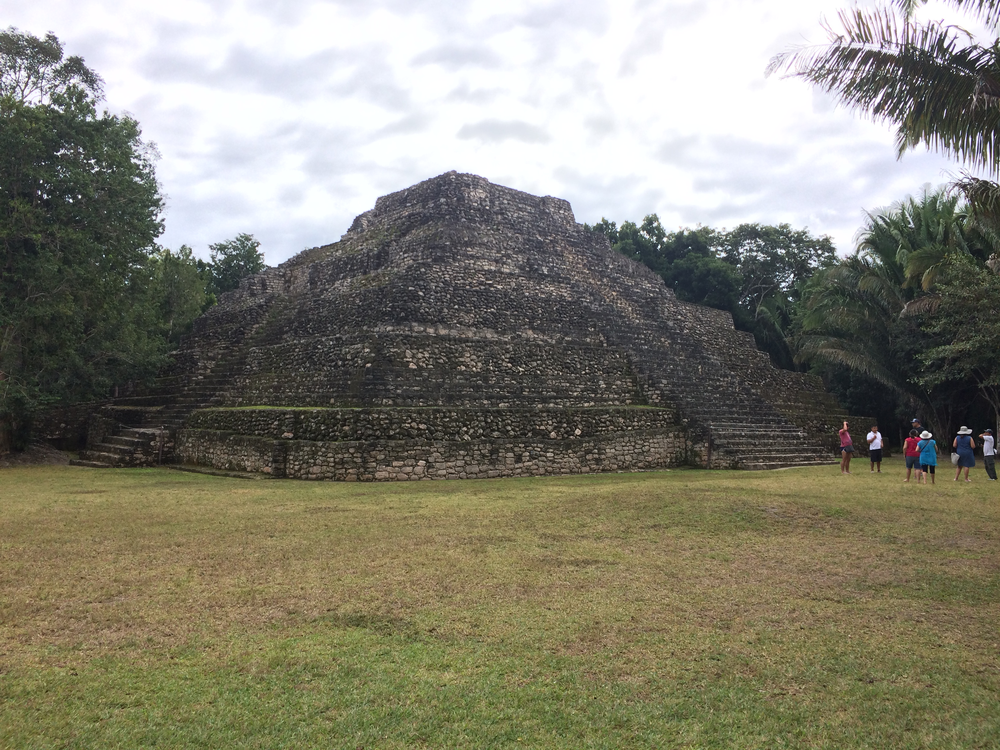
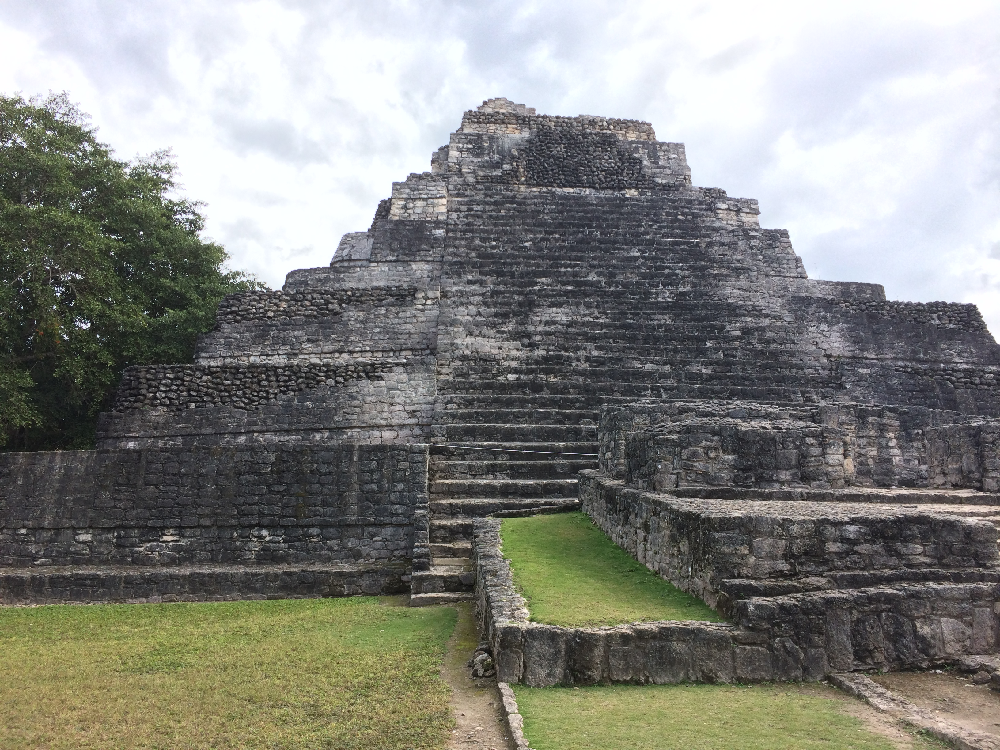
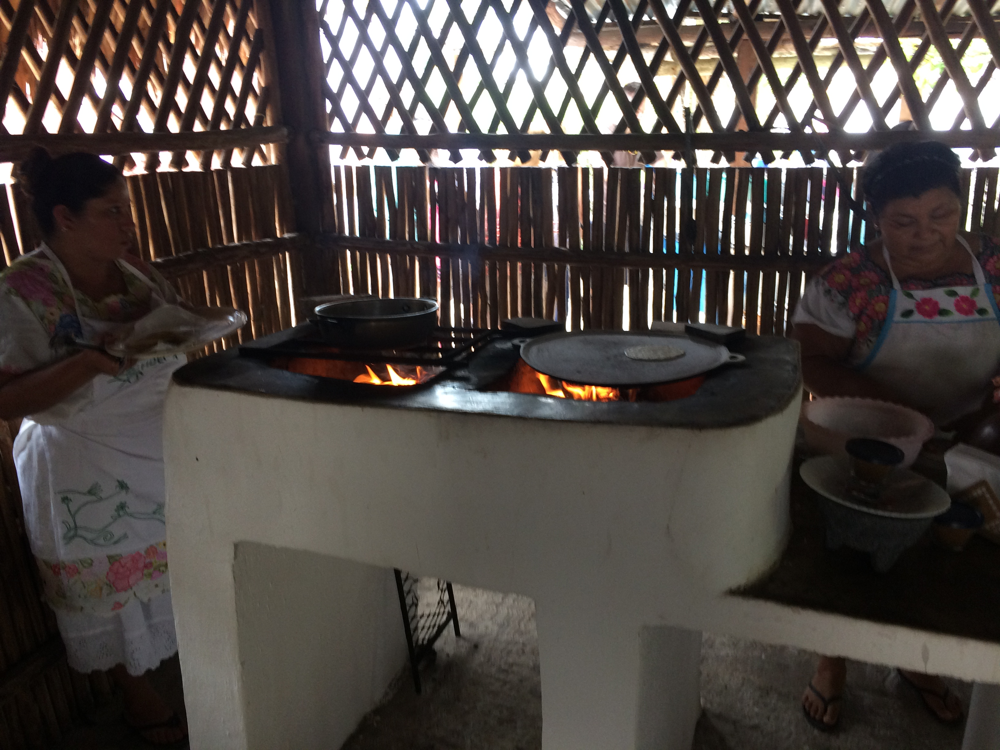
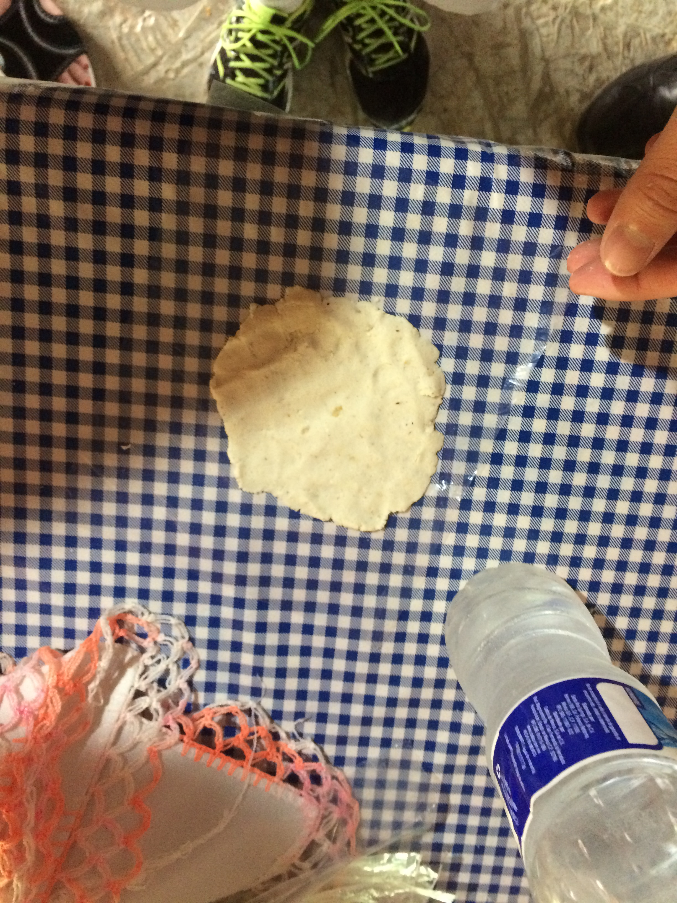
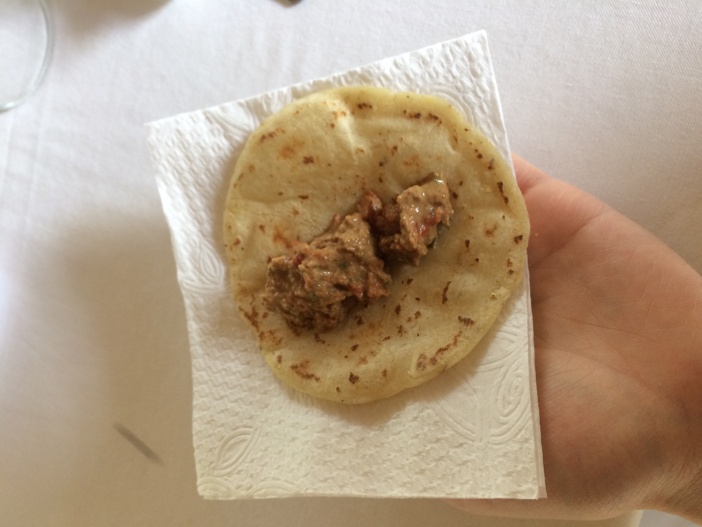

Today we were in Costa Maya, Mexico. (Yay! Another country on my list of "been
there's".) Costa Maya itself is not a very big town and the only industry is
tourism. It consists of a cruise pier, a multitude of shops where locals set up
to sell to the tourists from the cruise ships, and a few houses. The Mexican
government is (trying) to develop the area into a large tourism city to compete
with the Caribbean ports, but it definitely isn't there yet.

Native Choice, the company we did our tour with, was located a few blocks away
(most of the blocks are actually just open lots overgrown with vegetation where
the government wants to develop). The tour we did went to some Mayan ruins and
then to a modern Mayan family's home.

# Mayan History

I'll start with some background information about the Mayans that I learned
today.

The Mayans are believed to have come over the Bearing Straight at the very end
of the Ice Age. The Maya are related to the Eskimos in Alaska as well as the
Mongols in Asia. We know this because the Maya, as well as the Mongols, share a
birthmark called the "Mongolian Spot". (I would assume that there has been gene
analysis to confirm this as well.)

Evidence of the Mayan peoples' existence begins in 1200 BC. The Mayan Culture
peaked between 200 AD and 900 AD and the Maya still exist today; they have not
disappeared as is a common misconception. The Maya live primarily in the Yucatán
Peninsula. The Yucatán is primarily composed of limestone, so there are no
rivers in the area, all of the water percolates through the ground to form
underground rivers and caves. When the Spanish came to and colonized the
Americas, they basically skipped all of the Yucatán Peninsula. Since there are
no rivers in the area, the Spanish assumed that there was no source of fresh
water in the Yucatán Peninsula. The Maya, however, had other sources of fresh
water: underground rivers which are exposed in places where the cave ceilings
have fallen in. Because the Spanish skipped them, the Maya were conquered after
the Aztecs and Incas.

The Maya were organized in city-states, much like the Ancient Greeks and Europe
during the Medieval. Wars were primarily fought over resources and trading
routes and marriage to form political alliances was common.  Our guide quipped
"they had the same solutions to the same problems as *Europeans of the same
period* did".

# Mayan Religion

The Mayan religion was a polytheistic religion where, much like the Ancient
Greeks, everything had a god. There was a sun god, a god of harvest and
childbearing, a god of commerce and war, etc.

## Mayan Creation Account

The Mayan religion's creation account has many parallels with the
Judaeo-Christian creation account. As I describe the Mayan creation account, I
will point out some of the similarities that I see and that our guide pointed
out in italics.

The Maya believed that the Earth was created by the gods in 3700-ish BC.  *For
Young Earth Creationists like myself, this points to a general knowledge among
the ancient people that 1) a higher power created us and 2) it was fairly recent
as compared to the evolutionist's creation account.* In the first creation, the
gods created people from clay.  *This is similar to the Judaeo-Christian account
in Genesis 2:7 where God created man from the dust of the ground.* The people
made from clay did something bad (I don't remember exactly what) and were
destroyed in a flood. *This seems like a mix between the expulsion from the
Garden of Eden (Genesis 3) and the worldwide flood of Noah (Genesis 6:9-8:22).*
The gods then tried again and made the people from something else (I don't
remember what, exactly). These people did something else bad and were destroyed
by fire. *There are similarities to the destruction of Sodom and Gomorrah in
Genesis 19:23-29.* There were another creation which was also destroyed, but on
the fourth creation, the gods got it right and made the people from corn
(maize). To the Mayans, corn is the most important crop.

## Mayan Perception of Heaven and Hell

The Maya believed that four minor gods held the heavens above the earth and that
above that was a type of "heaven" (they didn't call it that, but that's
essentially what it was) and below the earth was a sort of "hell"/underworld (I
don't remember what, exactly, they called it). The Mayan people believed that
their temples (I'll talk more about them later) were portals to communicating
with the gods in heaven.

## Mayan Social Structure

The Maya had a caste system similar to the Indians. Like the Indian caste
system, you could not move up the ladder, you were born into one caste and
stayed there. The noble caste was seen as demigods by the common caste and the
commoners saw it as their duty to serve the nobles.  The noble caste survived by
taxation and trade. The nobles also were the religious leaders in the Mayan
culture. Only the nobles were allowed to go up to the top of the temples.

## Mayan Temples

As described earlier, the Maya had a concept of Heaven so they built elevated
areas to build their temples on. At Chacchoben, the site we went to, the
elevated area was about 110 metres (360 ft) square and looked to be about 10
metres (32 ft) high. On top of the elevated areas, the Maya build their temples.
The temples were pyramid structures, but unlike the Egyptian ones the Mayan
temples were not pointed at the top, they were "cut off". On the cut off
portion, the Maya built a small room where they did ceremonies and sacrifices.

Each temple was dedicated to a single god. For example, there was a temple to
the sun god and the harvest god. If something really bad happened in the realm
of one god, they moved the ceremonies to the main temple which was also the
largest temple and had huge ceremonies. For the most part, the main temple was
where the human sacrifices occurred, so if the celebrations moved to that
temple, it was almost guaranteed that there would be some human sacrifices.

<table class="gallery">
<tr>
<td colspan="2">

</td>
</tr>

<tr>
<td>

</td>
<td>

**The main temple**

</td>
</tr>
</table>

# How we Know This Stuff

The Mayan people kept very detailed chronicles of their history on paper. These
histories described the Mayan way of life and chronicled the scientific
discoveries that they made. When the Spanish came, however, the Spanish
Inquisition was in full force. Anything not specifically endorsed by the
Catholic Church was "against God" so they burned all of the Mayan history.
Imagine the knowledge that was contained in those pages. (Rabbit trail warning:
the same can be said of the books held in the library at Alexandria.)

This is one reason that the Mayan history is not as well known as the histories
of many western civilizations which carved their histories in stone and the
paper writings that they made were better preserved (thanks in part to the work
of the Ancient Islamic Empire).

Four books survived the Inquisition and the elements and a number of stone
tablets also were preserved. From these along with archaeological findings,
archaeologists and historians have reconstructed a sliver of what the Mayan way
of life was like.

Rabbit trail warning: I think it's scary to think of what people in 1000 years
will think of this civilization. Will they think that we peaked in the 1990s and
then started going downhill since there started to be less paper records (which
would imply less economic activity)? Will they think that CDs were used as
instruments or jewelry? Our houses are made of wood, what will they be able to
figure out from the cement foundations and asphalt roads? They won't be able to
see our pictures, since by then JPEG will be a thing of the past. They won't be
able to view our documents since PDFs will long since have been forgotten. This
is assuming that they even have the ability to read the storage mediums that we
use. Imagine trying to figure out SATA or USB 3 in 1000 years without even
knowing what it should do. I think it's very interesting.  Should we think about
this stuff? I don't know, maybe we should be leaving better records of our way
of life, but on the other hand, maybe we want to give future archaeologists and
historians something to do. Or maybe the world is going to end tomorrow and all
this philosophy doesn't matter anyway.

# Mayan House & Lunch

After walking around the temples with the guide telling us all the things I've
mentioned and a lot more that I've forgotten, we went back to the vans and drove
to a modern day Mayan village where we visited a Mayan family.

When we arrived, we met five Mayan women who had prepared lunch for us.  Before
we ate, however, the women helped us make tortillas. We had to (try to) shape
the dough that they gave us and then we gave it to another woman who cooked the
tortillas on a pan over an elevated open fire. The lady helping us with the
dough had to fix my attempt quite a bit.

For the meal we were served empanadas, rice, chicken, beans and a few other
items. It was a very good meal.

<table class="gallery">
<tr>
<td colspan="3">

</td>
</tr>

<tr>
<td>

</td>
<td>

</td>
<td>

</td>
</tr>
</table>
