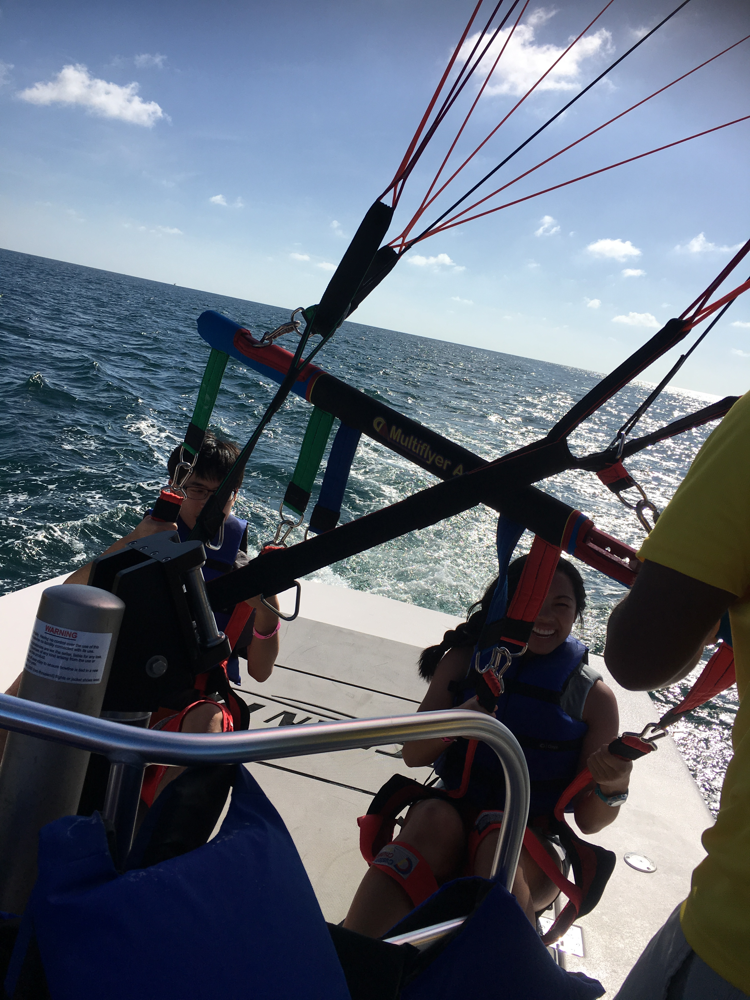
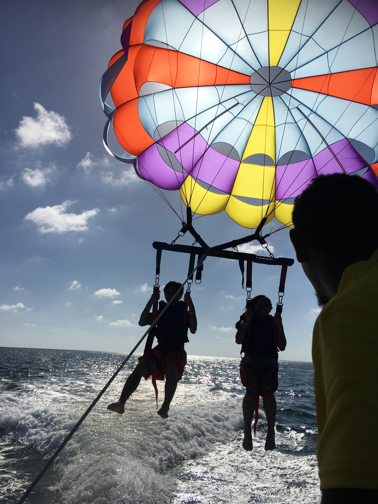
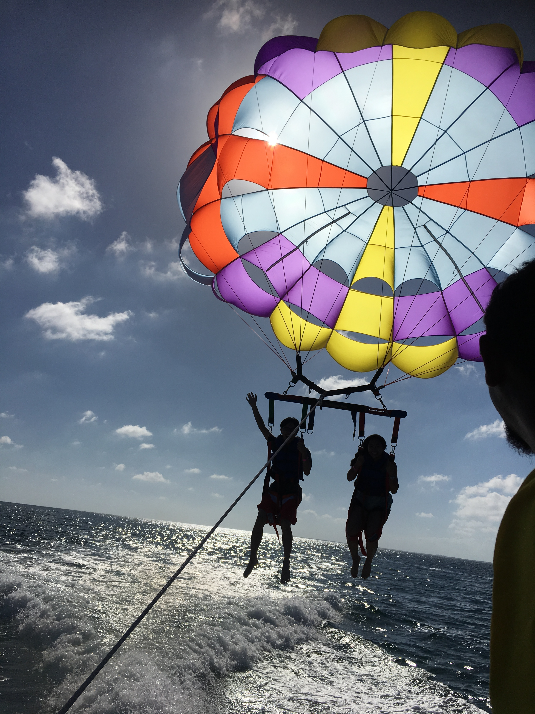
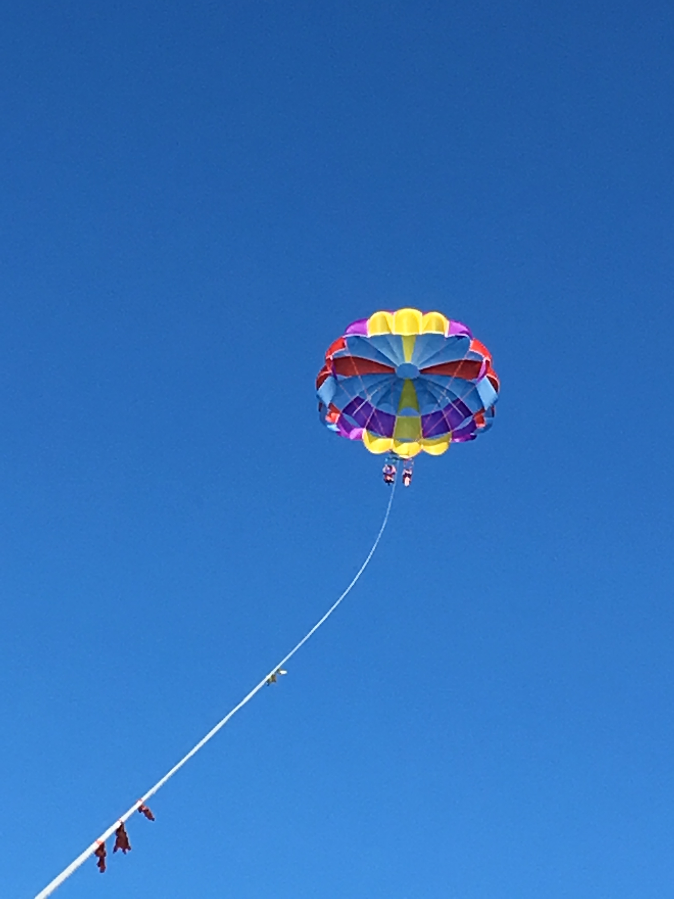
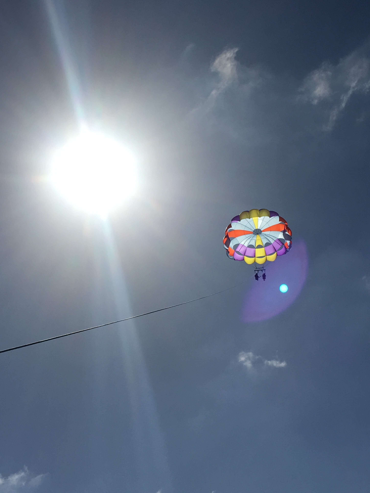

Today we were in Harvest Caye, Belize - a private island owned by Norwegian
Cruise Line. The island has been opened to cruise ships for only 11 days, so we
were some of the first people to be on the island.

The first thing we did was go paddle boarding. It was pretty fun. I got to the
point where I was able to just paddle on one side most of the time, you have to
kinda paddle in a circular motion through the water and it works. Then we went
into the ocean for a swim and then to the pool to swim. We ate lunch, and after
that, Hannah and I went parasailing.

Parasailing is pretty cool. You go out on a boat and they deploy this parachute.
You strap onto the parachute, and then they let out the rope holding the
parachute and you go up into the air. It was really cool because we were able to
see all of the island, the cruise ship, some of the mainland and a variety of
other islands while we were up there. I didn't have a camera so I don't have any
pictures from up high, but some people that were also on the same tour as us
took pictures of us as we took off and sent them to us. (We returned the favor
of course.)

<table class="gallery">
  <tr>
    <td colspan="2">
      
    </td>
    <td colspan="2">
      
    </td>
    <td colspan="2">
      
    </td>
  </tr>

  <tr>
    <td colspan="3">
      
    </td>
    <td colspan="3">
      
    </td>
  </tr>
</table>

After parasailing, I swam in the pool for a few minutes and then headed back to
the ship. I won't bore you with the details on the rest of the evening, and I'm
really far behind on writing anyway, so bye!
