Today we were in Roatan, Honduras - an island about 58 kilometers (36 miles) off
the cost of mainland Honduras. We had arranged for a driver to take us to a few
activities on the island. As we drove around, our driver pointed out a variety
of things on the island. Most of the things were "there's the house of the
mayor/governor/rich lady/sister/cousin/etc.".

# Petting "Zoo"

Our first stop was a sort of petting zoo. It was just a small family owned place
and we were led around the place by Isaac, the cousin of one the owners.
(Actually, it's very difficult to tell if they mean literal cousin or figurative
cousin, basically it seems like if they are your friend, they are your cousin.
I'm pretty sure they would call their cousin their brother. It's a very
different culture, families are much closer and the line between family and
friends is much more nebulous.)

He showed us a couple animals that lived in the island and then took us to the
monkey cage. The monkeys were yelling (more like screeching) at one another so
they let one of them out onto the trees surrounding the enclosure. The monkey
stayed close (they know where their food comes from). Then we were allowed to go
inside. The monkeys jumped all over us checking us out. They were very startling
since they mainly jumped from behind me onto my head. They really liked my head
for some reason. I wasn't so excited about the fact that they liked pulling my
hair. They don't have claws, so they couldn't dig in, they were just grabbing at
my hair and pulling it. It was a definitely unique experience though.

<table class="gallery">
<tr>
<td rowspan="2" width="70%">

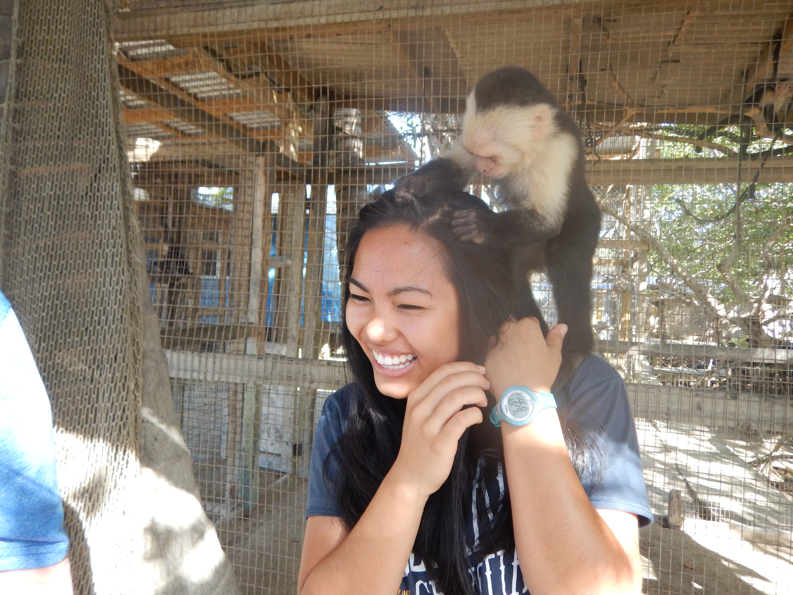

</td>
<td>

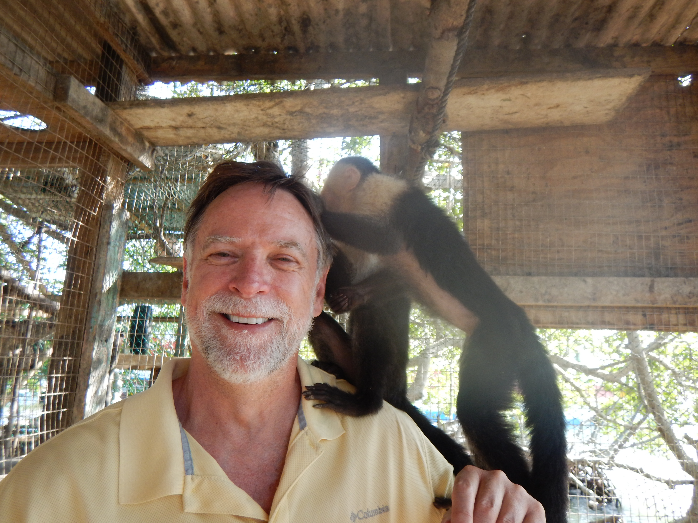

</td>
</tr>
<tr>
<td>

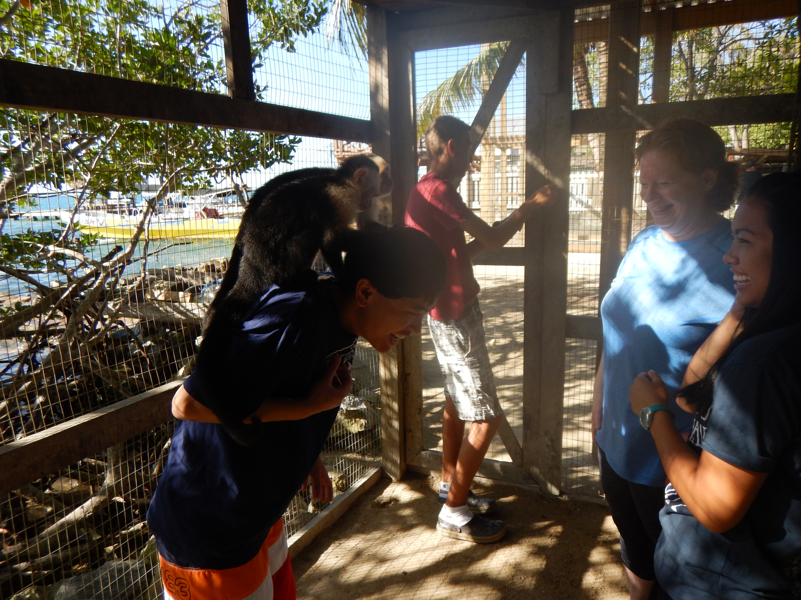

</td>
</tr>
</table>

Next we went by the cage of some spider monkeys. Isaac warned us not to stand
too close but dad got a bit too close to the enclosure and the monkey reached
out and swatted dad's glasses with his hand! Isaac said that if they get a good
grip on the glasses, they will put them on their head since they've seen humans
do it!

We then went to the toucan enclosure and got to hold and feed some toucans. They
had claws and it did kinda hurt some. We went to another enclosure where they
had a different bird (I don't remember what it was called) and held and fed it
too.

<table class="gallery">
<tr>
<td>

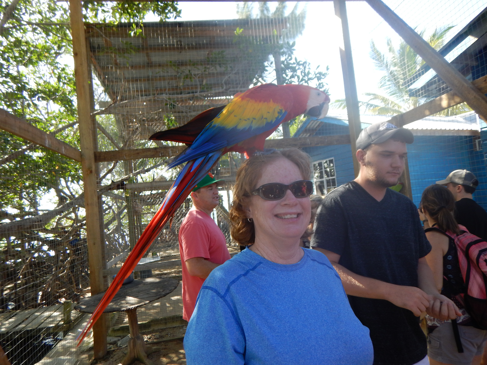

</td>
<td>

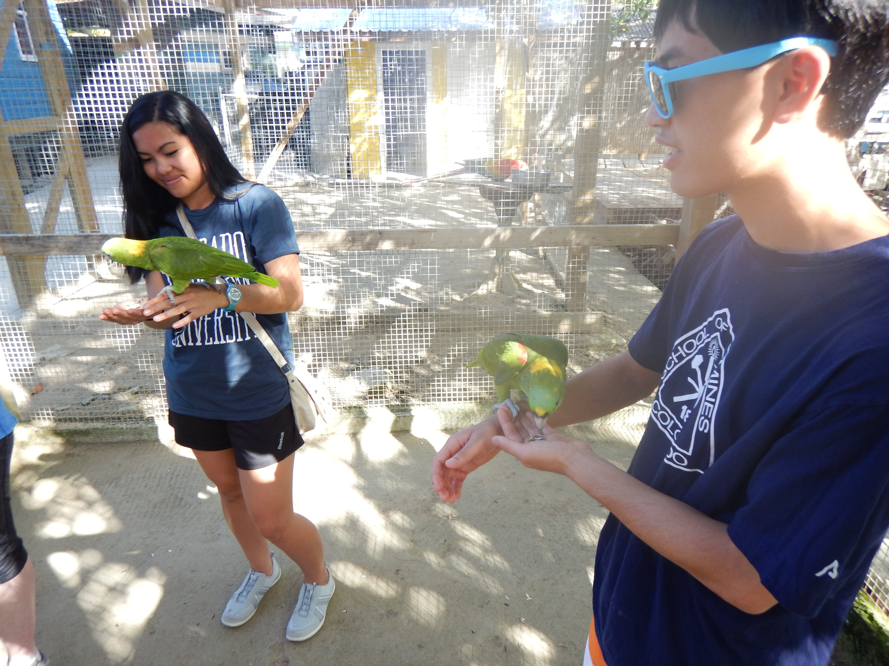

</td>
</tr>
</table>

The last animal that we held was a sloth. Hannah was really excited about
getting to hold a sloth. They moved so slowly! (There were some jokes comparing
me to the sloth, let's just say I was not amused.)

# House of the Owner

On our way to the next stop, we stopped at the home of the owner of the company.
He and his brother run a soccer program for boys. There is a bit problem with
juvenile delinquency in Honduras since school is not mandatory for any age. The
soccer program helps encourage kids to go to school since to play, they have to
attend school. Because the community is so small (the island is the size of a
small town), the teachers let the coaches know if the kids miss school and they
got punished by the coaches if they do (mostly by denying them playing time).
The team is pretty competitive on Roatan, but not so much on the mainland.

# Horseback Riding

We then went to a place where there were some horses. We rode them a little way
through the jungle and then down to the beach and into the water. It was really
fun riding them in the water.

<table class="gallery">
<tr>
<td>

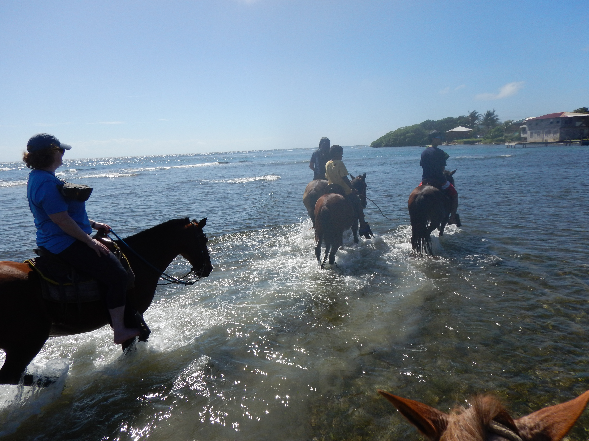

</td>
<td>

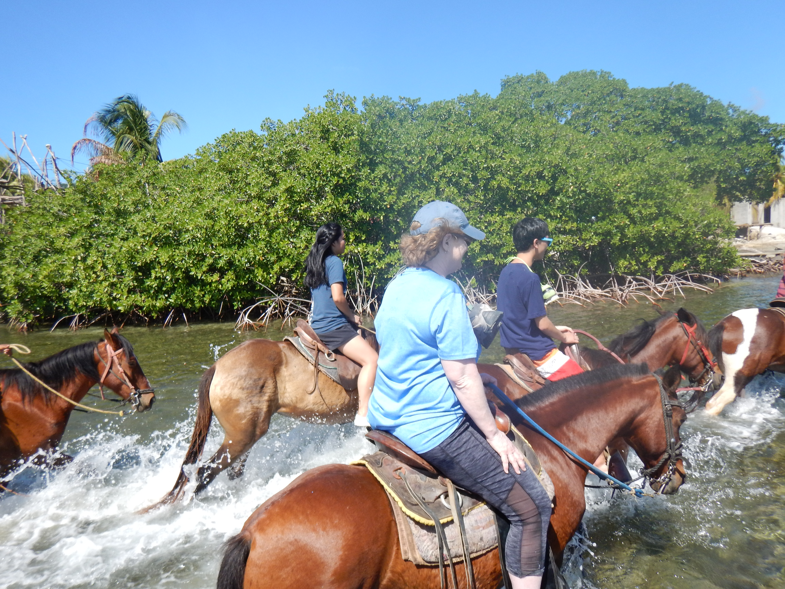

</td>
</tr>
</table>

# Snorkeling

One of the things that we wanted to do was snorkel at a reef. Our guide was
quite the wheeler and dealer (more on that later) and said, "oh yes, we can do
that. You will rent boat and go snorkeling at good reef. I will get you very
reasonable price". We were rather skeptical since all we really wanted was some
snorkel gear and a place to snorkel. (We knew that the price for going to the
beach and renting would be $20 USD per person, so it had to be a pretty good
deal.) When we arrived at the pier, he was very happy and was like "ah, you are
in luck, my friend just got back from a trip, I will get a good price for you"
After a couple seconds, he came back to us and was like, "I have good news for
you, you can get blah-blah-blah-blah and normally this costs $35 but for you he
will do it for only $25". We became un-skeptical very quickly and went on the
boat.

The boat took us out a few minutes to the Second Great Barrier Reef. Out at the
snorkeling site, we were able to see tons of coral (much more than when I was
with mom in Bermuda) and lots of fish. I asked dad how it compared to the Great
Barrier reef. He said that there was a good variety of fish, but the coral was
not doing so good. I thought it was pretty cool and I had a lot of fun.

<table class="gallery">
<tr>
<td colspan="3">

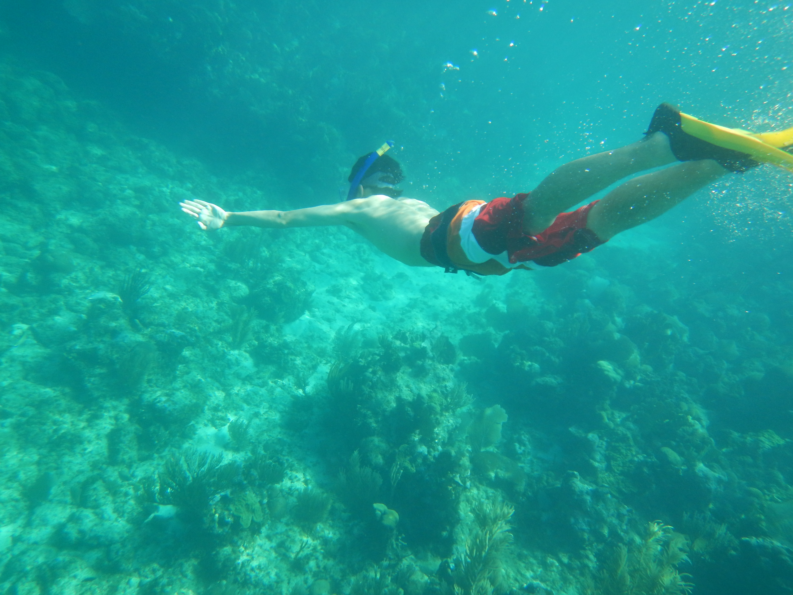

</td>
</tr>
<tr>
<td>

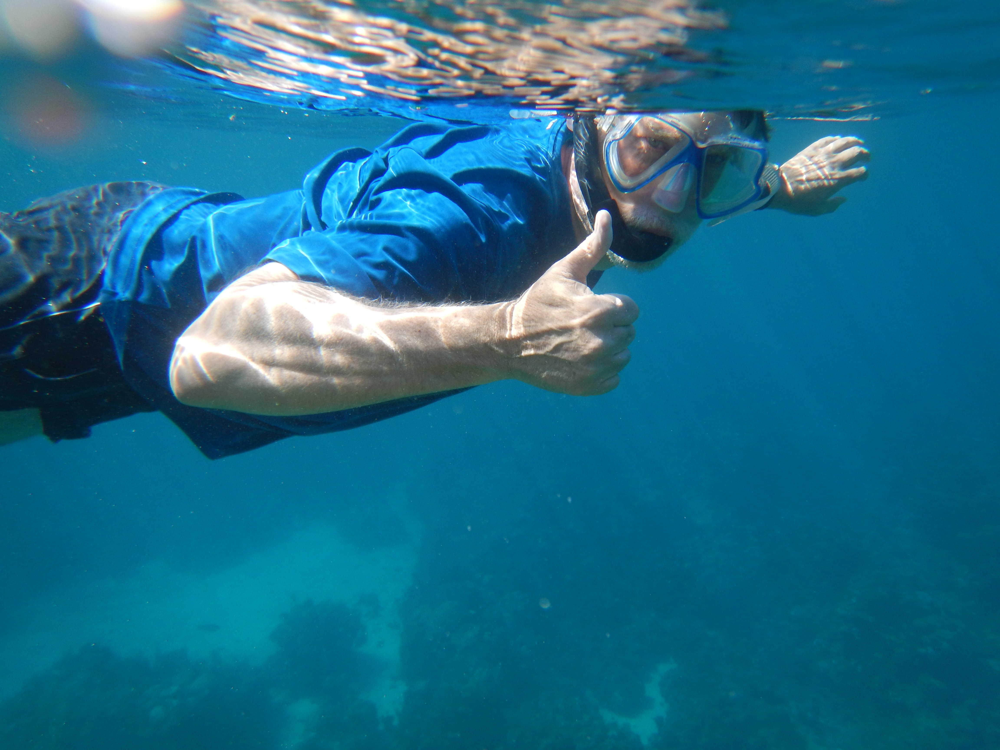

</td>
<td>

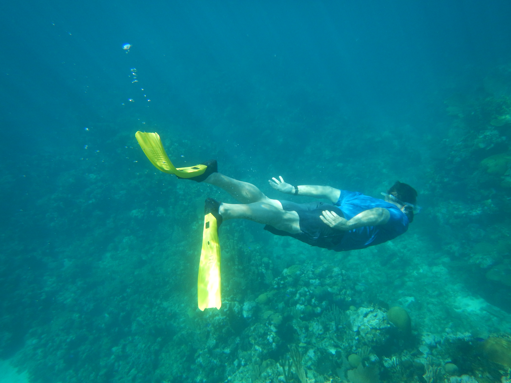

</td>
<td>

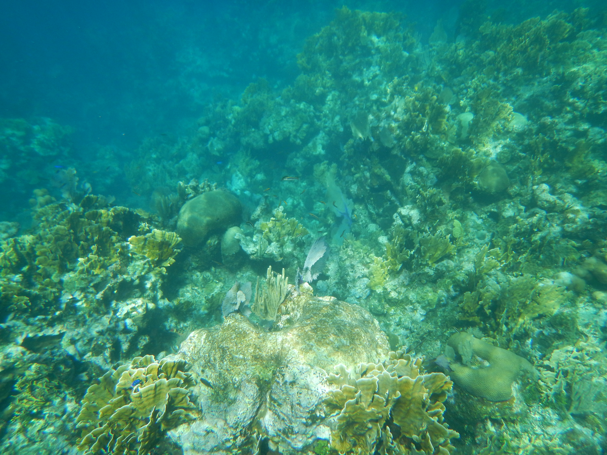

</td>
</tr>
<tr>
<td>

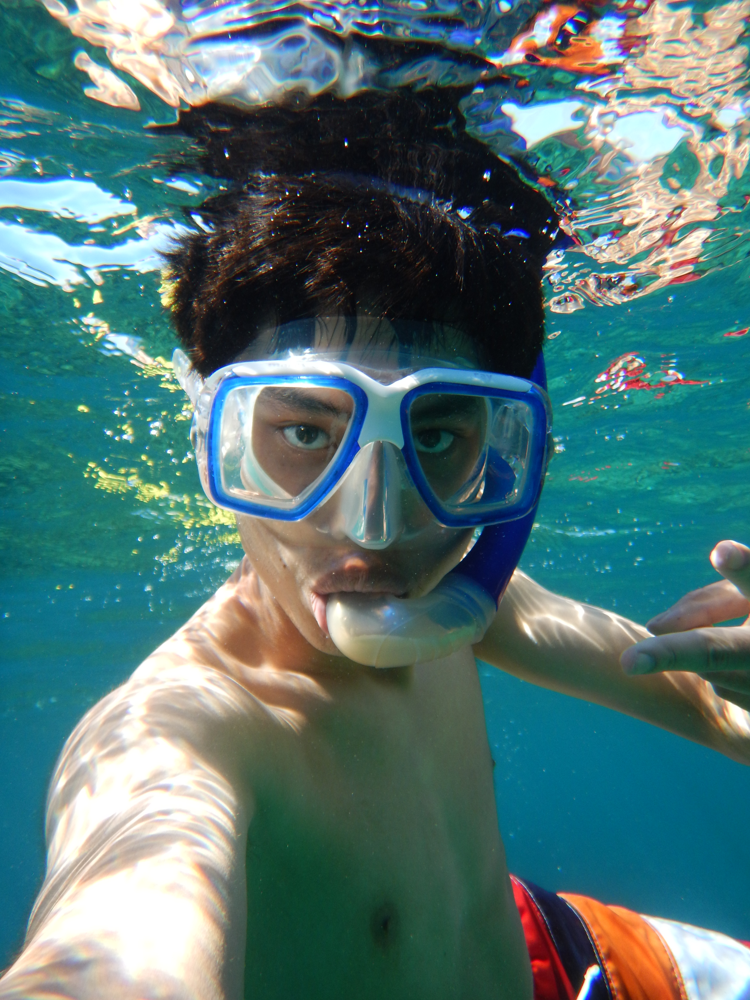

</td>
<td>

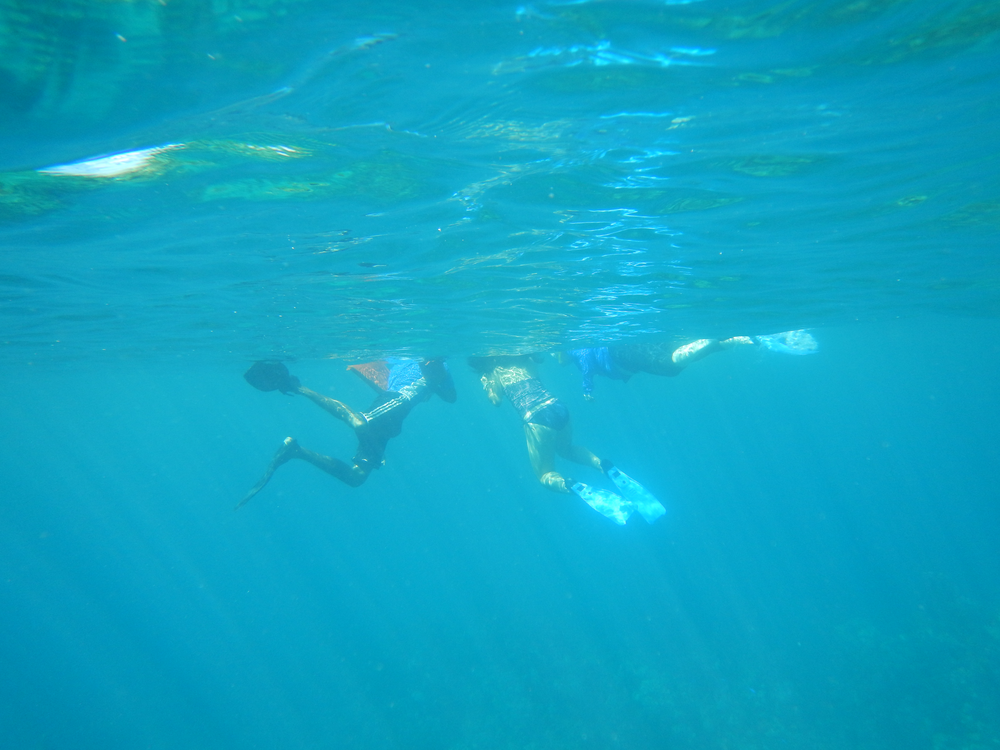

</td>
<td>

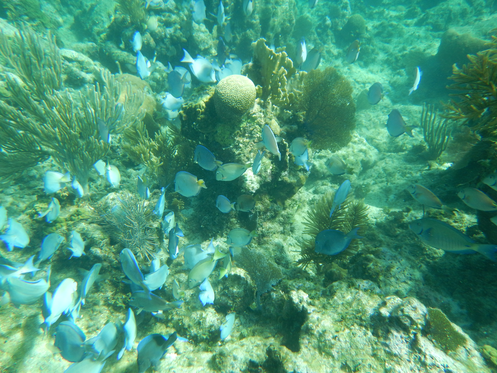

</td>
</tr>
</table>

After we were finished snorkeling, our driver took us back to our cruise ship.

# A Note On Our Driver

As I mentioned, our guide was quite the wheeler-dealer. If we had had time, we
wanted to go see an orphanage and hand out toys to the kids, but we didn't have
time so we weren't able to do that. After the fact, we decided it was probably
better that we hadn't since our driver probably would have tried to sell us the
orphanage! (Not really, but if he had we would not have been totally stunned.)

He has a family of **"only"** eight kids, and has a myriad of jobs to support
them. His dream is to find treasure at one of the pirate wrecks off the coast.
Of course it probably will never happen, but I think that the dream of striking
it rich is often a motivation to keep going.

I'm still in "blog writing catch up" mode, so I will stop writing here.
