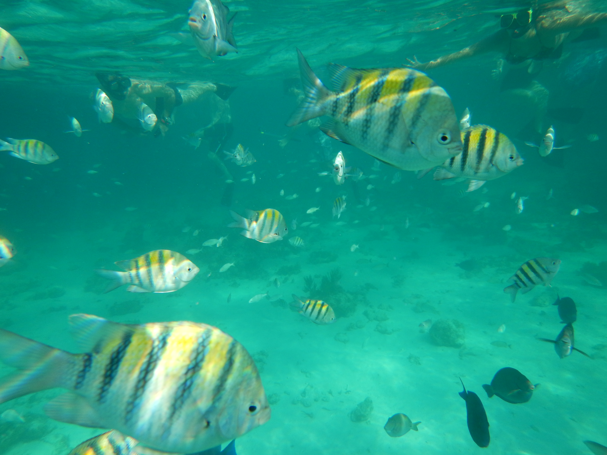

Today we were in Grand Cayman, Cayman Islands. English is the first language in
the Cayman Islands, but many people speak Spanish as well since they are in
contact with Hispanic cultures on a regular basis. We arrived fairly late in the
morning (11:00) and our tour didn't start until 14:00 (2:00 PM). It was a tender
port though, so we had to wait for our tender to get off the boat. We walked
around the town for about an hour and then went to the tour company office.

From the tour company office, we rode a bus to the boat dock, and on the way our
driver told us some things about the Cayman Island. For one, the island is tax
free but a lot of rich people live there (huh, funny, when you don't have any
taxes, money comes to you. What a surprise. JK, not actually a surprise, more
like common sense.). Our driver made it *very* clear that the Cayman Islands are
**tax free** (say it really slowly and emphatically in a deep Caribbean accent).

We got to the boat and boarded and then rode out to Stingray Sandbar.

# Stingray Sandbar

Out at the sandbar, we were able to hold and "kiss" the stingrays.

<table class="gallery">
  <tr>
    <td>
      
    </td>
    <td>
      
    </td>
  </tr>
  <tr>
    <td>
      
    </td>
    <td>
      
    </td>
  </tr>
</table>

It took a while for all of the people to have an opportunity to be able to hold
the stingrays, but it was kinda cool.

# Snorkeling

After seeing the stingrays, we rode over to another spot where we got out to
snorkel. I decided to wear my contacts today since the masks keep the water out
of my eyes pretty well when I snorkeled last time. I was extremely happy about
that decision. The coral was amazing and there was a great variety of fish.

<table class="gallery">
  <tr>
    <td>
      
    </td>
    <td>
      
    </td>
  </tr>
  <tr>
    <td>
      
    </td>
    <td>
      
    </td>
  </tr>
</table>

We went to one other site where there was a huge variety of fish, but not as
much coral. The guides had fish-food, which they threw out, which attracted a
ton of fish.

<table class="gallery">
  <tr>
    <td rowspan="2" colspan="2">
      
    </td>
    <td>
      
    </td>
  </tr>
  <tr>
    <td>
      
    </td>
  </tr>
  <tr>
    <td>
      
    </td>
    <td>
      
    </td>
    <td>
      
    </td>
  </tr>
  <tr>
    <td>
      
    </td>
    <td colspan="2">
      
    </td>
  </tr>
</table>

That was about it, we rode back to the shore and then drove back to town and
walked to the boat. I really enjoyed the snorkeling trip, I love being in the
water where there are so many cool things to see.
