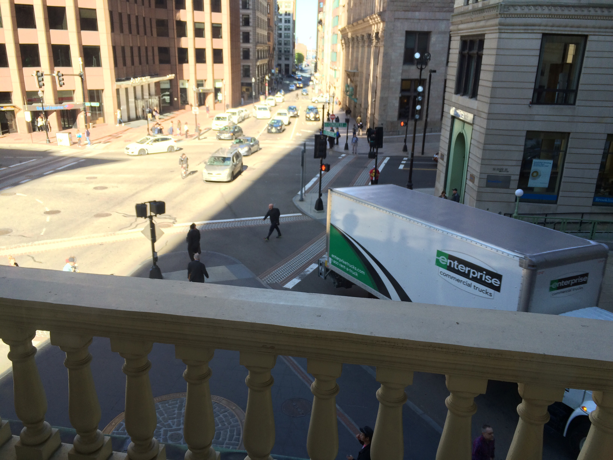

Today was primarily spent travelling by train from New York to Boston. We woke
up and got ready to go on the train. Our hotel is literally across the street
from Penn Station where we caught our train. We grabbed some breakfast for on
the train and then waited for the track to be announced. We got on the train
fine and finding seats was not a problem.  The ride was fine and I was able to
catch up on my blog post from yesterday.

### Arrival in Boston {#arrivalinboston}

After disembarking in Boston, we immediately went to find the tickets for the
subway. We immediately took the subway to a stop just a few blocks away from our
hotel: The Omni Parker Hotel. At this point it was fairly early but we were able
to check in and store our bags until our room was ready.

### Freedom Trail Walking Tour {#freedomtrailwalkingtour}

In the meantime, we went outside to Boston Common, the main square in the city
for a walking tour of the Freedom Trail. The Freedom Trail is a route through
the city that goes by the main historic landmarks in Boston including the State
House, a few churches, a couple meeting houses where the seeds of the War for
Independence were sown, and the site of the Boston Massacre. It goes on to Paul
Revere’s house, the Old North Church and Bunker Hill. The walking tour we did
only went through the first part of the trail. In all, the trail is only like 4
km (2.5 miles) long which is nice for tourism.

The lady who did our walking tour was "Paul Revere's wife". She took us by all
of the sites I mentioned and also took us into the cemetery where Paul Revere is
buried. At the site of the Boston Massacre, she told us the story behind the
massacre. Essentially, there was a mob of people (separatists and loyalists) all
making a ruckus in the square. Rocks and ice were being hurled at each other and
the Governor ordered 7 red coats to march down restore order in the square.
There were about 200 in the square, so they had no chance of actually restoring
order. They also had stones and ice thrown at them and one of them fired off
their musket.  The other soldiers fired as well (they never received an order to
fire) and when the smoke cleared, six colonists were dead. It was Samuel Adams
(no relation to the beer, he was dead a century and a half before the beer
existed) who created the propaganda that it was a massacre. He was the one who
encouraged the iconic engraving of an orderly British line firing into helpless
colonists. The propaganda worked obviously, we don't pay taxes to the Queen
anymore. They used propaganda to make the Red Coats look bad just as the Black
Lives Matter movement used propaganda ("Hands up, Don’t Shoot") to make the cops
look bad.

Throughout Boston’s history, there has been a very self-governing attitude
towards government. From its founding, the colonists placed a high value on
civil discourse in the form of town tall meetings. This continued up through the
War of Independence.

### Hotel

We went back to the hotel at this point because our room was ready and moved our
luggage inside. Then we went back out to the Freedom Trail (we are staying right
on the trail) and walked down to the Old State House.

### Old State House {#oldstatehouse}

The Old State House was the first meeting place in Boston. A few cool things
about the State House:

-   The Boston Massacre happened right outside the State House
-   The building has a subway station in the basement (obviously built
    much later)
-   The Declaration of Independence was first read to the people of
    Boston from a balcony on the building.
-   Other stuff that I can’t remember and is therefore not important.

We then walked around in the market area near the Old State House and ate some
dinner. Then we came back to the hotel and I caught up on my blog for yesterday
and went to bed.
