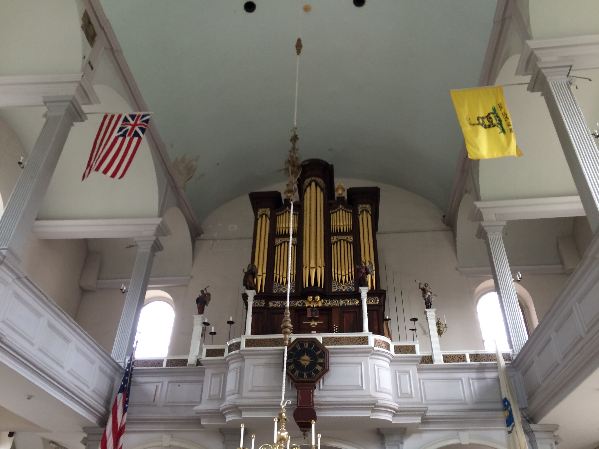

### Getting Into Boston {#gettingintoboston}

We got off the boat early this morning because we had a lot of things that we
wanted to do in Boston. We took the Subway towards the North End, at the tip of
the peninsula that Boston is on. We walked along the Freedom Trail to Paul
Revere's House.

### Old North Church {#oldnorthchurch}

Since Paul Revere’s House wasn’t opened yet, so we went on to the Old North
Church (pronounced "Awld Nawth Chuhch"). The church's most recent major
renovation was in 1911 (+/- 5 years) but it was built in 1723 (+/–10
years...ish). The church is an Episcopal Church (the Episcopal Church is the US
affiliate to the Anglican Church). The pews are box pews which is exactly as it
sounds. There rows of boxes with a pew in them and a door to the isle. The walls
were about four feet high but the pulpit is elevated so it is easy to see the
preacher. The pews are bought by families in the church. The Revere Pew has been
passed down and Paul Revere’s children still own the pew.

On the walls were a bunch of plaques commemorating various people associated
with the church. There were stones that listed all of the priests of the church.
Another plaque commemorated an officer who died at the Battle of Bunker Hill.

There was a very nice organ in the back. I would have loved to hear it play
during a service.

### Paul Revere House

By this time, the Paul Revere House was opened so we backtracked to the house.
It is one of the only houses left from that time period because of a fire that
went through sometime a long time ago. The house was very small considering up
to 11 people lived there at a time (Paul Revere was very good at making babies,
he had 8 with his first wife and 8 with his second wife after his first died in
childbirth). They had the house furnished with furniture from the mid to late
1700s and early 1800s.

### Cemetery

From the Paul Revere House we proceeded on to a cemetery where there were a
bunch of very old graves. I think it said that the oldest was from about 1650.

### USS Constitution {#ussconstitution}

We walked across the bridge to Charlestown and to the USS Constitution, one of
the ships from the first US Navy. The ship still sails a few times every year
(right now it is in drydock for a few years). Before going to the ship, we went
to the museum. There were displays about the history of the USS Constitution,
what life was like on the vessel and some general information about the ship.
I'll just list a few of the most interesting details.

-   The USS Constitution served in the War of 1812.
-   The USS Constitution was involved in the bombardment of Tripoli during the
    war against the Barbary Pirates. The subsequent invasion of Tripoli is still
    commemorated in the Marine's theme song.
-   The USS Constitution was dubbed *Old Ironsides* because cannonballs seemed
    to bounce off its sides.
-   The USS Constitution never sank (duh) and captured a bunch of ships and sank
    a bunch as well.

After seeing the museum exhibits, we went over to the boat and walked around. It
is very small for the number of people who lived on board.

### Bunker Hill Memorial {#bunkerhillmemorial}

The Bunker Hill Memorial was the next thing on our list of things to do.  I’ll
start by explaining some of the history of Bunker Hill.

The British had occupied Boston for much of the beginning of the War of
Independence. The Patriots laid siege to Boston and the British wanted to get a
foothold in Charlestown on the other side of the Charles River.  Patriot spies
received intelligence on the British plans and an order was given to fortify
Bunker Hill, the highest point in Charlestown. The decision was made to fortify
Breeds Hill, the hill closer to Boston.  When the British awoke, they saw saw a
redoubt (groundwork fortification) and a network of groundwork and fences and
walls defending Charlestown. The British sailed across the river to attack the
Patriot stronghold. The Patriots were able to repel the first two attacks by
waiting until they could see the "whites of their \[the British\] eyes" before
firing a deadly volley into the attackers. On the third attack, the British took
off their heavy packs and attached their bayonets. The Patriots ran out of
ammunition and lost the hill to the British, but the cost was high for both
sides. The Patriots casualties were about 400 but the British were decimated. Of
the 1500 who crossed the river nearly 700 were killed or wounded.

Despite technically being a military victory for the British, the battle was a
morale booster for the Colonies because it demonstrated that the Patriots could
stand up to the best trained force in the world at the time: the British Army.

The museum basically talked about the history of the battle (much more in depth
than I laid out above) but the monument outside is notable. On the top of
Breed’s Hill is a monument that looks a lot like the Washington Monument. The
person who built the Washington Monument was the runner up in the competition
for the Bunker Hill Monument and took the winning design and used it in his bid
for the Washington Monument.  We were not able to go up the monument because of
the heat, it was about 32° C (92° F).

### Evening

At this point, it was time to return to the ship. I spent the evening swimming,
eating dinner, playing ping-pong, writing my blog and listening to the Piano
Man.
