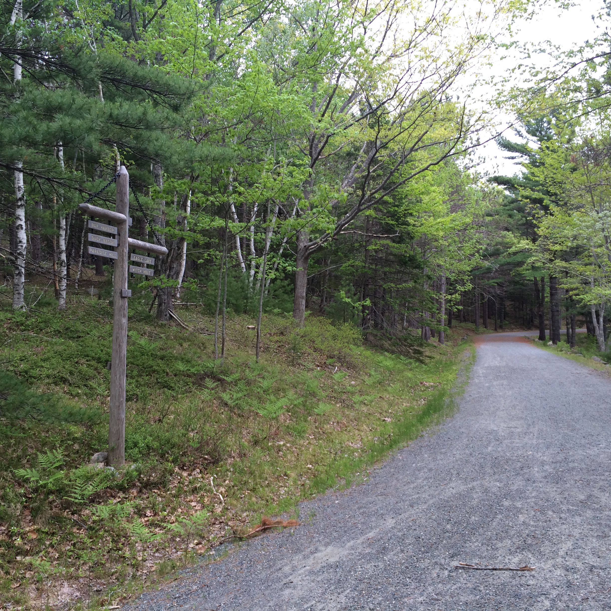
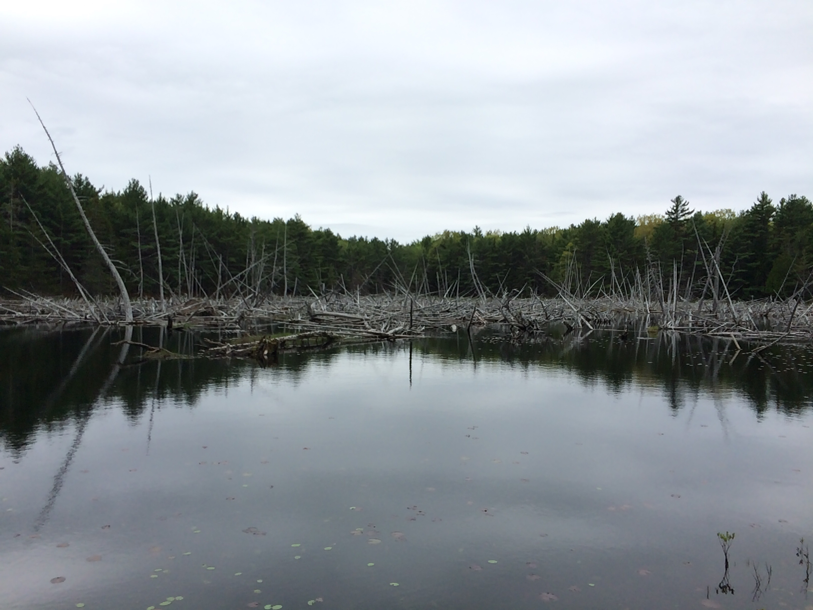
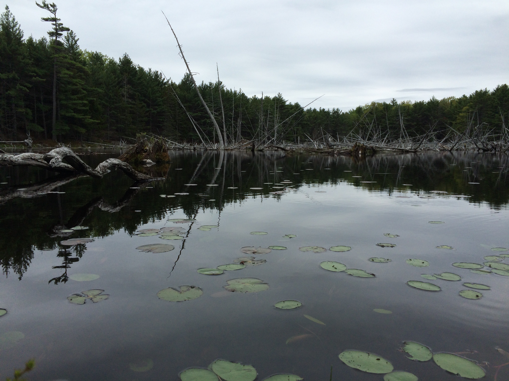
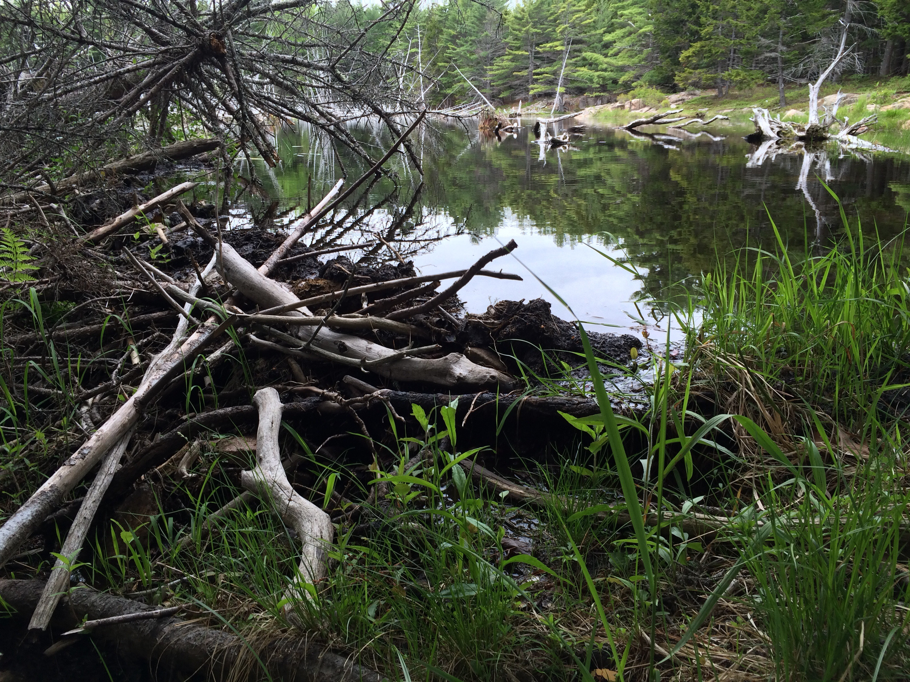
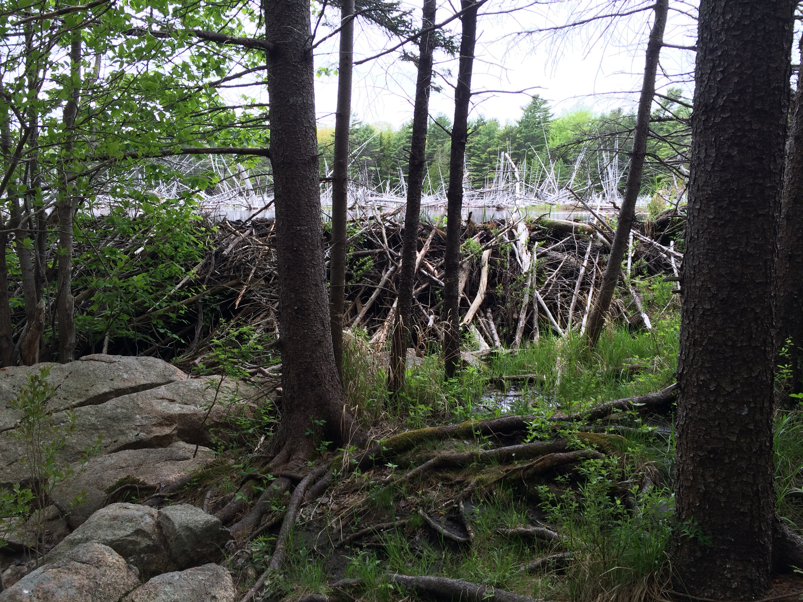
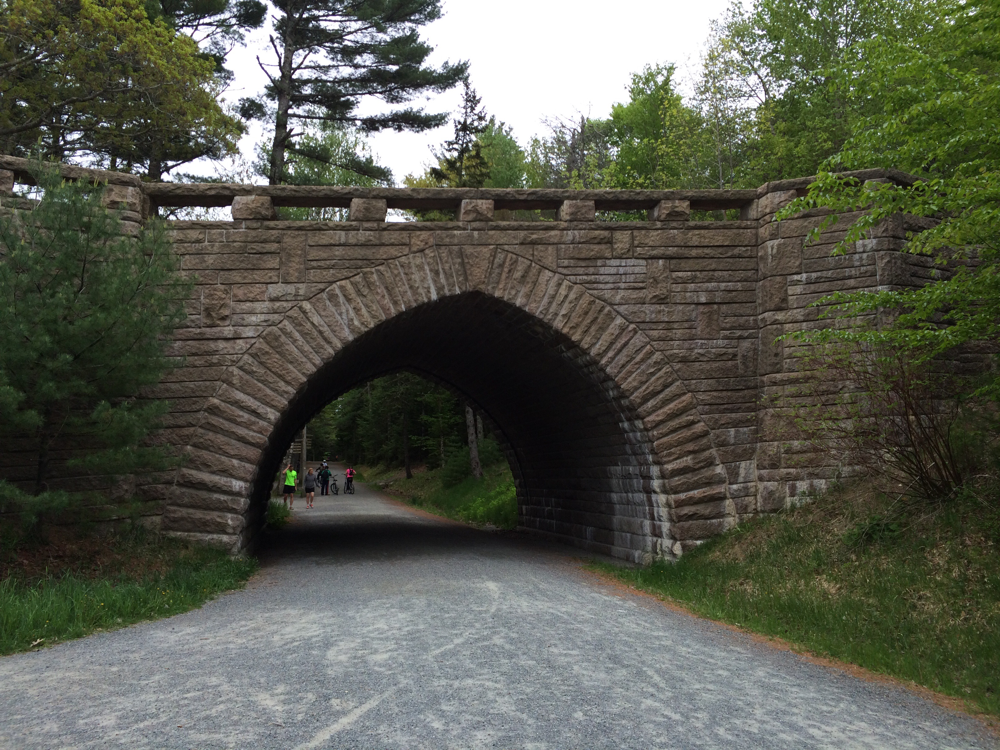
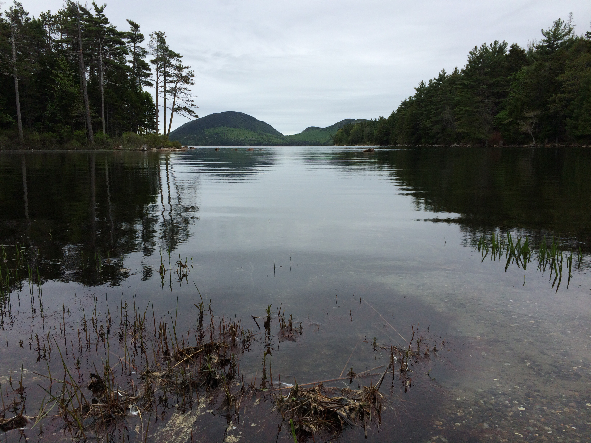
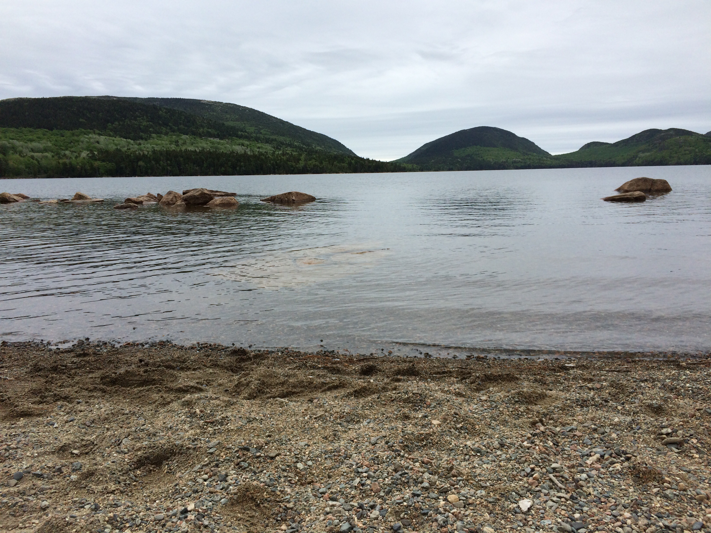
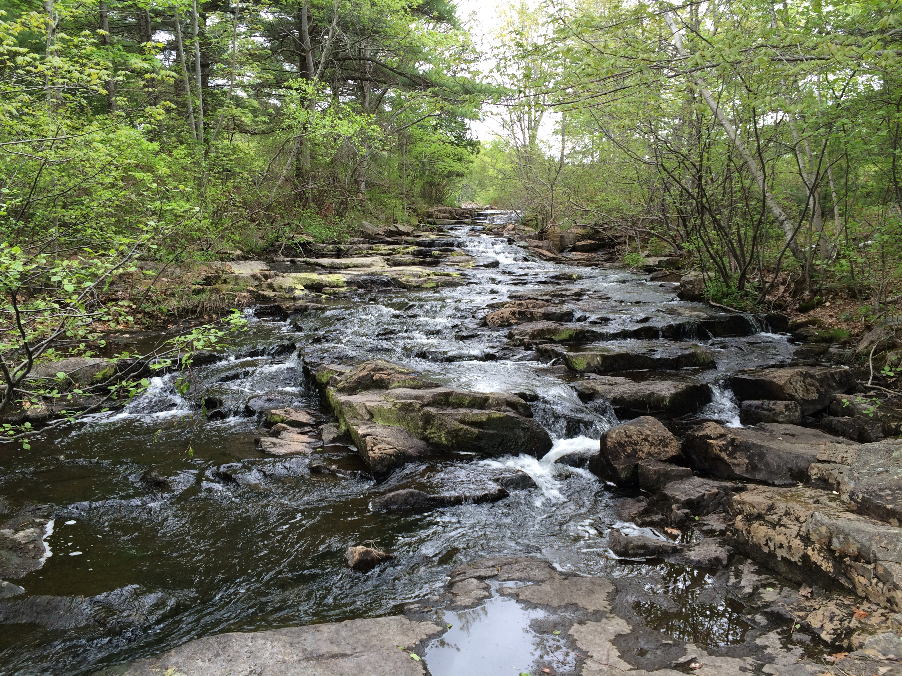
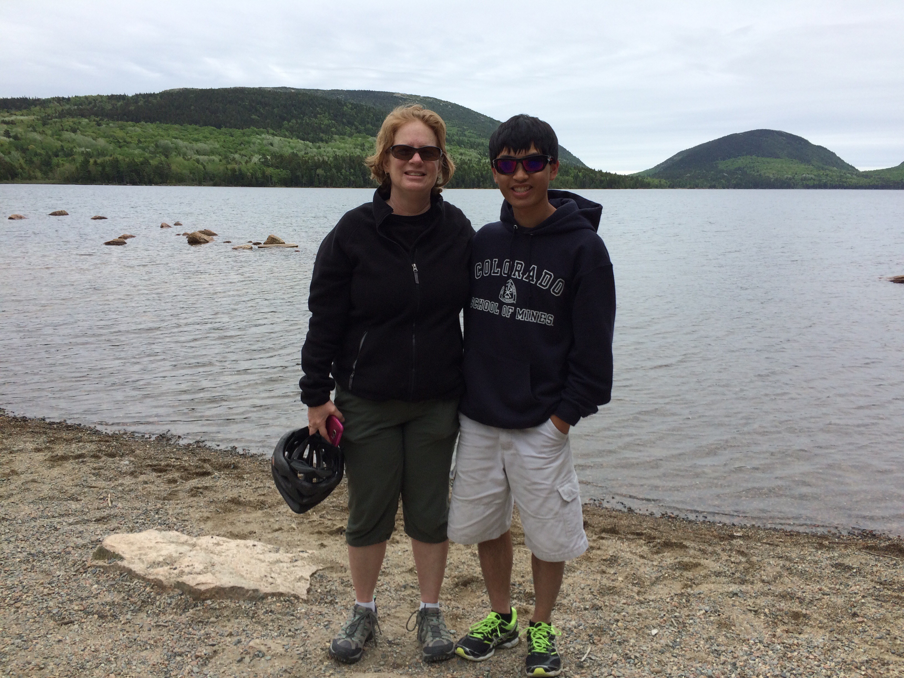

Today we were in Bar Harbor, Maine (pronounced Baahh Haahhhbahh). Bar Harbor is
know for its lobster but it is also near Acadia National Park.

### Bike Tour {#biketour}

We did a bike tour through the park. The park came to be through large donations
from John D. Rockefeller Jr. and a few other men. They bought up the land,
preventing it from being developed. After cars were introduced to the island,
Rockefeller built a road around the entire park and built separate carriage
roads where no motorised vehicles are allowed. They were named carriage roads
because horse-drawn carriages are allowed. Throughout the park, the car road and
the carriage road intersect in multiple places and in those places, Rockefeller
had bridges built to ensure that people on the carriage roads didn't have to
deal with cars. Our tour went on these carriage roads. I think it is best to
just post a bunch of pictures and let them speak for themselves.

<table class="gallery">
<tr>
<td>

</td>
<td>

</td>
<td>

</td>
</tr>
<tr>
<td>

</td>
<td>

</td>
<td>

</td>
</tr>
<tr>
<td>

</td>
<td>

</td>
<td>

</td>
</tr>
<tr>
<td colspan="3">

</td>
</tr>
</table>

### Walking in Town {#walkingintown}

After our bike tour, we walked around the town of Bar Harbor. We ate lunch at a
local restaurant that served lobster rolls (basically lobster sandwiches). I had
one and it was very good. We walked around the town for a little while looking
in the various stores and enjoying the town. Then we headed back to the boat and
the evening proceeded much like the previous ones.
