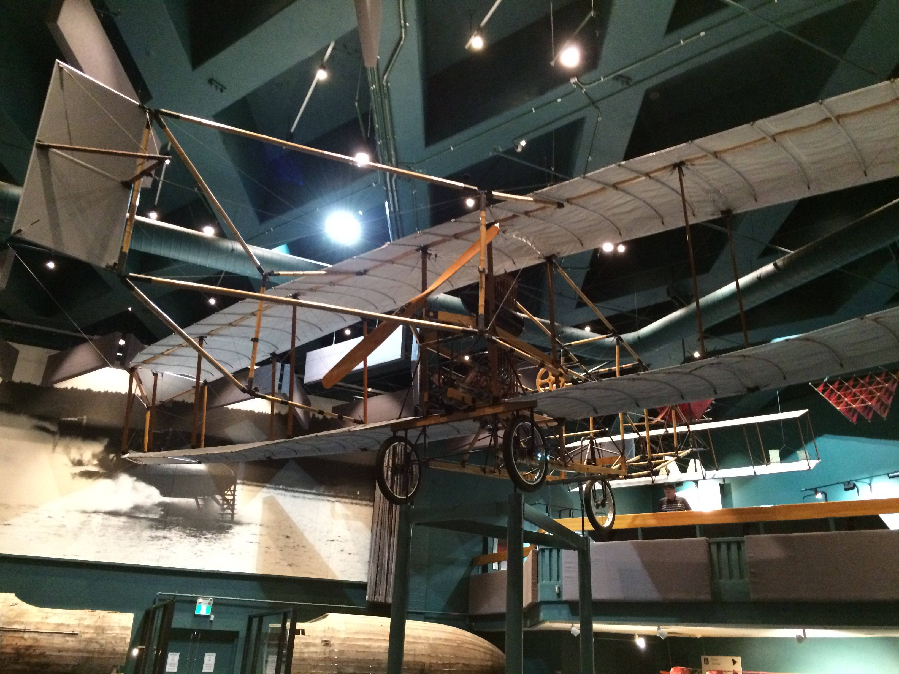

Today we went on a bus tour which took us to the Alexander Graham Bell Museum.

### Alexander Graham Bell Museum

#### The Ride to the Museum

On our way to the Alexander Graham Bell Museum, our guide talked about a few
interesting things about Sydney, Nova Scotia, and Canada in general.  (He also
said some of this on the ride back, but I'll just summarise it all here.)

By the way, if you want a solid source of information about any of the topics
I've written about, I am not that solid source so don't cite me on any of this.
The reason I do this is a) to let people back home know that I'm alive and b) to
sort all of the information I've learned and things I've seen in my own mind.

-   The Town of Sydney is located on the island of Cape Breton, the
    northern island of Nova Scotia.
-   Cape Breton has a huge lake in the middle of it. The lake is called
    Bras d’Or Lake.
-   Thousands of years ago it was a fresh water lake but as the glaciers
    melted after the Ice Age, the seawater rose to a level where it flooded into
    the lake basin creating the current salt water lake.

On the way we stopped at a *look out* spot (overlook in American English). It is
said that this lookout spot was the reason that Alexander Graham Bell decided to
settle in Nova Scotia after his success with the telephone.

#### The Museum

Before visiting the Alexander Graham Bell Museum, I only knew about Alexander
Graham Bell’s work on the telephone. Alexander, however, contributed so much
more than just that to society. I’ll list a few of his most notable
contributions.

-   Alexander’s father was a speech therapist and his mother was deaf.
    His father developed a system called *Visible Speech* (or something like
    that) which was a phonetic language which put speech mechanics into a
    language.
-   Alexander got a job at a school for the deaf and he used his
    father’s system to teach his students how to speak.
-   After becoming successful with the invention of the telephone,
    Alexander worked on a variety of other things. One of which was helping
    build the first airplane in Canada. He worked with Mr.  Curtiss and a bunch
    of other men on the project. Curtiss subsequently went off to create a
    successful airplane manufacturing company in the States.
-   Another of his post-telephone projects was a hydroplane, a boat
    which used “wings” underwater to provide lift allowing the boat to move
    across the water with minimal drag.
-   He had many other side projects, some of which were successful,
    others were very unsuccessful, but Alexander kept busy with all of his
    projects.

Alexander is best know for his work on the telephone. It was neat learning about
how he created the telephone after taking Physics II which focuses a lot on
electromagnetism. The telephone uses the properties of electromagnetism to
transmit sound. It specifically uses the fact that solenoids (essentially wraps
of wire around a spool) create magnetic fields when current is run through them
and that current is induced through the wire of a solenoid when there is a
changing magnetic field inside the solenoid. Graham discovered that both sound
waves and electromagnetic waves are sinusoid all waves. Because of this, sound
waves can be encoded as AC current and transmitted across a wire.  All of this
was new to me and it was neat being able to see how the stuff I learned in
Physics is actually used in real life.

Outside the museum, there was a great view of a lighthouse.

### Evening

My evening consisted of the normal activities so just read the older blog posts
and you’ll get a pretty good idea of what I did.
