Today we went on a walking tour of Quebec City.

### Lower Town

Quebec City is divided into two parts, the upper town and the lower
town. The dividing line is a tall cliff, so the upper town is literally
above the lower town. The lower town is the part of the town closest to
the water and therefore closest to the place where we docked.

After meeting our guide, we walked past a building that used to be the
customs building. The building used to be right next to the river, but
today it is about a hundred metres (328 ft). Like many other major
cities built on rivers, Quebec has filled in much of the land near the
St. Lawrence River over the years.

Our guide led us through the streets of Lower Town Quebec. There were
many fancy shops, restaurants, and hotels in the lower town. One very
nice hotel was built over the area of a former dock and during the
construction, some of the stone of the old dock was found. We went into
the hotel lobby and saw the remains of the wall. In the lobby there were
a few models that show what the dock looked like at a few different
points in history. Out on the street in front of the hotel, they had put
darker coloured bricks in a few places to show the shoreline at those
same points in history.

The streets were very pretty and I can understand why all of Quebec
City’s Old Quarter is a UNESCO World Heritage Site.

### Upper Town

After walking around the Lower Town, we rode the funicular to the upper
town (you will recall that the Upper Town is literally on a cliff above
the Lower Town). A funicular is a cross between a tram and an elevator.
Essentially a small car is pulled up and down by cables but the car is
on very steeply inclined railroad tracks.

Once at the top of the cliff, we walked around the Upper Town. The most
prominent structure in the Upper Town is the Chateau de Frontenac, a
large hotel and supposedly the most photographed hotel in the world. The
name comes from a famous Quebecer in the 1600s. It was built in sections
and started out as a U shaped building. After another building was
constructed somewhere else in Quebec that was taller than the Frontenac,
they built the iconic tower to once again be the tallest building in the
city. Still later, they built a fourth wing to make a complete square
shape around the tower.

<table class="gallery" width="60%">
<tr>
<td colspan="2">

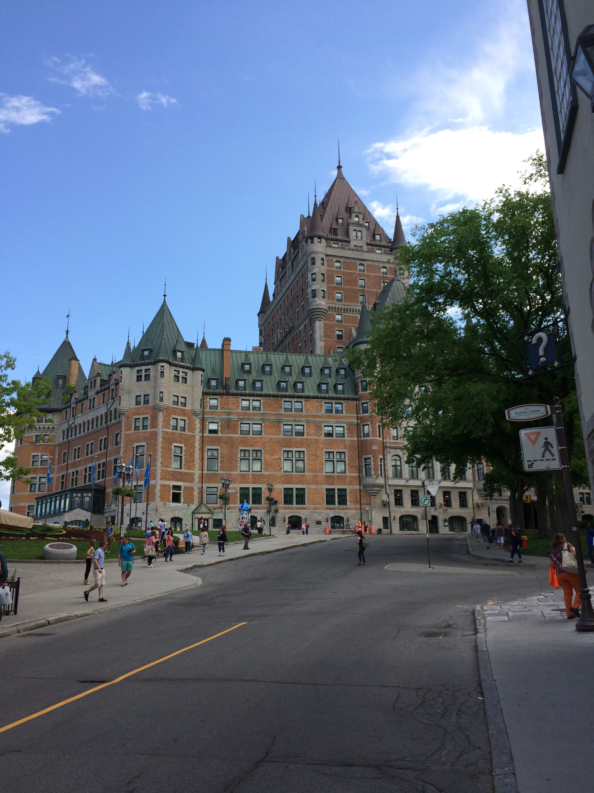

</td>
</tr>
<tr>
<td>

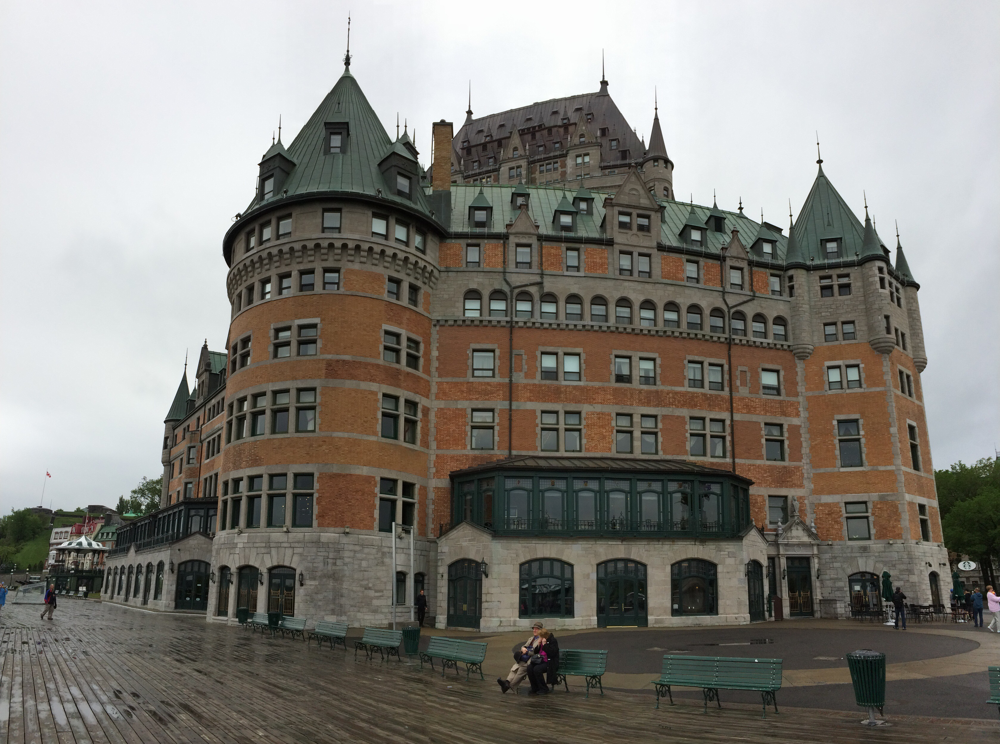

</td>
<td>

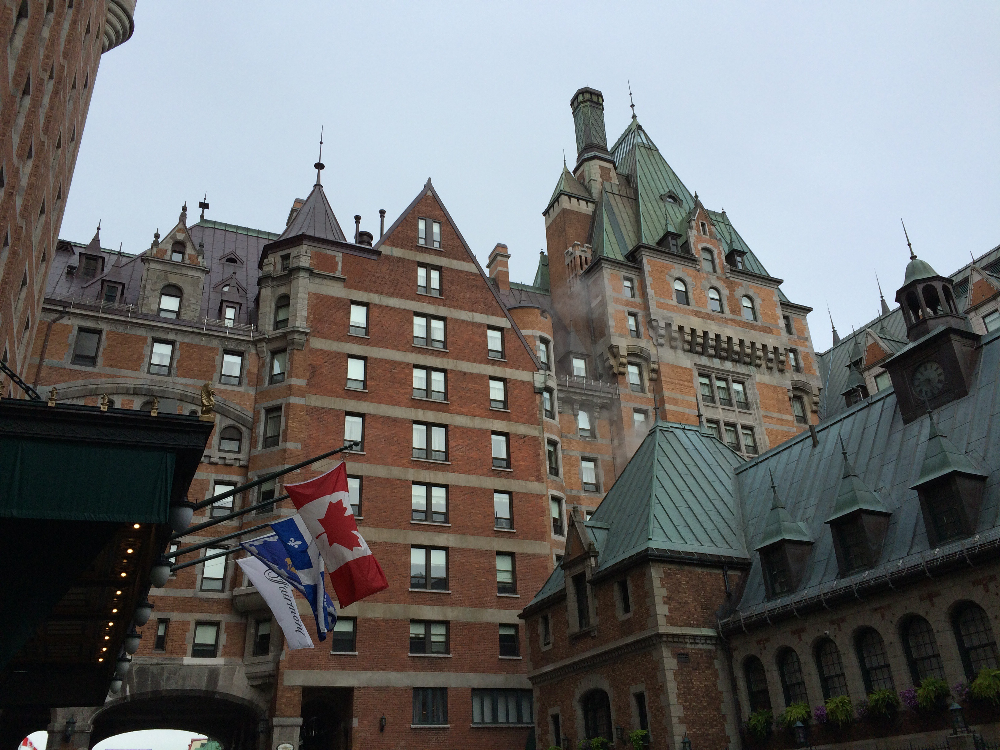

</td>
</tr>
</table>

We went inside the hotel to see the interior of the lobby. It is very grand.

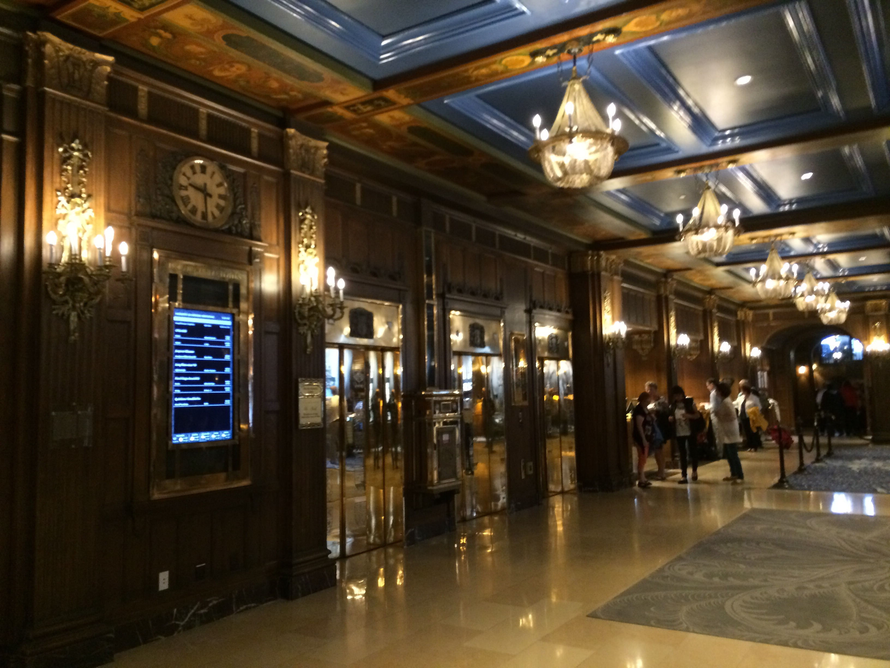

------------------------------------------------------------------------

As with the Lower Town, the Upper Town has many nice shops and
restaurants. We walked around and our guide talked about at a bunch of
the buildings. At one spot, there is a cathedral with a Holy Door.
According to Catholic teaching, if you walk through this door, your sins
will be forgiven. There are only seven holy doors in the entire world.
At another spot we passed a street where a bunch of artists set up
stands to display their work.

After walking around the Upper Town we left the Old Town via one of the
many gates in the wall around Old Town Quebec. We walked a little bit to
a cafe where we ate a small pastry before saying goodbye to our guide.
She gave us a few suggestions on where to go after our pastry and we
decided that we wanted to walk the city wall and visit the citadel.

### Walking the Wall

We walked a good distance along the wall and got some great pictures of
it and the views from it. Here are some of the best photographs.

<table class="gallery" width="80%">
<tr>
<td colspan="2">

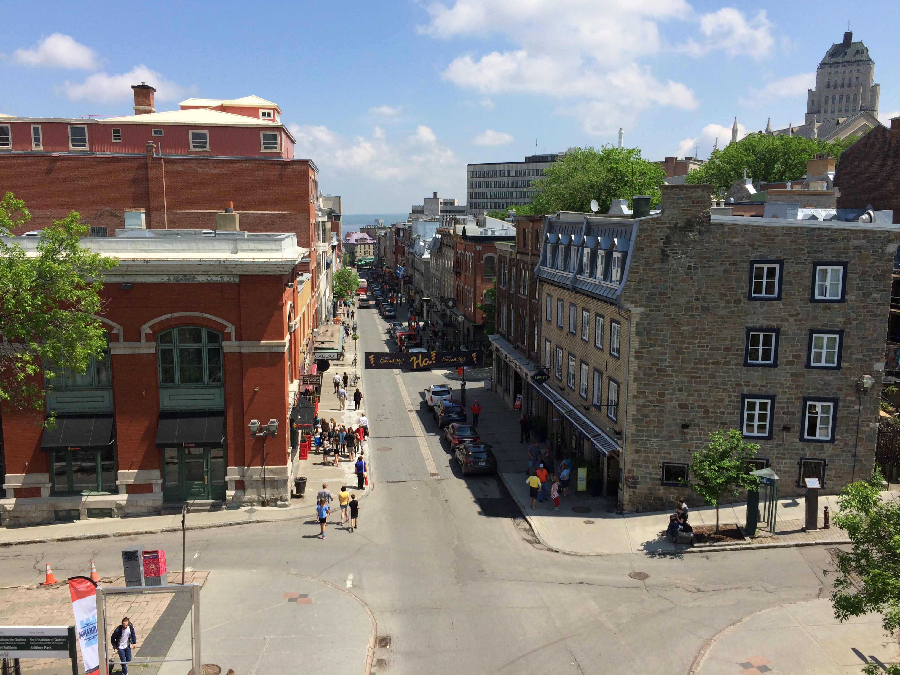

</td>
</tr>
<tr>
<td>

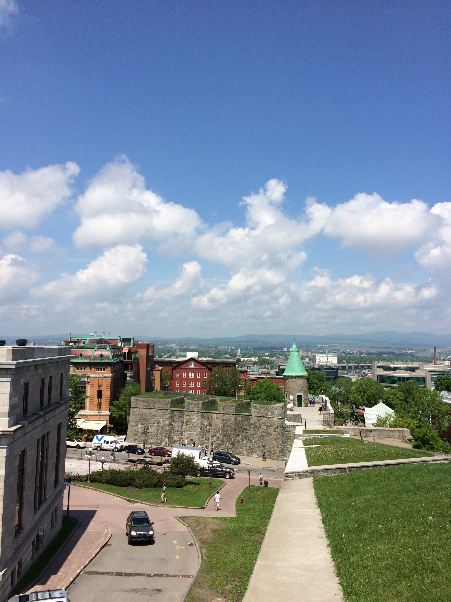

</td>
<td>

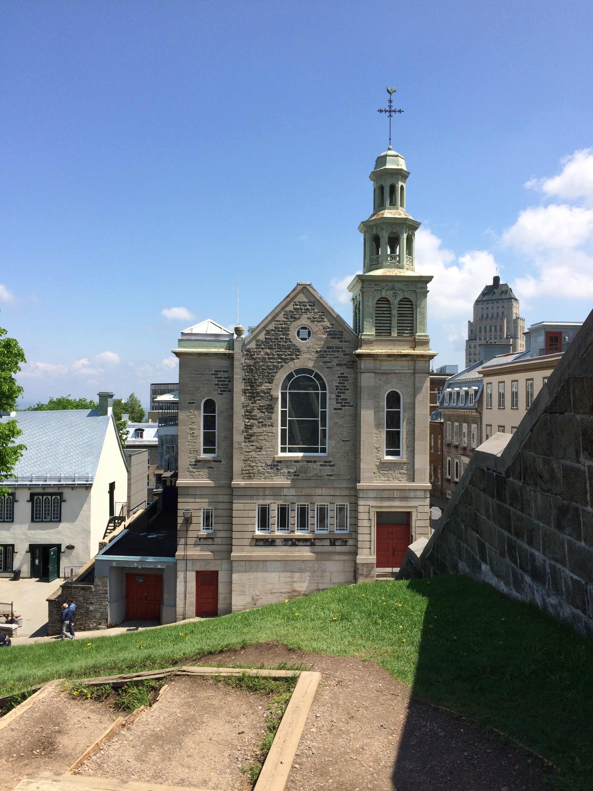

</td>
</tr>
<tr>
<td>

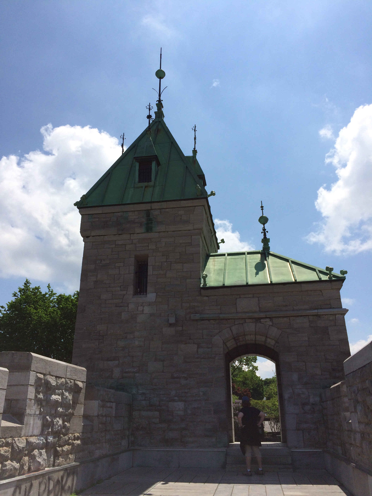

</td>
<td>

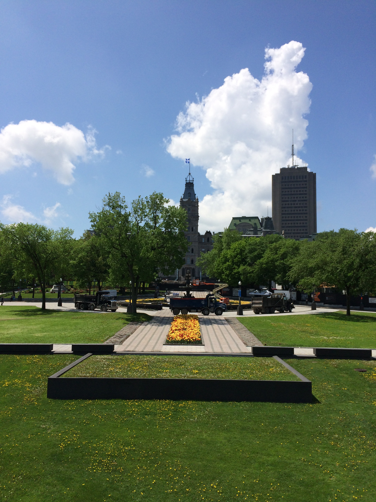

</td>
</tr>
</table>

### Citadel

The citadel was connected to the wall and we decided to visit it and
take the guided tour of the premises.

#### History of the Citadel

The Quebec Citadelle (that's how they spell it in French) has gone through many
evolutions. The oldest buildings still standing are a couple powder magazines.
All of the other buildings were either added later or destroyed.

Quebec City was invaded six times. The French controlled Quebec first, but the
British and French swapped control of Quebec a couple times before the Seven
Years War (known in the States as the French and Indian War). During that war,
Britain cemented its control of Canada when the French withdrew from all
Canadian holdings. The famous battle of that war was the battle on the Plains of
Abraham in which the British routed the French in just a few minutes. The
generals of both sides died during the battle, the French one saying that he was
glad that he did not have to see his city held by the British and the British
one saying that he was happy to know that he won the day.

During the War of Independence, Americans attacked the British stationed in
Quebec in an attempt to take Canada for the United States. At that point, the
Patriots in what would become the States thought that the Canadians would join
the rebellion so they were merely trying to eliminate the British threat from
Quebec. The Americans suffered huge losses because they attempted to attack
during the winter and ran into a snow storm with their summer gear on.

Later, during the War of 1812, the Americans again attacked Canada in an attempt
to rid North America of all British influence. This attack, too, failed. The
attack was enough to warrant a new citadel to protect against any threats. The
new citadel was never attacked. I guess the Americans finally figured that the
Canadians were too stubborn to join the Union.

#### Our Tour

Our tour guide was very good and engaging. She took us all around the citadel
and showed us many interesting things. The entire complex is actually active
military so we couldn't just wander alone and there were actual military people
in the compound. The first stop was the parade grounds where they perform a
changing of the guard ceremony during the summer. We were a bit early to see it
(they don't start for another few weeks) but we got to see them practising.

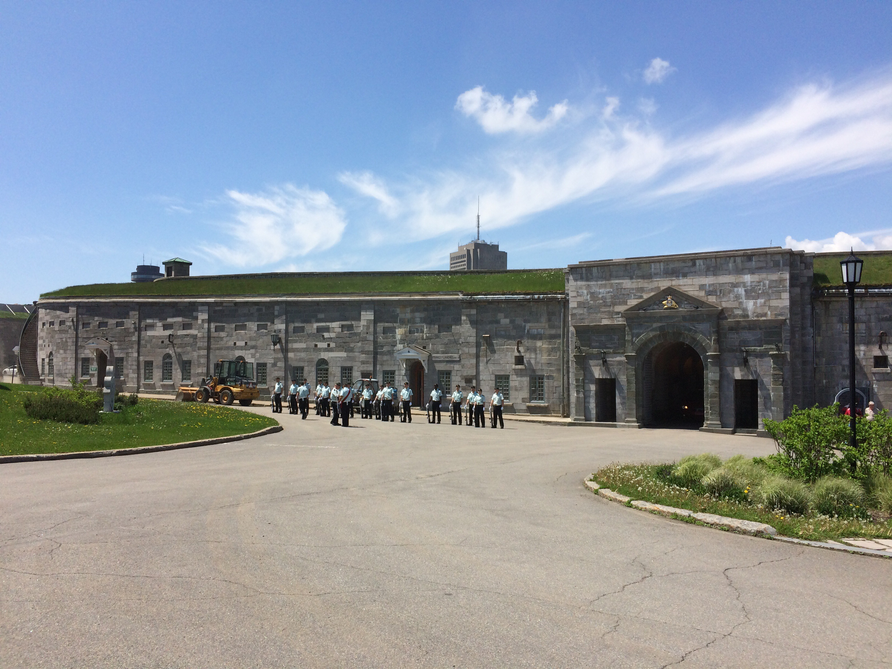

We then walked to the powder house where there was a small museum about life in
the citadel during the time when it was a more active military base. The powder
store was designed with very thick walls, but a weak ceiling so that if it were
to explode, the blast would mainly go up and not out therefore reducing the
damage to people and structures in the vicinity.

We walked around looking at some of the other buildings in the citadel including
one for the commander in the citadel and one which is the summer or winter home
of the Governor General.

We visited another museum as well which had many artifacts on display from the
citadel and explained some of the other history of the citadel that I have
described above.

At the end of the tour we stopped at a very large cannon. This cannon had a
range of about 5km (3mi) and protected the Quebec harbor. From this vantage
point, we were able to get great pictures of the city.

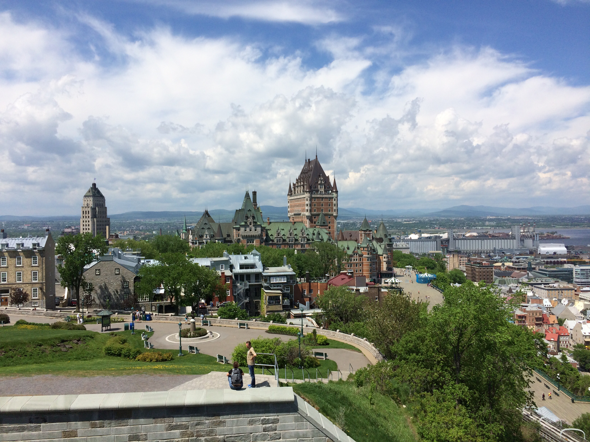

### Evening

We returned to the boat by walking down one of the stairways down the cliff
face.

The evening proceeded as normal.
