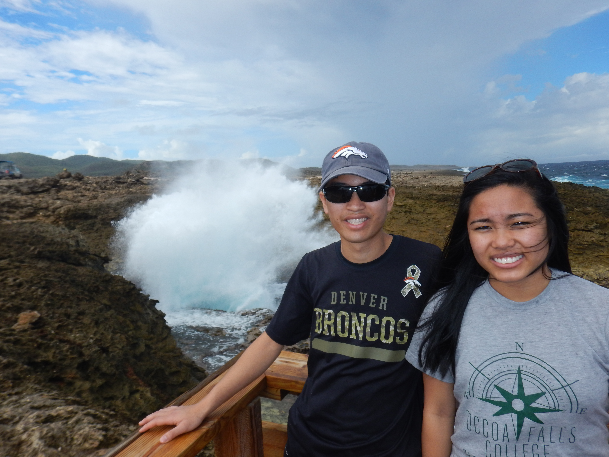

Today we were in Curacao, and our tour started at 08:00. The tour today was a
tour in the back of pickup trucks which they had put seats and a canopy in. We
went offroad for most of the day and since it had just rained, we got pretty
muddy.

We started by going over the large bridge in Curacao, Queen Juliana Bridge. This
bridge goes over the harbour entrance. Curacao is a major port island. It's
harbour is really good and it has an international airport with direct flights
to the Netherlands and other countries every day. Curacao and Aruba are actually
Dutch islands, an EU island just miles off the coast of South America. Curacao
has a large refinery which refines oil coming in from Venezuela and then exports
it to the rest of the world.

In addition to the automobile bridge, there is a pedestrian bridge over the
harbour entrance. This bridge is interesting because is swings open horizontally
for ships to pass, rather than swinging upwards.

Then we went north, to the dirt roads on the north side of the island. Our guide
stopped occasionally to tell us about the things we were seeing. He pointed out
some of the plant life on the island. Curacao, Aruba are both desert islands.
They are not tropical since they do not receive most of the moisture from the
Trade Winds. We saw cacti, low-lying shrubs and some trees which require little
water.

Our first main stop was a blowhole. This blowhole spewed the water up pretty
high.

The island is made of igneous rock with coral on top, so the ground is just a
bunch of old coral formations.

Then we went on to a cave that had bats in it. This cave was used as a hideout
for slaves back when there was slavery on the island. Since it is an island, it
is difficult for slaves to escape, but they still tried and went to the caves
when to hide for a little while.

While we were walking around, our guide showed us some snails that are unique to
the island. Because it is a volcanic island, any species that are found on the
island must have been imported either by humans or animals. These animals
continued to adapt to the environment, isolated from the rest of the world so
there are many species that are not found anywhere else in the world.

We then drove to another location where there was a nice overlook of the north
coast. The guide also had lunch for us there and then we headed to the south
coast to snorkel.

There is a stark contrast between the south and north coast. The wind always
comes from the north-east, so the north coast is pounded constantly by huge
waves and wind. The south coast on the other hand is very mild.

Our first snorkel spot was a fisherman's wharf where lots of turtles come to eat
the dregs of fish cleanings and the like. We got to see quite a few turtles
ranging in size from about 0.3 metres (1 ft.) long to over a metre (3.3 ft.)
long!

Then we went to the next location which had lots of coral and fish. There were
lots of different, colourful fish and a large variety of coral.

At this point, we headed back to the ship and immediately got ready for formal
night! We got all dressed up in suits and ties (well, not mom and Hannah, but
dad and I).

After dinner and the show, there were lots of New Year's celebrations going on.
We went up to the pool area at about 11:00.  I didn't like it. It was too loud,
and I just wanted to introvert for a while.  So, I had a pretty miserable New
Years. I headed back to the cabin at 00:05 on January 1, 2018.
