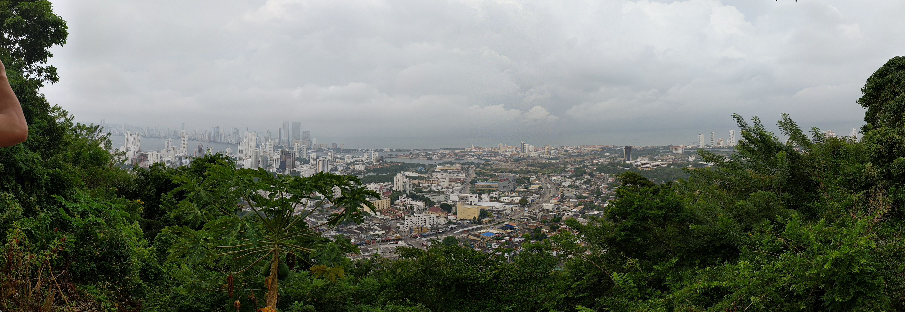

Today we were in Cartegena, Columbia. We only had a couple of hours in the city
because tomorrow we are going to the Panama Canal and we need to be "in line" at
the canal pretty early in the morning.

Our guide met us at the cruise terminal and took us around the city. Our first
stop was at the main fortress: *Castillo San Felipe de Barajas*.

Cartegena was a very important city in colonial times and had many forts to
protect it. In 1741, the British attempted to take Cartegena because by
controlling Cartegena, they would control all of the trade routes from Europe to
South America, effectively conquering all of South America.

Blas de Lezo, admiral of the Spanish defence, sank three ships in the harbour to
delay the British. This delay allowed the Spanish's greatest ally--disease--to
work. By the time the British arrived at the fortress, they were not in good
fighting condition and lost the *Battle for Cartegena de Indias*.

After getting a look at the fortress, we drove to the *Convento de la Popa*, the
primary monastery in Cartegena. From this monastery, we had a panoramic view of
the entire city.

We drove back to the old town of Cartegena for a walking tour. The entire old
town is a UNESCO World Heritage site. As we walked around, our guide pointed out
some interesting things about Cartegena. One thing that was very interesting
was that the size of someone's front door was an indicator of their social
status. The bigger the door, the larger carriages you could fit in, the more
wealthy you were. Additionally, the type of knocker on the door indicated the
owner's trade. For example, the fish denoted a fish merchant.

We also went to an emerald museum (it was also a shop, you could really spend a
lot of money on the stuff there). The museum was pretty interesting though. The
guide showed us some different types of emerald and explained how they were
mined.

Overall, old town Cartegena reminded me of New Orleans. It had a uniquely
American (in the general sense) feel, but felt like a European city.

At this point we got back in the car and drove around the new town. It wasn't
hugely impressive, it seemed like any big city. Notable was the fact that most
of the tall buildings were high-rises, not office buildings. Our guide said that
most of the people living in the high-rises were people who got rich off of oil.

Our guide then dropped us back off at the cruise terminal and we got on the
boat. We didn't end up leaving until an hour after the planned time because 12
people were not there by the planned departure time. Eight showed back up, but
four did not and we left them behind. Funnily enough, they were the people in
the cabin right next to us.

After eating lunch on the boat, I spent the afternoon playing chess with Alex. I
mainly was teaching him some stuff to help him improve his chess game. He's a
good leaner, hopefully I didn't teach him to poorly.

This evening's show was the *Island Magic Steelband*, a steelband from Trinidad
and Tobago. The band consisted of four members: one of them played the bass
steel drums, one played the steelpan, one played a double steelpan with lower
tones, and another played traditional drums. Unlike most steelbands which play
reggae, they played classical and Broadway music. They were really good and I
quite enjoyed the show. I wasn't the only one who enjoyed it either, the theatre
was packed and they got two standing ovations.
