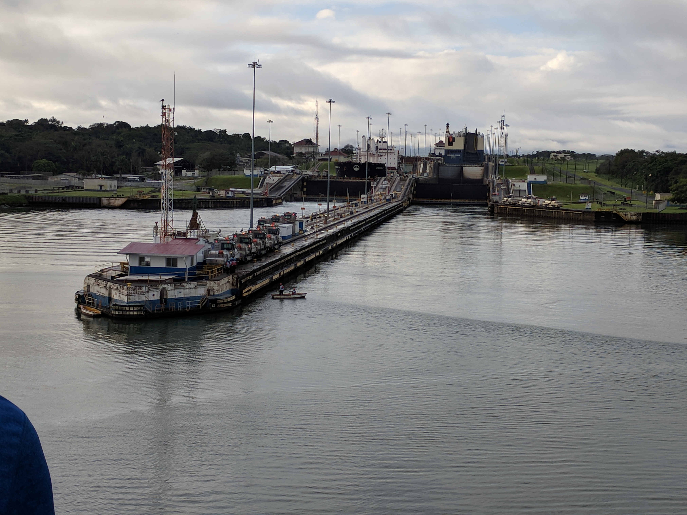
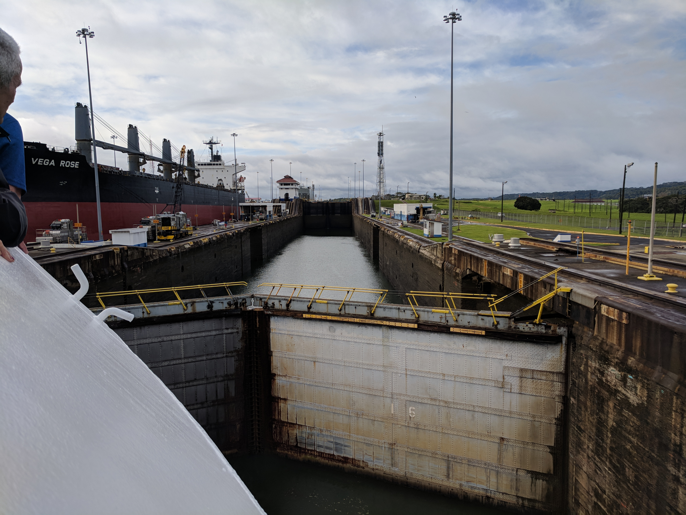
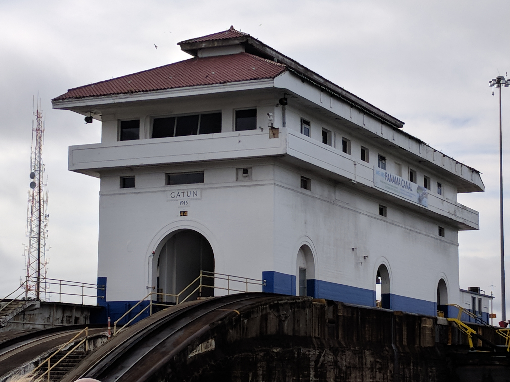
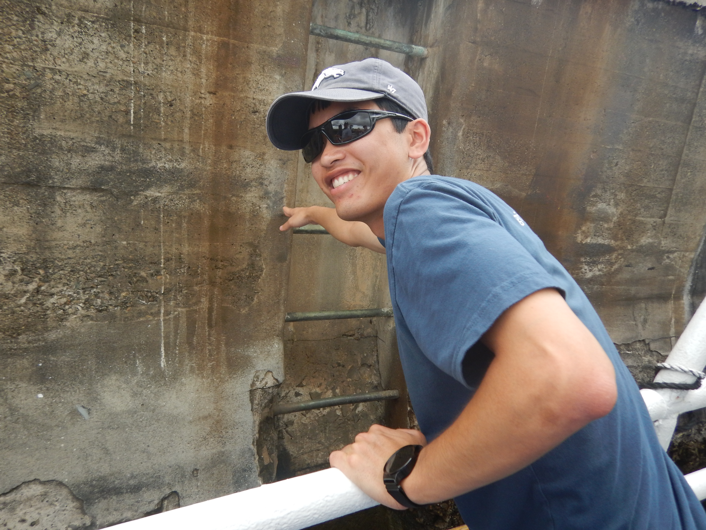
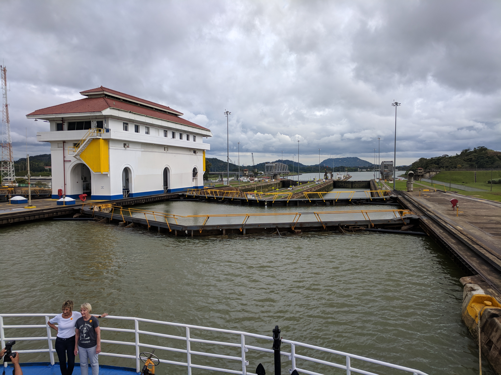
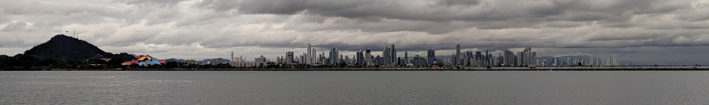

Today we transited the Panama Canal. I'm going to first describe what we did and
then give you some of the interesting facts that we learned about the Panama
Canal.

## What we did

Our boat arrived at the Atlantic side of the canal at about 07:00. They opened
the bow for people to go outside and watch the transit. We got a pretty good
place at the front of the boat.

It took a while to manoeuvre the cruise boat to the Gatun Locks, the locks on
the Atlantic side. Then, traversing the locks up to Gatun Lake took almost
another hour.

<table class="gallery">
  <tr>
    <td>
      
    </td>
    <td>
      
    </td>
  </tr>

  <tr>
    <td>
      
    </td>
    <td>
      
    </td>
  </tr>
</table>

The cruise boat anchored in Gatun Lake, the man-made lake which makes up most of
the canal. We disembarked the boat and tendered to the shore where we got on a
bus to go to the other side of the isthmus of Panama where the Pedro Miguel and
Miraflores locks take ships up and down from the Pacific Ocean to Gatun Lake.

The bus dropped us off and we got onto a ferry which took us through the Pedro
Miguel and Miraflores locks all the way to the Pacific Ocean! It was neat going
through these locks on a smaller ship because we really got a feel for the
technological wonder of the lock systems. We were also inside of the locks,
we could see the sides of the locks and even reach out and touch the walls.

<table class="gallery">
  <tr>
    <td>
      
    </td>
    <td>
      
    </td>
  </tr>
</table>

After transiting the locks and reaching the Pacific, we went under the Bridge of
the Americas, the first and only permanent bridge across the canal. (The
Panamanian government is building a bridge on the other side of the canal, but
it is not yet complete.)

We then disembarked the ferry and got on to the bus which took us back around
the Gatun Lake to our boat. On our way, we got some nice views of Panama City.

By the time we got back to the boat, it was very late and we went to the LIDO
(the buffet) for a quick dinner.

<!--
## Interesting facts about the Panama Canal

- The Panama Canal is one of the Seven Wonders of the Modern World.
- The Panama Canal
TODO
-->
