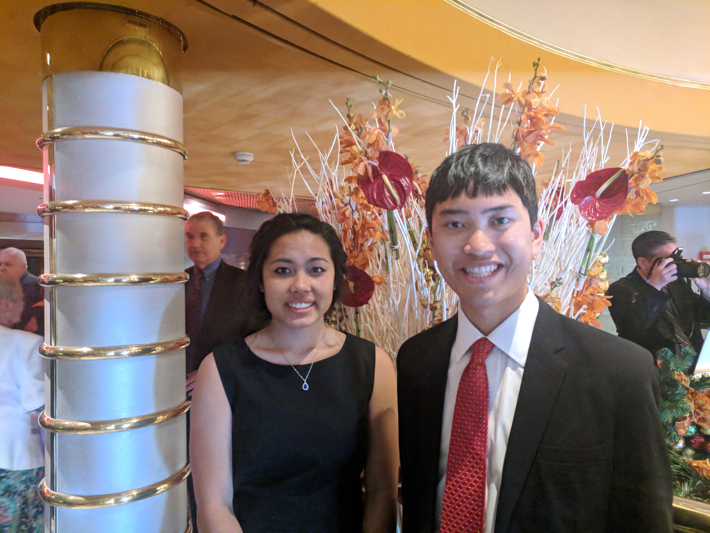

Today we were at sea. I had a lot of fun, but it isn't very interesting to write
about. I woke up pretty late, but I spent the day swimming and playing ping pong
and chess. The waters were a bit rough, but not too bad throughout the day.

This evening was formal night. I dressed up all nice in my suit and tie.

After dinner, we went to play trivia. Mom and I have been going the past few
nights and we've kinda formed a team with two other couples. One of the couples
is from New York, we met them at a trivia night one time. I don't remember where
the other couple is from, but they came on our snorkelling tour in Curacao. We
always are able to get ~13/18 possible points.

I then spent a while listening to the piano duo in BILLBOARD on Board. At 9:45,
a bunch of the dining staff came out with chocolate treats for everyone on floor
two. It was a "Chocolate Surprise". It was nothing like the Chocolate
Extravaganza on the Noordam, but it was nice nonetheless. I ate some chocolate
and then went to bed.
