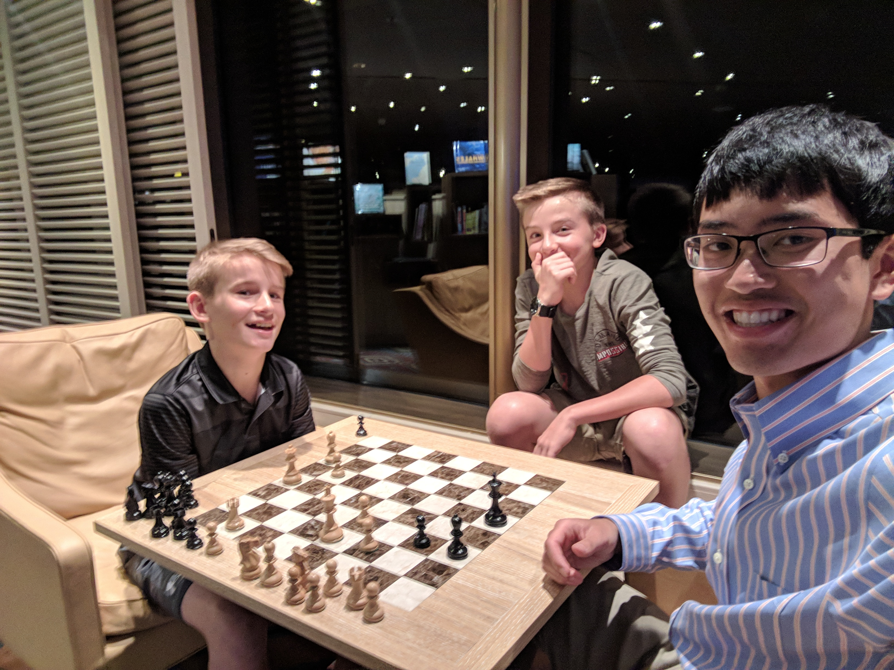

Today was another day at sea. The seas had calmed down, so the ship wasn't
rocking much at all. I spent a lot of time playing ping-pong, swimming, and
playing chess (sound familiar). I played one guy who was really good (at least
compared to me) rated ~1500. I'm doing well to stay above 1100.

I also tried to help Alex and Eric become better at chess. Hopefully I taught
them OK.

Tonight the show was the magician and the comedian. They each did half of the
show. The magician did a very extended, and very impressive card trick series.
The comedian was also really funny again. Comedy acts like his do not come
across in writing very well, so I won't try and describe it, but I was laughing
through the entire thing. (It was clean too, which was nice.)
