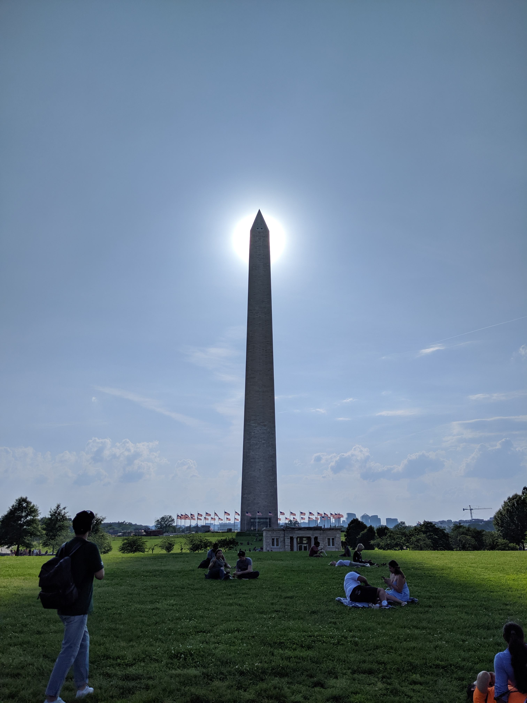

We woke up fairly late today because we were quite tired after our long travel
day yesterday. Our apartment is very close to a subway station which is a few
stops from the National Mall, the big grassy area in front of the Capitol. Our
destination for the day was the Holocaust Museum, a tribute to the genocide of
the Jews by the Nazi regime before and during WWII.

We were not alone going to this destination; there were many school groups who
were at the museum as well. They all were very respectful, and I was happy to
see lots of students learning about the history of the Nazi regime's systematic
annihilation of the Jews. I also saw a lot of MAGA hats, both on students and
other people at the museum. (Sidebar: objectively, the MAGA hats were one of the
best marketing tactics employed by a presidential campaign in the past few
years. It was simple, and became an icon of "the deplorable" majority.)

The museum was very moving. For me, there were two main takeaways; the hatred of
the Jews was widespread and the vast majority of the culture was complicit, and
the Nazis were coldblooded, calculated killers in their systematic extermination
of the Jews.

On the first point, there was antisemitic sentiment in the European mind as far
back as the Roman Empire when the first major contact occurred. It was the
Romans who sent the Jews into their nearly 2000 year diaspora. Even after the
Christianization of the Roman Empire in A.D. 325 when Constantine converted to
Christianity, antisemitism persisted. The theology predominant in that time
period was that the Jews were condemned to hell due to their rejection and
crucification of Christ. Much later, during the Protestant Reformation, Luther
began pointing out the antisemitism of the Catholic church, but he too became
antisemitic later on in his ministry.

In the years leading up to the rise of the Third Reich, many nations began
implementing antisemitic laws. The Nazis gradually implemented more restrictions
on what the Jews could do, who they could marry, where they could live, and
other restrictions. Their European Axis allies such as Romania were quick to
follow Nazi Germany's lead, since antisemitic sentiment was already high an that
region.

It was painfully clear that the general culture in wide swaths of Europe was
ready to be complacent in the face of Government-led antisemitism.

The second takeaway was equally chilling. Not only did the Nazis set up the
infamous extermination camps such as Auschwitz-Birkenau, Treblinka, and Dachau,
but they also killed millions in cold blooded mass executions. During the
invasion of Russia, mobile killing squads followed the invading army into
occupied towns and rounded up all of the Jews. They would march them out to a
nearby forest and force them to dig a massive pit that would become their
graves. Then they forced them to undress and shot them at point-blank range,
letting them fall into the pit or they forced them to walk into the pits over
their dead friends and family and shot them there. Nearly one fourth of the six
million Jews who were killed in the Holocaust were killed in this manner.

There was a display with a pictures of the sky above every single known Nazi
extermination location arrayed on a wall in one of the galleries. I was very
moved by the number of pictures on that wall.

The perpetrators of the Holocaust were not just the relatively few people
working the concentration camps, but the large numbers of Nazi soldiers in the
killing squads. Clearly, they were responsible for massive carnage, and should
have been brought to justice during the Nuremberg Trials. Generally, it became
obvious that the Nazis got off pretty easy during the trials. Of the top
officials who did not commit suicide (Hitler and a few of his top aides did
this), only around 140 were brought to trial at Nuremberg, and only three were
sentenced to execution.

Overall, going to the Holocaust Museum was a very solemn experience. Generally,
I did not really get extremely emotional looking at all of the atrocities, and
the other evidences of the Holocaust: they were absolutely heartbreaking, but
did not evoke a gut-wrenching response. Rather, it was the displays about people
who helped people hide from and escape the Holocaust and about the soldiers who
fought the Third Reich and liberated the camps that caused me to tear up. One
quote that really got me was from a man who helped some of his Jewish neighbors
hide: "How can you say what I did was good? It was what everyone *should* have
done.". The heroism of these people was touching. One thought that was on my
mind was: how could I possibly live up to that legacy of heroic actions? We are
not at war with any evil empires (although we may be at a moment's notice), but
I realized we are in a life-and-death fight right now: the fight for the rights
of the unborn.

We stayed at the museum until close. We stopped and got food from the food
trucks which lined the street in front of the Washington Monument. We sat in the
shade of the Washington Monument as we ate.

After that, we walked over to the Lincoln Memorial, and on the way we stopped at
the WWII Memorial, one of the more recent monuments in DC.

<video
  src="./images/wwii-fountain.mp4"
  width="75%"
  class="align-center"
  autoplay="true"
  controls="true"
  loop="true">
</video>

After visiting the Lincoln Memorial, we walked past the Vietnam War Memorial and
to the White House. At that point, we were quite tired, and we headed back to
the apartment.

