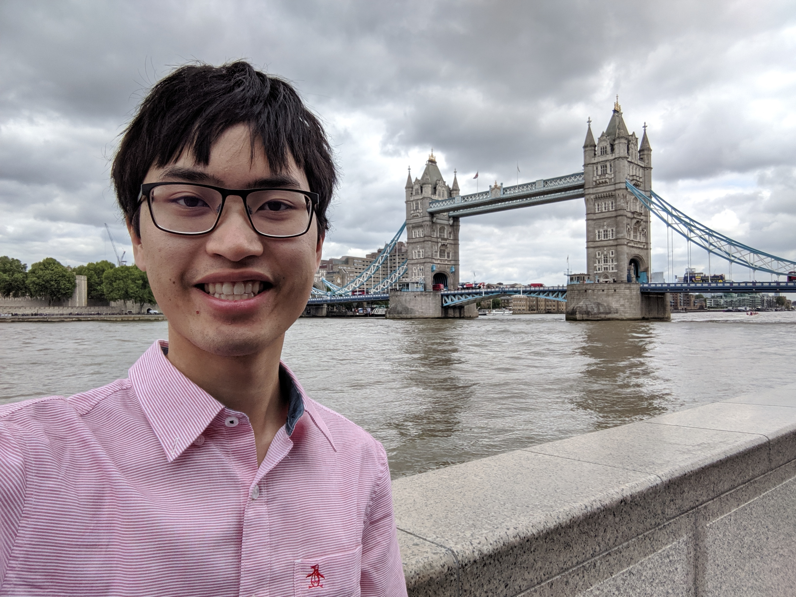

Today we docked in Southampton, England. I disembarked as early as possible so
that I could get in to London for as much of the day as possible. I did the
"self disembark" which basically just meant that I had to carry my bag off the
ship rather than have them take it for me. Mom is staying on the boat to go back
the other direction to NYC.

I took an Uber to the Southampton train station, and then I had to buy a ticket
to get into London. The trains don't leave that often from the station going
directly to London, and one was about to leave. I hadn't had a chance to convert
any currency, so I had to take a terrible exchange rate at the station. It cost
nearly $50 to get into London! Luckily, once I got on the train everything went
very smoothly and I arrived in Victoria Station in London a couple hours later.

After I arrived in Victoria Station, I went straight to the hotel that I am
staying at: Chester Hotel Victoria. It's not a very nice hotel (it's 2 stars),
but the location is great. It was only a couple minutes walk from the station
once I had gotten my bearings. I was too early to check in, so I just left my
bags there so that I could go sight seeing.

I've been to London before, and I've been to most of the touristy locations. For
this trip, then I decided to focus on trying to experience London more, while
still going and seeing some of the touristy sites as well. Of course, one of the
most Londonesque experiences is riding the Tube. We had utilized it when we were
last here, but navigating it alone was a different experience for sure. Good
thing they speak English here. Since I am only here for a few days, I had to be
somewhat smart with what tickets I got. I figured that I would be riding it at
least four times today, and that was the price cutoff for buying individual
tickets vs. the day ticket. So, I grabbed a full day ticket, and headed off. I
think I'll buy individual tickets tomorrow, as I'll only be here for a few hours
in the morning.

First stop was the Tower of London, which isn't much of a tower... I didn't go
in, but I walked around it and then went across Tower Bridge.

I continued walking along the Thames River enjoying the experience of being in
London. I find it very interesting being in England because while the language
is the same, and you can read all of the signs, and you can understand what all
of the people (except for some of the tourists) are saying, it is a very
different culture. The architecture is more European, they have funny accents,
they have a longer history, and their idioms are different.

I was getting hungry at this point, and I didn't really want to spend a lot of
money for lunch. Nothing right along the Thames was cheap, so I went down the
main street that leads to London Bridge and found a bunch of street vendors. I
saw a vendor serving fish and chips, but they only accepted cash, so I had to go
find an ATM and withdraw some British Pound notes. The fish and chips were kinda
crappy, to be honest, but it was filling enough, and I had fun people watching
as I ate. The area I was in is a _very_ touristy area (basically everything
along the Thames between Tower Bridge and the Palace of Westminster is touristy)
so there were people from all over the world walking by.

At this point, I decided to walk across London Bridge to head towards St. Paul's
Cathedral. On the way, I came across the Monument to the Great Fire of London.
It's basically just a tall tower that commemorates the Great Fire of London
which happened in 1666 and destroyed much of the city.

I really like St. Paul's Cathedral. For one, the architecture is magnificent, I
like it better than Westminster. I think that it also holds a special spot in my
heart due to the well-known WWII photograph of St. Paul's rising above the smoke
of a burning London during the Blitz. The cathedral's dome and spires appear to
be floating on a cloud of smoke; and it is illuminated by the light of the
burning fires all around. The billows of smoke behind the cathedral serve as an
eerie backdrop of the scene; and the light reflecting off of the smoke provides
that iconic silhouette of the cathedral's dome.



I continued walking around near St. Paul's and then hopped back on the Tube and
headed back to the hotel to get ready to go to Evensong at Westminster Abbey.

---

Despite the fact that its main funding sources seem to be tourists buying
tickets for tours, the gift shop, and the Government, Westminster Abbey is also
an operating Anglican congregation. As such, they conduct services throughout
the week including Choral Evensong which is what I attended. There was quite a
queue outside of the Abbey of people wanting to attend the service. Most seemed
to be tourists who were either interested in attending a service, or interested
in getting to go inside of the Abbey when there aren't hundreds of other
tourists. I was primarily there for the first, but the lack of irreverent
tourists was nice.

I'm sure some were also there to try and grab a picture inside the Abbey while
there weren't that many people around, but photos are prohibited for people
attending the service (which is a good thing in my book). That's the funny thing
about vacation pictures: taking pictures of static things like monuments and
buildings is fairly pointless (not saying that I'm not guilty of this). I think
it's especially true in places that don't change with the time of the day
(inside) or places where taking pictures is not exactly respectful (a cathedral,
for example). I mean, if you think about it, iconic locales have had _many_
professional photographers take photos of the exact same thing that you are
trying to take a picture of. The difference is that they are actually good at
taking photos and are using a camera that isn't total garbage like whatever you
are using. Stop. Grab, like, one picture so that you can remember you were there
and then use Google to find good pictures of it.

The Evensong service consisted of choral music, prayers, Scripture readings,
corporate recitation of the Apostle's Creed, and other liturgy. I appreciated
that the Apostle's Creed and the Lord's Prayer were recited during the service;
I don't think I've ever been in a service where the Lord's Prayer was recited
corporately as part of the planned service, and I definitely haven't been in one
where the Apostle's Creed was recited so having those as part of the service was
a new experience. I think that more traditional, Evangelical churches should
corporately affirm these core Christian texts through recitation.

After I exited the Abbey, I got this picture of it from the outside with the
light of the evening sun illuminating its façade beautifully. (See, there I go
being a hypocrite and taking pictures that other people have probably taken more
competently than myself.)

The weather was so nice, so I decided to walk back to my hotel instead of taking
the Tube. I also wanted to find something to eat, and I found an English pub and
got a burger. Then, I continued wandering around and ran across Westminster
Cathedral, the seat of the Roman Catholic Church in England and Wales. It's a
relatively recent addition to the London skyline (it was completed in 1903). The
Church of England separated from the Catholic Church under King Henry VIII in
1534. It was not until the late 1800s that the Catholic Church was officially
re-established in England; and the Catholic Church decided to build Westminster
Cathedral.

It has been a full day of travel, sightseeing, and experiencing so I am going to
go to bed.
