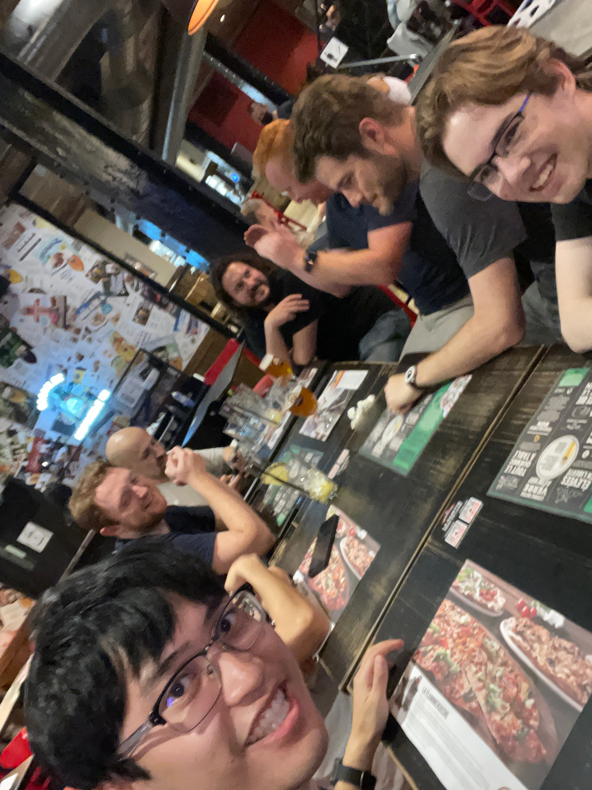

This morning, I met up with Sam, Jo, and Robby and we went to breakfast together
at a café. Then, we headed over to the building museum which opened at 11:00.
The museum is not part of the Smithsonian, but it was very well done. It is
located in a vast building that used to be an administrative office for the
Pension Bureau.

In the covered "courtyard" of the building, they had an exhibit about the
renovation of the Notre Dame Cathedral in Paris. They are sourcing parts for the
roof from all over the world. Also downstairs was an exhibit that discussed some
of the buildings that define city skylines and another exhibit which explored
some of the different materials that have been used to create unique buildings.

We then headed upstairs. There was an exhibit about the twin towers that had
photographs of them throughout the decades and also had images of the new One
World Trade Center. There were many side-by-side comparisons of different views
showing both the twin towers with the new World Trade Center building. I was
glad that we got to see the exhibit so close to 9/11.

The last exhibit that I went to was one about home construction. One side of the
exhibit had cross-sections of a variety of home construction methods. It was
like they constructed a part of a house and then intentionally didn't finish the
layers in various places so that you could see "inside the walls". On the other
side were a variety of common household items from various time periods which
defined the domestic sphere. In the middle of the exhibit were a number of
models of famous homes and housing structures like apartments. There were models
of Monticello, Mount Vernon, and Oak Alley; all of which I have visited. I wrote
about `my visit to Oak Alley
<../../2016-17-caribbean-cruise/2016-12-27-new-orleans-la/>`_ a few years ago on
this blog. There were also models of other famous homes like Fallingwater.

At about 13:00, I left to hop on the train to DCA for my flight to Montreal.
Using the Metro to get to DCA is very easy since it's just a normal stop on one
of the lines. Again, getting to security was no problem either thanks to Global
Entry, so I found a burger at one of the restaurants while I waited for the
flight.

The plane was pretty small. It only had 2 seats on either side of the aisle. The
flight went smoothly, I arrived in Montreal without any issues. After getting
off the airplane, I had to walk what seemed like an entire concourse to get to
customs which was itself quite slow.

After finally getting out, I met up with two coworkers: Ian (an iOS developer)
and Eric (the CEO of Beeper). This was the first time that I'd met any of my
Beeper coworkers in-person, so that was quite cool. We got an Uber to the hotel:
Hotel Monville. A bunch of the rest of team was at a bar and grill a few blocks
away, so we dropped our bags and headed over to meet them.

There are still a few team members who will be arriving later tonight or
tomorrow. We have a big week ahead with a lot of team meetings. While I enjoy
the flexibility of remote work, I'm looking forward to working side-by-side with
my coworkers and getting to know them as three-dimensional humans rather than
boxes on a Zoom call.
