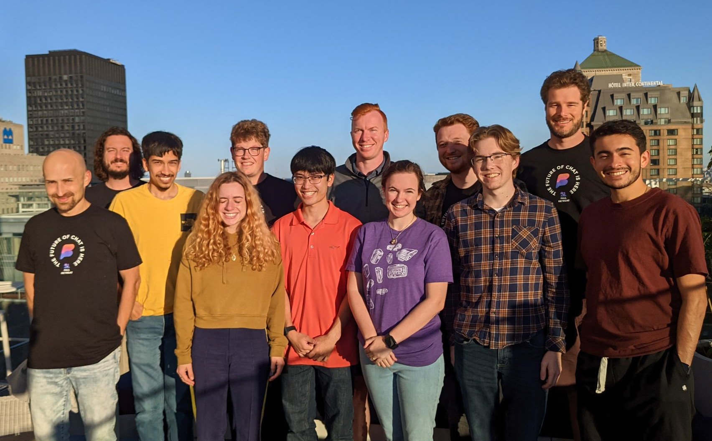
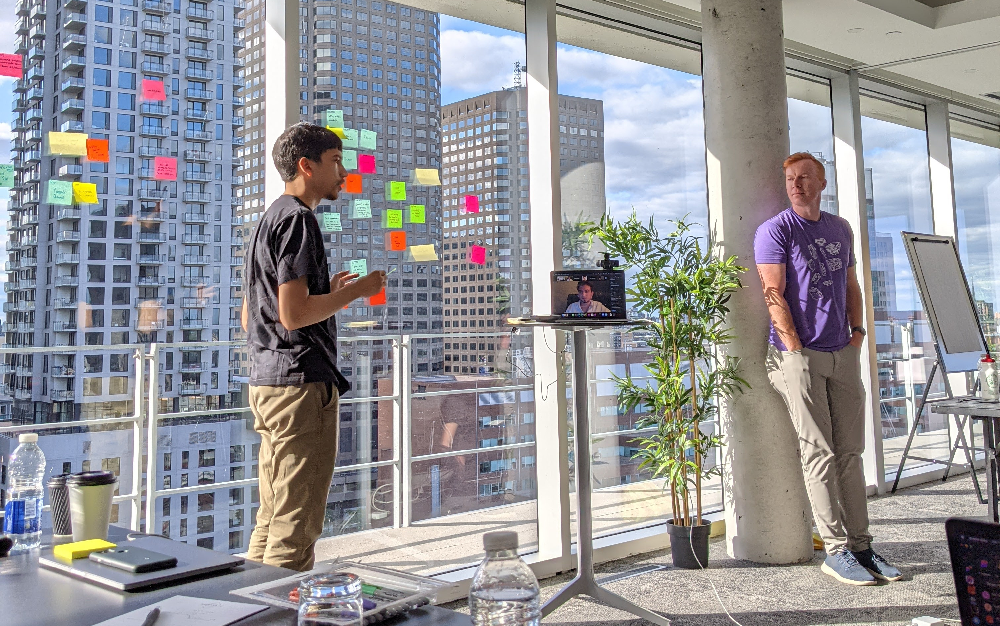
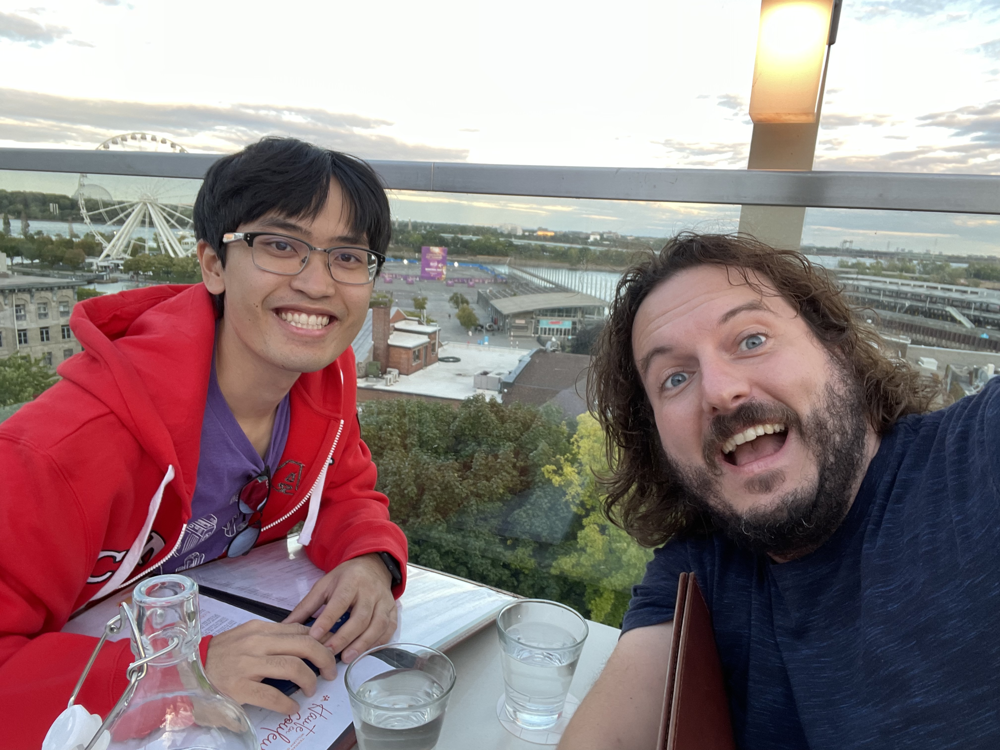
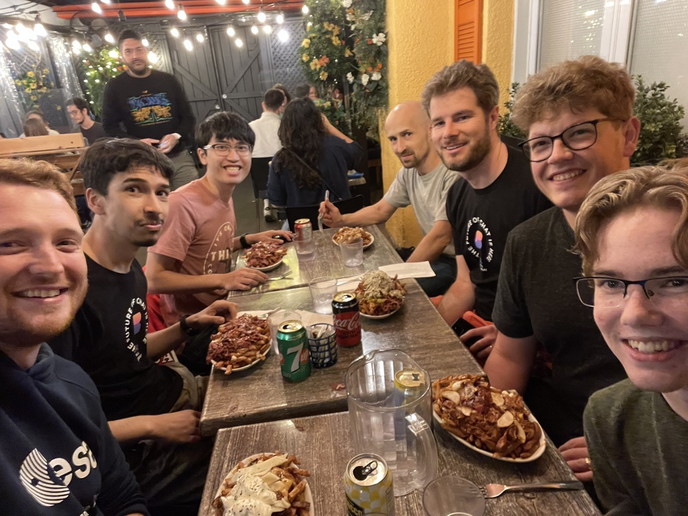

As I mentioned in my `previous post <../2021-09-10-denver-to-dc>`_, the main
reason for my travel was for a work retreat with Beeper in Montreal. The purpose
of the retreat was for all of us to get to work together in person. For most of
us (myself included), it was the first time meeting anyone else on the team in
person. In fact, the closest person to me in the company lives in Provo, Utah.

Instead of relating to you what we did every chronologically, I'm going to give
you some highlights and overall thoughts on the week.

Working With My Coworkers
=========================

Meeting my coworkers in person was the best part of the trip. We are an
all-remote company, so these retreats are the only times we have to work
in-person. I really enjoyed getting to meet everyone and interact with them in
both work and non-work situations. We had somewhat normal work days every day,
but we took advantage of our physical proximity to have more vision, planning,
and retrospective meetings. We went out to eat in the evenings and on a few
days, we had extra evening activities.

   Left to right: Alex, Scott, Tulir, Caroline, Nick, me, Brad, Annie, Kilian,
   Ian, Eric, and Eric R.

I think one of the best parts of the whole experience was that I was able to get
to know people who are not on my direct team. For example, one evening, I sat at
a table with Caroline, the Chief of Staff; Scott, who is on my bridge team;
Alex, an Android developer; Ian, an iOS developer; and Annie, a React desktop
app developer. I really enjoyed all of my interactions with my coworkers, and I
gained a great deal of confidence in their competence and our ability to
collectively get the necessary work done.

The "scheduled programming" of company-wide meetings were really great as well.
On Monday, Brad (CTO) led a company retrospective, and Eric (CEO) led a
discussion about our overall company strategy and our goals for the next few
months. Between these two meetings, it was a great opportunity to reflect on how
the team has come together so far to deliver a product with lots of potential.
It was also an opportunity for us to refocus and recognize that there are a lot
of things that we still have to improve. Despite all of the work we have to do,
I have extreme confidence in my team and our ability to bring Matrix to the
masses.

   Brad (right) looks on as Tulir discusses topics during our team retro.

I would characterize our team as motivated, smart, and scrappy. Many of the
people in the company were hired out of the Matrix and reverse-engineering
communities. For example, Tulir had already built a number of Matrix bridges to
various networks, Annie was already building a Matrix client, and Eric was
already working on reverse engineering before they joined. Because of this, many
of us have external motivation for the work we are doing. In addition to
motivation, the team has a lot of talent. Everyone is really good at their jobs.
I often felt like the dumbest person in the room, which is great because that
means that there's tons of things that I can learn from each of my teammates.
But maybe the most impressive qualities of our team is our passion for
delivering product to customers quickly and not allowing the perfect be the
enemy of the good. That is one of the best things about Eric's leadership: he
encourages us figure out the easiest solution that could work and ship it to
customers and see if they like it. Our team has the motivation to ship a great
product, we are willing to take quick wins where we can, and we have the talent
to accomplish whatever ambitious goals we set before ourselves.

We Are on the Brink of Greatness
--------------------------------

At one point on the last day, Annie asked everyone if we wanted to go to a shop
down the street. I off-handedly mentioned that I was "on the brink of
greatness". I wasn't, I was just about to commit my code, but the phrase stuck
and became our de-facto motto for the retreat. It fits pretty well, too, because
as a company, we are aiming for a lofty goal of fundamentally changing the chat
landscape to an open, federated system where walled garden chat networks are the
exception, not the norm. And while we aren't there yet, that goal seems within
reach.

The entire experience of the retreat has given me confidence in the team's
ability to work together towards that goal and go from being on the brink of
greatness into actually accomplishing our goals. I'm excited to see what the
next few years have in store for us!

Walking Tour
============

On Tuesday, all of us went on a walking tour around Old Town Montreal. I'll
relate just a few of the interesting things that our guide told us about on the
tour.

.. figure:: ./images/walking-tour.png
   :align: center
   :target: ./images/walking-tour.png
   :width: 70%
   :alt: The team on our walking tour of Old Montreal.

   The team on our walking tour of Old Montreal.

Montreal was founded in 1642 by French colonists led by a French military
officer Paul Chomedey de Maisonneuve and a nun named Jeanne Mance. Despite being
integral to the founding of the city, Mance was only granted the status of
co-founder of Montreal in 2012.

On one part of the tour, we passed some large stone warehouses that are now used
as residences and shops. The warehouses were constructed over the spot of the
original hospital in Montreal founded by Jeanne Mance. The original hospital was
close to the port, and because of the commerce going through that area, it was
not ideal for recovering patients. The Catholic nuns decided to move the
hospital to Mount Royal (after which the city is named) and erect the warehouses
in place of the old hospital. Then they rented out the warehouses to merchants
to fund the hospital operations. Quite an inspiring entrepreneurial story, and
quite apt given that we all work at a startup.

Montreal is a historically divided city. There are English and French influences
all throughout the city. In the past, the divide was much greater with many
people not daring to cross over to the other side of the city from where they
grew up. In recent decades, the city has become more integrated, but some of the
divide still exists. It is most visible in the architecture and establishments
of the city. For example, in the plaza where we started the tour, the Cathedral
of Notre Dame (which embodies the French/Catholic influences on the city) is
juxtaposed with the Bank of Montreal's head office (which exemplifies the
British influence on the city).

I really enjoyed getting to go on the walking tour and hang out with my
teammates while learning about and sight-seeing in Montreal.

Dinnertime!
===========

Every evening after work, we went to dinner. On some evenings, we went as a
whole team, but other times we split up and went in smaller groups to dinner. On
Monday, the whole team went to Terrase William Gray which was a restaurant on a
rooftop terrace overlooking Montreal's Old Port area.

   Scott and myself at Terrase William Gray

On Tuesday, a group of us biked over to a poutine restaurant. We joked as we
were riding that doing the bike ride offset the fact that we were eating one of
the least healthy foods on the planet.

   (Left to right) Kilian, Tulir, me, Alex, Eric, Nick, and Ian at a poutine
   restaurant.

On Wednesday, a number of us went to a really good ramen restaurant and then
after we were done, we went to an ice cream place.

.. raw:: html

    <table class="gallery">
      <tr>
        <td>
            
          Caroline, Kilian, Eric R, and myself eating ramen.
        </td>
        <td>
           
          Tulir, Scott, Caroline, Ian, Kilian, Eric, Alex eating ice cream.
        </td>
      </tr>
    </table>

On Thursday, the entire team went to a really fancy restaurant where they served
a four-course fixed-menu meal (which I don't have a good picture of). Then, on
Friday, a few of us went to a Chinese noodle soup restaurant.

.. figure:: ./images/noodles.jpg
   :align: center
   :width: 70%
   :target: ./images/noodles.jpg
   :alt: Eating Chinese noodle soup

   Eric, Tulir, Ian, Annie, Nathan (Annie's husband), and myself eating Chinese
   noodle soup.

All of the food we had was great, and it was nice to be able to get to know my
teammates outside of work.

Overall, I really enjoyed my time in Montreal getting to meet and work with my
coworkers and enjoy great food together, all while being in the beautiful
history-rich city of Montreal.
