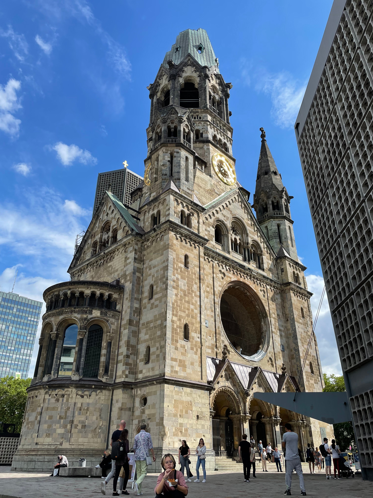

I'm in Berlin for the Matrix Community Summit 2022, but I arrived a few days
early so that I could spend some time sightseeing. I am still trying to put in
mostly full days at work while I'm here in until the Summit starts by working
afternoons and evenings.

On Monday, I went to the TV Tower, the tallest building in Germany. I took the
S-Bahn from my hotel which is just a couple stops away from the TV Tower. The
Tower was built by the Soviets while Berlin was divided between East and West. I
got a ticket up to the observation deck, and the views were great!

All around the observation deck are information panels with pictures of the city
with overlayed information about the various sites in all directions. A two
themes that were prevalent in the callouts: the Jewish influence in various
areas of the city (a very potent topic for obvious reasons), and the East/West
divide imposed by the Soviet occupation.



After walking around the entire observation deck, I walked around in the area a
bit longer. There's a cool clock in Alexanderplatz that shows the time in
different places in the world.



On my way back to the hotel, I stopped at the ALEXA, a large mall and went to
the food court for a currywurst.



--------

On Tuesday, I went to the Pergemonmuseum. The museum is on Museumsinsel and
houses reconstructions of multiple significant historical sites. Most famously,
it houses the Ishtar Gate from Babylon. The scale of the gate is immense, and
the passage leading to the gate is equally impressive. In fact, the
reconstructed passage is significantly narrower and shorter than the actual
passageway, and the gate itself is just a part of the larger gate structure. I
can't imagine how a subsistence farmer in antiquity would have felt as he
approached the gates.



The other major construction was of a Roman market gate. It is an immense
two-story stone structure. It's amazing how much care was put into building the
entrance to something as basic as a market!



I had an audio tour for the museum and walked through many other exhibits in
addition to the main reconstructions. Many were exhibits featuring many
near-eastern antiquities. Whenever I see exhibits on ancient cultures, I'm
amazed by the artistry. There have always been smart and talented people
throughout history, and it's always interesting to have a peek into their lives
through their art.

One exhibit that I enjoyed that is somewhat off the beaten path is the Aleppo
Room. This is a reconstruction of a room from a merchant's house in Aleppo from
around the year 1600. The room is decorated using colourful wood panels with
depictions of events from the Bible such as the Last Supper. There are also
inscriptions from the Psalms as well as Arab proverbs. Most people believe the
room was meant to make people of all faiths comfortable in the home of the
merchant.



After visiting the museum, I headed over towards Charlottenburg. The reason for
going that direction was that I was going to meet someone who was also attending
the summit. I also wanted to visit the Kaiser Wilhelm Memorial Church. The site
has the ruins of a church that was mostly destroyed during the war (as most
buildings were). There's a modern octagonal structure next to the ruins of the
old church. On the outside, it has a very Brutalist appearance, but inside, the
blue stained glass windows create a very reverent space.

<figure>
  <table class="gallery">
    <tr>
      <td>
         
        <b>The ruins of the Kaiser Wilhelm Church</b>
      </td>
      <td>
         
        <b>The mosaic on the ceiling inside of the ruins of the church structure</b>
      </td>
    </tr>
    <tr>
      <td colspan="2">
         
        <b>The inside of the modern church structure</b> 
        The blue light gave an unexpected, but quite nice ambiance to the space.
      </td>
    </tr>
  </table>
</figure>

I then went over to the Technische Universität Berlin campus and worked there
for a few hours, and then met up with Kim, the guy who was attending the summit,
and a friend of his at a doner kebab restaurant. The kebab was fantastic, and it
was cool to meet a fellow Matrix-enthusiast in person.

After eating, we headed back east to go to the NixOS Meetup at C-Base. I've been
using NixOS for a couple years now, and it was fun to meet up with other Nix
users. I'm technically a maintainer of the Nix Home Manager project. (I'm a
somewhat horrible maintainer since I don't spend enough time helping to review
PRs and such.) One of the attendees of the meetup actually was someone I'd
interacted with on GitHub, so that was cool to see actual people that I'd been
talking to online.

--------

On Wednesday, I went over to the Reichstag building. I had done absolutely zero
preparation for the trip, so I didn't have a ticket to go inside. It's quite
impressive from the outside, and maybe in the future, I'll actually plan my trip
and go inside. I hear there's good views from the glass dome.

I decided to walk through the over to the Soviet War Memorial in the Tiergarten.
The memorial is in the Western half of the city, and it commemorated the Soviet
sacrifices during the Battle of Berlin. The Soviets took horrifying losses
during the battle. The Western wartime leaders disagreed about whether they
should continue advancing east or allow the Soviets to face the brunt of the
Nazi army and be the liberators of Berlin. Would the post-war era have been
different if the Soviets were not the liberators of Berlin? I am not sure. But
one thing I know for sure is this: the Red Army fought valiantly to defeat the
Nazis and liberate Berlin. We should honour their great sacrifice.



I then walked towards the Brandenburg Gate. Along the way, I encountered a
plaque commemorating the place where President Reagan gave his *Tear Down This
Wall* speech. That gave me the idea of listening to the two most famous
Presidential speeches given in West Berlin: Kennedy's and Reagan's. I listened
to them as I sat under the shade of some trees near the gate.

Kennedy's speech is most well known for the "Ich bin ein Berliner" part. In
spite of the common perception that this was a gaffe meaning "I'm a jelly
doughnut", it was in fact not a gaffe, and was instead a powerful display of
solidarity with the besieged West Berliners. However, in my opinion, the most
powerful part of his speech was his series of "let them come to Berlin"
statements. I'll copy them here:

> There are many people in the world who really don't understand, or say they
> don't, what is the great issue between the free world and the Communist world.
> **Let them come to Berlin.** There are some who say that communism is the wave
> of the future. **Let them come to Berlin.** And there are some who say in
> Europe and elsewhere we can work with the Communists. **Let them come to
> Berlin.** And there are even a few who say that it is true that communism is
> an evil system, but it permits us to make economic progress. **Lass' sie nach
> Berlin kommen. Let them come to Berlin.**
>
> -- John F. Kennedy

Reagan's speech contains the famous "Mr. Gorbachev, tear down this wall!" line,
but most of the rest of it was actually very policy-heavy. It was a
significantly longer speech than Kennedy's. He championed the success of the
Marshall Plan and the economic success of the West. He also called for arms
reductions and more openness between East and West Berlin. It was clear in the
content of the speech that Reagan did not expect the wall to fall only two years
later, but fall it did.

Kennedy's speech was much more emotionally potent, while Reagan's was much more
politically potent. I think they were the right speeches for their times, but if
I were to choose just one to exist, it would be Kennedy's.

After listening to the speeches, I made my way through the gate. I thought about
the fact that just a few decades ago, that gate was closed off and barricaded by
armed guards. Yet today, you can't tell which side was on the East and which was
on the West. In fact, the plaza on the eastern side of the gate seems to be the
more popular tourist destination. (It is a pedestrian-only zone unlike the
Western side, so maybe that is the driving factor there.)



By this time, it was about lunchtime and I got a currywurst from a food stand
before heading back to the hotel to work for the afternoon and evening.

-------

Berlin is a beautiful city. That it was divided for so long is a tragedy. The
scars of communist rule can still be seen across the city. But the unity of the
German people was stronger than the political forces separating them, and today,
Berlin is a vibrant metropolis and was an absolute joy to visit.
