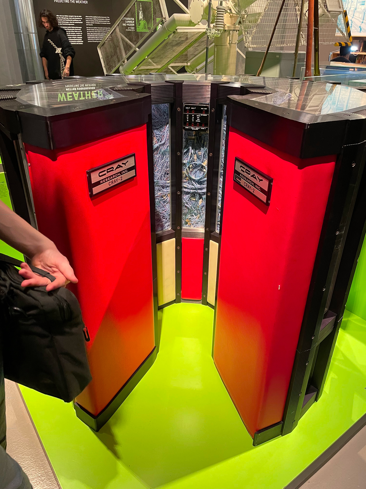
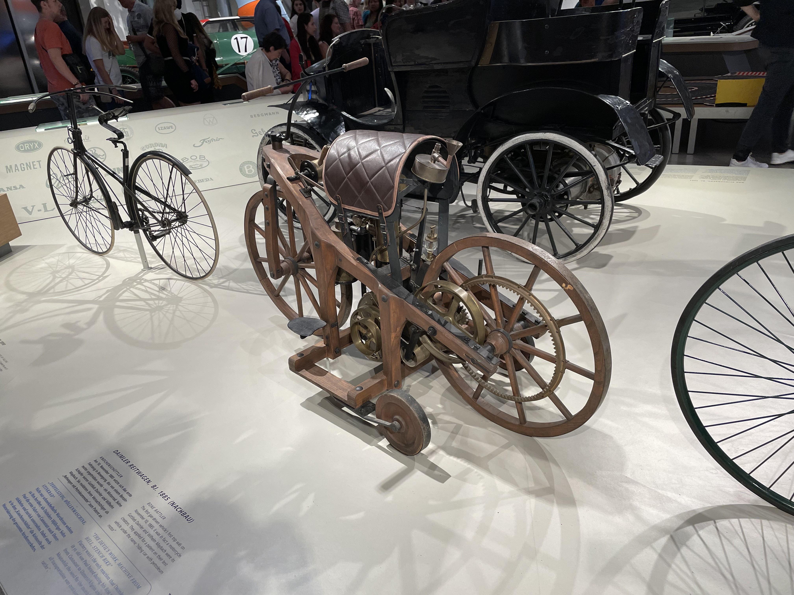

The main purpose of my trip this week was for the Berlin Matrix Community
Summit, an event organized by members of the Matrix community in Berlin. Matrix
is the chat protocol that Beeper (the company I work for) is building our chat
app on top of. The protocol is developed openly, and has a large community of
open source developers, projects, and businesses all building on top of Matrix.
This summit was the first Matrix-only event. There have been other events at
which Matrix had a large presence such as FOSDEM, but this was the first
ever Matrix-only event.

The people attending the event had quite diverse reasons for attending. Some,
like myself, work full time at companies building on top of Matrix. Others are
system administrators at institutions that are running Matrix servers for their
internal chat needs. Still others are enthusiasts building projects with Matrix
or wanting to learn more about the ecosystem. In total, at least fifty-seven
people were in attendance!



The summit was held at c-base, an open-source-focused hackerspace in the heart
of Berlin. There were three rooms for talks and workshops and a packed schedule
with three tracks throughout most of Friday and Saturday. There was also space
outside by the River Spree with tables to hang out at.

# Barcamp

On Thursday we had a [barcamp](https://en.wikipedia.org/wiki/BarCamp) which
comprised of a meet-and-greet and introductions followed by creating a small
schedule of discussions on some of the topics where there was mutual interest.
At the discussions I attended, we talked about bridges, server load testing,
various clients, and the Matrix specification.

In my opinion, the most interesting thing about the discussions was getting to
know some of the conference participants and learn from their expertise and also
their questions. The experience that everyone brought was quite diverse: Nadine
is a UX designer, Nico is developing a native Qt Matrix client called Nheko, Jan
is a network administrator of a Matrix deployment at Universität Graz in
Austria, Christian works on bridges at Element, I work on Bridges at Beeper,
Aiman just started working at a company that is building tools for bridging
chats across multiple chat networks through Matrix, Jose works at a company
building tools for businesses to bridge customer support chats into Matrix, Kim
is a maintainer of a Python bot library and runs a homeserver for a couple dozen
users, networkException is a high school student who maintains various open
source projects including some related to Matrix, Henri and Charles are working
on two unrelated social media platforms built on top of Matrix, and that was
just a some of the participants in the barcamp which itself was a small subset
of all the conference attendees.

# Talks and Workshops

On Friday and Saturday, there was a full schedule of thirty-six talks and
workshops hosted by twenty-four different presenters. During most of the
conference, there were three tracks going at once. There were so many that I was
not able to attend all of the ones I wanted to attend! I'll give a few
highlights of talks and workshops that I enjoyed.

* **Valentin's *Show us Your Homeserver* workshop**

  As one of the first workshops of the summit, Valentin facilitated a time for
  people to discuss their homeserver configurations.

  He had many interactive activities where we would break into groups based on
  various options that we had selected for our homeserver setups and discuss why
  we had chosen that particular setting. It was cool to get to meet some other
  homeserver admins and see what they were doing for their setups.

  

* **Alex's Kubernetes talk**

  In a presentation about his homeserver setup, Alex Babel discussed how he uses
  GitHub, ArgoCD, and Kubernetes to manage his Synapse instance. The talk was
  quite interesting and it was cool to see a smaller homeserver deployed using
  Kubernetes. We deploy using Kubernetes at Beeper, but I'm not directly on the
  team that manages it, and it's quite complicated, so I don't really have a
  grasp of what's going on, but it was easy to understand Alex's setup since it
  was at a smaller scale.

* **Ben's Rust SDK talk**

  The lead developer on the Rust SDK from Element presented their work on the
  Rust SDK. The talk discussed why the new SDK was being developed, examined the
  features and benefits of the latest SDK, and he gave a preview of some of the
  things that they are planning on implementing next.

  

* **Yan's Conclusion Talk**

  Yan, one of the main summit organizers gave the keynote presentation to
  conclude the summit. His talk was about the future of Matrix, and he
  communicated with a "friend from the future" via Matrix. This friend sent him
  notes about what future would bring in the Matrix ecosystem. The conclusion of
  the talk was an admonition to go build the future we want to see!

There were other talks that I attended that were very good including one by Hato
about Matrix-backed collaboration widgets that his company has written for
public-sector clients and Kim's presentation about the Matrix Reminder Bot and
his workflow with it. Additionally, there were many other talks and workshops
that I wasn't able to attend.

In all, the quality of the talks was fantastic, and I learned tons from everyone
at the summit.

# Presentation Time!

In addition to attending many talks and workshops, I gave a few as as well. On
Friday, I gave a [presentation about Hungryserv](), a project that we are pursuing at
Beeper to help us scale to more users. I was happy that so many people were
interested in the project, and the attendees had many great questions.



On Saturday, I gave a presentation about [what Beeper is working on](). I explained our
vision, talked about Beeper, discussed what we've built and what current
challenges we have, and described what it's like working at Beeper.



I also teamed up with Kim to give a workshop on how to write Matrix bots in
Python. He presented
[simplematrixbotlib](https://github.com/i10b/simplematrixbotlib/) and I
presented [maubot](https://github.com/maubot/maubot). Then we gave participants
some time to work on a bot of their own.

It was a pleasure to be able to give the talks and tell people about things that
I'm passionate about.

# The Hallway Track

One of my favourite parts of the entire event was being able to meet and talk to
so many people in the community. The organizers provided many great
opportunities for such interactions including barbecue dinners on Thursday and
Saturday (sponsored by Beeper) and a dinner at a nearby Chinese restaurant on
Friday (sponsored by Element).

During the barbecues, we had steaks, bratwursts, grilled vegetables, and cheeses
along with some bread and lots of different sauces. Yan and Nadine were the main
ones in charge of the conference food, but as the only Beeper employee in
attendance, I did my best to help. They had thought of pretty much everything,
though, so my role was mainly to take credit for securing funding for the food
:)



Food is always such a great unifier, and it was cool to interact with people
outside of the formal scheduled event. I talked with everyone from some students
running a Matrix server for their university's IT department to a digital
activist advocating for data sovereignty and privacy laws in the EU.

On Sunday, there was nothing in particular scheduled, but a handful of people
gathered back at c-base to hack on various Matrix-related projects. It was a
nice, relaxing way to end the conference.

## Lange Nacht der Museen

On Saturday night, a few of us headed out after dinner to *Lange Nacht der
Museen*, an event in Berlin where the museums are open late into the night and
you can visit all of them for a discounted fee. Christian, networkException,
Jan, and myself went, and we started at the Deutsches Technikmuseum which is a
technology museum inside of an old train station. The museum had displays about
the history of many different technologies including automobiles, motorcycles,
audio-visual equipment, networks, and computers.

<figure>
  <table class="gallery">
    <tr>
      <td>
        
        <b>A CRAY-2 computer</b> 
        There are so many wires! Imagine having to debug which one was faulty!
      </td>
      <td>
         
        <b>An early motorcycle</b> 
        I don't think this would pass any modern safety inspections...
      </td>
    </tr>
    <tr>
      <td colspan="2">
         
        <b>An early Benz automobile</b> 
        This car came out a few years after the Ford Model T, and it's obvious
        that even then, it was meant as a luxury alternative.
      </td>
    </tr>
  </table>
</figure>

After the Technikmuseum, we went over to the planetarium. It was about to close,
but we managed to go in and see a short animated film about a space station and
the interactions between an astronaut, a fish, a tiger, and a boy (who I think
was based off of Mowgli). It was a cute little film, and a fun way to end the
evening.

# Conclusion

In all, the summit provided many opportunities to meet people in the community
and get to know them on a personal level. I'm grateful for the organizers
putting together such a great schedule!

I think the Matrix ecosystem has a bright future ahead of it. I feel like all of
us in the community are at the start of something big. There are so many smart,
energized people working on Matrix, and I feel fortunate that I was able to get
to know a few of them at the summit. I hope that history will consider many of
the people in attendance at this summit as pioneers of their respective niches
within the Matrix ecosystem.

Matrix is a community. It's not dependent on a single company. And after
attending the first ever Matrix Community Summit, I can say with confidence that
the Matrix community is strong.

The future of Matrix is bright: now we just have to go build it!
