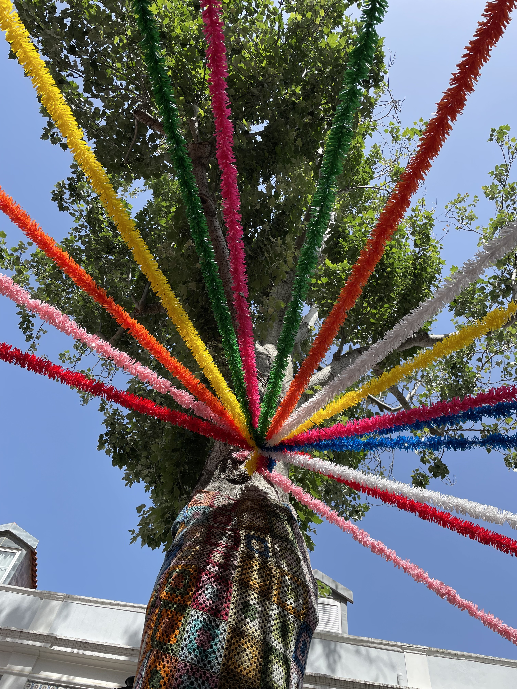
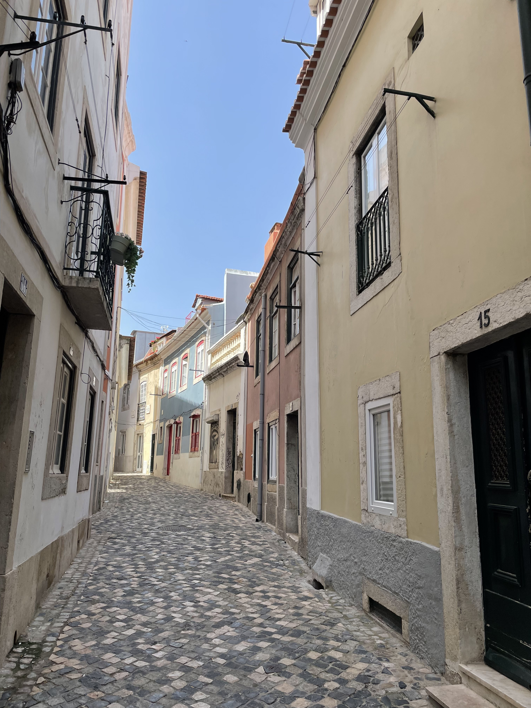
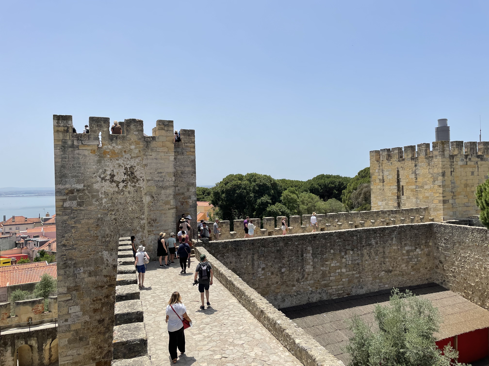
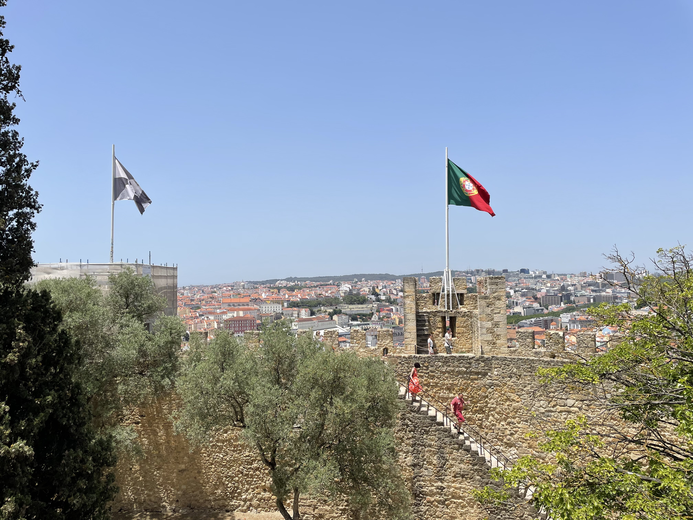
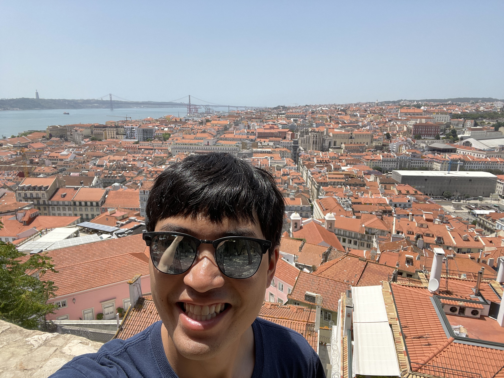

Today, I went to the Alfama district and toured the Castelo de São Jorge. Then,
in the evening, I went out with some people from the hostel to the streets where
there were celebrations for the _Feast of Saint Anthony_ which is the largest
festival in Lisbon.

After a small breakfast at the hostel, I started walking over towards the
Castelo de São Jorge in the Alfama district which is the old quarter of Lisbon.
My goal was to eventually get to the castle, but I wanted to enjoy walking
through the old quarter on my way, so I went at a very leisurely pace.
The streets were beautiful, and in some areas, people were already setting up
decorations for the celebration that night.

<figure>
  <table class="gallery">
    <tr>
      <td>
         
        <b>Colorful decorations attached to a tree in Alfama</b> 
        The streets were decorated throughout the day.
      </td>
      <td>
         
        <b>A narrow street in the Alfama district</b> 
        The streets were very picturesque and I took my time enjoying the
        beauty.
      </td>
    </tr>
  </table>
</figure>

---

The Castelo de São Jorge is situated on the top of a hill that has great views
of the city. Because of this, it has been a strategic stronghold for every
civilization that lived in the area. The area of the castle has Roman ruins and
evidence has been found of settlements as far back as the 8th century B.C. The
main castle on the site was built by the Moors during the Arab occupation
Additional structures were built after the Christian reconquest of the area when
the castle became a royal residence.

The castle grounds are home to a museum which contains many artefacts from the
various periods of settlement in the area.

<figure>
  <table class="gallery">
    <tr>
      <td colspan="2">
         
        <b>A panorama of the castle's main entrance</b> 
        There was a substantial moat around the walls protecting the castle.
      </td>
    </tr>
    <tr>
      <td>
         
        <b>Atop the castle walls</b> 
        The castle's defensive perimeter was quite impressive.
         
         
      </td>
      <td>
         
        <b>The castle walls on the opposite side</b> 
        The Portuguese flag is flying in the foreground and the city can be seen
        in the background.
      </td>
    </tr>
    <tr>
      <td colspan="2">
         
        <b>The views of Lisbon from the castle heights</b> 
        The views of the city from within the castle were stunning. I can see
        why it was chosen as a defensive outpost.
      </td>
    </tr>
  </table>
</figure>

After spending a couple hours at museum and the castle, I wandered back through
Alfama towards the Se de Lisboa (Lisbon Cathedral). When I arrived, there was a
televised wedding going on. I looked it up, and apparently it is the *Wedding of
Saint Anthony* a collective wedding for a set of 16 couples that happens every
June 12th. In the past, poor couples were chosen for the wedding. Although,
today I am not sure if being low-income is one of the qualifying factors.

As I continued walking through Alfama, the streets were a bustle of activity as
people set up make-shift stands for selling beer, shots, and bar foods.



---

I went back to the hostel for dinner. After dinner is when all of the Feast of
Saint Anthony festivities were supposed to begin. The first thing was a parade
that we heard was going to happen that came right down the street in front of
the hostel. The parade was quite lame. Even more lame than the [one that mom and
I watched in Bermuda]()! In the almost
hour we watched from the balconies of the hostel, maybe four or five "floats"
came by. Most of them looked like childrens' bands from local schools. We kept
thinking there'd be something more interesting, but nothing came.

At that point, a large group of around twenty people from the hostel headed out
to the actual celebrations on the streets. There was one guy who anointed
himself leader of the pack and was like "I'm going to the big party" so we all
followed. But he led us to Barrio Alto, which was overcrowded, and wasn't a very
fun atmosphere. The group got split up pretty quickly. I ended up with a group
of around six people who wanted to go over to Alfama, the old quarter which I'd
walked around in the morning. By the time we walked the half hour over to
Alfama, we'd lost a few more people who wanted go see other festivities and it
was just a guy named Ben and myself.

The Alfama district was alive with live bands playing music, people in the
narrow streets partying, and makeshift beer stands and food vendors lining the
streets. We wandered about letting the crowds dictate the direction we went. The
atmosphere was amazing and it was super fun to be in the middle of the biggest
festival of the year in Lisbon.



Each street had a few stands set up selling food or beer (or both). There are
two main beer companies in Portugal: Sagres and Super Bock, and it seemed like
they were having a competition of who could sell the most beer :) They tasted
fairly similar to me.

After partying early into the morning, we headed back to the hostel for much
needed sleep.
