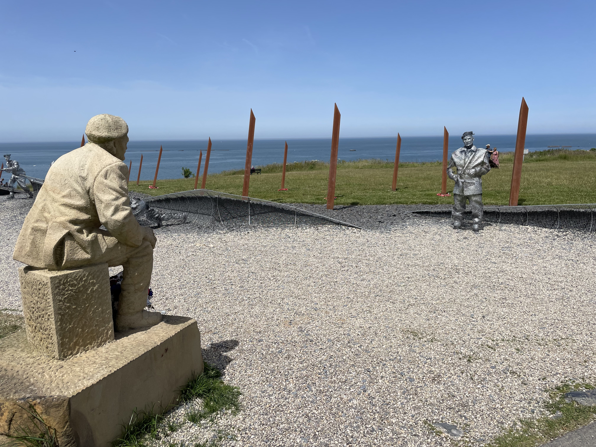
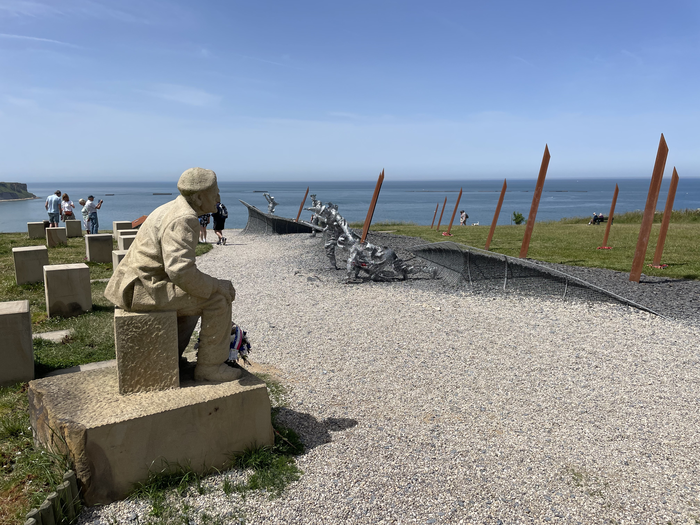

Today, I took a day trip to the Normandy beaches. The tour visited Omaha Beach,
the American Cemetery at Omaha Beach, the D-Day museum at Arromanches (Gold
Beach), and Juneau Beach.

This post has taken me a long time to write because I wanted to do justice to
the topic, and capture some of my thoughts and emotions from the day.

Omaha Beach was our first stop. When we were there, it was high tide. The water
came right up to the sea wall.

The D-Day landing was scheduled for low tide so that as the infantry advanced
and cleared the obstacles, larger craft could be landed further up the beach.
Nothing went to plan, however. Due to navigational difficulties, lack of
accurate naval and aerial bombardment, and other complicating factors, the
Americans who landed on Omaha met the fiercest resistance of any beachhead.

A few years ago, I [had the pleasure of hearing from D-Day veterans]() while on the Queen Mary II. Many of their stories came to mind as I stood
on the sea wall looking out towards the ocean.

I imagined the hundreds of yards of virtually barren beach littered with
anti-personnel and anti-watercraft mines. I imagined the blanket of deadly
small-arms and mortar fire raining down from the strongholds above the beach. I
imagined the artillery shells from further behind the line crashing into the
troops. I imagined the thousands of men (most barely so) struggling to come
ashore, many dying before even arriving on dry ground, and many more within
seconds or minutes of reaching the beach.

Then I looked the other direction towards the bluffs which rise above the beach
about 200 yards beyond the sea wall. Although the ridge at Omaha was not nearly
as high as in certain places along the line such as Pointe du Hoc, they
nonetheless looked fairly difficult to scale even today. I can't imagine what it
was like trying to attack them head-on. As I looked at the bluffs, I imagined
the young German defenders, equally terrified of the large incoming American
offensive as the Americans were of the German fortifications. I imagined them
beginning to realize that the Americans were, in spite of the odds, gaining a
beachhead, and wondering whether they would be reinforced.

Then I looked up and down the beach, taking in the scale of the area that was
targeted by the invasion. Barely visible in the distance in one direction was
Point du Hoc, and all the way to the horizon in the other direction, slightly
curving out to sea was endless defensible beach and bluffs.

{{< figure 
      src="./images/omaha-beach.jpg"
      link="./images/omaha-beach.jpg"
      target="_blank"
      title="A view of the sea wall at Omaha Beach"
      caption=`The sculpture in the water is in the shape of knives and
        depending on the tide is either partially submerged or entirely exposed.
        It has a dual meaning. It represents the violence of the battle and it
        also represents the lives cut short by the war.

The monument above the sea wall commemorates the American troops who landed at
Omaha to begin the liberation of Europe.`
>}}

---------

Our next stop was the American Cemetery at Omaha Beach. It is a vast complex
with thousands of graves of fallen American soldiers. The majority of the bodies
of the fallen were repatriated back to the States for burial, but many families
chose to have their sons interred in Normandy, near the place of their death.
All of the gravestones point west back towards America, from whence they came.
Through the trees, Omaha Beach is visible. The cemetery slopes slightly down
towards the beach.

Walking through the uniformly laid out cross and Star of David markers was quite
moving. So moving, in fact, that I even have been inspired to write a poem of
sorts about it.

> Seventy-five years apart, we came to Normandy. 
> Two different circumstances: one to liberate, one to commemorate. 
> Yet here be the same waters, the same sand, the same hills, the same fields. 
> The tides come and go; the forces of creation are constant. 
> Oh how fleeting are the forces of men.

(OK, I don't think I'm winning any Pulitzer for that.)



---------

The next stop was Arromanches. It's a town near Gold Beach where we stopped for
lunch before proceeding to a hill overlooking the beach where there is a D-Day
museum.

We watched a film with footage from the day of the battle, but there were two
other things that I found most compelling. First, from the heights above the
beach you can still see to this day the remnants of the temporary port that the
engineers built to allow the allies to offload materiel from larger vessels
before the capture of already-established deep water ports.



Seeing the remnants of the port that is featured in so many pictures was
stunning. It just gave some perspective on the magnitude of the engineering
operation needed surge in troops and supplies into the ever-growing beachhead.

The second thing that was very impactful was a statue of a D-Day veteran looking
at his younger self emerging from the waves on the beach. The younger version of
the veteran was formed from welded-together bolts, and only the front was
formed, evoking a sense of ephemeralness. Further down the metal sculpture were
similar representations of men emerging from the waves onto the beach. The way
the sculpture was crafted, from one angle you could see the man being
represented, but from another angle, the figure could almost be mistaken for a
pile of debris.

<table class="gallery">
  <tr>
    <td>
      
    </td>
    <td>
      
    </td>
  </tr>
</table>

---------

The last stop on the tour was a brief stop at Juno beach, the Canadian landing
site. Among the exhibits were some of the defensive works that constituted the
coastal obstacles.



After that, we took the long ride back back to Paris. It was late by the time we
got back, and after a quick dinner I went to bed. I have to be up tomorrow early
for a tour of the Louvre!
