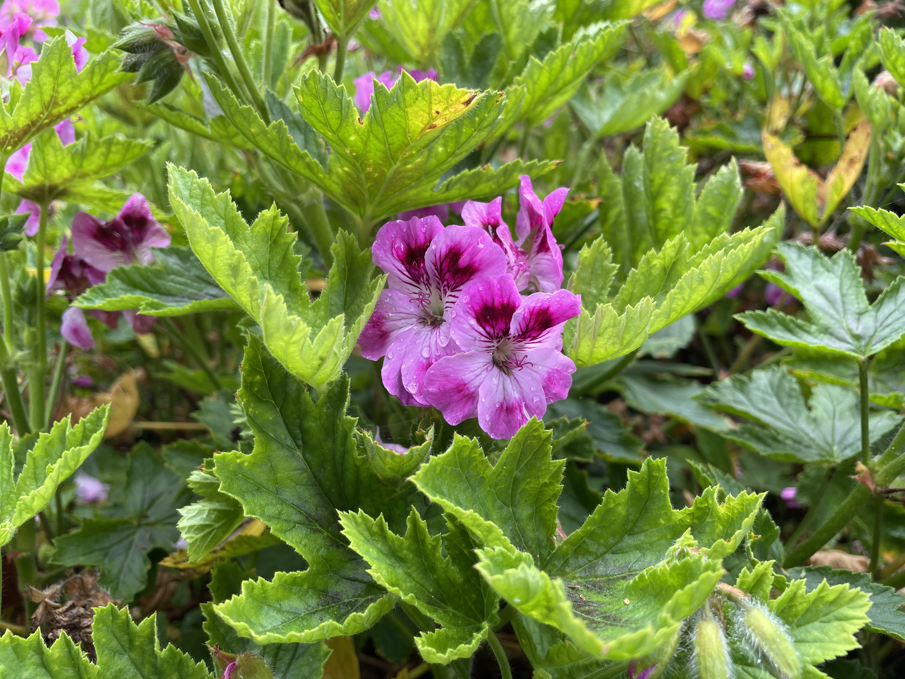

This week, I went to Oakland to visit a friend Jack Garner, a friend from school
who works at Salesforce out in San Francisco. I flew in in the evening on
Tuesday to minimize the time I had to take off of work. I worked for the first
two days and then we both took Friday and Monday off for a long weekend.

## Working from California

On Wednesday, we both worked from his apartment. That is the nice thing
about having a remote job in software engineering: you can work anywhere that
has Wi-Fi. In the evening, we went to a trendy food court. I had a nice bowl of
ramen.

On Thursday, I took my standup meeting from his apartment, and then we took the
train into San Francisco to work from Salesforce Tower for the rest of the day.
Jack gave me a tour of the Salesforce-occupied floors of the tower including the
top floor which would have had great views except for the complete fog cover. We
could barely even see the ground around the building! There is an elevated urban
park above the transit system and which connects a few office buildings near the
Salesforce Tower. We took a walk around that and then I headed to the WeWork at
the tower and he headed to the Salesforce floors for the rest of the day.

At lunch, we met up to go to a Vietnamese place. Another Mines student, Brooks,
who just started at Salesforce, joined us. Both Brooks and Jack were students in
the
[Architecture class I taught]()
a couple semesters ago, so it was a fun reunion.

## Golden Gate Park

As I mentioned, we both took Friday and Monday off of work to have a long
weekend, and spent the weekend sightseeing.

On Friday we went to Golden Gate Park, which is a large park on the west side of
San Francisco similar to Central Park in New York, but bigger. There are walking
paths and some roads through the park, and there are various ecological,
cultural, and educational sites scattered around as well.

There is an art museum and a science museum, but we skipped those as they are a
bit expensive, and I wanted to do more active and outdoors stuff (and man did we
do _a lot_ of walking). One of the things in the park is a botanical garden. We
went there and walked around the entire thing. I was amazed by the biodiversity
that they were able to cultivate. They have everything from redwoods to cacti
and other plans found in arid regions. There's even sections with more tropical
foliage. I'm no botanist, but I really liked looking at all the big, bright
flowers.

<table class="gallery">
  <tr>
    <td>
      
    </td>
    <td>
      
    </td>
  </tr>
</table>

By the time we were done wandering at the gardens, it was well into the
afternoon and getting food was the most pressing concern. We found a burrito
restaurant Casa Barajas near the park. The burritos were quite good. One unique
thing they did was slightly toast the tortilla so it was crispy rather than soft
on the outside.

After lunch, we walked over to this little lake with an island in the middle
with an artificial waterfall. Interestingly, the water was tinted green. We
weren't quite sure why, though we looked it up later and it was due to an algae
and it caused the entire water system to have that green tint to it.

After looking at the green waterfall, we continued walking to see the small
bison herd that is kept within the park. Apparently, the Bison were brought
during the 19th century and a small herd has lived there ever since. It was
quite surreal seeing Bison in the middle of a coastal Californian city.



By that time, we were quite tired from walking around so we headed back for the
day.

## Muir Woods Forest

The next day, Jack and I headed over to the Muir Woods National Monument. It's a
forest full of beautiful redwoods. We drove to a bus stop where we boarded a
shuttle to take us to the forest.

We took a hike through the woods, and saw so many beautiful, tall trees. Along
the main footpath, there were also displays with information about the trees and
the forest. Some of the trees are over a thousand years old! I also learned that
redwood trees capture water from the low cloud-cover that often hovers near
coastal areas.



On the hike, we had a bit of excitement because I got stung by a wasp right on
the earlobe! The wasp was trying to extract its stinger from my earlobe, but
couldn't fly away. Jack had to poke it off with a stick to get it off my ear. My
ear felt warm and tingly for the rest of the day. The best way I can describe
how it felt is that it's like how your ears feel if you are in the cold for an
extended period of time, and then come back inside to a warm house. Luckily, I'm
apparently not too allergic to the stings, so it ended up being just a fun story
to tell.

After hiking and walking around for a couple hours, we took the bus back to
Jack's car and then we found a seafood restaurant for a very late lunch. I had
the Mixed Catch Fish & Chips and it was delicious.

I wanted to go see the Golden Gate Bridge from the North side (where many of the
most famous pictures of the bridge are taken), so we drove over. Unfortunately,
all we saw was fog.



We are going into San Francisco tomorrow, so hopefully it clears up enough that
I'll be able to see the bridge from the other side.

## Fisherman's Wharf

On Sunday, we returned to San Francisco to spend the day at Fisherman's Wharf,
an area on the north side of the city that used to be the main port for the city
in the days before container ships took over global shipping.

The pier area is very extensive. Almost all the piers have been converted to
commercial spaces. Some are now parking lots while others have been converted to
museums or restaurants and gift shops.

We ended up at Pier 39, which is a very tourist-y, commercialized area. It was
full of shops and it kinda felt like Disney World. At the end of the pier, there
was a great view of Alcatraz. The fog was lifting right about that time, so we
got a good view.



We stopped for lunch at Fog Harbor Fish House. I had the Seafood Penne and it
was delicious. The seafood really is so much better on the coasts...

By the time we were done with lunch, the fog had lifted even more, so we took
a bus over to the Golden Gate Bridge.



We walked a little way along the bridge and then made our way over towards
Lombard Street: the really windy road that everyone likes to take pictures of.
Apparently people also like to drive down it, too. It seems like they always
have police there to control the traffic. I have no idea why you would want to
wait for hours to drive down a windy road, when you can walk down it and have a
much better time. I also can't imagine living along the street. Thousands of
tourists giving by your house every day must get old; and the only real benefit
is saying that you live on Lombard Street.



It was fairly late in the afternoon at this point so we headed back to Jack's
apartment for the evening.

## Raquetball

On Monday morning, we went to a gym to play racquetball. When we were in school,
Jack was the president of the racquetball club at Mines, and we played fairly
regularly. Neither of us had really played since then (especially because the
pandemic closed things down). We played for a couple hours in the morning, and
then he took me to the airport for my mid-afternoon flight.

-----------------

I enjoyed spending time in California. It was the first time I'd been able to
visit the state for an extended period of time. The only other time that I'd
spent time in California was for the
[Facebook Global Hackathon Finals](),
but we were at Facebook headquarters and the hotel for almost the entire time.
Funnily enough, Jack was on my team for that hackathon, and I'd consider our win
at that hackathon to be the crowning achievement of my college career, and I
think it will remain one of the peaks of my entire career.

It was great getting to spend time with Jack. We'd spent tons of time together
during school since we were in the same clubs and activities. I was glad to get
to catch up with him and see California. It was very nice of him to host me at
his apartment, and I really appreciated it.
