A couple weeks ago, my company had our week-long 2022 Q1 work retreat in Playa
del Carmen, Mexico (about an hour south of Cancun). As with the [previous work
trip](../2021-dc-montreal/2021-09-13-17-montreal), the purpose of the retreat
was for us to get to work together in person and to bond as a team. I got to see
many of the people who were in Montreal again, and got to meet some of the new
team members who have joined the company since September.

Seventeen team-members were able to attend this retreat. We rented two Airbnb's
for the team and we spent our days at the larger of the two. Because we were all
basically in the same house for a week, it had a more communal feel than
Montreal and I felt like we were really able to get to know each other as a
team.

I shared a room in the main Airbnb with Eric R., Josh, and Ian. It was quite
spacious and worked well for us. The house had a really nice family room with a
couch that became a popular location to get some work done. It also had a nice
outdoor patio, a pool and hot tub, and hammocks.

Doing Some Work
===============

On Monday, we had a retrospective meeting where we discussed things that we
thought had gone well since the last retreat, things that we thought had gone
poorly since the last retreat, suggested ideas about what we wanted change about
the company, and a listed questions we wanted to discuss.



On Tuesday, we had a team vision meeting outside on the patio. Eric laid out our
vision (which at a macro level hasn't changed since Montreal), and discussed
some specifics about what that will look like over the next few months.



Throughout the week, we had a combination of normal work tasks and ad hoc
meetings. My primary goal this week was to pair with
[Finn](https://gitlab.com/thefinn93) on some tasks related to the [Signal
bridge](https://github.com/mautrix/signal). Finn is a new member of the team who
joined a couple months ago. He is the author of
[signald](https://gitlab.com/signald/signald) and we hired him partially so that
we could have in-house expertise on signald (which runs alongside
mautrix-signal) and Signal itself. Our goal was to migrate signald to use
PostgreSQL instead of SQLite. The reason for this is that it is significantly
easier to optimize the performance of Postgres databases (there are lots of
settings that you can change) than SQLite databases (which are quite difficult
to optimize since they are essentially disk-speed constrained). It was very nice
to have Finn to bounce questions and ideas off of while we worked on the
migration. By the end of the week, we'd proven that the migration would not only
be viable, but would produce actual noticeable improvements to the Signal bridge
performance.

One of the nice things about working in close proximity to one another was that
we were able to overhear conversations that other people were having and hop
into them. For example, on Tuesday, I overheard some of the desktop team members
talking about the chat networks dialog (the way that you connect Beeper to the
other chat networks from the desktop app). I was interested in their discussion
because I had some ideas about how the dialog should work from a bridge
perspective. I joined right in and talked with them for a half an hour about how
they were wanting to improve the dialog and how that lined up with thoughts that
I had.

For those unfortunate enough to be responsible for fixing production issues, the
proximity has some downsides. On Wednesday, I woke up and when I looked at my
phone, I saw a slew message in our infrastructure channel about some failures
with our iMessage bridge (which Eric R. maintains). Unfortunately for him, he
was waking up about the same time and the first thing he heard from me was "good
morning, have you checked the infra chat?". I'm not sure if that's a better or
worse way of hearing about production issues than getting paged via PagerDuty.

Squashing Some Bugs
===================

A few minutes walk away from the Airbnb was a Gelato shop that we visited on
multiple occasions. One evening, a group of us were enjoying our frozen treats,
and Finn got into a conversation with Wellington (one of our iOS developers). It
went something like this:

**Finn:** Oh, I found a bug in the iOS app. 
**Wellington:** Oh, tell me about it 
**Finn:** Ok, so this is a very important part of the user story for this
ticket. I was eating some ice cream... 
**Wellington:** What flavor? 
**Everyone:** <<Laughing>> 
**Finn:** Chocolate, that's very important to reproducing the bug. Well, anyway,
when I share images, it doesn't work. 
**Wellington:** What version are you on? 
**Finn:** The latest, I think? 
**Wellington:** Let me see... 
**Finn:** <<opens app>> 
**Wellington:** Oh, that's an old version. We fixed it already. 
**Finn:** Wait, what do you mean, I updated Beeper yesterday. 
**Wellington:** We fixed that today.

And sure enough, a whole new interface for uploading photos was implemented in
the latest version and worked much better. I guess that just shows how quickly
we are iterating and improving the product! Oh, and we decided we would need to
visit the gelato shop again just to be sure that we were unable to reproduce the
bug.

Getting to Know My Coworkers
============================

One of the main goals of the retreat was to help the team members bond with one
another. We had plenty of time to do that during the week of the retreat. The
Airbnb had a pool table and a ping pong table, and I got to play both a few
times throughout the week.

In addition, the Airbnb had a private pool and hot tub (which wasn't very hot,
but did the job). On multiple occasions, I stayed up late into the night hanging
out in the hot tub drinking beer and talking with teammates. On Monday, myself,
Finn, and Eric R. stayed in the hot tub until 3 AM. We talked some about
work-related things, but mainly we discussed a bunch of random unrelated things.
I enjoyed it immensely (though Josh and Ian may beg to differ as they had to put
up with Eric and me coming into the room at 3 in the morning). Let's just say we
weren't up very early the next morning. We had a few more hot tub evenings, but
none of them went that late again.



On the two nights that we had meals in downtown Playa del Carmen (more details
below), we chose to walk back through town and into Playcar (the semi-private
community that our Airbnbs were located in). In order to "keep track of
everyone", Scott appointed himself to the C-suite as Chief Safety Officer. He
started a count-off system where we each called our given number in order. We
weren't very good at it, but we didn't leave anyone behind! The CSO position
changed hands quite a few times during our trip; but I think that Scott is the
current acting CSO. Let's see if he manages to keep us all in line at the next
retreat :).

All of my interactions just reinforced my confidence in the team's ability to
make an amazing product. All of the new people that I met are just as enjoyable
to be around as the ones that I had already met in Montreal. I'm extremely
grateful to have such a great team to work with.

I think one of the biggest benefits for me of meeting the team in person is that
I now feel more equipped to reach out to each of them over chat. This is
especially the case for the iOS and Android developers since I don't interact
with them very often at all. Now, I know people on every team and feel like I
have people I can reach out to when I encounter issues or have questions.

Eating Well
===========

Every meal (except two dinners and one lunch) was prepared by private chefs who
came to the Airbnb and fixed food for us. Every meal was amazing. All of the
meals featured Mexican cuisine, and were delicious. They laid out the meals
family style on the large dining table, and we enjoyed the food immensely.

<figure>
  <table class="gallery">
    <tr>
      <td colspan="2">
        <a href="./images/private-chef-food.jpg" target="_blank">
          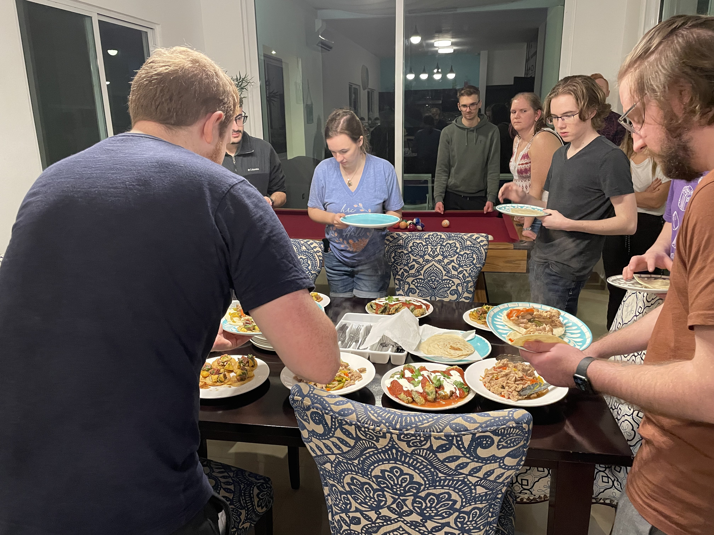
        </a>
        <b>The first dinner that the chefs made for us</b> 
        We were very hungry since we'd all been travelling all day.
      </td>
    </tr>
    <tr>
      <td>
        <a href="./images/private-chef-food-breakfast.jpg" target="_blank">
          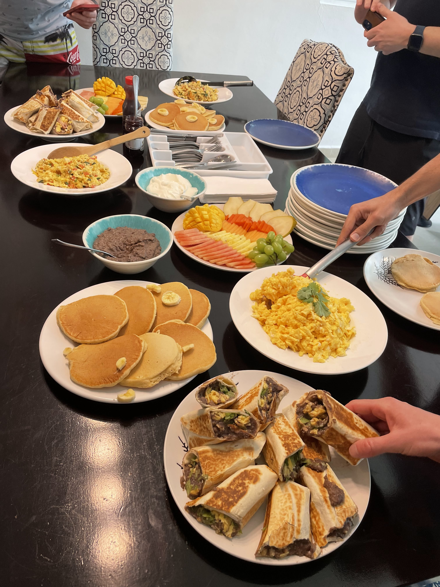
        </a> 
        <b>One of the fantastic breakfasts that we were served</b>  
      </td>
      <td>
        <a href="./images/private-chef-food-lunch.jpg" target="_blank">
          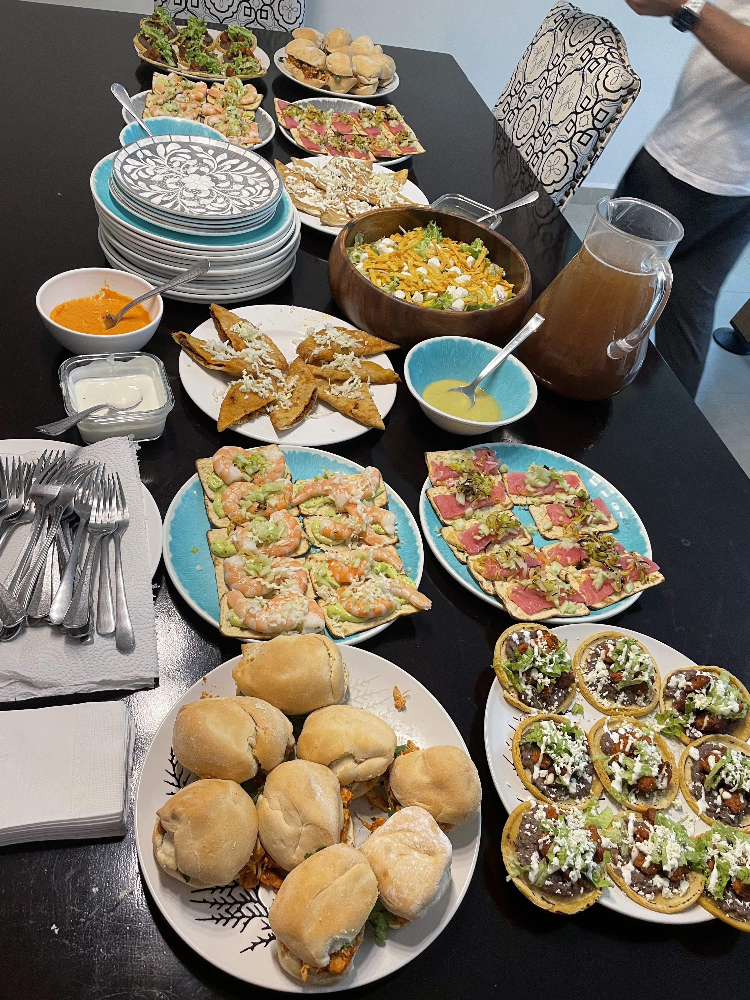
        </a> 
        <b>One of the lunches that we were served</b> 
        The chefs used seafood in many of the dishes, and they were quite
        delicious.
      </td>
    </tr>
  </table>
</figure>

On Tuesday evening, we went to Porfirio's in downtown Playa del Carmen. I ended
up at a table with Josh, Bradley, Brad, Finn, Sarah, Ian and Kilian. We enjoyed
a selection of appetisers, and a few rounds of drinks. But the highlight was the
Surf & Turf. Our waiter mentioned that Surf & Turf for four was the special that
evening, and Brad (CTO) asked if anyone wanted to join him for that. Bradley and
myself agreed, and the food was finished table-side in a very cool show by the
waiter.

<figure>
  <table class="gallery">
    <tr>
      <td>
        <a href="./images/porfirios-table.jpg" target="_blank">
          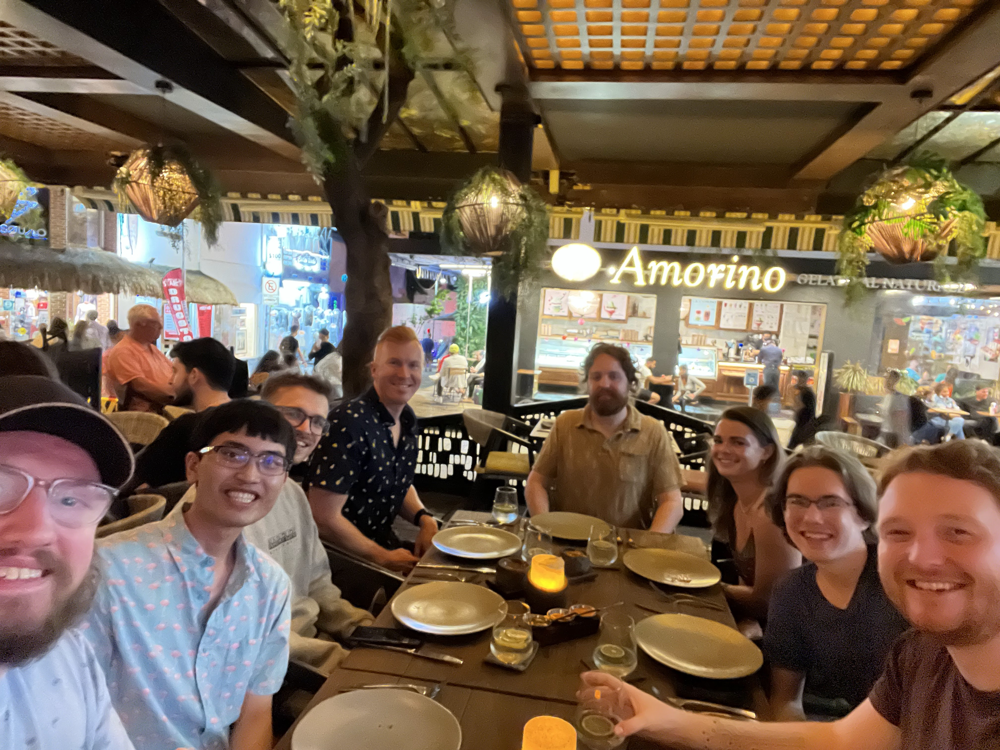
        </a> 
        <b>My tablemates at Porfirio's</b> 
        Left to right: Josh, me, Bradley, Brad, Finn, Sarah, Ian and Kilian
      </td>
      <td>
        <a href="./images/porfirios-drinks.jpg" target="_blank">
          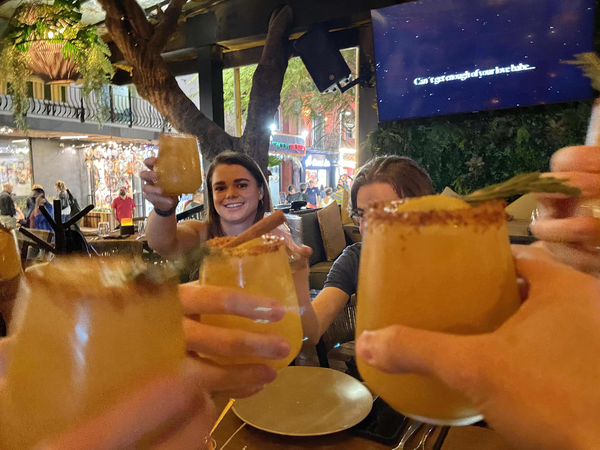
        </a> 
        <b>Enjoying a cocktail with the team</b> 
        Don't know what it was, but it went down way too smoothly.
      </td>
      <td>
        <a href="./images/porfirios-surf-and-turf.jpg" target="_blank">
          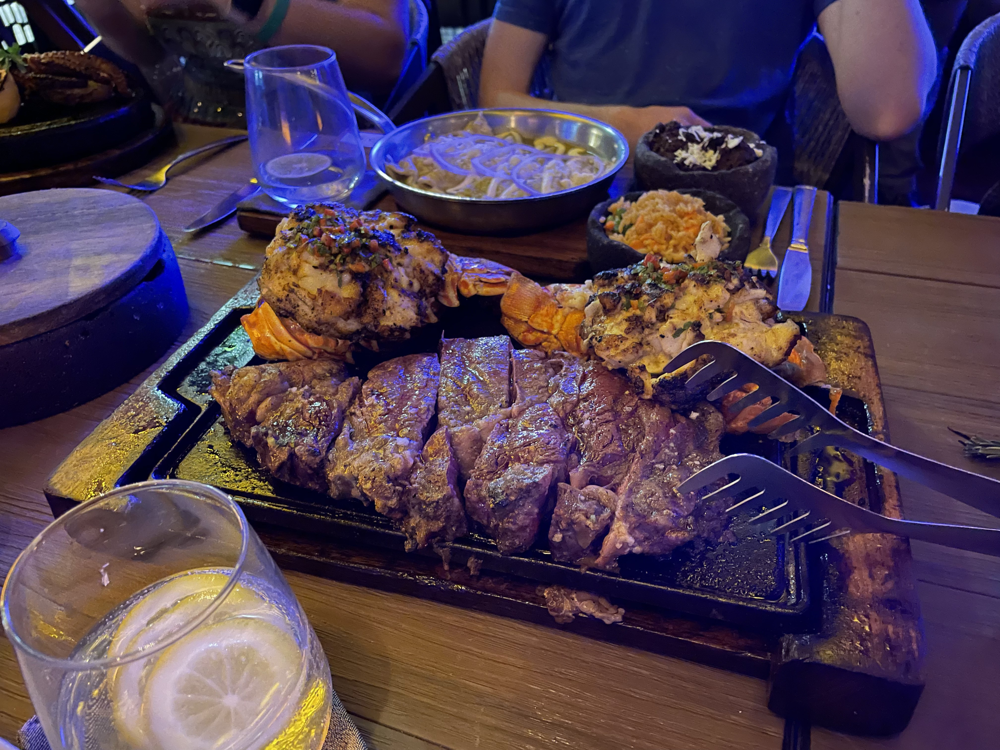
        </a> 
        <b>Our Surf & Turf meal</b> 
        When the CTO asks you if you want Surf & Turf, the answer is "yes".
      </td>
    </tr>
    <tr>
      <td colspan="3">
        <a href="./images/porfirios-surf-and-turf-finish.webm" target="_blank">
          <video
            src="./images/porfirios-surf-and-turf-finish.webm"
            class="align-center"
            width="100%"
            muted="true"
            autoplay="true"
            controls="true"
            loop="true">
          </video>
        </a>
        <b>Our surf & turf being finished at the table</b> 
        The whole experience was super over-the-top, but I loved it.
      </td>
    </tr>
  </table>
</figure>

On Friday, we went to a rooftop restaurant called Catch. We had a great long
table, and we enjoyed a large variety of fare and plenty of cocktails. At the
dinner, I had a conversation with Wellington about functional programming. We
discussed how it's seeing a resurgence lately with reactivity systems and
serverless architectures. Since I have had the opportunity to [teach Programming
Languages at Colorado School of Mines]() (the primary functional programming
class), I am always interested in talking about industry applications of
academic concepts such as functional programming.



The food throughout the entire week was fantastic. At one point, someone asked
everyone if I had any food allergies. I said that "I'm allergic to bad food" and
luckily for me, the food was amazing the entire week.

We're Going to Need a Bigger Boat
=================================

This retreat we had a full-day private catamaran excursion to Isla Mujeres. We
had a bus take us from the Airbnb to the dock in Cancun where we were to embark
on a day-trip over to Isla Mujeres. On our way to the island, we had an
opportunity for a short snorkeling excursion into some of the reefs.
Unfortunately, the reefs do not seem to be very healthy, but the weather was
amazing and it was nice to get out in the water.

Once on the island, we had lunch at a beach-side buffet restaurant and then we
did a golf cart tour around the island.

<figure>
  <table class="gallery">
    <tr>
      <td colspan="2">
        <a href="./images/catamaran-team.jpg" target="_blank">
          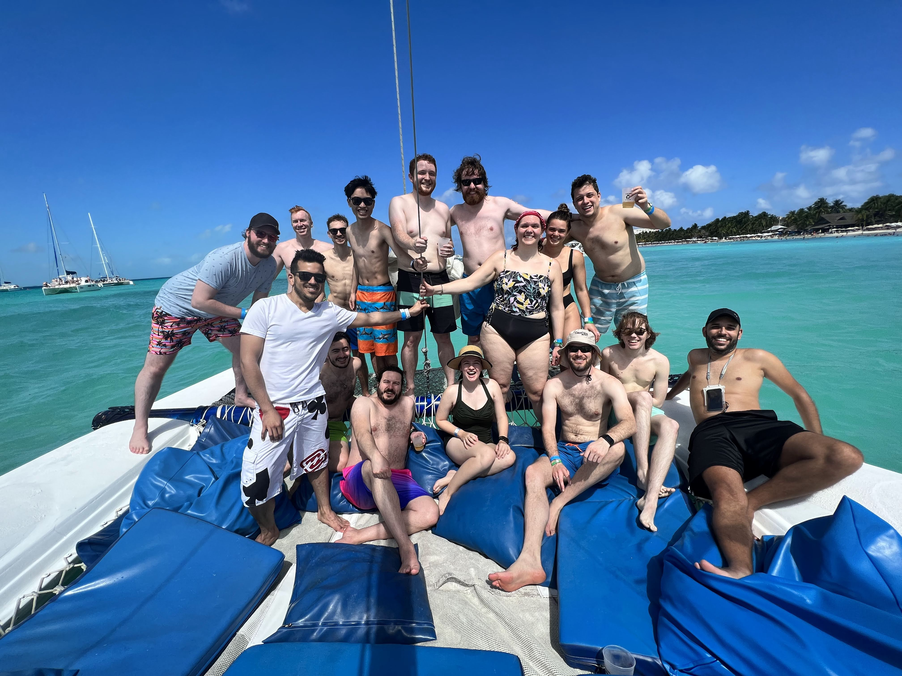
        </a>
        <b>Enjoying the beautiful water off the coast of Isla Mujeres with the
        best team in tech</b> 
        Left to right: foreground: Gerardo, Eric R., Scott, Annie, Eric M., Ian,
        Tiago; background: Josh, Brad, Bradley, me, Kilian, Finn, Michelle,
        Sarah, Wellington.
      </td>
    </tr>
    <tr>
      <td>
        <a href="./images/catamaran-beach.jpg" target="_blank">
          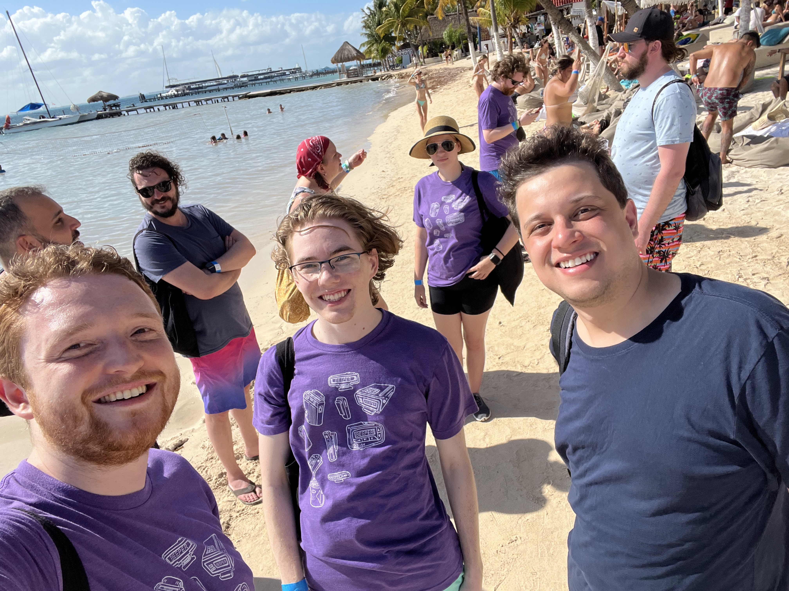
        </a> 
        <b>Enjoying the beach before our golf cart tour</b> 
        Left to right: foreground: Kilian, Ian, Wellington; background: Tiago,
        Scott, Michelle, Annie, Finn, Josh.
      </td>
      <td>
        <a href="./images/catamaran-golf-carts.jpg" target="_blank">
          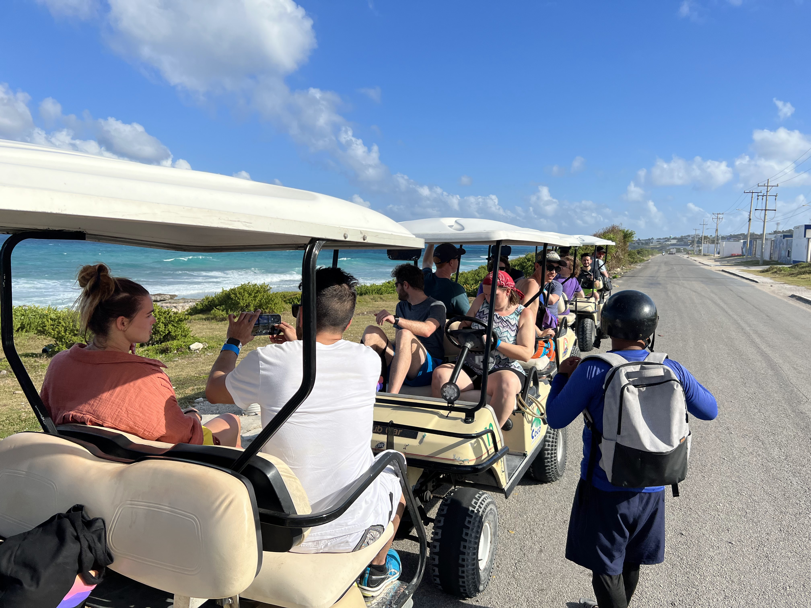
        </a> 
        <b>Our golf cart caravan on our tour around the island</b> 
        The views were beautiful all around the island, and our guide made the
        tour very enjoyable.
      </td>
    </tr>
    <tr>
      <td>
        <a href="./images/catamaran-island-views.jpg" target="_blank">
          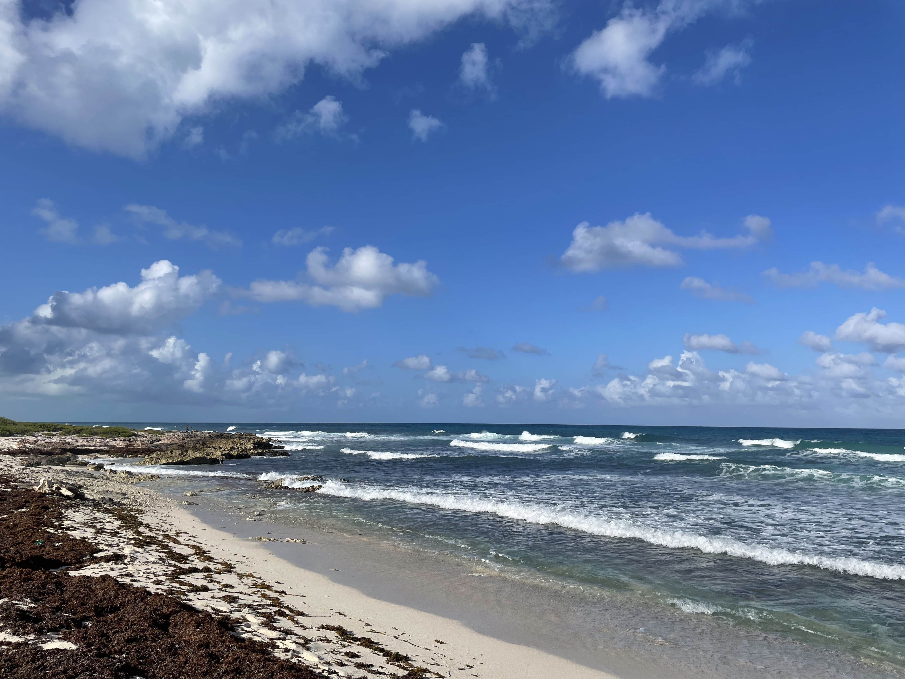
        </a> 
        <b>Great views of the Gulf of Mexico from the eastern of Isla Mujeres</b> 
      </td>
      <td>
        <a href="./images/catamaran-nap.jpg" target="_blank">
          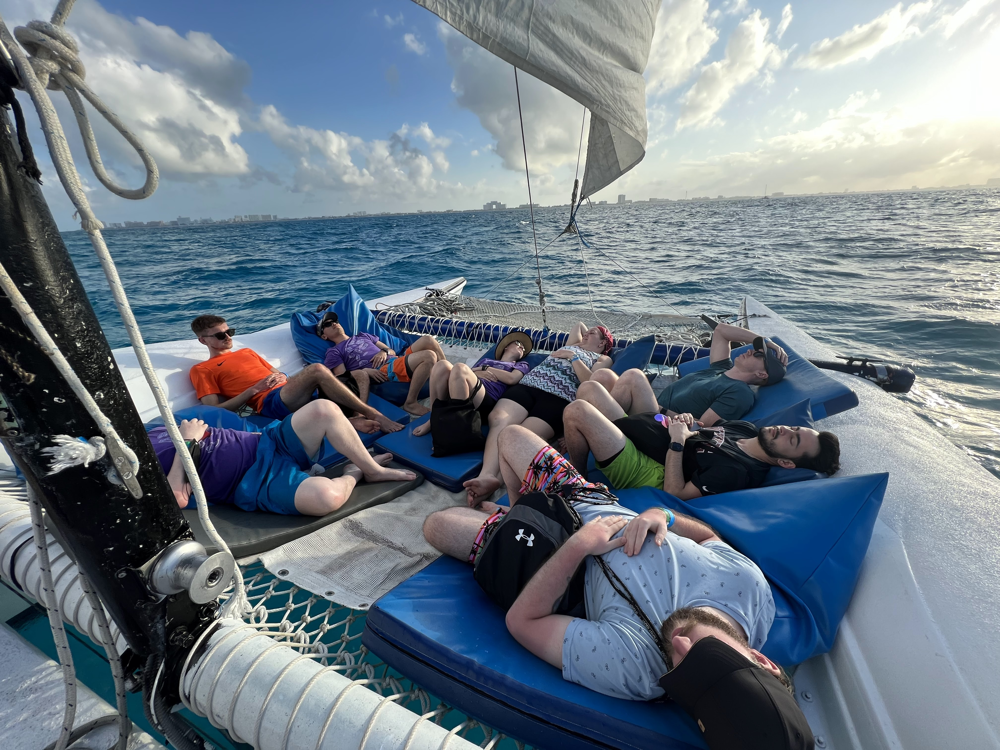
        </a> 
        <b>The team relaxing after a hard day of work</b> 
        The ride back to Cancun was beautiful and very relaxing. Maybe a bit
        <i>too</i> relaxing :)
      </td>
    </tr>
  </table>
</figure>

The boat tour was one of the most exotic things that I've ever done. It's
definitely the most exotic thing I've ever done on a work trip. It's very unique
being at a company at this size. If we had even a few more people, we'd need a
bigger boat. Not that that would be a bad thing, it would just be different. I
hope that Beeper *does* eventually need a bigger boat, because that would mean
we are growing and achieving our goals. But right now, I'm grateful that I get
to be a part of the company while we are at this size.

At one point during the catamaran trip, Finn expressed a feeling that I think we
all share:

> I'm so glad I joined Beeper. Not because of this boat trip, but because these
> people are f***ing awesome!
>
> -- Finn

I think that also sums up my feelings about the entire trip very well, so I'm
going to end it here.
