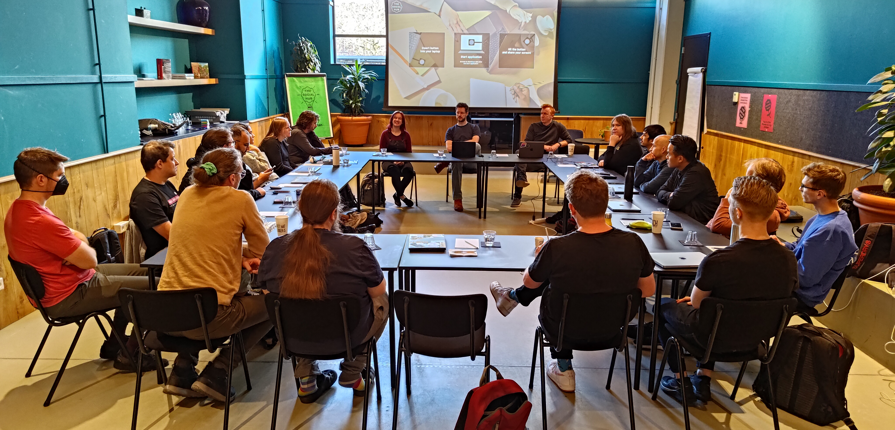
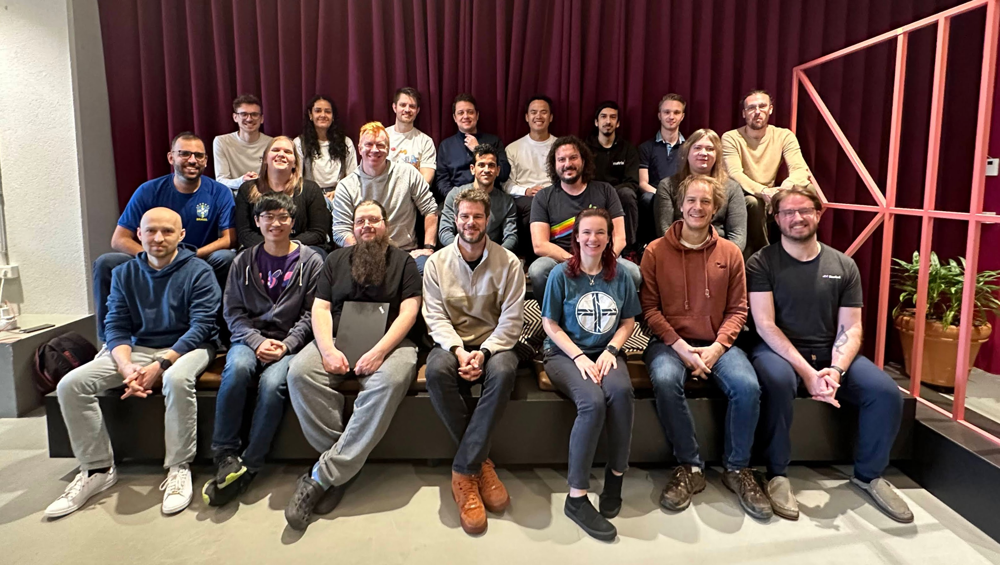
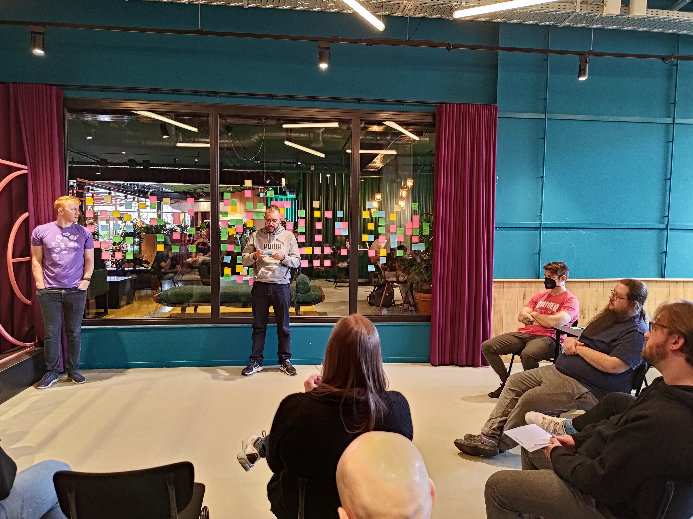
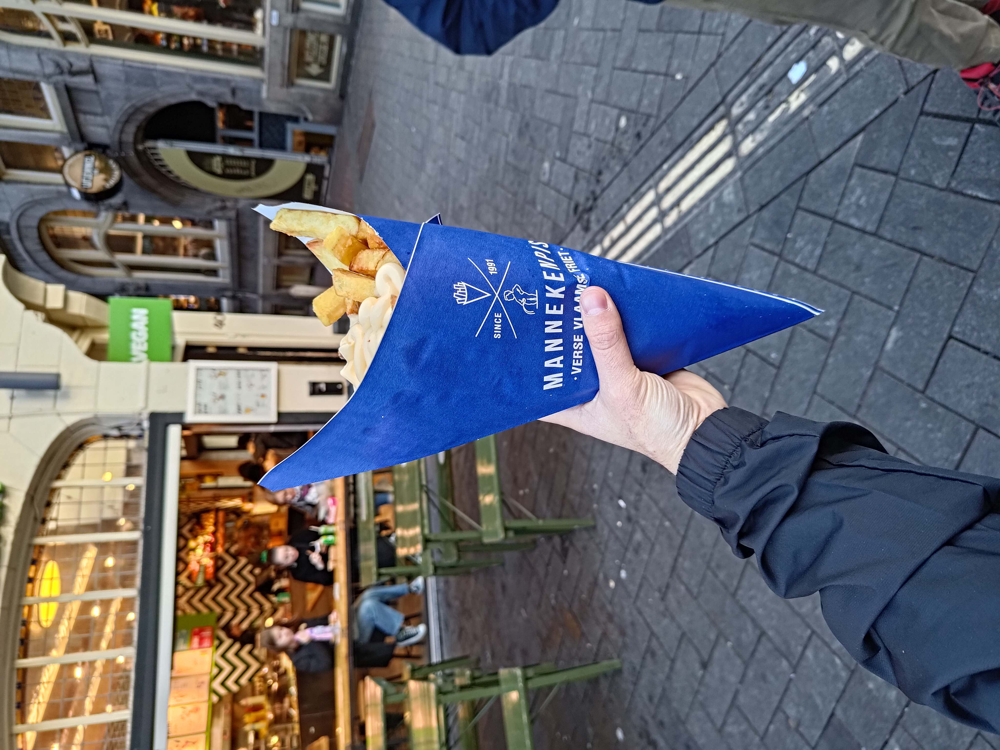

This week, my company (Beeper) had our first retreat of the new year in
Amsterdam, Netherlands. We aim for about three retreats a year, though due to
holidays and a recent push towards our 
[beta exit](https://blog.beeper.com/p/beeper-update-4-out-of-beta)
milestone, it has been a little while since we have all gotten together. The
[last retreat]()
was in Mexico City in October and before that we had
[three]()
[other]()
[retreats]().
The goal of each retreat is to provide an opportunity to connect as a team on a
personal level, discuss future plans, and reflect on the progress we have made.

Since the last retreat, we have gained a new team member, Joonas, who is yet
another Finn bringing our Finish contingency up to four people. Joonas
previously worked at Oura (the smart ring company) as an iOS developer and he
was hired onto our iOS team earlier this year, however he has been helping out
on the backend team wrangling our iMessage bridge and helping bring it to even
more of our users.

This retreat was also the largest we've had so far with 22 people in attendance.
We stayed at
[The Social Hub Amsterdam City](https://goo.gl/maps/DeqBLLtmbuR9Ne8Y6)
which was a really nice venue for the retreat. I think that the hotel doubles as
student housing, and because of that, there were lots of nice spaces to sit and
work. There was also a co-working room which we rented and used for our team
meetings.

## Retro

One of the highlights of every retreat for me is our Monday morning retro. This
retreat's retro was no different. If I were to sum up the vibe of the retro in
one phrase it would be: progress and optimism.

We have made a lot of progress as a team in the past five months. Most of the
work we have done lately has been building towards our 
[beta exit](https://blog.beeper.com/p/beeper-update-4-out-of-beta)
milestone. We launched
[hungryserv](https://github.com/sumnerevans/hungryserv-presentation)
to all users, shipped our iOS app to the
[App Store](https://apps.apple.com/us/app/beeper-universal-messenger/id1551695541),
shipped Start New Chat functionality in our iOS app, improved our login and
waitlist experience, launched new
[Slack](https://github.com/mautrix/slack)
and
[Discord](https://github.com/mautrix/discord)
bridges, and many other bug fixes and architectural improvements across the
entire platform.

There is also a lot of optimism about what we will accomplish next. We are
focusing on polishing our apps and scaling our backend so that we can onboarding
even more people from our waitlist!

The next few months are going to be very exciting for Beeper. Since we've
stabilized our app architectures, we are going to be able to focus on building
new functionality.

## Working

We worked every day except for Thursday from the conference/co-working space. I
had a list of things that I wanted to accomplish this week that I felt would be
good tasks to do while face-to-face with people on my team. We also had many
ad-hoc discussions about various topics.

### Planning for Scale

On Monday, the backend team had a conversation where we discussed ideas for
making our architecture easier to scale horizontally. The main conclusion was
that we need to move towards having small, hyper-replicable units that can be
deployed at the edge of our infrastructure. We continued our discussion on
Wednesday and decided to double down on hungryserv to accomplish our scaling
goals.

This next evolution of our architecture will allow us to iterate faster on new
features and deliver lower latency experiences to our users.

### Chatwoot ([again](../../2022-lisbon-and-paris/ericeira-portugal#chatwoot-and-other-shenanigans))

One of the things that I wanted to do on this trip was upgrade the Chatwoot bot.
It hasn't gotten much love and has fallen behind in
[mautrix](https://github.com/mautrix/go)
versions significantly. Upgrading would allow me to utilize the new crypto
helper which handles keys better. Having Tulir around to explain how to use the
new helper functions he had added to the library was very nice.

I was also able to collaborate with the support team on a few new features for
Chatwoot. I added functionality to create Chatwoot conversations for all users
who don't currently have active conversations on startup, and I created a
dashboard within Chatwoot to provide links to some important resources for our
support team.

### Deploying to Production

I have been trying to learn how our production stack works beyond bridges, and
one of the ways that Brad (my boss) has been helping me do that is by having me
work on and deploy non-bridge backend work. The Chatwoot changes required
deployment, and having other people on the backend team there to double-check
that what I was deploying things correctly was really handy.

On Friday, we had a BRAD day. It's a day that every employee in the company can
work on anything we want, so long as it's company-related, and as long as we
present it at the following week's demo meeting. I was planning on writing a
ChatGPT bot, but Eric used ChatGPT to write the bot. Luckily, the AI doesn't
know how write code to deploy containers to our production environment yet, so
that is what I did. It was good experience to learn more about how our
kubernetes setup works.

### Other Progress

There were many other things that we worked on. The client teams developed ideas
for how to add polish to our apps, Scott and Max worked on the new Signal
bridge, and our iMessage team worked to improve our iMessage integration.

We made a lot of progress on all fronts, and we have lots of exiting work ahead!

## Exploring Amsterdam

As with all our retreats, we spent time together exploring the city. On Sunday,
Brad, Scott, Bradley, and myself went to a fish restaurant and we had a
fantastic platter of fish.



### Boat Tour

On Monday, we took a boat tour through the canals of Amsterdam. Amsterdam is
called the Venice of the North because of all of the canals.

After the boat tour, a few of us went to get fries, which Amsterdam is famous
for. The large size fries that I ordered were way too much. The fries were
pretty good, and the fritesauce (which is just mayo) was fine, but I really have
no idea why I ordered so much. I don't like potatoes that much, and I don't like
mayo, either. Oh well, when in ~~Rome~~ Amsterdam...

<figure>
  <table class="gallery">
    <tr>
      <td>
         
        <b>The huge helping of fries I got.</b> I didn't finish it.
      </td>
      <td>
         
        <b>Me holding the fries wondering why I hate myself.</b>
      </td>
    </tr>
  </table>
</figure>

### Boules

On Wednesday, we went to
[Mooie Boules](https://mooieboules.nl/amsterdam/)
"French bowling". The goal was to throw large meta balls towards a small wooden
red ball. Whichever team gets closest to the red ball got points. Points are
determined by the number of your team's balls that are closer to the red ball
than all the other team's balls (similar to curling scoring).

I played with Max against Ivan and Jess. Ivan and Jess made a great comeback and
won by one point!



### Tulips

Thursday was "Adventure Day". The team split up to go on various adventures
around Amsterdam. I went with G, Annie, Michelle, Bradley, Josh, Laser, and Jess
to Keukenhof to see the tulips. Most of the tulips were not quite in bloom yet,
but there was a greenhouse that had many tulips in bloom.

<figure>
  <table class="gallery">
    <tr>
      <td>
        
      </td>
      <td>
        
      </td>
    </tr>
    <tr>
      <td>
        
      </td>
      <td>
        
      </td>
    </tr>
  </table>
</figure>

### I Can Play the Nine Ball!

One of the fun things about being in-person is getting to play games with
coworkers. I think it's a great way to get to know each other a little better by
doing something that isn't work-related.

One of the best aspects of our hotel was the pool table. We would often take
breaks by going to play a game of 8-ball. Toni introduced us to a game called
9-ball which is played with only 9 of the balls and the goal is to pocket the
9-ball, but the catch is that you must hit the lowest number ball first. So, at
the beginning of the game, you must hit the 1-ball. After hitting it, anything
is legal, so you could try and play the 9-ball through the 1-ball. It encourages
you to try some crazy shots and sometimes you get lucky!

At one point, we played doubles 9-ball. Nick and Toni teamed up against Tulir
and myself. Many crazy shots were attempted, and some of them succeeded!

I also brought poker chips on the trip, so on Thursday in the afternoon, a group
of us (Nick, Toni, Josh, Annie, and myself) played a casual game of poker.

----

I had a great time in Amsterdam. It's a very nice city, and it was great getting
to spend time with my coworkers in-person. I'm excited and optimistic about what
we will accomplish in the next few months as we bring Beeper to many more
people!
