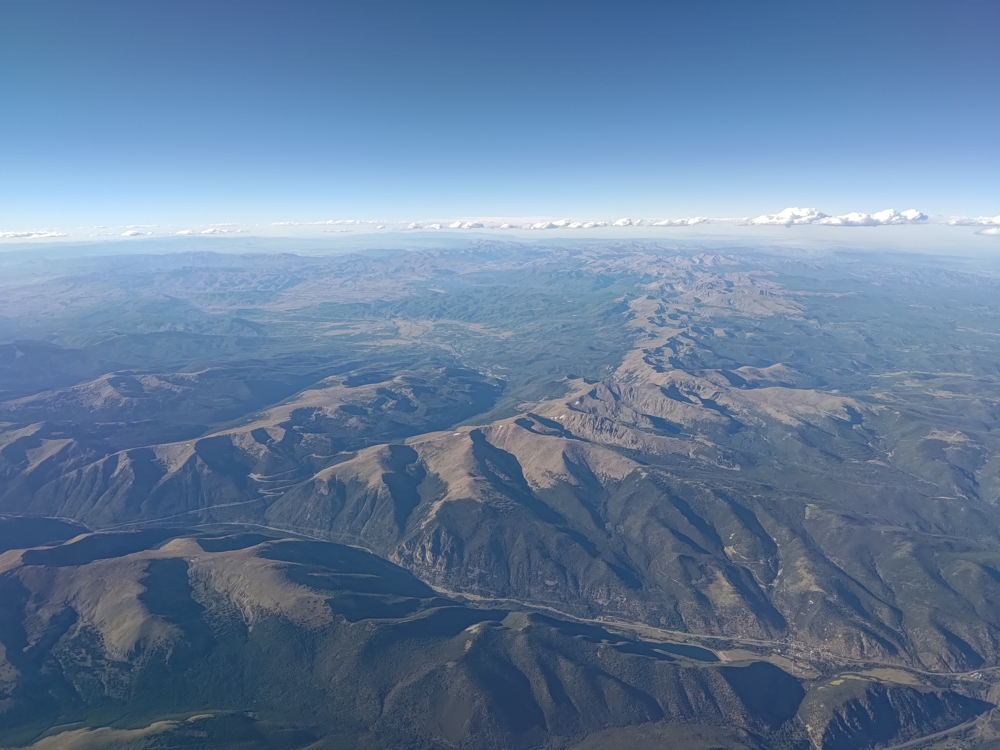
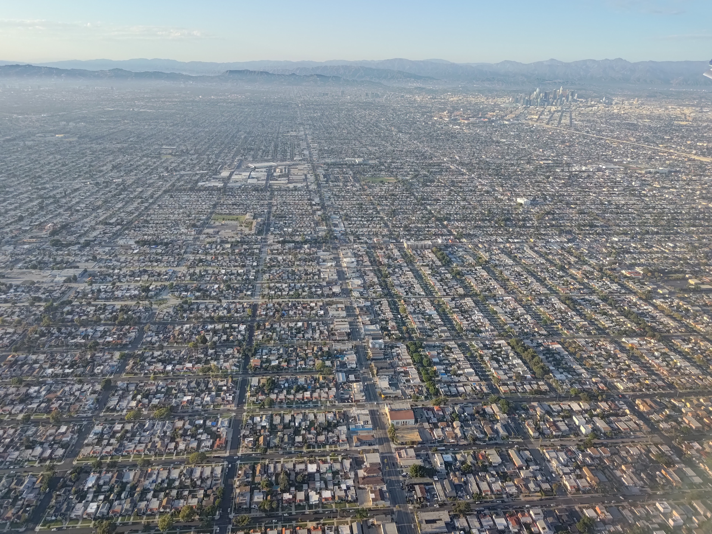

This weekend I flew out to Los Angeles to see my friend
[Ethan Cranston](https://ethancranston.com/). He is a former student of mine at
Mines, and we got to know each other well because he was one of the most
consistent in-person attendees during the hybrid COVID semesters. He now works
at SpaceX and since I have a ton of Southwest points, I decided to visit him
somewhat on a whim.

I left Friday afternoon, and the outbound flight out of DIA was really pretty.
I had a great view of Berthoud Pass out my window. Then, on the descent into
LAX, I had a great view of downtown LA and the sprawling suburbs.

<figure>
  <table class="gallery">
    <tr>
      <td>
         
        A view of Berthoud Pass out my window. I know the pass very well since
        I love to ski at Winter Park.
      </td>
      <td>
         
        During the descent into LA, all I could think about was <i>Party in the
        USA</i> by Miley Cyrus. There's something surreal about the view.
      </td>
    </tr>
  </table>
</figure>

Ethan lives close to the airport, and he kindly picked me up, and then we went
to dinner at a great ramen restaurant in El Segundo. Then we walked over to the
beach and walked around for a bit. There was a movie playing on a big projector
at one part of the beach. It was a nice little walk after being on the plane for
a couple hours.

## Working Out on Vacation?

On Saturday morning, Ethan and I went to his Brazilian Jiu-Jitsu gym for a
class. Ethan trained as a kid in taekwondo in the same organization that I am a
member of, and he's recently started training in jiu-jitsu.

I've done a handfull of jiu-jitsu basics classes taught by my previous taekwondo
instructor who cross trained in jiu-jitsu, but I don't really know any moves.
The training was quite fun, and we did a bunch of different drills. Everyone was
very welcoming and I enjoyed trying a different martial art!

## Lunch

For lunch, we went to a Poke restaurant. We met up with a student who is working
on reverse engineering iMessage. I'd met him online through Beeper, and by
coincidence, I found out he lived in LA, pretty close to where Ethan lives. It
was cool to meet him in person because I've interacted with him in a technical
capacity a fair bit recently since I've been
[working on improving Beeper's iMessage bridge]().

## Exploring LA

After lunch, we headed back to Ethan's apartment and both of us ended up taking
an ten minute nap that turned into an hour-long nap. Apparently the jiu-jitsu
class was more tiring than I thought!

After our nap, we went over to the SpaceX HQ and walked around the outside. They
have a Falcon 9 booster on display outside of the building. It is very
impressive in person, and it's so neat that they are able to land them upright!



We then went to Watts Towers, which is a sculpture built by an eccentric artist
during the early decades of the 20th century. Its main structure is steel but is
covered in concrete which is laced with embedded fragments of glass, porcelain,
seashells, and other random items. Watts Towers is on a bunch of "top
attractions in LA" lists, on the [TimeOut
list](https://www.timeout.com/los-angeles/things-to-do/los-angeles-attractions)
it's number 27. As we walked around the sculpture, we kept joking about it being
the 27th coolest thing in LA. In my opinion, there's a reason it's 27th. It was
kinda cool to see, but not something that I'm dying to revisit.



After stopping back at Ethan's apartment for a few minutes, we took an Uber down
to Hermosa Beach. There's a really long pier that we walked out on and we
walked a bit on the beach. It wasn't quite nice enough to get in, but I figured
I had to at least get my feet wet if I went all the way out to LA.



For dinner, we went to a sushi restaurant which was delicious. Then we made our
way over to Monkish Brewing Co. for a few beers. Our Uber driver on the way was
a tattoo artist, and after we arrived, he showed us some of the tattoos he's
done on his Instagram. He was quite the eccentric guy, and he kept scrolling and
showing us tons of pictures. I thought we'd never escape! Monkish had a really
nice outdoor seating area and we had a couple rounds before going over to
Hermosa Brewing Company for last call. I'm not a big drinker, and I'm a total
lightweight, but I enjoy a good beer every now and again. But at the end of the
day, what makes a good night out is the company you're with, and Ethan and I had
a great hanging out and really getting to know each other on a deeper level.

## Mass

Ethan is Catholic, and so on Sunday, we went together to Mass. I had never been
to a Catholic Mass in English before. The only other time I had been to Mass was
[a French Mass in Montreal]()
where I understood nothing about what was going on. I still didn't know what was
going on at the English Catholic Mass, but that was a function of not being
Catholic rather than a function of not knowing the language.

There were two things that struck me most about the service. First was the order
of the service and the specific emphasis of each part of the Mass. The second
was on the emphasis on confession and repentance at various points within the
service.

As a baptist, some aspects of service felt familiar: scripture readings, songs
of worship, and prayer. Yet there were many aspects that felt very different. At
my church, the scripture readings are from the passage of scripture which the
pastor is teaching on, whereas at the Mass there were readings from various
parts of scripture. Additionally, whereas the main focus of the service at my
church is on the expository preaching of the Word through verse-by-verse
exegetical teaching, the priest's message was just one part of the service, not
the centrepiece. A much longer time was dedicated to preparing for the Eucharist
than my church prepares for communion. Many prayers were offered during the Mass
in preparation for the Eucharist and other things that I didn't really
understand. At my church, after the sermon, one of the men of the church stands
in front of the congregation and leads a time of prayer, and sometimes also
makes a few comments on the passage that was taught, or another relevant
passage. In general, the Mass had much more structure than the services at my
church.

The other thing that struck me was the emphasis on confession at different
points within the service. At my church, the main time during the service where
we stop to confess our sins to God is before communion. During the prayer,
confession and gratitude for Christ's sacrifice is emphasised. However, at the
Mass, it felt like there were more times specifically focused on those topics.

In all, I'm glad I attended. As a protestant, there are many things in
Catholicism that I disagree with, but I nonetheless appreciated the opportunity
to participate in worshiping God.

## Hollywood

After the Mass, we drove over to Hollywood, which in many ways is the exact
antithesis to Christianity. But hey, I was a tourist, I'm going to do touristy
things.

We parked right on the Hollywood Walk of Fame which is a long street with stars
embedded in the sidewalks commemorating various Hollywood stars. Among the
people commemorated are the likes of Dr. Seuss, Elton John, Harrison Ford,
Steven Spielberg, and Andy Griffith. The Apollo XI mission also was commemorated
for their impact on television. At least two presidents also have stars: Donald
Trump and Ronald Reagan, both of whom were successful in Hollywood long before
they were successful in politics.

As we were walking along the street, Ethan made the comment that it was a great
place for engineers, because you have an excuse to be looking down at your feet!
At one side street, there was a farmer's market of sorts with lots of food
stands. We stopped for some delicious dumplings from one of the vendors before
continuing on.

There were lots of tourist attractions along the street. We went into the
Guiness Book of World Records museum. There were interactive exhibits related to
the various world records. You could try your hand at beating the records at
some of the exhibits. It was pretty fun, and interesting to see all the crazy
records.

## Griffith Park

Our next destination was Griffith Observatory, an observatory on a hill north of
LA. Notably, there's a great view of the Hollywood sign. We parked and hiked up
to the observatory. The views over the sprawling city of LA were spectacular.



Ethan also helped get a picture of me doing a side kick over the Hollywood sign.



The inside of the observatory is a space museum with a bunch of cool exhibits.
One area focused on an "empty" part of the sky that when observed with a
powerful telescope revealed thousands of galaxies containing millions of stars.

Additionally, there were a scale models of all the planets in the solar system.
They were not spaced out correctly as that would take *way* too much space, but
they were volumetrically accurate. Next to each model was a scale where you
could stand and see how much you would weight on that planet. I think that I'm
going to start a weight-loss program which just sends people to Mars.

Outside of the observatory there is a scale model of the orbits of the solar
system. It's centred around a point near the front of the observatory and goes
out across the lawn. It was amazing to see how much further away Jupiter is from
Mars. In many textbooks, for the sake of space, the distance between the orbits
of the planets is shown as relatively constant, yet that is definitely not the
case. The outer planets are *so* much further away.

## K-Town

After spending a couple hours at the observatory, we headed down to K-Town for
Korean BBQ.

We found an unlimited Korean BBQ place called
[Bud Namu](https://maps.app.goo.gl/ySSjBvd4Ym1URv2d6). It was absolutely
delicious. We had a large variety of meats and everything was so good. Except
for the cow tongue, we did not enjoy that.

By this time, it was time to head back to Ethan's place so I could make my 20:50
flight.

-----

I thoroughly enjoyed my time in LA. I'm grateful to Ethan for acting as my tour
guide and letting me stay at his place for the weekend. LA is a beautiful city,
and I am happy I was able to see so many cool sights during my short weekend
trip.
